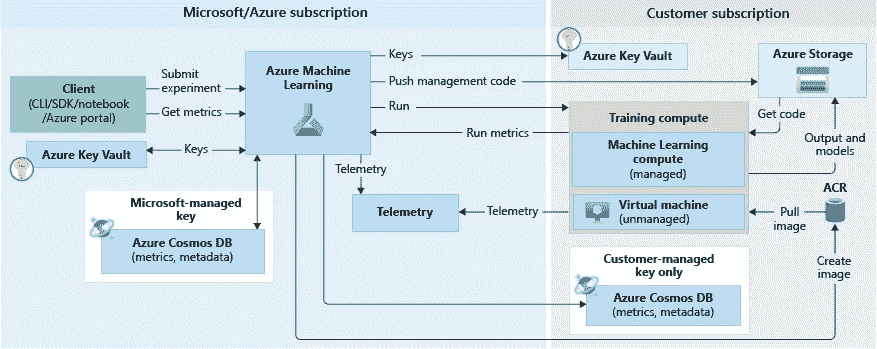

# 引擎盖下的 Azure 机器学习:组件和架构

> 原文：<https://towardsdatascience.com/azure-machine-learning-under-the-hood-components-and-architecture-abc0dd27b1fb?source=collection_archive---------26----------------------->

来源: [Unsplash](https://unsplash.com/photos/zSpGWzwRFas)

Azure 机器学习(ML)是一个端到端的工具，用于管理机器学习和深度学习管道。它可以跨大型计算资源池自动进行培训，并帮助您在生产中部署模型和管理生产应用程序的推理。

当您在组织中采用 Azure ML 时，更深入地理解它的结构和组件是一个好主意。这篇文章旨在展示 Azure 机器学习的内部工作原理。

在简要回顾了它的功能之后，我将继续描述它的关键组件，包括工作空间、计算、实验和快照，并描述系统在训练你的机器学习模型时所经历的工作流程。

# 什么是 Azure 机器学习？

Azure Machine Learning (ML)提供的工具旨在帮助数据科学家构建、部署和训练他们的机器学习算法。你可以使用 Azure ML 来训练任何类型的机器学习模型，包括传统的机器学习、监督算法和非监督机器学习。

Azure ML 支持多种语言，包括 Python 和 R，以及一系列 SDK。你也可以利用 Azure ML 的 studio，它为无代码或低代码 ML 和深度学习(DL)模型提供了一个工作空间。

Azure ML 为[端到端机器学习操作](https://www.run.ai/guides/machine-learning-operations/)提供了许多工具，包括:

*   **Azure ML 的设计师**——(预览版)提供了构建实验和部署管道的拖放模块。
*   **Jupyter 笔记本** —让您使用预制的示例笔记本或创建自己独特的笔记本。
*   **R 脚本或笔记本**——让您在编写自己的代码库时使用 R SDK，或者在设计器中使用 R 模块。
*   **多模型解决方案加速器** —(预览)基于 Azure ML，该解决方案使您能够构建、训练和管理成百上千的 ML 模型。

Azure ML 提供了更多的功能，比如机器学习 CLI 和

Visual Studio 代码扩展。该平台与 TensorFlow、PyTorch、Ray RLlib 等开源框架协同工作，用于强化学习等。它还集成了各种各样的外部库，如 Git 和 MLFlow。

# Azure 机器学习组件

让我们来看看 Azure 机器学习生态系统的基本组件。

# 工作空间

工作区是 Azure 中的中心资源，它保存着您的机器学习管道和所有相关资源。它是以下方面的焦点:

*   管理用于训练和部署机器学习模型的资源
*   存储 Azure 机器学习管道使用和创建的资产

工作区包括工作区使用的其他 Azure 资源:Azure 容器注册表(ACR)；Azure 存储帐户，用作工作区的默认数据存储。Azure 应用洞察，用于监控；和 Azure Key Vault，它存储用于执行模型的秘密。

# 计算

Azure Machine Learning 不仅管理模型，它还提供计算资源，您可以使用这些资源在训练和推理模式下运行它们。Azure ML 提供两种类型的计算资源:

**计算实例**

包括机器学习工具和环境的预配置 Azure 虚拟机(VM)。计算实例通常用作开发机器-在模型开发的早期阶段，您可以启动实例并立即开始运行笔记本电脑。或者，它们也可以用于运行模型的训练和推理。

**计算集群**

具有自动扩展能力的虚拟机集群。这些适用于大型培训操作，以及在生产中运行模型。当您通过 Azure ML 提交作业时，集群会自动扩展以提供作业所需的资源。

# 数据集和数据存储

Azure 数据集使得访问和使用你的数据变得容易。Azure ML 创建对您的数据的引用，以及其元数据的副本。数据不会复制到 Azure ML 中，而是保留在原处，因此没有额外的存储成本，也没有数据完整性和安全性的风险。

# 模型

在最简单的情况下，模型是接受输入并产生输出的代码。机器学习模型通常包括算法、输入数据集和影响算法如何生成输出或预测的超参数。经过一轮或多轮训练后，模型已经从输入数据集中“学习”了它可以学习的内容，并可以根据看不见的数据生成预测。

你可以将之前训练过的模型导入 Azure ML，或者引入新模型的代码，并使用 Azure ML 在 Azure cloud 中提供的计算上训练它。模型被注册为工作空间的一部分。

# 运行和实验

运行是训练脚本的一次执行。实验是一组运行。两者都存储为工作区的一部分。Azure 机器学习记录每次运行的数据，并保存实验中的信息。这包括:

*   执行元数据—时间戳、持续时间
*   您的培训脚本生成的任何指标
*   作为实验的一部分上传的或由训练脚本生成的任何输出文件
*   包含预运行脚本的文件夹的完整快照

管路可以有“子管路”，您可以将几个级别的管路嵌套在一起。这使您可以自动化复杂的培训程序。

# 快照

每次运行时，Azure ML 都会获取包含训练脚本的目录，对其进行压缩，并将其复制到计算目标。然后，该脚本在一个或多个计算目标上运行。作为实验的一部分，相同的压缩文件存储在运行记录中。

这提供了对在哪里运行了什么实验的完全可见性，并确保每次都一致地执行训练运行，这与在各种机器上复制和手动运行脚本的临时程序形成对比，后者容易出错且难以跟踪。

# 幕后:培训工作流程

了解 Azure 机器学习如何在幕后操作和训练模型可能会有所帮助。

每次在 Azure ML 中运行实验时，都会发生以下步骤:

1.  请求运行，快照 ID 指向包含代码模型和训练脚本的目录的快照。
2.  Azure ML 启动，创建一个运行 ID 和一个机器学习服务令牌，计算目标可以在后面的阶段使用。
3.  用户为运行选择一个计算目标——这可以是托管的目标(Azure ML 计算资源的两种类型之一)，也可以是未托管的目标，它只是一个常规的虚拟机，用户已经在其上安装了机器学习环境。

数据流操作如下:

1.  计算目标从密钥库中检索 SSH 凭证，密钥库是 Azure 订阅的一部分。
2.  Azure ML 管理代码被写到用户的 Azure Files 帐户下的文件共享中(了解 Azure Files 如何工作
3.  Azure ML 将快照下载到计算实例
4.  Azure ML 通常使用 Docker 容器在计算目标上设置所需的环境，并设置配置和环境变量。容器使用 Azure ML 管理代码启动，并运行用户的培训脚本。
5.  当训练运行完成时，Azure ML 将指标从存储到 Cosmos DB。然后，您可以在 Azure ML 用户界面中看到从 Cosmos 数据存储中提取的结果。

来源:[蔚蓝](https://docs.microsoft.com/en-us/azure/machine-learning/concept-azure-machine-learning-architecture)

# 结论

Azure Machine Learning 巧妙利用 Azure 服务和基础设施，为您提供真正的端到端机器学习工作流管理。我们讨论了 Azure ML 基础设施的关键组件，包括:

*   **工作区** —由模型、计算资源和数据集组成的中央实体
*   **数据集** —对存储在 Azure 中的机器学习数据集的引用
*   **计算** — Azure 虚拟机或虚拟机集群，让您运行分布式培训
*   **运行和实验** —用于管理和跟踪训练迭代的实体

学习操作整个过程可能需要一个学习曲线，但一旦您的组织开始大规模培训模型并通过一次点击将它们部署到用户，这将会带来回报。