# Azure ML 和 DevOps 遇见泰坦尼克号

> 原文：<https://towardsdatascience.com/azure-ml-and-devops-meets-titanic-6a0aa748d5a8?source=collection_archive---------14----------------------->

Azure Machine Learning 是一个云服务，用于加速和管理机器学习项目生命周期。它使您能够创建模型或使用从开源平台(如 Pytorch、TensorFlow 或 scikit-learn)构建的模型。Azure ML 补充了额外的 MLOps 工具，帮助您监控、重新训练和重新部署模型。

在这篇博文中，我想展示如何使用 Azure 机器学习笔记本和计算实例进行开发，使用集群进行培训，使用容器网站进行生产，来构建、培训和部署一个模型。对于这个演示，我们将使用泰坦尼克号乘客数据( [Titanic.csv](https://raw.githubusercontent.com/pietheinstrengholt/Azure-ML-and-DevOps-meets-Titanic/main/Titanic.csv) )，使用随机森林模型预测谁将幸存。

# 设置环境

如果你有一个 Azure 帐户，你可以去 Azure 门户网站创建一个机器学习工作区。你可以使用搜索栏找到机器学习，然后点击创建按钮。

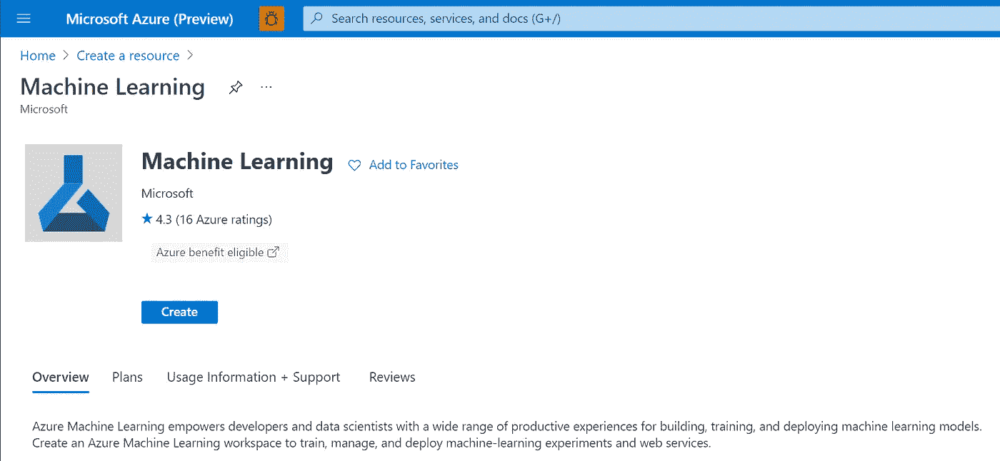

图片由 Piethein Strengholt 提供

接下来，您需要填写项目细节，比如您的订阅 ID、资源组名称和工作区名称。你可以从基础开始，所以点击“查看+创建”。

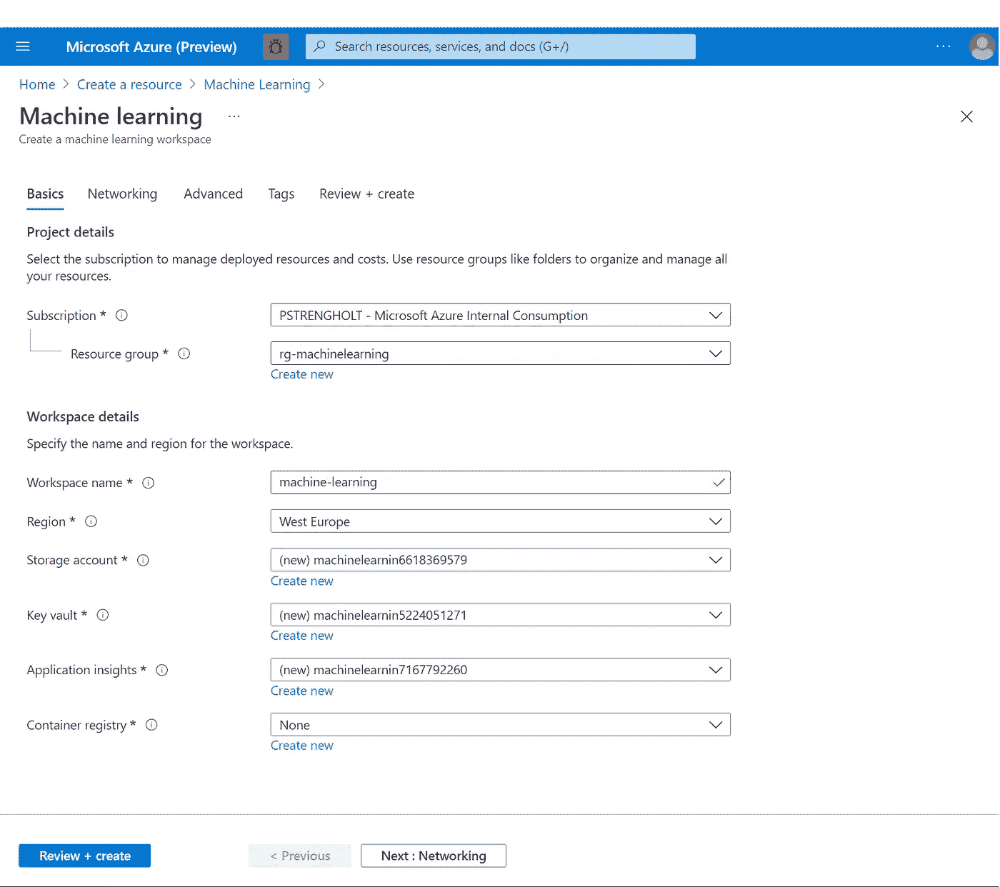

图片由 Piethein Strengholt 提供

部署后，您可以使用资源组概述窗格检查所有新创建资源的结果。

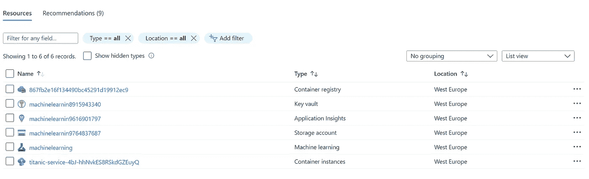

图片由 Piethein Strengholt 提供

Azure 机器学习服务自带默认存储账号。在我们的演示中，您将使用这个默认的存储帐户来使我们的 Titanic 数据可用。点击存储账号，点击默认的 azureml-blobstore-xxx 容器，使用上传按钮上传你的 [**Titanic.csv**](https://raw.githubusercontent.com/pietheinstrengholt/Azure-ML-and-DevOps-meets-Titanic/main/Titanic.csv) 数据。

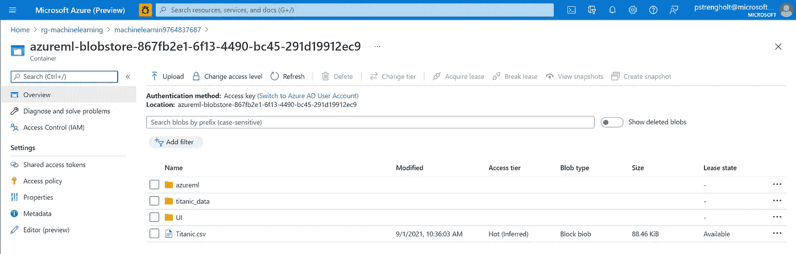

图片由 Piethein Strengholt 提供

在本演示中，您还需要使用存储帐户**访问密钥**。点击返回并转到默认存储帐户。在左侧点击“访问密钥”，点击“显示密钥”，并将密钥信息复制到一个安全的位置供以后使用。

## 服务主体认证

为了将机器学习工作流设置为自动化过程，我推荐使用服务主体认证。这种方法将身份验证从任何特定的用户登录中分离出来，并允许管理访问控制。

第一步是创建服务主体。首先选择 **Azure Active Directory** 和 **App 注册**。然后选择+New application，给你的服务主体起个名字，比如*my-SVP-machine-learning*。您可以保持其他参数不变。

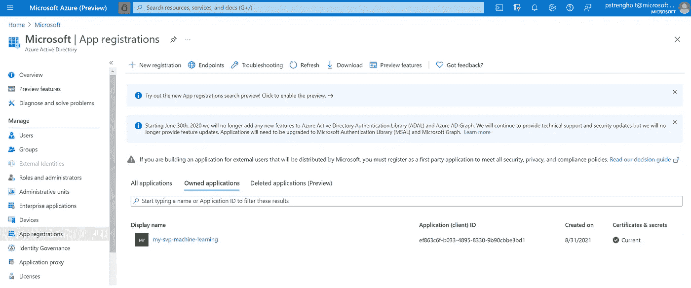

图片由 Piethein Strengholt 提供

从您新创建的服务主体的页面中，复制*应用程序 ID* 和*租户 ID* ，因为稍后需要它们。然后选择**证书&秘密**，和**+新客户秘密**为你的密钥写一个描述，并选择持续时间。然后点击**添加**，将*客户端机密*的值复制到安全位置以备后用。

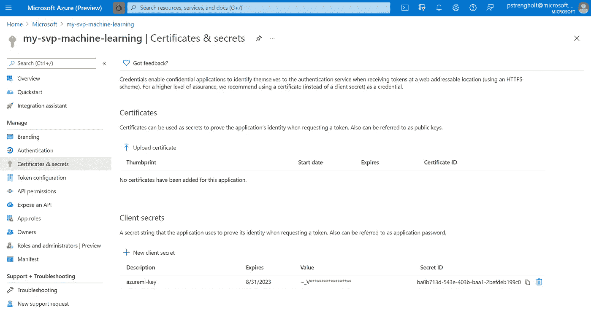

图片由 Piethein Strengholt 提供

最后，您需要授予服务主体访问 Azure ML 工作空间的权限。导航到资源组，导航到机器学习工作区的资源组。然后选择访问控制(IAM)并添加角色分配。对于角色，指定需要授予的访问权限级别，例如参与者。开始输入您的服务主体名称，找到后，选择它，然后单击 Save。

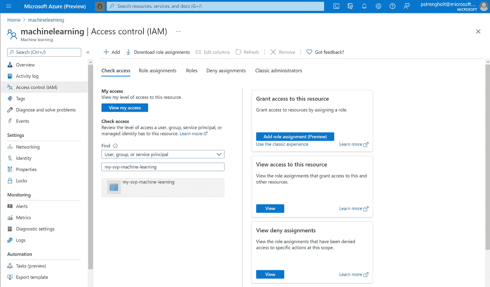

图片由 Piethein Strengholt 提供

# **Azure 机器学习**

设置好一切后，我们就可以开始了。悬停回到机器学习服务并启动工作室。

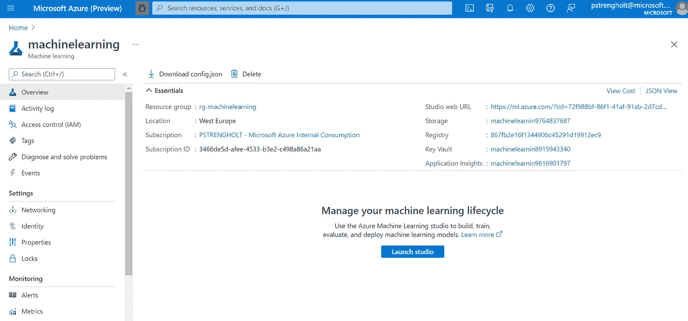

图片由 Piethein Strengholt 提供

启动 studio 环境后，您将看到一个包含许多框和控件的概览屏幕。让我给你一个组件的高层次理解，以及它们如何一起工作，以协助建立，部署和维护机器学习模型的过程。

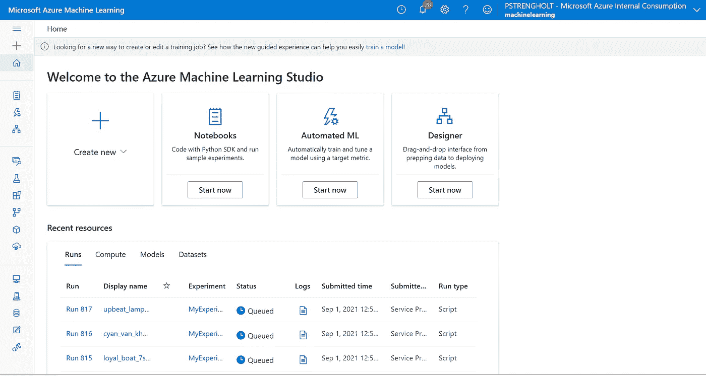

图片由 Piethein Strengholt 提供

*   一个**工作区**是集中所有服务和平台组件的地方。
*   一个**计算目标**是您用来运行您的培训脚本或托管您的服务部署的任何机器或一组机器(集群)。
*   **数据集**使访问和处理数据变得更加容易。通过创建数据集，可以创建对数据源位置的引用及其元数据的副本。
*   **环境**是对你的机器学习模型进行训练或评分的环境的封装。
*   一个**实验**是来自一个指定脚本的许多运行的分组。它总是属于一个工作区。提交运行时，您需要提供一个实验名称。
*   一次**运行**是训练脚本的一次执行。一个实验通常包含多次运行。
*   一个**笔记本**用来在集成的 Jupyter 笔记本服务器上编写和运行你自己的代码。

## 设置计算实例

为了开发新的模型，您需要有一个计算实例，这是一个包含为机器学习安装的多个工具和环境的容器。计算实例主要用于开发工作站。该计算实例还可以用作培训和推理作业的计算目标。在左侧，单击 compute 并创建一个新的计算实例。您现在可以保留默认设置，因此单击“Create”创建您的第一个计算实例。

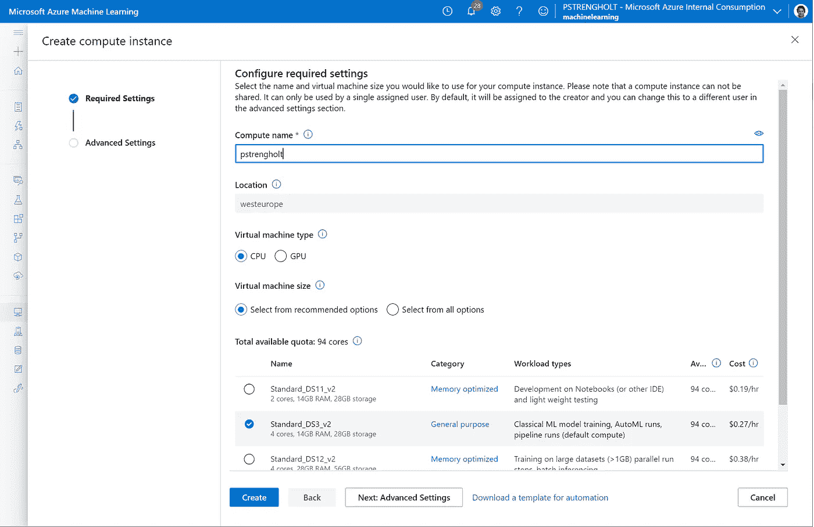

图片由 Piethein Strengholt 提供

## 构建您的第一台笔记本电脑

让我们继续我们的旅程，开发我们的泰坦尼克号生存预测模型。您将通过使用 Jupyter 笔记本来完成此操作。点击“笔记本”和“新建”,然后选择创建新笔记本。左侧的文件夹和文件结构将类似于您在下图中看到的内容。点击+新建。在我的例子中，我输入 **Titanic.ipny** 作为我的第一个笔记本，但是你可以选择任何名字。请注意，这是为了开发和测试的目的。

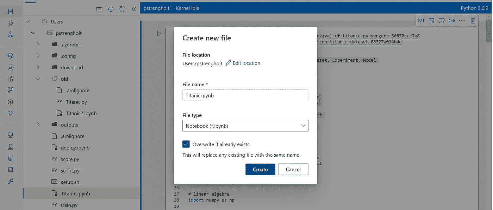

图片由 Piethein Strengholt 提供

对于模型本身，我使用了来自 towardsdatascience.com 的[预测泰坦尼克号乘客生存的文章。我用额外的配置增强了代码，以将流程与 Azure ML 紧密集成。让我们一行一行地浏览脚本:](/predicting-the-survival-of-titanic-passengers-30870ccc7e8)

```
# importing necessary librariesfrom azureml.core import Workspace, Datastore, Dataset, Experiment, Model
from azureml.data.dataset_factory import DataType# importing sklearn librariesimport sklearn
from sklearn import linear_model
from sklearn.linear_model import LogisticRegression
from sklearn.ensemble import RandomForestClassifier
from sklearn import metrics
from sklearn.model_selection import train_test_split
from sklearn.metrics import classification_report
from sklearn.metrics import confusion_matrix
from sklearn.preprocessing import MinMaxScaler
from sklearn.tree import DecisionTreeClassifier
from sklearn import preprocessing# Useful for good split of data into train and test
from sklearn.model_selection import train_test_split# import pandas
import pandas as pd# linear algebra
import numpy as np# import re package
import re# import joblib
import joblib# import seaborn
import seaborn as sns# import matplotlib
%matplotlib inline
from matplotlib import pyplot as plt
```

导入所有必需的库需要第一个代码块。azureml.core 包是与我们的 azureml 工作空间进行通信所必需的。我们的模型需要其余的包，比如 sklearn。

```
# get existing workspace
ws = Workspace.from_config()# set connection string settings
blob_datastore_name='machinelearnin9342837683' 
container_name=os.getenv("BLOB_CONTAINER", "azureml-blobstore-867fb2e1-6f13-4490-bc45-291d19912ec0") 
account_name=os.getenv("BLOB_ACCOUNTNAME", "machinelearnin9763237684")
account_key=os.getenv("BLOB_ACCOUNT_KEY", "ExMnf3yB6usdSLi96wo53MMDA/QX5E6WnccJHAq1ECawHDDb5WI1ATw9UUqS3lgHQm69oKfNwWIrUtlSXZ1RQA==")# register blob storage account within AMLS
datastore = Datastore.register_azure_blob_container(workspace=ws, 
                                                   datastore_name=blob_datastore_name, 
                                                        container_name=container_name, 
                                                         account_name=account_name,
                                                         account_key=account_key,
                                                         overwrite=True)# connect to the azure blob storage account
try:
    datastore = Datastore.get(ws, blob_datastore_name)
    print("Found Blob Datastore with name: %s" % blob_datastore_name)
except UserErrorException:
    datastore = Datastore.register_azure_blob_container(
        workspace=ws,
        datastore_name=blob_datastore_name,
        account_name=account_name, # Storage account name
        container_name=container_name, # Name of Azure blob container
        account_key=account_key,
        protocol=http) # Storage account key
    print("Registered blob datastore with name: %s" % blob_datastore_name)# attach Titanic.csv file
dataset = Dataset.Tabular.from_delimited_files(path=[(datastore, 'Titanic.csv')])
```

下一个代码块需要访问我们的工作区，并从您的存储帐户和容器中检索大量数据。此脚本中的凭据用于将存储帐户注册为新的数据存储(从您的安全位置复制粘贴访问密钥)。一旦连接上，你就可以删除这些行项目，因为 Azure ML 会进一步处理这个问题。这允许您不在脚本中放置任何凭据。现在，就让它这样吧。

```
# register Dataset as version 1
dataset.register(workspace = ws, name = 'titanic', create_new_version = True)
```

下一行项目是关于将该数据集注册为版本 1。

```
experiment = Experiment(ws, "TitanicExperiment")
run = experiment.start_logging(outputs=None, snapshot_directory=".")
```

下一步是你将注册你的泰坦尼克号实验。这很有用，因为通过实验，您可以查看所有使用的输入数据集、训练和测试数据、结果、日志记录信息等等。让我们跳到机器学习模型本身。

```
# convert dataset to pandas dataframe
titanic_ds = dataset.to_pandas_dataframe()print("Examine titanic dataset")
titanic_ds.info()print("Show first records")
titanic_ds.head(10)# convert ‘Sex’ feature into numeric
genders = {"male": 0, "female": 1}
data = [titanic_ds]
for dataset in data:
    dataset['Sex'] = dataset['Sex'].map(genders)# since the most common port is Southampton the chances are that the missing one is from there
titanic_ds['Embarked'].fillna(value='S', inplace=True)# convert ‘Embarked’ feature into numeric
ports = {"S": 0, "C": 1, "Q": 2}
data = [titanic_ds]
for dataset in data:
    dataset['Embarked'] = dataset['Embarked'].map(ports)# convert ‘Survived’ feature into numeric
ports = {False: 0, True: 1}
data = [titanic_ds]
for dataset in data:
    dataset['Survived'] = dataset['Survived'].map(ports)# a cabin number looks like ‘C123’ and the letter refers to the deck.
# therefore we’re going to extract these and create a new feature, that contains a persons deck. 
deck = {"A": 1, "B": 2, "C": 3, "D": 4, "E": 5, "F": 6, "G": 7, "U": 8}
data = [titanic_ds]
for dataset in data:
    dataset['Cabin'] = dataset['Cabin'].fillna("U0")
    dataset['Deck'] = dataset['Cabin'].map(lambda x: re.compile("([a-zA-Z]+)").search(x).group())
    dataset['Deck'] = dataset['Deck'].map(deck)
    dataset['Deck'] = dataset['Deck'].fillna(0)
    dataset['Deck'] = dataset['Deck'].astype(int)# drop cabin since we have a deck feature
titanic_ds = titanic_ds.drop(['Cabin'], axis=1)# fix age features missing values
data = [titanic_ds]
for dataset in data:
    mean = titanic_ds["Age"].mean()
    std = titanic_ds["Age"].std()
    is_null = dataset["Age"].isnull().sum()
    # compute random numbers between the mean, std and is_null
    rand_age = np.random.randint(mean - std, mean + std, size = is_null)
    # fill NaN values in Age column with random values generated
    age_slice = dataset["Age"].copy()
    age_slice[np.isnan(age_slice)] = rand_age
    dataset["Age"] = age_slice
    dataset["Age"] = titanic_ds["Age"].astype(int)# convert ‘age’ to a feature holding a category
data = [titanic_ds]
for dataset in data:
    dataset['Age'] = dataset['Age'].astype(int)
    dataset.loc[ dataset['Age'] <= 11, 'Age'] = 0
    dataset.loc[(dataset['Age'] > 11) & (dataset['Age'] <= 18), 'Age'] = 1
    dataset.loc[(dataset['Age'] > 18) & (dataset['Age'] <= 22), 'Age'] = 2
    dataset.loc[(dataset['Age'] > 22) & (dataset['Age'] <= 27), 'Age'] = 3
    dataset.loc[(dataset['Age'] > 27) & (dataset['Age'] <= 33), 'Age'] = 4
    dataset.loc[(dataset['Age'] > 33) & (dataset['Age'] <= 40), 'Age'] = 5
    dataset.loc[(dataset['Age'] > 40) & (dataset['Age'] <= 66), 'Age'] = 6
    dataset.loc[ dataset['Age'] > 66, 'Age'] = 6# create titles
data = [titanic_ds]
titles = {"Mr": 1, "Miss": 2, "Mrs": 3, "Master": 4, "Rare": 5}for dataset in data:
    # extract titles
    dataset['Title'] = dataset.Name.str.extract(' ([A-Za-z]+)\.', expand=False)
    # replace titles with a more common title or as Rare
    dataset['Title'] = dataset['Title'].replace(['Lady', 'Countess','Capt', 'Col','Don', 'Dr',\
                                            'Major', 'Rev', 'Sir', 'Jonkheer', 'Dona'], 'Rare')
    dataset['Title'] = dataset['Title'].replace('Mlle', 'Miss')
    dataset['Title'] = dataset['Title'].replace('Ms', 'Miss')
    dataset['Title'] = dataset['Title'].replace('Mme', 'Mrs')
    # convert titles into numbers
    dataset['Title'] = dataset['Title'].map(titles)
    # filling NaN with 0, to get safe
    dataset['Title'] = dataset['Title'].fillna(0)# drop name and title column since we have create a title
titanic_ds = titanic_ds.drop(['Name','Ticket'], axis=1)# default missing fare rates
titanic_ds['Fare'].fillna(value=titanic_ds.Fare.mean(), inplace=True)# convert fare to a feature holding a category
data = [titanic_ds]
for dataset in data:
    dataset.loc[ dataset['Fare'] <= 7.91, 'Fare'] = 0
    dataset.loc[(dataset['Fare'] > 7.91) & (dataset['Fare'] <= 14.454), 'Fare'] = 1
    dataset.loc[(dataset['Fare'] > 14.454) & (dataset['Fare'] <= 31), 'Fare']   = 2
    dataset.loc[(dataset['Fare'] > 31) & (dataset['Fare'] <= 99), 'Fare']   = 3
    dataset.loc[(dataset['Fare'] > 99) & (dataset['Fare'] <= 250), 'Fare']   = 4
    dataset.loc[ dataset['Fare'] > 250, 'Fare'] = 5
    dataset['Fare'] = dataset['Fare'].astype(int)# create not_alone and relatives features
data = [titanic_ds]
for dataset in data:
    dataset['relatives'] = dataset['SibSp'] + dataset['Parch']
    dataset.loc[dataset['relatives'] > 0, 'not_alone'] = 0
    dataset.loc[dataset['relatives'] == 0, 'not_alone'] = 1
    dataset['not_alone'] = dataset['not_alone'].astype(int)# create age class
data = [titanic_ds]
for dataset in data:
    dataset['Age_Class']= dataset['Age']* dataset['Pclass']# create fare per person
data = [titanic_ds]
for dataset in data:
    dataset['Fare_Per_Person'] = dataset['Fare']/(dataset['relatives']+1)
    dataset['Fare_Per_Person'] = dataset['Fare_Per_Person'].astype(int)# convert all data to numbers
le = preprocessing.LabelEncoder()
titanic_ds=titanic_ds.apply(le.fit_transform)print("Show first records of all the features created")
titanic_ds.head(10)
```

在这个演示中，我们将创建一个模型来预测泰坦尼克号沉没时谁会幸存(或死亡)。大块提供了准备数据的所有代码。总之，您将许多特征转换为数字和聚合数据，以提高模型的准确性。例如，您将年龄转换为一个类别，并根据名称编辑标题。此外，您还修复了丢失的值，并导出了其他要素的数据。最后一行显示了创建的所有特征的前 10 行。

```
# convert all data to numbers
le = preprocessing.LabelEncoder()
titanic_ds=titanic_ds.apply(le.fit_transform)# split our data into a test (30%) and train (70%) dataset
test_data_split = 0.30
msk = np.random.rand(len(titanic_ds)) < test_data_split 
test = titanic_ds[msk]
train = titanic_ds[~msk]# drop ‘PassengerId’ from the train set, because it does not contribute to a persons survival probability
train = train.drop(['PassengerId'], axis=1)X_train, X_test, Y_train, Y_test = train_test_split(train.drop("Survived", axis=1), train["Survived"],test_size=0.4,random_state=54,shuffle=True)
```

接下来的几行确保所有数据都被转换成数字。接下来，您将我们的完整数据集分成测试和训练数据集。在我们的例子中，所有的乘客信息被合并到一个大的数据集中。接下来，数据被拆分为用于训练和验证模型的数据。从概念上讲，你可以看到我们在下面做了什么:


[来源](https://datascience.stackexchange.com/questions/61467/clarification-on-train-test-and-val-and-how-to-use-implement-it)

```
# save data
np.savetxt('download/train.csv', train, delimiter=',')
np.savetxt('download/test.csv', test, delimiter=',')
np.savetxt('download/X_train.csv', X_train, delimiter=',')
np.savetxt('download/Y_train.csv', X_train, delimiter=',')
np.savetxt('download/X_test.csv', X_train, delimiter=',')
np.savetxt('download/Y_test.csv', X_train, delimiter=',')# upload data to blob storage account
datastore.upload_files(files=['download/train.csv', 'download/test.csv', 'download/X_train.csv', 'download/Y_train.csv', 'download/X_test.csv', 'download/Y_test.csv'],
                       target_path='titanic_data/',
                       overwrite=True)# attach all datasets
dataset_train = Dataset.Tabular.from_delimited_files(path=[(datastore, 'titanic_data/train.csv')])
dataset_test = Dataset.Tabular.from_delimited_files(path=[(datastore, 'titanic_data/test.csv')])
dataset_X_train = Dataset.Tabular.from_delimited_files(path=[(datastore, 'titanic_data/X_train.csv')])
dataset_Y_train = Dataset.Tabular.from_delimited_files(path=[(datastore, 'titanic_data/Y_train.csv')])
dataset_X_test = Dataset.Tabular.from_delimited_files(path=[(datastore, 'titanic_data/X_test.csv')])
dataset_Y_test= Dataset.Tabular.from_delimited_files(path=[(datastore, 'titanic_data/Y_test.csv')])# register datasets as version 1
dataset_train.register(workspace = ws, name = 'train', create_new_version = True)
dataset_test.register(workspace = ws, name = 'test', create_new_version = True)
dataset_X_train.register(workspace = ws, name = 'X_train', create_new_version = True)
dataset_Y_train.register(workspace = ws, name = 'Y_train', create_new_version = True)
dataset_X_test.register(workspace = ws, name = 'X_test', create_new_version = True)
dataset_Y_test.register(workspace = ws, name = 'Y_test', create_new_version = True)
```

为了在 Azure ML 中存储和管理我们所有的数据，你需要使用下面几行代码。在稍后阶段，您将注册您的版本化模型并将其链接到此版本化数据，包括所有其他元数据，如性能指标、准确性等。这对展示证据和保持控制很重要。

```
# Random Forest
random_forest = RandomForestClassifier(n_estimators=100)
random_forest.fit(X_train, Y_train)# Save model as pickle file
joblib.dump(random_forest, "outputs/random_forest.pkl")# Predict and get result
Y_prediction = random_forest.predict(X_test)
random_forest.score(X_train, Y_train)
acc_random_forest = round(random_forest.score(X_train, Y_train) * 100, 2)# show the important features for the classification
feature_imp = pd.Series(random_forest.feature_importances_, index=X_train.columns).sort_values(ascending=False)
plt.figure(figsize=(10,6))
sns.barplot(x=feature_imp, y=feature_imp.index)
# Add labels to your graph
plt.xlabel('Feature Importance Score')
plt.ylabel('Features')
plt.title("Visualizing Important Features")
plt.tight_layout()
```

接下来，您将使用随机森林模型，这是一种受监督的机器学习算法。它创建了一个决策树的森林，并使其具有一定的随机性。此外，您会看到一个显示模型中最主要特征的图。

```
# register model within workspace
model_random_forest = Model.register(workspace=ws,
                       model_name='random_forest',
                       model_path='outputs/random_forest.pkl',
                       model_framework=Model.Framework.SCIKITLEARN,
                       model_framework_version=sklearn.__version__,
                       sample_input_dataset=dataset_X_train,
                       sample_output_dataset=dataset_Y_train,
                       description='Titanic survival prediction using random forest.',
                       datasets = [('train',dataset_train),('test',dataset_test),('X_train',dataset_X_train),('Y_train',dataset_Y_train),('X_test',dataset_X_test),('Y_test',dataset_Y_test)],
                       tags={'type': 'regression'})
```

使用上面的代码行，您将在 Azure ML 中注册您的模型。模型本身被序列化为 pickle 文件，这意味着它已经被转储以供以后使用。此外，您还将模型链接到了我们的训练数据集。

```
# log plot image
run.log_image('Feature Importance Score', plot=plt)# complete run
run.log("Random Forest accuracy", acc_random_forest)
run.complete()
```

最后，您记录我们模型的准确性，并将运行标记为完成。

## MLOps 功能

在典型的开发流程中，开发模型只是第一步。最大的努力是让一切都准备好投入生产。这包括数据收集、数据准备、培训、服务和监控。您只是执行了这些最初的步骤，并在 Azure ML 中存储了所有相关的元数据信息。例如，您可以看到下面的绘图图像，它和我们的模型的其他信息，如实验、版本化数据集、日志记录信息等等。

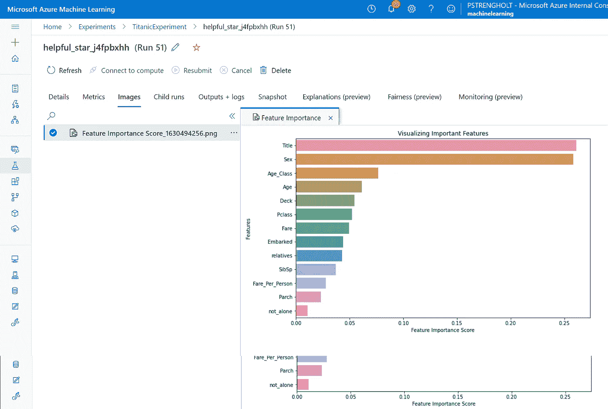

图片由 Piethein Strengholt 提供

最大的好处是，您可以将模型和实验与可靠且可重复的结果关联起来。团队成员可以轻松地观察、解释和改进模型行为和准确性，因为所有信息都集中在一个中心位置。

## 利用计算集群进行纵向扩展

下一步是在集群上训练模型，这对计算密集型处理很有用。例如，当使用大型数据集或复杂计算时。这项工作可以分配给几台机器。在计算部分，您可以创建和配置集群。在本演示中，您可以通过单击“下一步”来使用标准配置。

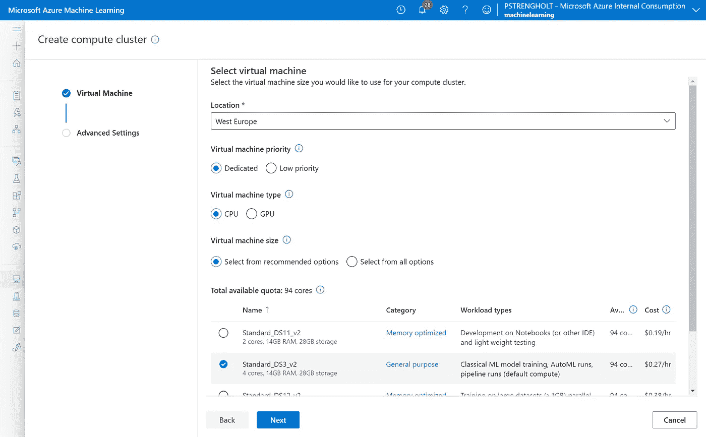

图片由 Piethein Strengholt 提供

为了向我们的集群提交作业，您需要设置一些额外的脚本。第一个脚本名为 **setup.sh** ，用于安装所需的软件包。

```
#!/bin/bash
pip install azureml-sdk[notebooks]
pip install azureml-core
pip install azure-storage-blob
pip install joblib
```

第二个脚本叫做 **script.py** ，它与我们的 Azure ML 工作空间交互，用于提交我们的作业。让我们检查下面的代码块。

```
from azureml.core import ScriptRunConfig, Experiment
from azureml.core import Workspace
from azureml.core.compute import ComputeTarget, AmlCompute
from azureml.core.compute_target import ComputeTargetException
from azureml.core import Environment
from azureml.widgets import RunDetails
from azureml.core.authentication import ServicePrincipalAuthenticationsvc_pr = ServicePrincipalAuthentication(
    tenant_id="72f988bf-FDf1-41af-9Ab-2d7cd011Ab47",
    service_principal_id="ef861c6f-b0FA-4895-8330-9b90Aea3bd1",
    service_principal_password="~_V846CU~R36tP.UV4Sz78TtUAaeyF40C")ws = Workspace(
    subscription_id="3466fg5d-afda-4533-b3e2-c498g86a45aa",
    resource_group="rg-machinelearning",
    workspace_name="machinelearning",
    auth=svc_pr
    )# create or load an experiment
experiment = Experiment(ws, 'TitanicExperiment')# create or retrieve a compute target
cluster = ws.compute_targets['cluster1']# create or retrieve an environment
env = Environment.get(ws, name='AzureML-sklearn-0.24.1-ubuntu18.04-py37-cpu-inference')# configure and submit your training run
src = ScriptRunConfig(source_directory='.',
                        command=['bash setup.sh && python train.py'],
                        compute_target=cluster,
                        environment=env)run = experiment.submit(config=src)
run
```

你还记得服务原则账户吗？服务原则帐户信息来自您之前使用的帐户信息。这允许您的集群与 Azure ML 进行交互。另一个重要的方面是推论。我正在使用一个[预构建的 Docker 容器](https://docs.microsoft.com/en-us/azure/machine-learning/concept-prebuilt-docker-images-inference)映像，它包含最流行的机器学习框架和 Python 包。

另一个重要方面是命令参数。我用它来传入 **setup.sh** 和 **train.py** 脚本。setup.sh 脚本安装所有必需的软件包。在我的示例机器学习模型脚本中， **train.py** 引用了与 **Titanic.ipny** 相同的代码。在存储这些脚本并运行 script.py 之后，应该向集群提交一个作业，如下图所示。

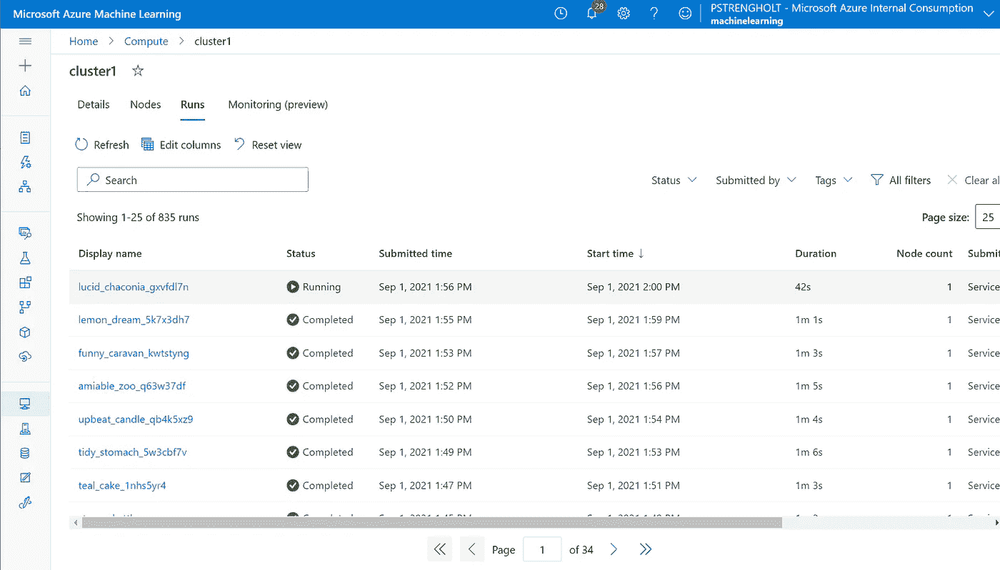

图片由 Piethein Strengholt 提供

最大的好处是您可以轻松地纵向扩展。从在计算实例上开发的模型过渡到高性能的弹性集群相对容易。这只是用另一个(小的)脚本来包装你的实验。

## 使用 Azure ML 端点操作您的模型

最后一步是操作您的模型，在我们的例子中是将模型部署为 web 服务。在 Azure ML 中，您可以部署实时或批处理服务。要将您的模型部署为实时 web 服务，请使用下面的代码:

```
# set service name
service_name = 'titanic-service'
service = Model.deploy(ws, service_name, [model_random_forest], overwrite=True)
service.wait_for_deployment(show_output=True)
```

*titanic-service* 是指服务名。在我们的例子中, **model_random_forest** 指的是您在我们的工作空间中注册的模型。成功部署后，您应该在端点部分看到您的服务:

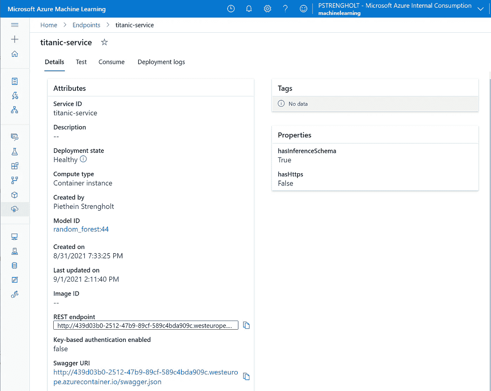

图片由 Piethein Strengholt 提供

这个 REST 端点可以与任何其他系统集成。让我们通过使用 [postman](https://www.postman.com/) 来验证服务。

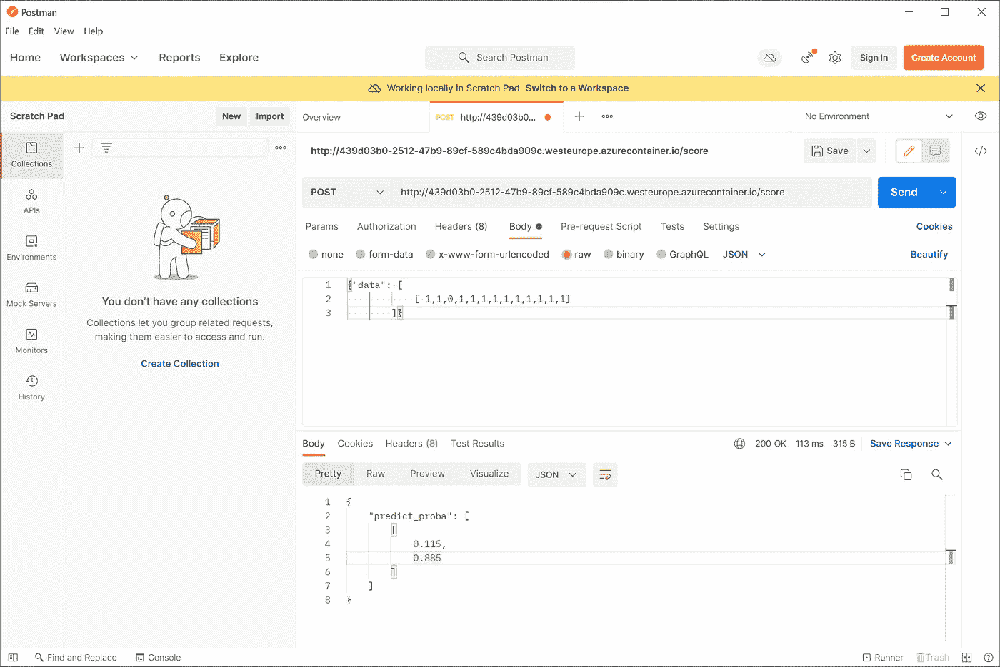

图片由 Piethein Strengholt 提供

我通过提交 13 个数据属性进行 API 调用。第二和第三个属性是性别和年龄。数字 1 和 1 对应于年龄小于或等于 11 岁的女性。提交我们的请求后，你可以看到泰坦尼克号幸存的概率是 88.5%。

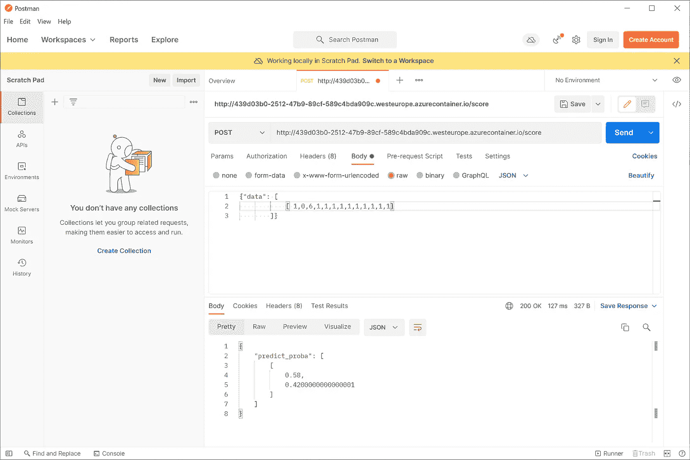

图片由 Piethein Strengholt 提供

如果您将性别和年龄更改为 0 和 6，这些值对应于年龄在 44 和 66 之间的男性。幸存的概率，如你所见，下降到了 42.0%。

# 结论

我们刚刚展示的是一个从数据收集和准备到模型部署和运作的自动化 ML 生产环境。合乎逻辑的下一步是将我们的所有代码存储到一个版本化的 Git 存储库中，并使用一个持续集成(CI)流程来自动化管道启动、培训和测试自动化、审查和批准流程。

代码仓库:[https://github . com/pietheinstrengholt/Azure-ML-and-devo PS-meets-Titanic](https://github.com/pietheinstrengholt/Azure-ML-and-DevOps-meets-Titanic)