# Azure Synapse 分析—简介

> 原文：<https://towardsdatascience.com/azure-synapse-analytics-introduction-34d4a0a81c0?source=collection_archive---------4----------------------->

## 关于 Azure Synapse Analytics 的内容、原因和方式的简要概述


信用:ISTOCKPHOTO

# 介绍

Synapse Analytics 是来自 Microsoft Azure 的集成平台服务，它结合了数据仓库、数据集成、ETL 管道、分析工具和服务、大数据功能的规模、可视化和仪表板的功能。

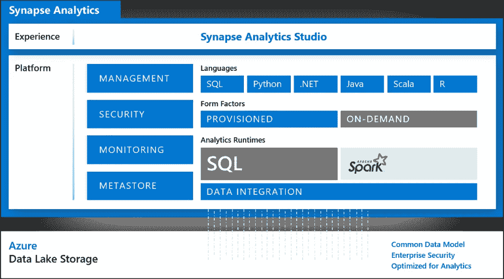

微软 Azure Synapse 分析逻辑架构。鸣谢:微软 Azure

该平台支持企业范围的决策分析需求。工具、过程和技术支持跨维度的分析能力: ***描述性*** & ***诊断分析*** 通过利用其数据仓库能力，借助 T-SQL 查询收集业务见解。它通过利用与 Apache Spark、Databricks、Stream Analytics 的集成，利用 ***预测性*** 和 ***规定性*** *分析*功能，为组织的决策提供支持。

## 它是如何工作的

Azure Synapse Analytics 是一站式分析解决方案，提供以下功能:

*   SQL 服务器的专用池***，**称为 **Synapse SQL，**是整个分析数据存储的主干，这些为在其下实施数据仓库提供了必要的基础设施。使工程师能够根据他们现有的经验执行 T-SQL 查询。
    它还支持 empower 使用*无服务器模式处理计划外或临时工作负载，通过使用*数据虚拟化*允许从他们自己的数据存储中释放洞察力，而无需通过建立数据仓库的正式流程。**
*   **使用 **Synapse 管道**的 ETL 和来自不同来源的数据集成功能使组织能够高效地搅动数据以用于仓储和分析目的。可重用的工作流和管道编排功能易于适应。对 Hadoop 和 DataBricks 的 HDInsight 等大数据计算服务的支持使其成为一个更强大的 ETL 工具。**
*   **借助面向 Azure Synapse 的 **Apache Spark** 实现大数据工作负载和机器学习解决方案的开发。该平台通过支持大规模可扩展的高性能计算资源来处理大数据工作负载。SparkML 算法和 Azure ML 集成使其成为训练机器学习工作负载的完整解决方案。**
*   **使用 **Synapse Link** 从运营数据源提供实时运营分析。**

## **哪里合适？**

**Azure Synapse Analytics 最常见的业务用例有:**

*   ***数据仓库*:集成各种数据平台和服务的能力。**
*   ***描述性/诊断性分析*:对 Synapse 数据库使用 T-SQL 查询来执行数据探索和发现。**
*   ***实时分析* : Azure Synapse Link 支持与不同的运营数据源集成，以实施实时分析解决方案。**
*   ***高级分析*:通过利用 Azure 数据块，使用 Azure 数据块来支持决策。**
*   ***报告&可视化*:与 PowerBI 集成，增强业务决策能力。**

**[](https://www.linkedin.com/in/p-jainani/) [## Pankaj Jainani -云解决方案架构师

### 我是云解决方案架构师、人工智能工程师、DevOps 顾问、Scrum Master、技术经理……

www.linkedin.com](https://www.linkedin.com/in/p-jainani/) 

# 功能演练

假设您已经在 Azure 订阅中 [*设置并配置了*](https://docs.microsoft.com/en-in/azure/synapse-analytics/get-started-create-workspace)Azure Synapse 分析工作区。

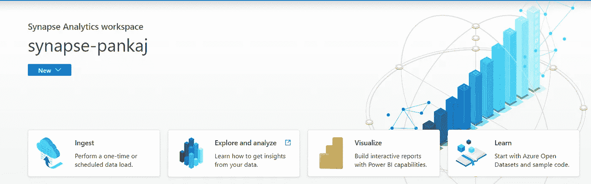

Synapse Analytics Workspace — *鸣谢:MS Azure Synapse Analytics Studio*

> Azure Synapse Analytics workspace 的设置和配置超出了本文的范围。有关更多详细信息，请查看参考资料部分。

## 使用 Spark 加载和分析数据

*   从*数据中心，*浏览图库和`covid-tracking`数据集。
*   使用下面的数据集打开新的 Spark 笔记本。

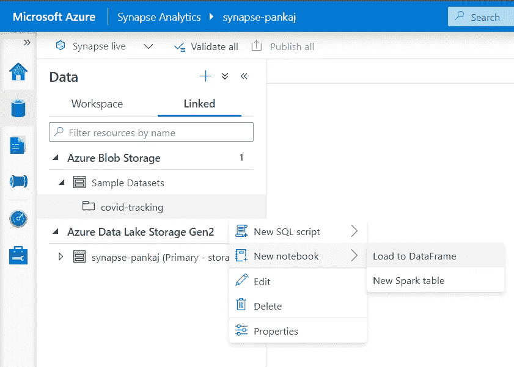

演示屏幕截图—C*create Spark 笔记本。鸣谢:Azure Synapse 分析工作室女士*

*   该笔记本包含以下默认代码，以及使用 Spark backbone framework 分析数据集的更多功能

```
## ---- ##
df = spark.read.parquet(wasbs_path)
display(df.limit(10))
```

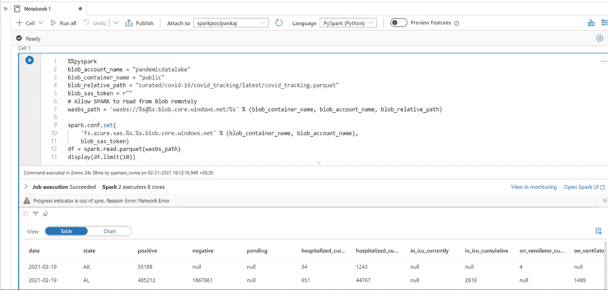

一个演示的屏幕截图— *使用 Spark 分析数据集。鸣谢:Azure Synapse 分析工作室女士*

## 分析无服务器 SQL 池中的数据

*   再次从数据中心加载示例数据集，但是这次创建一个新的 SQL 脚本，如下所示:

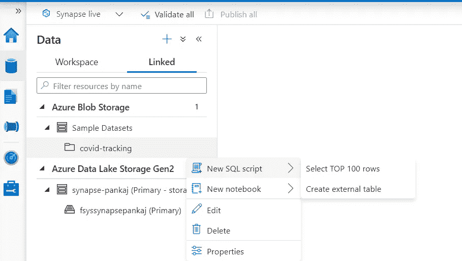

演示屏幕截图— *使用 SQL 脚本分析数据集。鸣谢:Azure Synapse 分析工作室女士*

*   这将为您提供使用本机 T-SQL 查询分析数据集的自由脚本

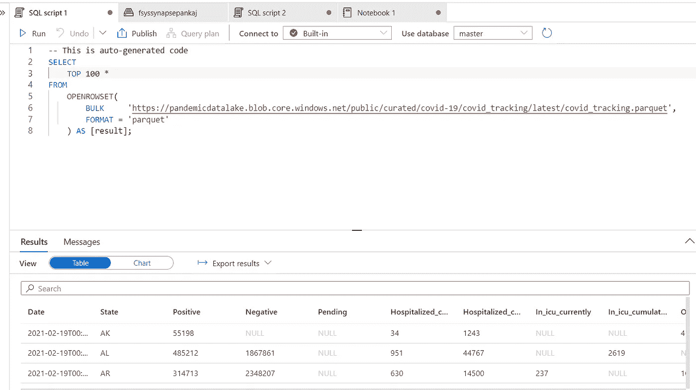

演示的屏幕截图— *使用 SQL 脚本分析数据集。鸣谢:Azure Synapse 分析工作室女士*

## 设置和集成管道

这个小演示将展示如何在 Azure Synapse 中集成管道任务

*   从 Synapse Analytics Studio 的 ***集成*** 中心选择 ***管道。***

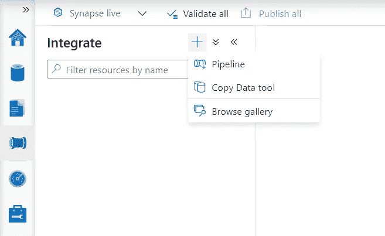

演示的屏幕截图—创建集成*管道。鸣谢:Azure Synapse 分析工作室*

*   一旦管道被实例化——你可以根据手头的问题添加工作流 ***活动*** 。

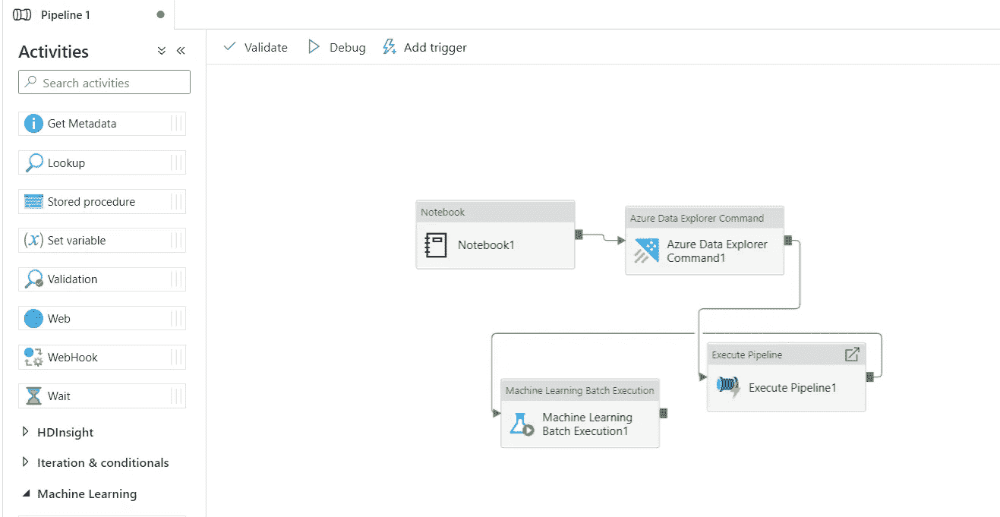

演示屏幕截图—设置*管道活动。鸣谢:Azure Synapse 分析工作室*

*   您可以添加*触发*条件来响应事件或手工执行管道工作流。同样，选择 ***监控中枢*** ，选择 ***管道运行*** 监控任何管道执行进度。

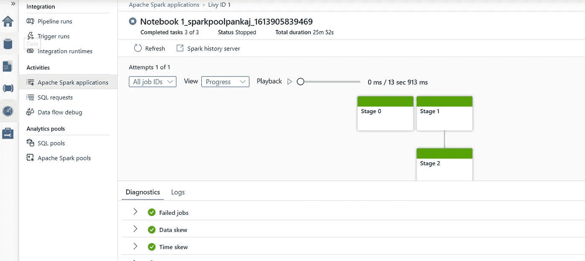

演示的屏幕截图—探索 Synapse Studio 的显示器选项*。鸣谢:Azure Synapse 分析工作室*

## 集成链接服务

使用 Synapse Analytics Studio 集成和启用各种链接服务，例如 Power BI

*   使用 ***管理*** 枢纽查看已有的 ***关联服务***

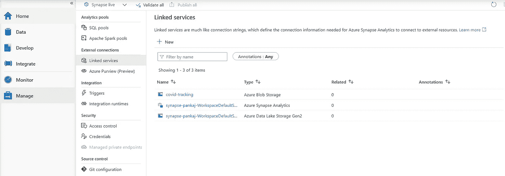

演示的屏幕截图—探索 Synapse Studio 的链接服务*。鸣谢:Azure Synapse 分析工作室女士*

*   此外，创建一个到 ***PowerBI*** 工作区的链接，以利用数据可视化和报告。

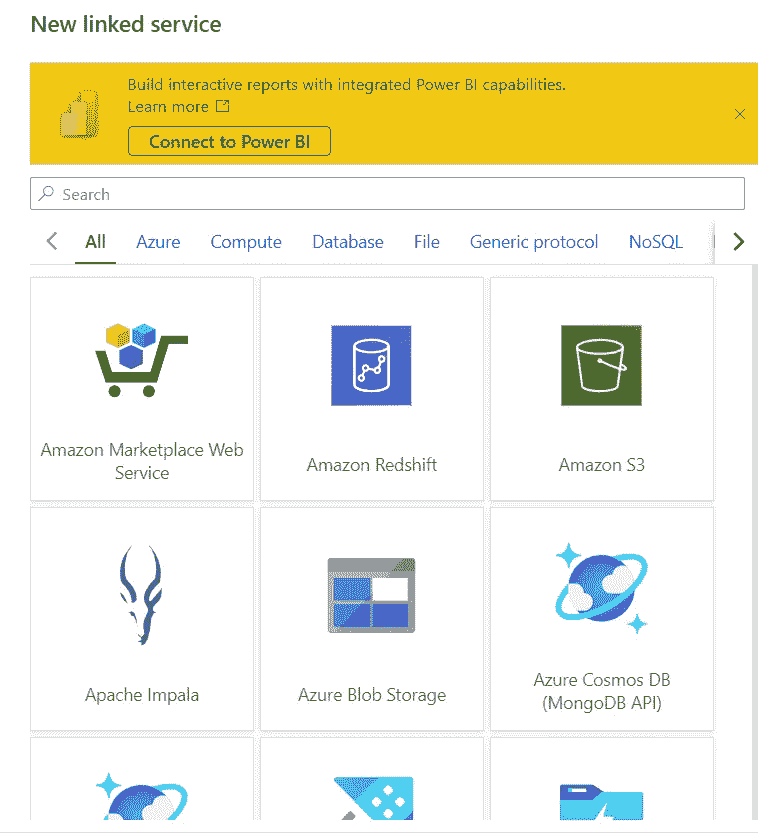

演示的屏幕截图—创建和设置 Synapse Studio 的链接服务*。鸣谢:Azure Synapse 分析工作室*** 

# **结论**

**在这个关于 ***Azure Synapse Analytics 的简介中，*** 我已经浏览了浅水区，以了解 Azure 的这个托管服务的基本功能。**

**现在，您已经了解了*什么是*Synapse Analytics，*为什么*解决优化组织的目标非常重要，并且稍微了解了*如何在各种分析用例中利用其功能。***

**希望你已经获得了一些见解，让我知道你的反馈和疑问。**

> ***与我连线*[***LinkedIn***](https://www.linkedin.com/in/p-jainani/)*进一步讨论***

**[](https://www.linkedin.com/in/p-jainani/) [## Pankaj Jainani -云解决方案架构师

### 我是云解决方案架构师、人工智能工程师、DevOps 顾问、Scrum Master、技术经理……

www.linkedin.com](https://www.linkedin.com/in/p-jainani/) 

# 参考

[1]微软文档|[Azure Synapse Analytics](https://docs.microsoft.com/en-in/azure/synapse-analytics/overview-what-is)**