# Azure Synapse 专用 SQL 池模式设计选项基准

> 原文：<https://towardsdatascience.com/azure-synapse-dedicated-sql-pool-schema-design-options-benchmark-63ee1e0f1a19?source=collection_archive---------18----------------------->

## [理解大数据](https://towardsdatascience.com/tagged/making-sense-of-big-data)

## 通过基准测试证明的最佳实践集(dis)

# 介绍

MPP 引擎的市场非常广阔，云领域的大玩家也有不断发展的产品。因此，更好地了解它们的能力和表现真的很有趣。

让我们回顾一下 Azure 的 Synapse 专用 SQL Pool MPP 数据库平台，它是微软基于 PDW 设备的数据仓库的演进，旨在服务于数据仓库需求。

# 动机

该基准测试的动机是找到简单问题的简单答案:如何**在基于**经典星型模式**构建的 Azure 专用 SQL 池上调整物理模式**，使用**现实的**企业级**数据量**来回答**最常见的分析查询**。

基于 TPC-H 模式有一些不错的值得回顾的基准，例如由 Gigaom 执行的基准。最新的一个确实值得研究，但是，对我来说，它没有提供以下问题的答案:

*   索引调优和分布选项如何影响性能？
*   基数如何影响响应时间？
*   对于给定的数据量大小，将查询保持在 3-5 秒的响应时间间隔内需要多少资源

当前的基准旨在回答这些问题，并证明或否定一些一般性建议。

# 基准描述

## 数据模型

让我们考虑一个经典的星型模式，其中一个事实表被一组维度表包围

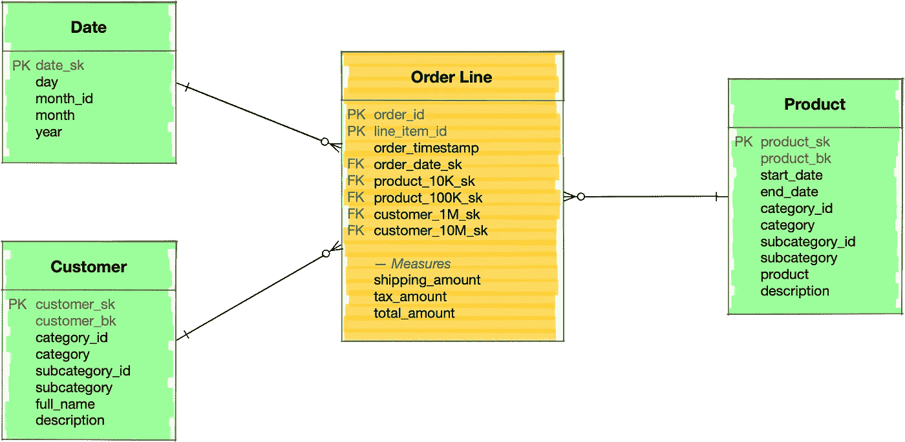

为了简化测试，事实表包含对不同大小的相同维度的引用。

## 要测试的查询

让我们将简单分析查询分为 3 个简单类别:

*   全范围/大范围/小范围扫描**以及随机访问，根据等式和范围谓词进行适当过滤；**
*   **加入**大表和**(事实和尺寸)小表之间的**操作；
*   **大桌对大桌加入**年代

## 基本数据

为了测试不同的配置文件，需要检查不同大小的输入表:

*   较小尺寸用 **100** 、 **10K** 、 **100K** 记录
*   较大尺寸: **1M、10M、**和 **100M** 记录
*   事实表尺寸用 **10M** 、 **100M** 、 **1B** 记录

## 集群环境

已经执行了以下集群配置和准备工作:

*   **DW200c、DW1000c、DW3000c、DW6000c** 容量/性能等级已使用；
*   **没有并发查询**，所有查询都是随后运行的；
*   查询在 **xlargerc** 资源类下运行，确保 70%的内存资源分配；
*   在对基于**复制的**数据分布类型的所有维度表运行基准查询之前，调用了**索引重建**；
*   **参与查询的所有表的统计数据被更新**；
*   **结果集缓存**被关闭**；**
*   在每次测试之前，运行以下代码:`DBCC DROPCLEANBUFFERS; DBCC FREEPROCCACHE;`
*   显示的运行时间值是连续 5 次运行的平均值，不包括最小值和最大值。

# 专用 SQL 池模式设计选项

基准测试的目的是使用基于固定星型模式的逻辑数据模型在物理模式级别测试不同的选项。

因此，让我们考虑以下两个主要方向:索引和数据分布的选项:

**索引:**

*   默认聚集列存储索引，称为 **CCI** 向下文本
*   有序聚集列存储索引(**有序 CCI 下文本**)
*   聚集索引(非列索引)
*   次级 B 树索引

**分配:**

*   循环赛
*   混杂
*   复制

# 基准测试结果

# 测试#1:小型、大型和全表扫描(无连接)

在测试#1 的范围内，一组简单的过滤器查询正在扫描不同的数据集大小:

*   小定位记录对；
*   大—占整个表格的 10-30 %;
*   全扫描—分析整个表。

每个单独的测试都有一个特定的目标要验证。在基准测试期间运行的所有查询的列表可以在本文的最底部找到。

## 测试 1.1:默认 CCI 指数

第一个测试是在具有默认索引配置(聚集列存储索引)的表上执行的。以下是不同容量级别的结果:DW200c、DW1000c 和 DW3000c:

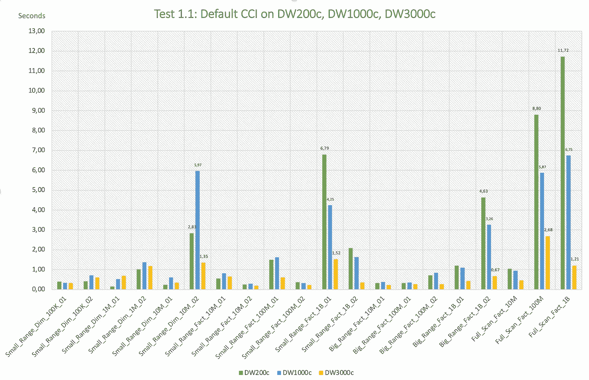

测试 1.1 结果图表。作者图片

***观察*** *:*

*   从 **DW200c** 性能级别开始，专用 SQL 池为大多数查询提供 3 秒内的响应时间。
*   例外情况是对非常大的表的查询，例如包含十亿行的表
*   有趣的是，与 DW200c 相比，查询“Small_Range_Dim_10M_02”在 DW1000c 上的时间更短。我认为这与以下事实有关:从 DW1000c 开始，群集开始拥有 2 个计算节点，这为节点间通信带来了一些开销，并导致此类查询的性能下降。

## 测试 1.2:默认 CCI 与订购 CCI

最近，Azure 引入了一个有趣的专用 SQL 池性能增强特性，称为**有序聚集列存储索引**。

乍一看，它可能会给人留下改变游戏规则的印象。但事实上，并不是这样。我推荐你阅读来自微软的[文章](https://docs.microsoft.com/en-us/azure/synapse-analytics/sql-data-warehouse/performance-tuning-ordered-cci)，更好地理解它能带来显著利益的独特环境。

在当前测试的范围内，测试了基于时间戳的范围扫描，它覆盖了所有记录的 10%或 30%。表结构的 3 个选项已经过测试:

*   **默认 CCI 指数**
*   "**有序 CCI 1** 索引-基于 order_timestamp 字段的有序 CCI 索引，结合基于同一 *order_timestamp* 字段的散列分布
*   "**有序 CCI 2** 索引-基于 order_timestamp 字段的有序 CCI 索引，具有基于散列的分布，这与基于 *order_id* 字段的默认 CCI 索引中的分布相同

测试的查询模式:

```
**select** **count**(*), **sum**(total_amount), 
       **sum**(shipping_amount), **avg**(tax_amount) 
  **from** <fact_order_line_1B_with_different_index_config>
 **where** order_timestamp **between** <range_of_different_size>
```

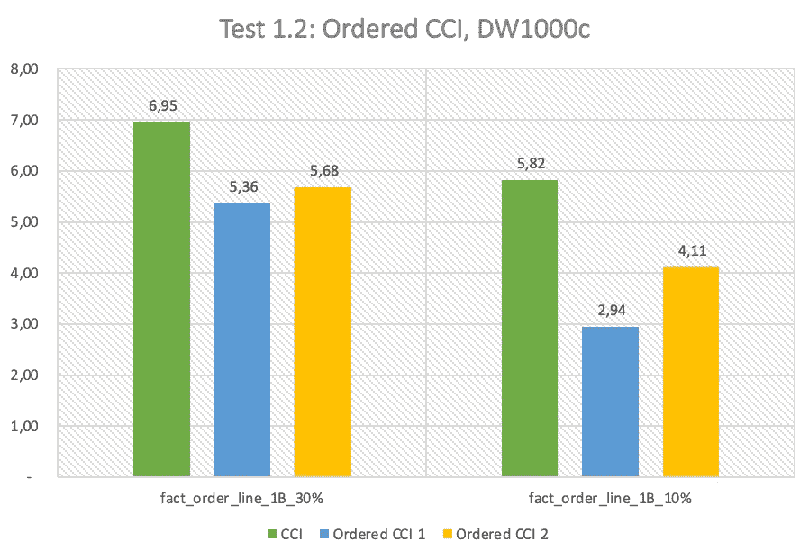

测试 1.2 结果图表。作者图片

***观察*** *:*

*   尽管有序的 CCI 1 可以为较小范围的扫描带来显著的性能优势，但是您应该为它创建理想的环境，这在现实生活中几乎是不可能的
*   一般来说，有序的 CCI 指数不会带来显著的好处

## 测试 1.3:聚集(非列存储)和 BTree 索引

专用 SQL 池可以灵活地选择不同类型的索引。除了默认的聚集列存储索引之外，还可以创建常用的聚集列存储索引。

所以理解什么时候值得使用它是很有趣的。

在测试范围内，相同的查询在一个维度表上运行，该维度表有 1000 万行，构建在默认 CCI 索引或聚集(非列存储)索引上，并在其上构建 B 树索引。

结果反映在下表中:

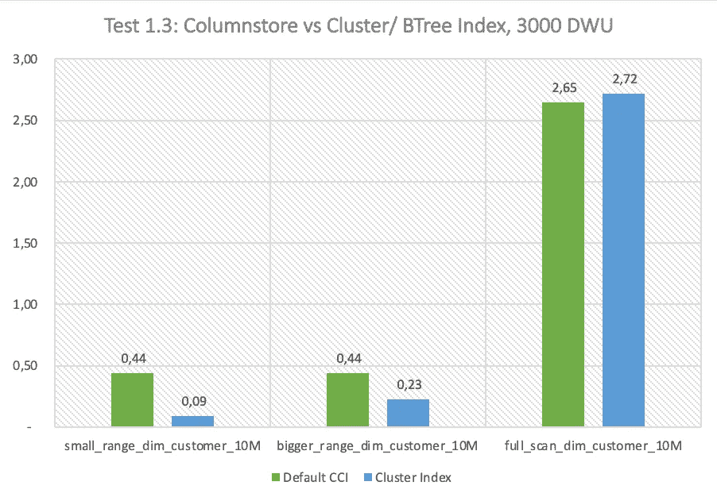

测试 1.3 结果图表。作者图片

***观察结果*** *:*

*   聚集索引以及辅助 BTree 索引为随机访问或小范围扫描提供了最佳的响应时间；
*   对于更大范围和全扫描，聚集索引和辅助 BTree 索引的效果稍差

## 测试 1.4:不同的列数

众所周知，默认的 CCI 索引最适合在查询中包含几列的分析场景。

测试的目的是验证 select 语句中涉及的列数如何影响计时。

查询模式:

```
**select** <calculation list> 
  **from** fact_order_line_1B 
 **where** order_timestamp **between** '2021-02-01' and '2021-03-01'<calculation list>:
1 Column:  **count**(*)
2 Columns: **count**(*), **sum**(total_amount)
3 Columns: **count**(*), **sum**(total_amount), **sum**(shipping_amount)
4 Columns: **count**(*), **sum**(total_amount), **sum**(shipping_amount), 
           **sum**(tax_amount)
```

关于查询时间的统计信息可以在下面找到:

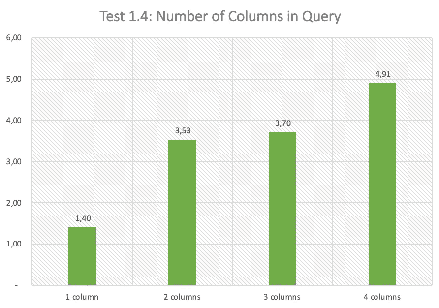

测试 1.4 结果图表。作者图片

***观察结果*** :

*   向 select 语句中添加更多列会显著影响响应时间:
*   计算中涉及的 2 列和 4 列之间大约有 40%的差异

## 测试#1.5:复制与哈希分布

测试#1.5 的主要目标是验证数据分布类型如何影响不同类型的范围查询的性能。

相同的数据已经存储在 3 种数据分布类型的表中:1)循环法；2)复制；3)哈希分布。

您可以看到 DW1000c 和 DW3000c 两个性能级别的基准测试结果:

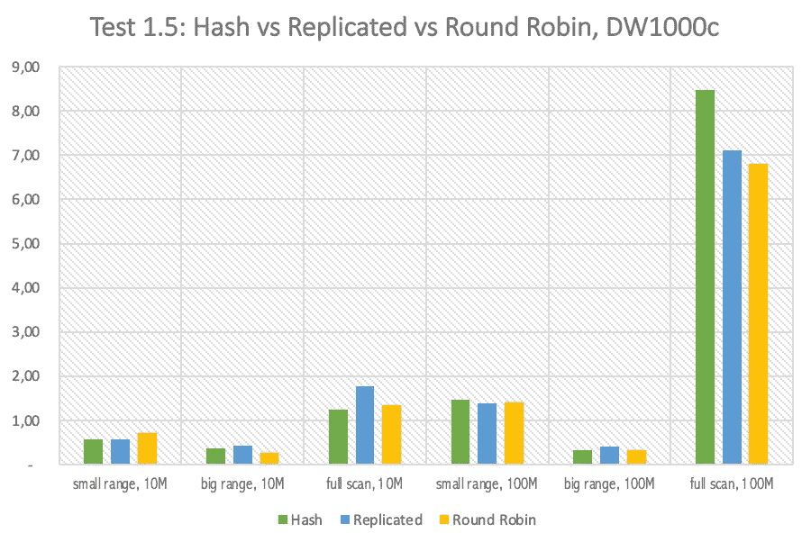

onDW1000c 上的测试 1.5 结果图表。作者图片

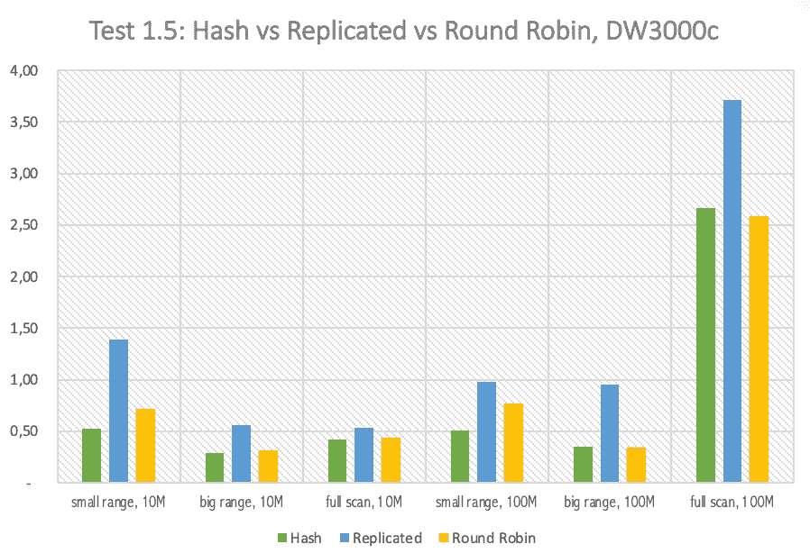

DW3000c 上的测试 1.5 结果图表。作者图片

***观察结果*** :

*   对于所有 3 个选项，查询结果时间与 DW1000c 性能水平非常接近；
*   从 DW3000c 开始，哈希分布式类型(我假设它允许更好的并行化)的性能开始显著提高。

# 测试#2:大到小的表连接(事实到维度)

如上所述，测试#2 的目的是对连接操作的不同方面进行基准测试。让我们回顾一下收集的各种统计数据。

## 测试 2.1:默认值

本节中第一个测试的目的是对基本的连接场景进行基准测试，包括:

*   事实到维度表的连接操作；
*   不同大小的事实表和维度表；
*   根据一个维度属性和几个聚合进行分组
*   较大的事实表通过散列来分发，而较小的维度被复制；
*   所有表都基于默认的 CCI 索引；
*   以 3 个性能级别为基准:DW1000c、DW3000c 和 DW6000c

查询模板如下所示:

```
**select** **top 50** 
       d.category_id, **max**(d.category), **avg**(f.tax_amount),
       **sum**(f.total_amount), **sum**(f.shipping_amount)
  **from** fact_order_line_<size> f 
       **inner join** <dimension_of_different_size> d on <join_criteria>
 **group** **by** d.category_id
 **order** **by** sum(f.total_amount) desc
```

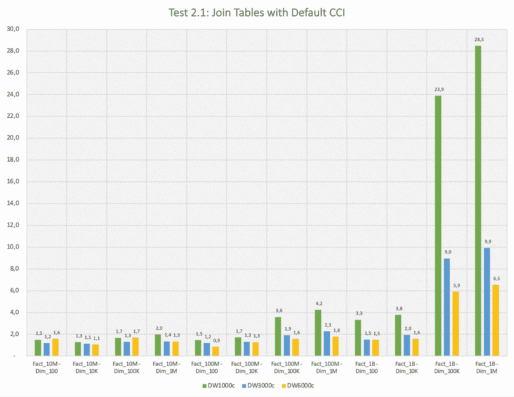

测试 2.1 结果图表。作者图片

***观察值*** :

*   从 DW1000c 的性能级别开始，大多数查询在 5 秒内执行；
*   例外是两个最新的查询，包括更大的表的连接:1B 到 100K 和 1B 到 1M；
*   从 DW1000c 到 DW6000c 的资源扩展不会对较轻的查询产生巨大影响，但是对于最近两个明显较重的查询，线性地改善了时间

## 测试 2.2:要连接更多维度表

测试#2.2 的目标是验证相同大小的额外维度表的连接如何影响总体计时。

已经在事实表到 1 维表的连接与到 2 维表的连接和到 3 维表的连接之间进行了比较。

性能等级 DW1000c 的结果反映如下:

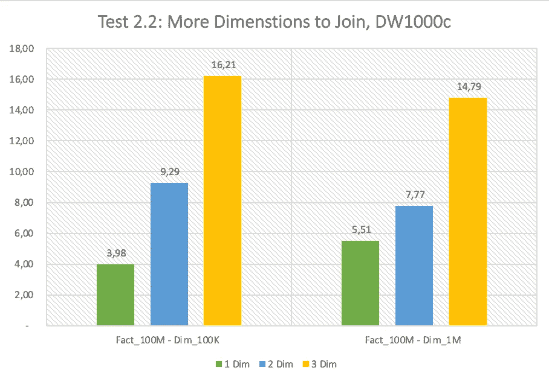

测试 2.2 图表。作者图片

***观察结果*** :

*   要连接的维度数量会显著影响总体时间:连接三个维度表的时间比连接一个维度表的时间**长 3-4 倍**

## 测试 2.3:具有聚集非列存储索引的维度表

有些数据库引擎同时支持基于行和基于列的存储配置文件，建议以基于行的格式存储维度表。

如果将事实表与维度表连接进行比较，验证连接的性能有何不同是一件有趣的事情，其中维度表是在 CCI 上构建的，而维度是使用简单聚集索引(非列存储索引)构建的

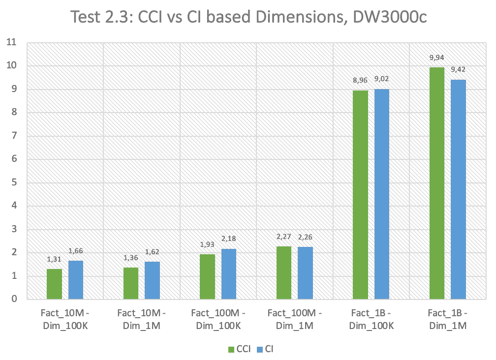

测试 2.3 图表。作者图片

***观察结果*** :

*   从上面的图表可以看出，整体性能几乎相同；
*   因此，另一个因素应该决定对维度表使用哪种索引方法。

## 测试#2.4:哈希复制与复制复制连接

MPP 存储的一个关键最佳实践是保持较大的事实表均匀分布在所有节点上，同时存储在所有节点上复制的较小维度表。

另一方面，Azure 建议将较小的表复制到大约 2GB 的空间。问题是，如果事实表仍然适合这个大小，那么还值得复制它吗？

因此，下面的测试比较了事实表(相对较小)被复制或通过散列分布的连接查询的时间。

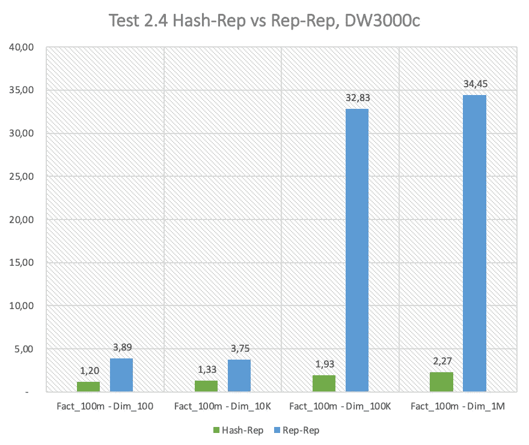

测试 2.4 结果图表。作者图片

***观察值*** :

*   事实表的分布式版本在所有情况下都能更好地工作。
*   对于较大的表连接，这种差异非常显著

# 测试#3:大表到大表的连接

最后一个测试致力于大表到大表的连接。

## 测试 3.1:分布类型

在这个测试的范围内，有 10 亿行的大型事实表被连接到一个包含 1 亿行的大型维度表。

事实表是按维度外键(customer_sk)上的散列分布的。使用以下维度表配置:

*   按主键散列分布的维度表(customer_sk)
*   按备选键分布的维度表(customer_bk)
*   配置为复制的维度表

使用 DW1000c 性能水平的时序对比如下所示:

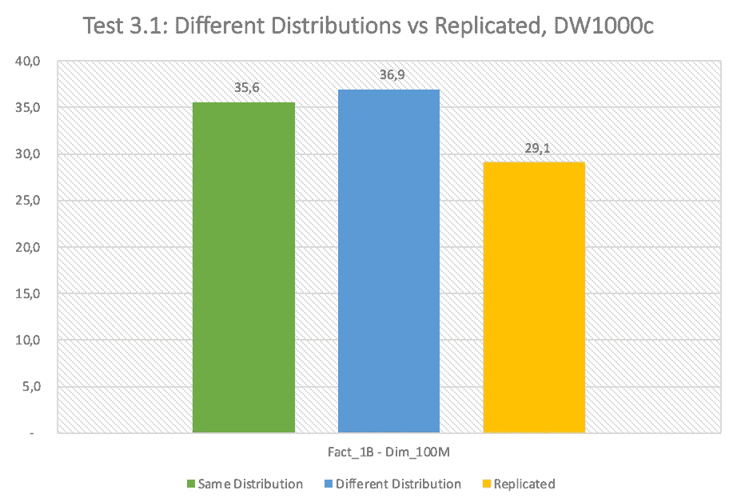

***观察值*** :

*   令人惊讶的是，基于连接键的分布并没有带来显著的好处；
*   基于复制的维度表的联接优于其他选项。

## **测试#3.2 分布与复制和扩展**

最后一项测试旨在验证更大规模的相同分布与复制选项:DW3000c 和 DW6000c:

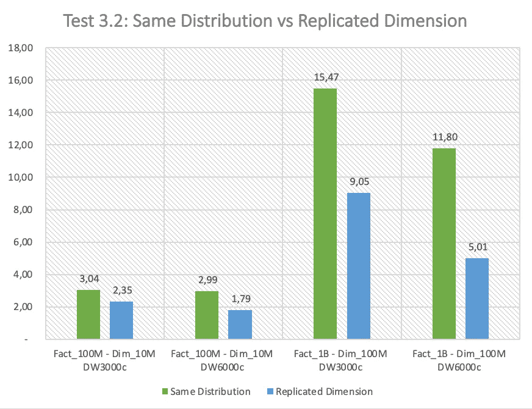

***观察结果*** :

*   在更大的范围内，维度表的复制版本比分布式版本显示出更大的优势；
*   DW6000c 的性能水平足以在 5 秒间隔内处理 10 亿到 1 亿个连接(对于复制版本)。

# 结论

尽管事实上不同的 MPP 引擎之间有很多相似之处，但它们中的每一个都有很多细节，包括 Azure 专用 SQL 池。它需要深入了解索引和数据分布配置的所有可能选项，以便充分利用它。

在本文中，索引和数据分布的不同方面和最佳实践已经通过基准测试得到了验证。

需要记住的一些亮点:

*   总是尝试将较大的分布式表与较小的复制表连接起来；
*   尽可能避免两个大表连接。否则，您将需要大量昂贵的资源来获得合理的用户查询体验；
*   减少返回的 select 查询中的列数，或者考虑使用基于聚集索引的维度；
*   减少要连接的表的数量。非常明显，但仍然)。

# 基准模式/数据/查询文件

你可以在 github [这里](https://github.com/andrijz/blog/tree/master/azure_dedicated_sql_pool_benchmark)找到模式创建、数据生成以及基准查询 SQL 代码。