# Azure Synapse 分析和 Power BI

> 原文：<https://towardsdatascience.com/azure-synpase-analytics-power-bi-f6ded6f96d5f?source=collection_archive---------16----------------------->

## 使用无服务器 SQL 池轻松高效地刷新 Power BI 数据集


[https://www . pexels . com/photo/adventure-air-aircraft-balloon-210012/](https://www.pexels.com/photo/adventure-air-aircraft-balloon-210012/)

引用微软的 Synapse 产品页面

> Azure Synapse Analytics 是一项无限的分析服务，它将数据集成、企业数据仓库和大数据分析结合在一起。它让你可以自由地使用无服务器或专用资源来查询数据。

我非常同意与自由有关的那一点。Synapse 拥有您针对不同工作负载或需求所需的所有工具。如果您需要一个普通的数据仓库，那么使用专用的或无服务器的 SQL 池。如果你想要 Spark，那么 Spark pools 可以提供友好的笔记本体验，如 Databricks(缺点是最新的 Spark 版本还没有出现)。Data factory 还与 Synapse workspace 集成在一起，因此无需在不同的工具之间来回切换。如果您想要对代码制品和 CI/CD 过程有更多的控制，那么源代码控制也包含在同一个配方中。

然而，如果不首先进行测试，就无法评估某个工具或应用程序的有用性。

## 要解决的问题

我想解决的问题是提高 Power BI 数据集刷新速度，并简化一些用于提取所需数据的 M 查询。源数据是 Azure Data Lake Gen2 上托管的一组 parquet 文件。Power BI 提供了一个 M 函数来解析拼花数据，就像所有用于读取 CSV、Excel 等的经典连接器一样。不幸的是，这种方法的总体体验并不理想。对于重要的数据加载，数据集刷新通常很慢，因为解析是使用 Power BI premium capacity 完成的，这不是从 parquet 文件加载/过滤大量数据的最佳工具。此外，用于提取数据的 M 查询有点复杂，更重要的是不容易阅读。

## 潜在解决方案

Azure Synapse 无服务器 SQL 池可以在包含 CSV 或 Parquet 文件的数据湖文件夹上定义外部表或视图。一旦定义了这些表或视图，我们就可以用 SQL 数据库连接器切换 Power BI 中的 parquet 连接器，并尝试创建使用查询折叠的加载查询。因此，使用 M 完成的任何过滤器或投影都将被翻译成普通的 T-SQL 语句，这些语句将由 Synapse 本身执行，而不是 Power BI。如果 Synapse 足够聪明，能够像 Spark 一样进行分区修剪或谓词下推，那么这将是一个巨大的胜利。数据集刷新有望更快，产生的成本也将最小。顺便说一下，无服务器 SQL 池的定价取决于为查询服务而读取的数据的大小。

让我们来制作一些 Power BI 数据集。


[https://www . pexels . com/photo/cooked-food-on-black-plate-5949889/](https://www.pexels.com/photo/cooked-food-on-black-plate-5949889/)

## 环境设置

需要 synapse analytics 工作区。它带有一个内置的无服务器 SQL 池，您可以选择连接到一个现有的数据湖或创建一个新的与工作区相关联的数据湖。我将使用[纽约市黄色出租车出行数据集](https://azure.microsoft.com/en-au/services/open-datasets/catalog/nyc-taxi-limousine-commission-yellow-taxi-trip-records/)。这是一个非常著名的数据集，已经被许多 Synapse 样本很好地记录和使用。数据集托管在美国东部 Azure 地区，因此出于数据局部性目的，建议将 Synapse workspace & Power BI 服务放在同一地区。在我的情况下，我将 2015/2016/2017 年复制到我的 Synapse 工作区，因为它不在同一地区托管。

假设报告要求是:

*   年份是 2015 年
*   供应商 ID 为 1

将包括 2015 年在内的 3 年数据加载到数据湖中，以便稍后使用 Synapse 测试分区修剪，但对于测试 Power BI 开箱即用数据湖加拼花连接，我们可以简单地指向仅托管 2015 年的文件夹。

**提示:** Azure storage explorer 还可以用来从公共 blob 容器中浏览/复制数据。

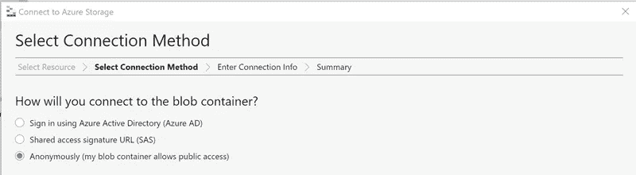

提供公共 blob 容器的 URL，即[https://azureopendatastorage.blob.core.windows.net/nyctlc](https://azureopendatastorage.blob.core.windows.net/nyctlc)。一旦连接，你可以浏览数据，甚至复制一些文件夹到你自己的数据湖文件夹。您需要获取`nyctlc/yellow`文件夹中的数据。

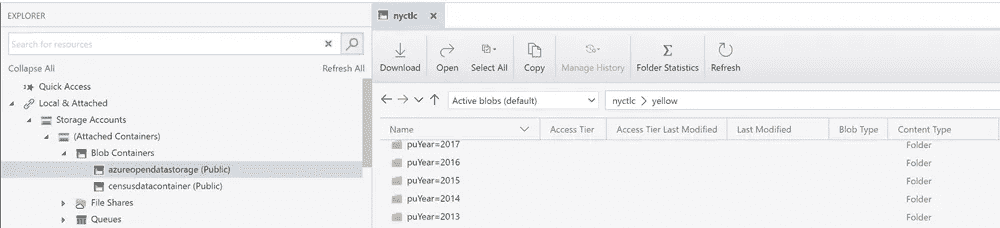

## 使用 Power BI 拼花阅读器

好了，让我们首先尝试使用 Power BI 提供的 parquet 连接器读取这些数据。由于需要从数据湖中枚举文件、parquet 解析和应用供应商 Id 过滤器，M query 看起来有点复杂。下面的大部分内容是由向导创建的，用来从数据湖中加载数据。将首先选择某个容器文件夹，然后使用 M 函数扩展该根文件夹中的所有拼花文件的内容，并将所有内容连接在一起。

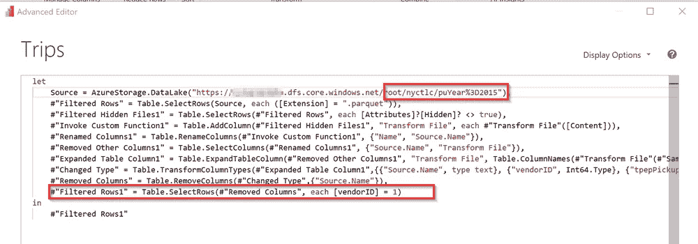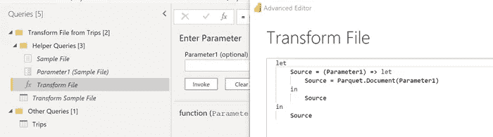

为了最大限度地减少本地填充文件并发布到 powerbi.com 所需的时间，我使用了一个小技巧。

*   通过在 2015 文件夹的末尾添加一些字符来重命名该文件夹
*   用相同的命名模式创建一个新的 2015 文件夹
*   从 real 2015 文件夹中复制超过一个月的数据
*   将更改应用于本地报表，然后将其发布到 powerbi.com
*   删除包含一个月数据的文件夹，然后恢复 2015 重命名的文件夹，使其具有正确的名称

接下来，我们将了解刷新 powerbi.com 数据集需要多少时间。此次刷新是针对包括 12 个月在内的 2015 年文件夹数据进行的。

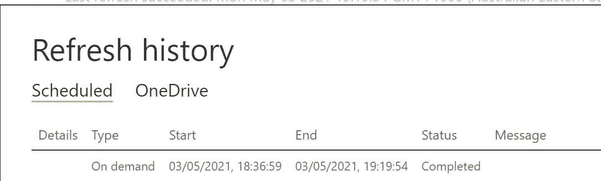

供应商 Id 为 1 的 2015 年纽约旅行的数据刷新花费了 43 分钟。该数据集有一个包含大约 7000 万条记录的表，虽然不算多，但刷新速度很慢。部分时间用于构建数据集的底层表格数据库，但 43 分钟似乎太长了。

接下来，让我们看看使用不同的方法(如使用 Synapse 无服务器 SQL pool)是否会有所不同。

## 正在准备 Synapse 无服务器 SQL 池

Synapse workspace 附带一个内置的无服务器 SQL 池。我们需要准备一个指向数据湖中 trips 数据的 SQL 抽象层。

首先，我们需要使用 UTF8 排序规则创建一个数据库。如果没有 UTF8 排序规则，在读取拼花文件时会有很多警告。详见[本文](https://docs.microsoft.com/en-us/azure/synapse-analytics/troubleshoot/reading-utf8-text)。打开 Synapse Studio，然后创建一个新的空 SQL 脚本文件来运行以下代码片段。

```
CREATE DATABASE NycTaxiTrips COLLATE Latin1_General_100_BIN2_UTF8;
```

如果我们需要添加一些认证细节，那么就特别需要一个外部数据源。在我们的例子中，我使用传递身份验证，所以不需要添加这样的细节。

```
CREATE EXTERNAL DATA SOURCE NycTripsDataSourceWITH (LOCATION='https://[DATA-LAKE-ACCOUNT].dfs.core.windows.net/')
```

创建一个指向包含 3 年纽约出租车旅行的文件夹的视图。

```
CREATE VIEW Trips ASSELECT *, T.filepath(1) AS year, T.filepath(2) AS monthFROMOPENROWSET(BULK '/root/nyctlc/puYear=*/puMonth=*/*.parquet',DATA_SOURCE = 'NycTripsDataSource',FORMAT='PARQUET')AS T;
```

如果您想尝试上面的两个片段，那么更新它们以使用您自己的 data lake 帐户名和 trips parquet 文件的正确相对路径。

您可以看到，我们已经使用 synapse `filepath`函数从文件路径中提取了年份和月份列。

要验证视图是否按预期工作，请读取前 10 条记录。如果向右滚动，您将看到来自分区结构的额外的 year 和 month 列。

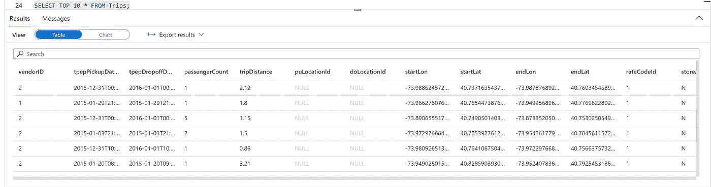

## 分区修剪

数据湖有 3 年的数据。如果我们想读取 2015 年的数据，Synapse 应该能够读取 2015 年的文件夹，只选择所需的数据。我们来验证一下这个假设是否成立。

首先运行此查询。

```
SELECT year, COUNT(*) AS count 
FROM Trips
GROUP BY year
```

结果应该是这样的，这意味着视图可以访问 3 年的数据。

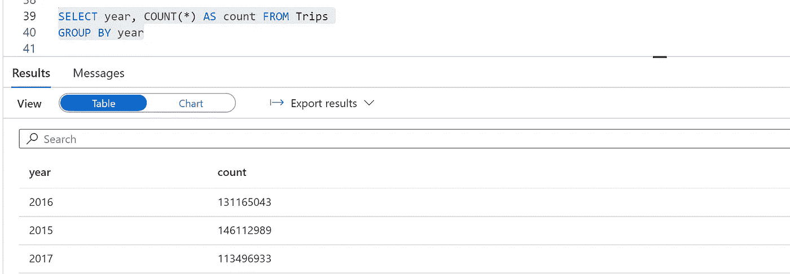

切换到 messages 选项卡，查看与运行该查询所读取的数据量相关的查询统计信息。

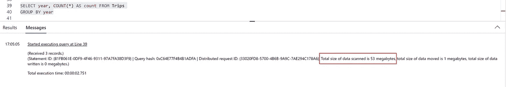

Synapse 需要读取 53MB 来运行这个查询。顺便说一下，Synapse 不必读取 parquet 文件的全部内容来得出记录计数。Parquet 是一种分栏文件格式，在我们的例子中，或者在投影几列的情况下，Synapse 可以只读取满足查询所需的列。

让我们对同一个查询应用一个年份过滤器。

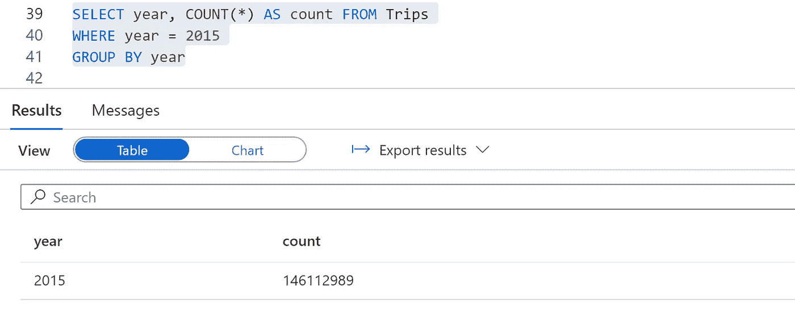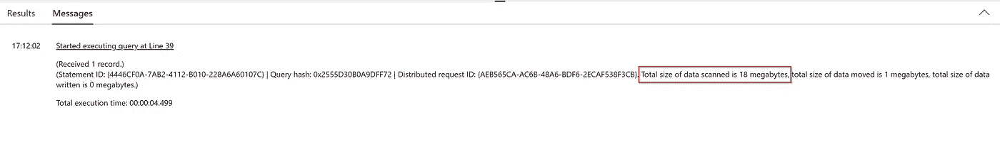

Synapse 这次扫描了 18MB 的数据，大约是查询扫描所有年份读取的 53MB 数据的 1/3。

另一个类似的模式是，读取较小数量的列比读取较大数量的列需要读取较少的数据。如果我们不需要加载所有的列，这是很方便的。

太好了！这意味着我们可以在所有年份定义一个视图，如果我们想要提取特定年份，分区修剪将只读取所需的数据，这使得查询运行更快，并且您的 Azure 账单不会飙升。

## 更新 Power BI 以使用 Synapse SQL 视图

现在克隆您拥有的 Power BI 报告，并删除现有的 Trips 表。然后将其替换为到 SQL server 数据库的连接，并选择 Trips 视图。SQL server 连接可以从 Synapse workspace 主页获取，因为它具有无服务器 SQL 池服务器名称。使用您的 Azure 凭据进行身份验证。

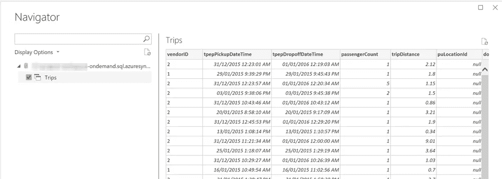

在 year 列上，使用下拉箭头应用基本文本筛选器，仅提取 2015 年，类似地，在 vendorID 列筛选器上，值为 1。删除年份和月份列。

右键单击最后一个应用的步骤，然后单击**查看本地查询**，它应该被启用，这意味着查询折叠在那里。您将看到应用的过滤器出现在 WHERE 子句中，SELECT 语句有一个投影，因此 year & month 列不包括在内。如果您只需要几列，投影也会使事情变得更快。

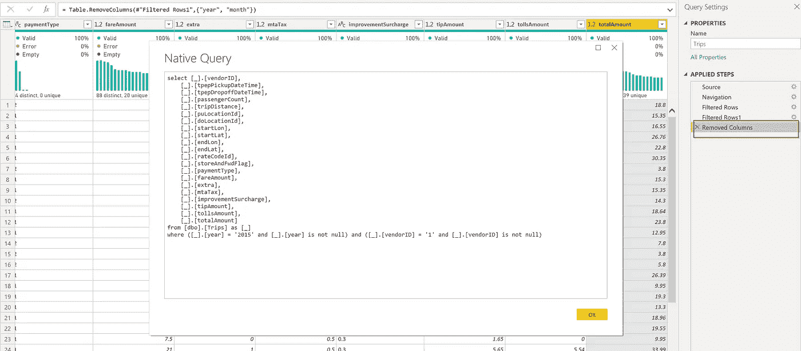

用于提取数据的 m 查询看起来更加清晰易读。

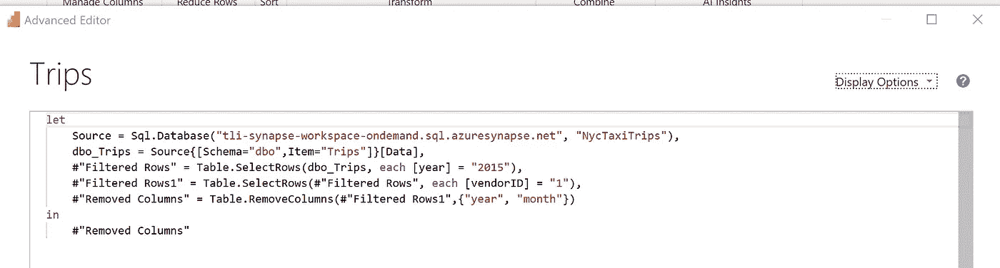

**查询折叠提示**

如果您需要使用一个包含过滤值的
CSV 字符串(类似于多个产品 id)的参数来过滤某一列，您可以使用`Table.SelectRows`和`List.Contains`的组合。不幸的是，这将直接破坏查询折叠。您需要将**参数值具体化为一个独立的查询，生成一个值列表，然后将`List.Contains`指向该查询。**

现在是关键时刻了。使用之前使用的相同技巧将该报告推送到 powerbi.com，填充 Synapse 连接的凭证并触发数据集刷新。

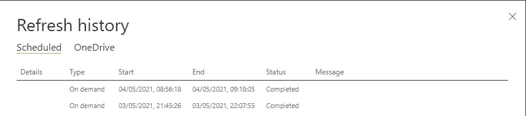

现在大约需要 23 分钟，大约是数据湖和拼花连接器所需时间的一半。实际上，如果您有滤波器，使得滤波后的数据是完整原始数据的一个小子集，则增益会明显得多。


用于执行刷新的数据量如何？

以下查询获取由无服务器 SQL 池处理的数据大小。数据刷新后的每日值与数据刷新前的每日值之间的差异可以很好地指示用于进行刷新的数据大小，这可以用于评估使用 Synapse 所需的成本，特别是在定期计划刷新的情况下。

```
SELECT * FROM sys.dm_external_data_processed
```

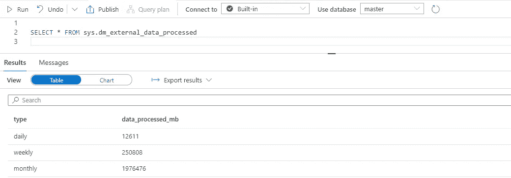

## 要考虑的其他想法

将刷新数据集所需的时间减少一半是一个很好的进步，但在 Synapse 和 Power BI 方面还可以做得更多。这里是 Dax Studio VertiPaq Analyzer 指标，它提供了一些优化该数据集的线索。

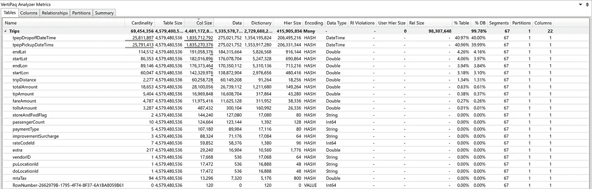

*   接送时间的基数非常大(大约 25M)。我们可以考虑使用一个日期列来表示接送，两个时间列来表示接送，也许可以使用另一个列来表示持续时间，以防旅行跨越一天的界限。
*   所有包含货币金额的列都应该从十进制转换为固定十进制(货币)。
*   重新定义 Synapse 视图，仅从 Parquet 中选择所需的列(以防我们不需要所有列)，并在 CREATE VIEW 语句中显式指定每个列的数据类型。这可能有助于字符串列。
*   对于空间列(纬度和经度)，我们可以将它们四舍五入到小数点后 4 位，例如，如果报告位置的误差在 11 米范围内是可以的。这将减少最终数据集的基数和大小。

## 资源

[](https://datamozart.medium.com/synapse-serverless-sql-power-bi-having-fun-with-pivot-3491dbb13ae8) [## Synapse 无服务器 SQL 和 Power BI —享受 PIVOT 带来的乐趣！

### 查看 Synapse 无服务器 SQL pool 的最新改进如何帮助您创建最受欢迎的 Power BI…

datamozart.medium.com](https://datamozart.medium.com/synapse-serverless-sql-power-bi-having-fun-with-pivot-3491dbb13ae8) [](https://blog.crossjoin.co.uk/2021/01/31/comparing-the-performance-of-importing-data-into-power-bi-from-adlsgen2-direct-and-via-azure-synapse-analytics-serverless-part-2-transformations/) [## Chris Webb 的 BI 博客:将数据从 ADLSgen2 导入 Power BI 的性能比较…

### 在我的上一篇文章中，我展示了如何从存储在 ADLSgen2 中的 csv 文件的文件夹中导入所有数据，而不做任何…

blog.crossjoin.co.uk](https://blog.crossjoin.co.uk/2021/01/31/comparing-the-performance-of-importing-data-into-power-bi-from-adlsgen2-direct-and-via-azure-synapse-analytics-serverless-part-2-transformations/)