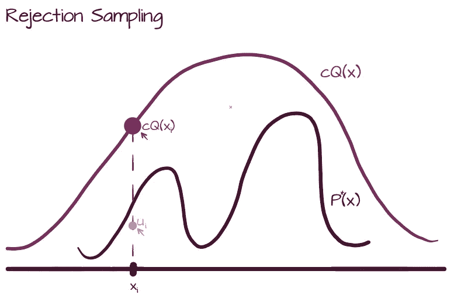
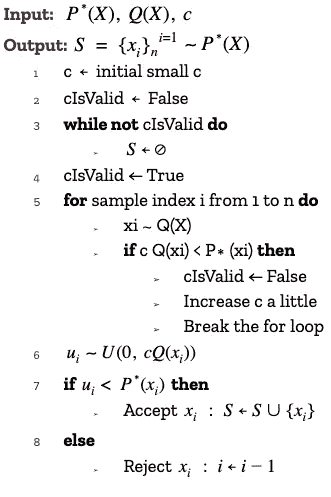
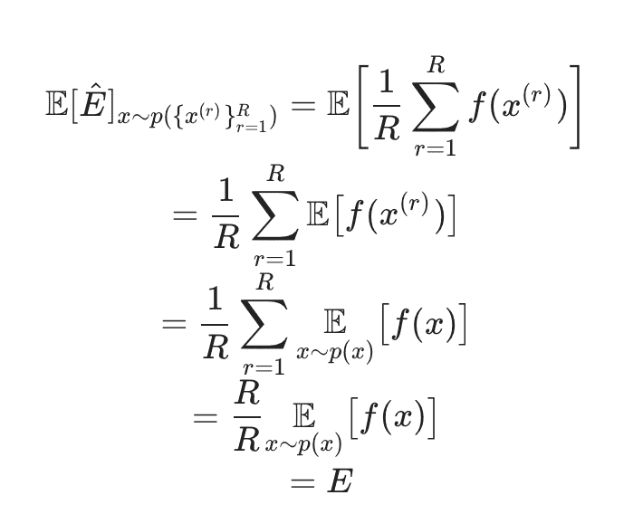
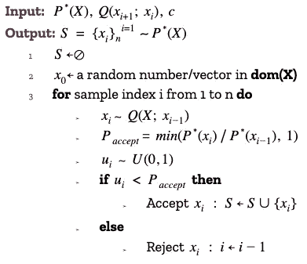
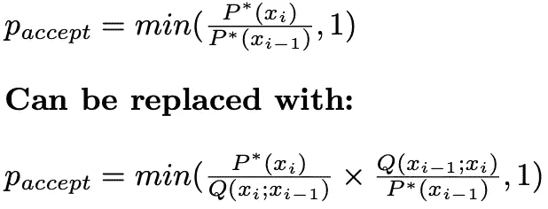

# 婴儿的第一次分配算法抽样:可用的方法和如何使用它们

> 原文：<https://towardsdatascience.com/babys-first-algorithmic-sampling-from-a-distribution-methods-available-and-how-to-use-them-208678247e62?source=collection_archive---------19----------------------->

Gabriela Morgenshtern 拍摄的图片

## [实践教程](https://towardsdatascience.com/tagged/hands-on-tutorials)

## 从复杂分布中取样和近似的缓慢和可接近的介绍

# TL；速度三角形定位法(dead reckoning)

这篇文章包括了来自[最近一篇关于算法抽样的论文](https://arxiv.org/pdf/2011.00901.pdf)的描述，用更简单的术语描述了使用简单或马尔可夫链蒙特卡罗方法进行抽样的动机和方法。它将 Metropolis Hastings 算法作为在读者实践中实现这种思想的一个例子，并简要地列出了对所涉及的超参数的考虑和启发。

# 抽样作为一个概念

这里，我们将来自分布 p(x)的样本 xᵢ称为概率分布为 p(x)的*单个*实现。这与统计中的一些其他地方相反，在这些地方，样本 x 可能指的是实现的集合

# 蒙特卡洛

蒙特卡罗方法有两个目标:(1)从一个给定的分布中产生覆盖该分布的样本；(2)在给定的分布下估计函数的期望。如果我们使用蒙特卡罗方法进行采样(即解决我们的第一个问题)，我们也将能够为我们的第二个问题的解决方案提供一个无偏估计量——良好的覆盖采样将允许我们近似期望表达式中的积分 **x~P(X)** :

> ***e*ₓ=*e[f(x)]=∫f(x)p(x)dx***

因此，我们应该考虑的基本计算问题是如何最好地获取这些样本。这里，我们讨论一种根据蒙特卡罗和马尔可夫方法获取这些样本的算法方法，以及改进这种马尔可夫链蒙特卡罗方法的计算时间的一些考虑因素:Metropolis Hastings 采样算法

# 马尔可夫性质/过程

一个简短但重要的注意事项是，我们在这里讨论的不是马尔可夫链，它是一种*类型*的概率*模型*，它融合了马尔可夫过程的思想。马尔可夫过程排序的方法在假设下操作，即在随机变量(RVs)的时间序列中，每个 RV 独立于所有其他 RV，除了紧接在它前面的那个*。*这转化为应用于一系列样本的联合概率分布的概率链规则，因此:

> ***P( X*** ₁ ***，…，x***ₙ***)= p(x***₁***p(x***₂***| x***₁**【t21)…p(x**ₙ***| x***ₙ₋₁

# **蒙特卡罗方法**

**如果我们的数据分布简单(即由我们的一个分布公式很好地定义)，或者如果我们的累积密度函数(CDF)是已知的，那么采样就很容易。如果分布不简单，我们不能直接从中取样。例如，当我们处理基于能量的模型时，就存在这种情况，因为归一化常数需要对输入域中的所有值进行计算开销很大的求和计算。**

**蒙特卡罗(MC)方法是探索(良好覆盖的采样)领域空间的迭代方法。这些方法有两个总体分类:**简单**和**马尔可夫链**。**

## **简单抽样**

**这里，每次迭代都是独立的，因为每次迭代都是盲目执行的(不知道先前的采样结果)。简单 MC 使用简单样本(明确定义的)分布。虽然我们不会在这里详细讨论这些，但简单的 MC 采样可以进一步细分为:**

***重要性抽样:***

**通过简单样本分布，在域上逼近复杂(非简单样本)函数的期望**

***拒绝采样:***

**来自复杂(非简单到样本)函数的样本通过简单到样本上限分布。也就是说，我们通过取某个明确定义的分布 **Q(x)** 来近似我们的复函数，该分布通过乘以某个正整数 ***c*** *，*将总是位于我们在笛卡尔轴上感兴趣的分布 **P(x)** 之上，并且从来自 **Q(x)** 的垂直切片的轴值的均匀分布范围中取样。在此图中可以看到这种方法的示例和伪代码:**

********

**同时计算 c 图和伪代码的拒绝采样是 Ghojogh、Nekoei 和 Ghojogh 等人提出的方法的改进。**

**然后，可以通过我们所有样本的平均值 **{x} ∈ *S*** 来计算我们对利息预期的无偏估计值( **E[P(x)]** )。它是无偏的，因为随着样本集的大小接近域的大小，我们接近了兴趣分布期望值的真实值。此外，通过增加 ***S*** 的基数(即，通过获取更多样本)，我们的估计量的方差将以与 **1/R** 成比例的速率减少。这两个性质的证明，对所有的蒙特卡罗估计器都是通用的，如下所示:**

********

**[***左:*** *蒙特卡洛估计量无偏的证明。* ***对:*** *证明蒙特卡洛估计量的方差以 1/R 的速率递减* ***。*** *这些证明摘自 CSC 412 2020 年冬季第 6 周笔记*](https://probmlcourse.github.io/csc412/lectures/week_6/)**

**从上面的估计器计算表达式中可以看出，这是一个非常简单的计算，可以包含在训练模型的证据下限(ELBO)函数计算中。而且，当你增加你的训练集的大小，或者用于训练的小批量的数量，你将更加接近你的概率的，难以处理的损失函数的真实期望。**

## **马尔可夫链抽样**

**在马尔可夫链抽样算法中，有一个候选生成分布 **Q** 是由实现者做出的选择。在**φᵢ**的候选可能或可能不直接依赖于**φᵢ-₁**，但是将总是以某种方式依赖于前一次迭代，从而允许马尔可夫属性特征(如上所述)。让**φᵢ**直接依赖于**φᵢ-₁**的一个替代方案是保持相同的**q(φ)**分布，具有相同的参数化，然后将依赖依赖与**φᵢ-₁**第一次迭代相关的一些其他属性。然后，**q(φᵢ)**必须与我们的目标分布相似，以确保它是对它的良好近似。**

***Metropolis-Hastings 采样算法***

**在 Metropolis 算法中，有一个简单到样本的候选(或建议)分布，取决于前一次迭代的样本值**φᵢ-₁**。我们使用这个候选提议作为从复杂的利益分布中取样的手段， **P*(X)** 。**

**例如，如果我们选择一个候选分布为具有一个常数𝝈但依赖于迭代的𝝁的高斯族，由于这种依赖性引入的对称性，我们简化了𝞪值的计算，如**q(φᵢ-₁|φ*)= q(φ* | φᵢ-₁).**在这种情况下，𝝈的值也被称为*步长*，这是一个必须仔细考虑的超参数，因为它影响探索具有足够覆盖的样本空间所花费的时间，从而影响算法的运行时间。对建议函数的这种对称选择定义了 *Metropolis 算法。*当算法的 alpha 值计算被推广以接受不一定对称的建议时，就会出现*黑斯廷斯*增强。 *Metropolis-Hastings* 基于 *Metropolis* 方法，使用重要性抽样的思想:它通过候选分布对新旧样本进行加权。**

******

**左:**Metropolis 算法的伪代码。**右:**黑斯廷斯扩增允许近似的非对称候选分布。改编自 Ghojogh，Nekoei，和 Ghojogh 等人。** 

**请注意，在 *Metropolis* 和*Metropolis-Hastings*alpha 计算中， **P*(X)** 项同时出现在分子和分母中——这是一种抵消任何不依赖于 **X** 但仍然难以处理的归一化因子的聪明方法，例如那些出现在基于能源的模型中的因子。**

***在大都市的随机漫步(RWM)***

**在 RWM，比如大都会黑斯廷斯，我们有当前候选样本对先前迭代的依赖性。通常在 RWM 中，候选**φᵢ**可能或可能不直接依赖于**φᵢ-₁**，但总是以某种方式依赖于前一次迭代，从而利用了马尔可夫性质。当使用这个算法系列时，我们有两个重要的选择:候选分布和步长。步长将直接影响我们接受样本的速率:太高的速率(太小的步长)将导致非常慢的域探索；过低的速率(过大的步长)将导致域的不完全覆盖。[有一篇论文](http://probability.ca/jeff/ftpdir/lawlessart.pdf)提出，在大多数情况下，为大都市实施设置的合适步长是𝝈 = 2.38。[对于适当的接受率，一个建议的启发式方法](https://www.youtube.com/watch?v=0lpT-yveuIA)是 23–50%的样本，并且在任何情况下，候选分布应该具有比
**P*(X)** (用于近似的感兴趣的分布)更高的方差。**

# **来源**

**1.Ghojogh，Nekoei，Ghojogh，et。艾尔。抽样算法，从调查抽样到蒙特卡罗方法:教程和文献综述。2020 年 11 月:[https://arxiv.org/pdf/2011.00901.pdf](https://arxiv.org/pdf/2011.00901.pdf)**

**2.乔治。多伦多大学，CSC412 年冬季讲座 5:[https://probmlcourse.github.io/csc412/lectures/week_6/](https://probmlcourse.github.io/csc412/lectures/week_6/)**

**3.乔治。多伦多大学 CSC 412 2020 年冬季讲座 7:[https://probml course . github . io/CSC 412/lections/week _ 10/# optimizing-the-elbo](https://probmlcourse.github.io/csc412/lectures/week_10/#optimizing-the-elbo)**

**4.理解 Metropolis-Hastings 算法。机器学习电视(加州大学圣克鲁斯分校)。2020 年 2 月:[https://www.youtube.com/watch?v=0lpT-yveuIA](https://www.youtube.com/watch?v=0lpT-yveuIA)**

**5.罗森塔尔。优化和调整 Metropolis 算法。2013 年 2 月:【http://probability.ca/jeff/ftpdir/lawlessart.pdf **