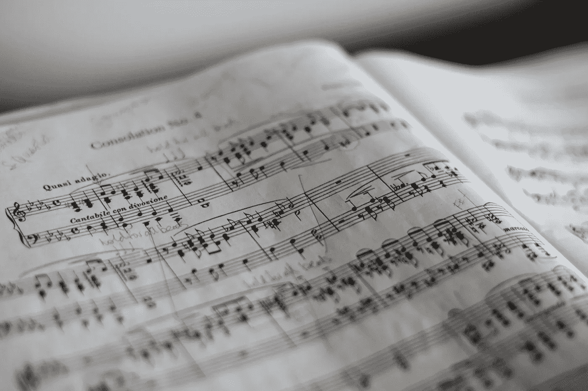

# MuseGAN:用 GANs 创作原创音乐

> 原文：<https://towardsdatascience.com/bachgan-using-gans-to-generate-original-baroque-music-10c521d39e52?source=collection_archive---------11----------------------->

## [实践教程](https://towardsdatascience.com/tagged/hands-on-tutorials)

## 用可播放的音频文件来听生成的音乐



照片由[马里乌斯·马萨拉尔](https://unsplash.com/@marius?utm_source=unsplash&utm_medium=referral&utm_content=creditCopyText)在 [Unsplash](https://unsplash.com/s/photos/music?utm_source=unsplash&utm_medium=referral&utm_content=creditCopyText) 上拍摄

下面是这个项目的 [github 回购](http://motriael.com/71iU) (ads):

gan 是高度通用的，允许生成任何可以合成为图像的东西。通过利用 GANs 的这一特性，有可能生成非常非正统的内容，至少从机器学习的角度来看是这样。这篇文章分享了我的项目，在这个项目中，我基于巴赫作品的 midi 文件，使用 GANs 生成了巴洛克音乐。

这并不是我第一次使用 GANs 来生成创意内容。我上次写了一个可以产生艺术的甘，基于著名艺术家的著名作品。从该项目中，我获得了一些关于 GANs 以及如何平衡它们的关键信息:

1.  质量重于数量。当我第一次训练甘产生艺术时，我用了大量的现实主义、抽象主义和印象派作品来训练甘。与只在每个类别中训练产生的结果相比，这一结果就相形见绌了。
2.  平衡是关键。将 GAN 维系在一起的是鉴别者和生成者之间的对立关系。如果鉴别器太过擅长识别假代，生成器就会停留在当前位置。如果鉴别器在识别伪代时变得太弱，生成器就开始利用环境并开始生成欺骗鉴别器的内容，但不会模仿真实的数据点。

有了这两点，我开始着手这个项目:

# 数据预处理:

机器学习的第一步是数据预处理。对于这个项目，它包含 3 个步骤:

## 访问 Midi 文件:

我在网上找到了一个巴赫作品的数据集，是从一个网站上搜集来的。我把所有的 midi 文件提取出来，放在一个文件夹里。

## 将 Midi 文件转换成图像:

我找到了一个 github 页面,其中有两个程序使用 music21 库将 midi 文件转换成图像，然后再转换回来。

每个音符可以表示为一个白块。音块的高度决定了音高，长度决定了音符演奏的时长。

然后，我编写了一个脚本，将这两个程序与我的 midi 文件集成在一起，在不同的目录中创建新的图像:

```
import os
import numpy as nppath = 'XXXXXXXXX'os.chdir(path)
midiz = os.listdir()
midis = []
for midi in midiz:
    midis.append(path+'\\'+midi)
```

这个脚本转到 midi 目录，然后将所有 midi 文件路径添加到一个列表中，供以后访问。

```
from music21 import midimf = midi.MidiFile()
mf.open(midis[0]) 
mf.read()
mf.close()
s = midi.translate.midiFileToStream(mf)
s.show('midi')
```

这个脚本打开第一个 midi 文件，并播放它以确保程序正常工作。如果在非交互环境中运行，这可能不起作用。

```
import os
import numpy as np
import py_midicsv as pmos.chdir(path)
midiz = os.listdir()
midis = []
for midi in midiz:
    midis.append(path+'\\'+midi)

new_dir = 'XXXXXXXX'
for midi in midis:
    try:
        midi2image(midi)
        basewidth = 106
        img_path = midi.split('\\')[-1].replace(".mid",".png")
        img_path = new_dir+"\\"+img_path
        print(img_path)
        img = Image.open(img_path)
        hsize = 106
        img = img.resize((basewidth,hsize), Image.ANTIALIAS)
        img.save(img_path)
    except:
        pass
```

这个脚本使用 github 页面中的 midi2image 函数，并根据 midi 文件的路径转换所有的 midi 文件。它们也被重新成形为形状(106，106)。为什么？106 是程序的高度，因为这是 midi 文件中可能的音符数。此外，对于卷积转置，使用正方形要容易得多。

## 构建数据集:

```
import os
from PIL import Image
from matplotlib import pyplot as plt 
import numpy as nppath = 'XXXXXXXXXXXXXX'
os.getcwd()
img_list = os.listdir(path)def access_images(img_list,path,length):
    pixels = []
    imgs = []
    for i in range(length):
        if 'png' in img_list[i]:
            try:
                img = Image.open(path+'/'+img_list[i],'r')
                img = img.convert('1')
                pix = np.array(img.getdata())
                pix = pix.astype('float32')
                pix /= 255.0
                pixels.append(pix.reshape(106,106,1))
                imgs.append(img)
            except:
                pass
    return np.array(pixels),imgsdef show_image(pix_list):
    array = np.array(pix_list.reshape(106,106), dtype=np.uint8)
    new_image = Image.fromarray(array)
    new_image.show()

pixels,imgs = access_images(img_list,path,200)
```

这个脚本转到包含所有图像和记录所有像素值的目录。这将是用作真实样本的像素值，将与计算机生成的样本一起输入鉴别器。像素值必须除以 255，因此值可以是 1 或 0(白色或黑色)，这使得程序更容易正常工作。

```
np.unique(pixels)
```

这个脚本只是确保像素值已经在 1 和 0 之间标准化。

# 创建 GAN:

## 进口:

这个程序要运行有很多先决条件:

```
from numpy import zeros
from numpy import ones
from numpy import vstack
from numpy.random import randn
from numpy.random import randint
from keras.datasets.mnist import load_data
from keras.optimizers import Adam
from keras.models import Sequential
from keras.layers import Dense
from keras.layers import Reshape
from keras.layers import Flatten,BatchNormalization
from keras.layers import Conv2D
from keras.layers import Conv2DTranspose
from keras.layers import LeakyReLU
from keras.layers import Dropout
from matplotlib import pyplot
from IPython.display import clear_output
```

这些基本上是运行 GAN 时需要使用的所有层和 numpy 函数。clear_output 只是每 10 个历元清除一次屏幕，这样屏幕就不会堵塞。

## 定义鉴别器:

```
def define_discriminator(in_shape = (106,106,1)):
    model = Sequential()
    model.add(Conv2D(64, (3,3), strides=(2, 2), padding='same', input_shape=in_shape))
    model.add(LeakyReLU(alpha=0.2))
    model.add(Dropout(0.5))
    model.add(Conv2D(64, (3,3), strides=(2, 2), padding='same'))
    model.add(LeakyReLU(alpha=0.2))
    model.add(Dropout(0.5))
    model.add(Flatten())
    model.add(BatchNormalization())
    model.add(Dense(1, activation='sigmoid'))
    opt = Adam(lr=0.0002, beta_1=0.5)
    model.compile(loss='binary_crossentropy', optimizer=opt, metrics=['accuracy'])
    return model
```

这个鉴别器经过多次试验后已经微调过了。卷积层的节点数量很少，因此生成器可以在鉴别器领先之前赶上鉴别器。漏失层也是必要的，以便鉴别器不会对数据进行过拟合。

## 定义生成器:

```
def define_generator(latent_dim):
    model = Sequential()
    n_nodes = 128 * 53 * 53
    model.add(Dense(n_nodes, input_dim=latent_dim))
    model.add(LeakyReLU(alpha=0.2))
    model.add(Reshape((53, 53, 128)))
    model.add(Dense(1024))
    model.add(Conv2DTranspose(1024, (4,4), strides=(2,2), padding='same'))
    model.add(Dense(1024))
    model.add(LeakyReLU(alpha=0.2))
    model.add(Dense(1024))
    model.add(Conv2D(1, (7,7) , padding='same',activation = 'sigmoid'))
    return model
```

发电机特别深，因为几乎在所有情况下，发电机都会落后。泄漏 relu 的使用是为了防止“死亡 relu”问题，其中小于 1 的值完全阻止训练。这个 GAN 的潜在尺寸不能太大，因为它会降低生成器的训练速度。我决定它的价值是 100

```
def define_gan(g_model, d_model):
    d_model.trainable = False
    model = Sequential()
    model.add(g_model)
    model.add(d_model)
    opt = Adam(lr=0.0002, beta_1=0.5)
    model.compile(loss='binary_crossentropy', optimizer=opt)
    return model
```

该脚本将鉴频器和发生器结合在一起，因此鉴频器的损耗可以反向传播回发生器。

## 生成样本:

```
def generate_real_samples(dataset, n_samples):
    ix = randint(0, dataset.shape[0], n_samples)
    X = dataset[ix]
    y = ones((n_samples, 1))
    return X, y

def generate_latent_points(latent_dim, n_samples):
    x_input = randn(latent_dim * n_samples)
    x_input = x_input.reshape(n_samples, latent_dim)
    return x_inputdef generate_fake_samples(g_model, latent_dim, n_samples):
    x_input = generate_latent_points(latent_dim, n_samples)
    X = g_model.predict(x_input)
    y = zeros((n_samples, 1))
    return X, y
```

这些自由函数能够产生 GAN 起作用所需的所有参数和数据:潜在点作为发生器的输入，而假样本和真样本用于训练和测试鉴别器。

## 列车 GAN:

```
def train(g_model, d_model, gan_model, dataset, latent_dim, n_epochs=51, n_batch=10):
    bat_per_epo = int(dataset.shape[0] / n_batch)
    half_batch = int(n_batch / 2)
    for i in range(n_epochs):
        for j in range(bat_per_epo):
            X_real, y_real = generate_real_samples(dataset, half_batch)
            X_fake, y_fake = generate_fake_samples(g_model, latent_dim, half_batch)
            X, y = vstack((X_real, X_fake)), vstack((y_real, y_fake))
            d_loss, _ = d_model.train_on_batch(X, y)
            X_gan = generate_latent_points(latent_dim, n_batch)
            y_gan = ones((n_batch, 1))
            g_loss = gan_model.train_on_batch(X_gan, y_gan)
            print('>%d, %d/%d, d=%.3f, g=%.3f' % (i+1, j+1, bat_per_epo, d_loss, g_loss))
        if (i+1) % 10 == 0:
            summarize_performance(i, g_model, d_model, dataset, latent_dim)
            clear_output()
```

该功能训练 GAN。它基本上协调了上面定义的所有函数，并打印了鉴别器和发生器的损耗。这允许您检查发生器和鉴别器之间的平衡。

```
latent_dim = 100
d_model = define_discriminator()
g_model = define_generator(latent_dim)
gan_model = define_gan(g_model, d_model)
print(pixels.shape)
train(g_model, d_model, gan_model, np.array(pixels), latent_dim)
```

这个脚本只是调用函数并实际运行程序。

# 可视化结果:

```
from keras.models import load_model
from numpy.random import randn
from matplotlib import pyplotdef generate_latent_points(latent_dim, n_samples):
    x_input = randn(latent_dim * n_samples)
    x_input = x_input.reshape(n_samples, latent_dim)
    return x_inputmodel = g_model
latent_points = generate_latent_points(latent_dim,1)
X = g_model.predict(latent_points)array = np.array(X.reshape(106,106),dtype = np.uint8)
array*= 255
new_image = Image.fromarray(array,'L')
new_image = new_image.save('composition.png')
```

这个脚本调用模型对潜在点进行预测，从而得到一个数组。然后使用 PIL 将该数组转换成图像。

```
image2midi('composition.png')
```

将图像转换为 midi 文件后，您可以在单元格中运行这些命令来聆听 midi 文件。

```
!apt install fluidsynth
!cp /usr/share/sounds/sf2/FluidR3_GM.sf2 ./font.sf2
!fluidsynth -ni font.sf2 composition.mid -F output.wav -r 44100
from IPython.display import Audio
Audio('output.wav')
```

# 结果:

以下是一些我最喜欢的人工智能音乐片段:

该模型已经开始掌握歌曲结构、基本和声和节奏，尽管它听起来确实有点像爵士乐。

# 我的链接:

如果你想看更多我的内容，点击这个 [**链接**](https://linktr.ee/victorsi) 。