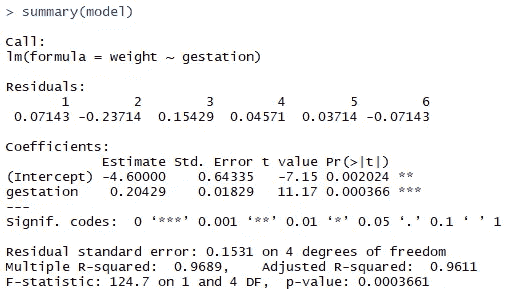

# 回归基础——R 中的线性回归

> 原文：<https://towardsdatascience.com/back-to-basics-linear-regression-in-r-3ffe4900482b?source=collection_archive---------20----------------------->

## 线性回归是统计学中最基本的知识之一，下面是如何用 R


Jean-Philippe Delberghe 在 [Unsplash](https://unsplash.com?utm_source=medium&utm_medium=referral) 上拍摄的照片

自从我的上一篇文章以来已经有一段时间了，这是因为我一直在忙于准备两个月后即将到来的精算考试。在过去几周的学习过程中，我遇到了一位老朋友，他是我第一次上统计学课线性回归时认识的。

随着我开始学习更复杂的机器学习算法，我有时会忙于构建最复杂的模型来解决问题，而实际上，一个简单的线性模型可以轻松完成工作。直到我开始更新关于线性回归的知识，我对它的简单性和易用性有了新的认识。

因此，我认为利用这篇文章不仅可以加深我对线性回归的理解，还可以借此机会与他人分享统计学中的这个基本话题，这是一个好主意。

# 介绍

为了使本文尽可能简洁，我将不会涵盖线性回归的每个细节，而是提供足够的信息，让您很好地理解如何在 R 中执行和解释它。我还将简要地谈到方差分析的主题，即方差分析以及决定系数，或更普遍地称为 R 平方。

说到这里，我们开始吧！

线性回归是一种线性模型，它描绘了响应变量与单个解释变量(简单线性回归)或多个解释变量(多元线性回归)之间的关系。

既然我们在谈论我的精算考试，就让我们以此为例吧。

假设我想研究某人花在学习上的时间和他们相应的考试分数之间的关系。我首先需要为我的研究收集数据点。然后，我会将这些数据点绘制成图表，x 轴代表某人学习的时间，y 轴代表他们的最终考试分数。

请注意，本例中的最终考试分数代表我们的回答变量，因为它是我们正在研究的变量。另一方面，学习时间被称为解释变量，因为它是影响和“解释”反应变量结果的变量。

# 最佳拟合线

但是等等，到目前为止，我们只讨论了出现在图表上的数据点。回归线到底是怎么来的？

如果我们试图通过所有的数据点画一条线，很有可能，并不是所有的数据点都直接适合这条线。那么，我们如何知道如何最好地定位生产线呢？这就是最佳拟合线概念的由来。

想法是通过所有数据点拟合一条线，使得该线最小化观测值和拟合值之间的累积距离或回归项残差。这个过程称为拟合最佳拟合线。

我强烈建议查看下面的视频，以获得对这一特定概念的更直观的解释。

因此，我们应该会看到一条呈上升趋势的直线，或者换句话说，有一个正斜率，这是因为一个人花在考试学习上的时间越多，很自然地，这个人在考试中的表现就越好。

# 个案研究

既然我们已经了解了所有的基础知识，现在让我们看看如何在 r 中执行简单的线性回归。

假设我们有一个 6x2 [的数据框架](https://github.com/chongjason914/linear-regression/blob/main/baby%20weights.txt)，它测量了怀孕期间不同时期的估计婴儿体重。

## 绘制数据点

首先，让我们将这个数据帧存储到一个名为 *baby* 的变量中。

```
# Load data
baby = read.table("baby weights.txt", header = T)# Show data
baby
```


然后，我们可以使用散点图在图表上绘制这 6 个数据点。

```
# Plot data
plot(baby, main = "Estimated baby weights during pregnancy", xlab = "Gestation period (weeks)", ylab = "Weight (kg)")
```

*Main* 、 *xlab* 和 *ylab* 是 R 中 *plot* 函数内的简单参数，分别指定绘图的主标题、x 轴标签和 y 轴标签。以下是那个情节的结果。


怀孕期间估计婴儿体重散点图

看起来我们的解释变量——孕育期和反应变量——体重之间确实存在正相关。换句话说，婴儿在子宫里呆的时间越长，体重就越重。听起来很合理。

我们可以通过使用 R 中的 *cor* 函数来检查两个变量之间的相关性，并进一步测试它是否具有统计显著性。

同样，我们可以*附加*baby data frame，这样我们就可以访问它的内容，而不需要重复调用变量，这只是为了让我们的分析更容易。

```
# Attach data
attach(baby)# Compute correlation between gestation period and baby weight
cor(gestation, weight)# Test whether correlation coefficient is zero
cor.test(gestation, weight)
```


相关性检验

这两个变量之间有很强的正相关性。输出也清楚地表明这是一个重要的结果。因此，我们现在可以通过这些数据点拟合一条直线。

## 拟合线性回归模型

在 R 中拟合一个线性回归模型是非常简单和直接的。这里要注意的函数是 *lm，*代表线性模型。

这里，我们将拟合一个线性模型，该模型将 y 轴上的婴儿体重与 x 轴上的妊娠期进行回归。这里的顺序很重要，值得记住，响应变量总是在解释变量之前。

我们将线性模型存储在一个名为 *model* 的变量中，这样我们就可以在稍后阶段访问输出。

```
# Fit linear model
model = lm(weight ~ gestation)# Examine model
model
summary(model)
```

有很多方法可以检查线性模型，但最全面的方法是使用*汇总*函数。



摘要

正如我们所看到的，在这个特定的输出中有几个部分，但是不要担心，我们将浏览每个部分，并在后面讨论它们的确切含义。现在，让我们通过使用 *abline* 函数将这个线性模型添加到我们之前的散点图中。

```
# Add regression line
abline(model, col = "red", lty = "dashed")
```


带回归线的散点图

## 拟合值

拟合值与观测数据共享相同的 x 值，只是它们正好位于回归线上。

在本节中，我们将了解如何获得这些拟合值，以及如何将它们添加到现有的回归线中。同样，我们有几种方法可以解决这个问题，它们都给出了相同的结果。

```
# Obtain fitted values 
model$fitted.values
fitted(model)
predict(model)# Add fitted values to regression line 
points(gestation, fitted(model), col = "blue", pch = 16)
```


蓝点代表拟合值

## 方差分析(ANOVA)和 R 平方

方差是数据集中数字之间分布的统计度量。更具体地说，每个数据点离平均值有多远。因此，方差分析是对方差的研究。

通过将总方差分成两部分，我们可以评估由回归线解释的方差和未解释的方差，称为残差。

r 平方是线性模型解释的响应变量变化的百分比。R 平方值越高，观察值和拟合值之间的差异越小。

然而，单独的 R 平方并不足以表明回归线是否提供了良好的拟合。我们还必须考虑研究的背景以及回归模型中每个解释变量的统计显著性。

```
# ANOVA
anova(model)
```


方差分析(ANOVA)

f 检验的 p 值 0.0003661 证实了妊娠和体重之间存在线性关系。这个结果与我们之前的相关性测试是一致的。

我们还可以看到，回归平方和为 2.92129，残差平方和为 0.09371，总平方和为 3.015。

有两种方法可以计算平方和。一种是通过第一原理，另一种是通过使用来自 *anova* 函数的输出。

```
x = gestation; y = weight# Total sum of squares
(SStot = sum((y - mean(y))^2)
sum(anova(model)[,2])# Residual sum of squares
(SSres = sum((y-fitted(model))^2))
anova(model)[2,2]# Regression sum of squares
(SSreg = sum((fitted(model)-mean(y))^2))
anova(model)[1,2]
```

类似地，有三种方法可以计算决定系数或 R 平方，这三种方法得出的结果都是 0.9689173。

1.  从*汇总*输出
2.  相关平方
3.  用回归平方和除以总平方和

```
# Method 1
summary(model)$r.squared# Method 2
cor(gestation, weight)^2# Method 3
SSreg / SStot 
```

## 截距和回归系数

因为在这个特定的研究中我们只有一个解释变量，所以我们总共有两个系数，一个用于截距，一个用于斜率。

调用*摘要*功能的输出。


摘要

我们可以看到，斜率参数的 p 值为 0.000366，这表明它在统计上是显著的，换句话说，非零。

为了更进一步，我们还可以得出截距和斜率参数的置信区间。

```
# Confidence interval for intercept and regression coefficient 
confint(model, level = 0.99)
```


截距和回归系数的置信区间

## 做预测

拟合线性模型的目标是做出具有合理精确度的预测。

在这一节中，我们将探讨使用简单线性模型进行预测的两种不同方法。

1.  根据基本原则
2.  使用*预测*功能

此外，我们还可以对这些预测产生置信区间和预测区间，以评估其准确性。

假设我们想预测一个婴儿在第 33 周的体重，下面是我们如何通过两种不同的方法来实现。

```
# First principles
coef(model)[1] + coef(model)[2] * 33# Using predict function
newdata = data.frame(gestation = 33)
predict(model, newdata)# Confidence interval 
predict(model, newdata, interval = "confidence", level = 0.9)# Prediction interval
predict(model, newdata, interval = "predict", level = 0.9)
```

两种方法应该给出相同的预测值 2.141429。

## 残差

回想一下，残差是观测值和回归拟合值之间的差异。回归中有一个潜在的假设，即残差应该服从正态分布。

除了检查正态假设之外，通过检查残差的趋势，我们还可以评估我们的回归线与数据点的拟合程度，即观察模型是否存在高估或低估真实数据点的特定部分。

在本节中，我们将讨论如何获得残差值，以及如何使用各种图来分析这些残差值中存在的模式。

有两种方法可以获得残差:

1.  使用*残油*功能
2.  从观察值中减去拟合值

```
# Method 1
resid(model)[1]# Method 2
weight - fitted(model)
```

接下来，我们将看看如何可视化残差的趋势。这里我们可以使用不同的图，每个图可以为我们提供关于残差行为的不同信息。

```
# Plot residuals vs fitted
plot(model, 1)
```


残差与拟合

残差在值 0 附近徘徊，这是线性模型非常适合的良好指标。点 2 看起来确实像一个异常值，但是很难用几个值来区分。

我们可以使用的另一个图叫做 QQ 图，它是一个散点图，描绘两组分位数之间的关系。在我们的例子中，我们感兴趣的是残差是否遵循正态分布，因此我们将绘制残差的分位数与正态分布的分位数。

如果我们的残差确实是正态分布的，我们应该会看到一个从左下角到右上角的对角线。

```
# QQ plot
plot(model, 2)
```


QQ 情节

对角线看起来非常接近除了点 2 之外的大多数数据点。这可能意味着从数据集中删除点 2 是值得的，这样可以得到更精确的线性模型。

# 结论

干得好，一路看完了这篇文章。我希望你已经了解了更多关于线性回归的概念，以及如何在 r。

概括地说，在本文中，我们讨论了:

*   什么是线性模型
*   如何拟合最佳拟合线
*   方差和 R 平方分析
*   截距和回归系数的显著性
*   如何使用线性模型进行预测
*   残差

如果你对学习数据科学和机器学习感兴趣，一定要看看我的其他文章。

快乐学习！

<https://medium.com/swlh/customer-segmentation-using-k-means-clustering-in-r-a74d512a4cfa>  </what-is-feature-scaling-why-is-it-important-in-machine-learning-2854ae877048> 