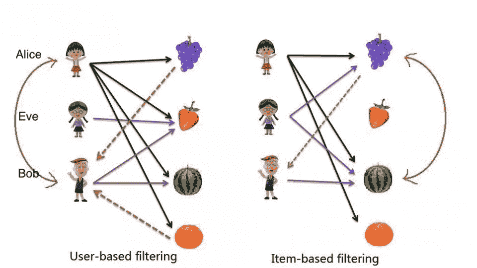
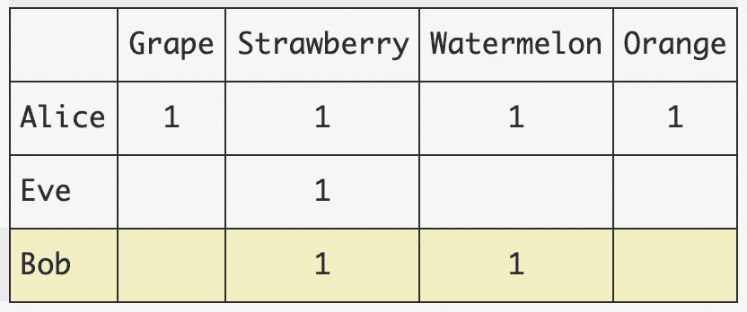
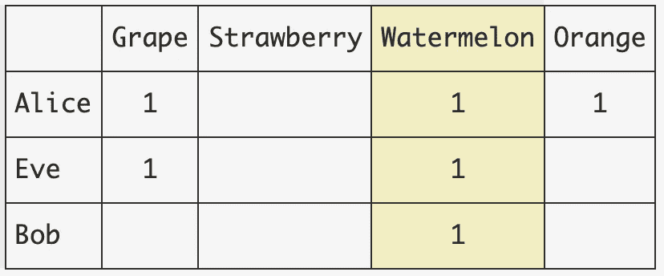

# 回归基础:最近邻

> 原文：<https://towardsdatascience.com/back-to-basics-nearest-neighbours-676d6f11a31?source=collection_archive---------73----------------------->

## 我们回到基础，并在密度估计和推荐系统的背景下研究最近邻方法

# 介绍

鉴于最近人工智能研究中基于深度学习的方法的大肆宣传的进展，特别是在 NLP 和 CV 中，是时候回到基础上了。许多基本方法，例如基于邻域的方法，在许多领域甚至在今天都非常有效。我们简要介绍最近邻方法及其在密度估计和推荐系统中的应用。讨论了基于用户和基于项目的协同过滤。最后，还讨论了冷启动和数据稀疏问题。

# 密度估计中的最近邻

先说[密度估计](https://scikit-learn.org/stable/modules/density.html#density-estimation)的问题。简单地说，**密度估计**是基于观测数据，对不可观测的潜在概率密度函数的估计。它可以用来洞察你手头的数据，更好的是，它还可以用来生成合成数据。

一种最常见的密度估计方法是简单的**直方图**，其中我们计算一个面元内的点数，并使用计数来可视化潜在的分布。直方图的主要缺点是它在面元大小和面元位置方面对面元选择非常敏感。读者可以参考 [scikit-learn 文档](https://scikit-learn.org/stable/auto_examples/neighbors/plot_kde_1d.html)获得更好的插图。

一个更复杂的方法是使用一个**内核**(例如高斯内核)来代替简单的计数计数，并使用 Parzen 窗口来代替朴素箱。Parzen 窗口可以直观地理解为围绕数据点的定义区域。为了专注于直觉，详细的数学被有意省略了。主要思想仍然类似于直方图，我们仍然尝试使用区域(而不是箱)中的相邻点来估计概率密度，使用核(而不是简单计数)来平滑分布。

有关核密度估计的更多信息，请参考 Bishop 的 PRML 第 2 章或更多[实用指南](https://scikit-learn.org/stable/modules/density.html#density-estimation)。

在核密度估计方法中，区域是固定的，而相邻点的数量可以根据局部数据稀疏性而变化。另一种方法是固定相邻点的数量 K，并扩展区域直到 K 个点被包含。这种方法被称为 **K 近邻(KNN)。**

KNN 方法(也称为核密度估计)是**非参数**方法的一种形式，因为它不假设训练数据的基本分布。相反，它“记住”整个训练数据，因此也被称为“**基于记忆的方法**”。当将 KNN 应用于分类时，它通过预定义的相似性度量(稍后将详细介绍)找到最近的邻居，或者换句话说，找到最相似的训练数据点，并且使用邻居点的标签通过例如多数投票来确定预测结果。

有些还将 KNN 标记为“**基于实例的学习**或“**懒惰学习**”，因为它不需要任何训练过程来拟合训练数据，重载计算被延迟到预测，并且基于预测样本邻域中的少数实例进行预测。正如我们将在后面看到的，在现实世界的实现中，可以进行一些工程优化来缓解这个问题。

# 优点和缺点

在算法的世界里，这永远是一个权衡的问题。

**优点:**

*   简单直观
*   高度通用(可以选择各种相似性度量结合特征工程来实现很多)

**缺点:**

*   **空间复杂度高**，因为需要“记忆”整个训练数据
*   **预测期间的高时间复杂度**，因为它需要穷尽搜索所有训练样本以形成邻域

也存在许多补救措施来解决上述缺点。一种方法是使用**离线阶段**来预先计算相似性得分并存储中间结果，这些结果可以在稍后的在线阶段被有效地获取。

对于大小为 N 且维数为 D 的数据集，计算所有样本对的相似性的计算成本为 O(DN)。使用 [K-D 树](https://scikit-learn.org/stable/modules/neighbors.html#k-d-tree)，复杂度降低到 O(DNlogN)，在 N 较大的情况下是显著的提升。

实际上，许多图书馆，scikit-learn 是最受欢迎的例子，已经通过在训练阶段构建有效的数据结构做到了这一点。一旦调用`fit`方法，取决于算法选择(sklearn 提供`kdtree, balltree, bruto`)。如果你正在寻找这种索引的更快的实现，看看这篇博客文章。

# 推荐者上下文中的最近邻

对于那些感兴趣的人来说，2019 年推荐系统顶级会议 RecSys 的最佳论文揭示了该领域深度学习研究的一些问题[1]。事实证明，基于邻居的方法仍然是一个强大的基线。

KNN 方法用于推荐系统中的协同过滤算法。**CF 的核心是如何找到相似的用户或物品，形成对等群体或邻居**。

在推荐器中有两种对称的基于邻域的 CF 方法，即基于用户的 CF 和基于项目的 CF。

如下图所示，在一个记录了用户消费模式的水果店中，目标是向 Bob 推荐水果。

改编自互联网(来源不明)

在左边的**基于用户的**方法中，Alice 被认为与我们的目标用户相似(实际上，我们通常会识别一组相似的用户)，因为他们在消费行为中都喜欢西瓜和草莓。因此，基于相似用户分享相似水果口味的假设，我们向 Bob 推荐葡萄和橙子，因为那些是他的同行买的，而不是他买的。

基于用户的 CF 矩阵(图片由作者提供)

在右边的**基于商品的**方法中，我们**寻找与目标用户**已经购买的商品相似的商品。在这种情况下，Bob 已经购买了西瓜，西瓜与葡萄最相似，因为它们被许多重叠的用户(Alice 和 Eve)购买。所以推荐葡萄。

基于项目的 CF 矩阵(图片由作者提供)

正如我们已经看到的，基于项目和基于用户的 CF 方法的最重要的部分是选择正确的相似性度量和形成邻域。

一些相似性度量是:

*   欧几里得相似性
*   余弦相似性
*   贴现余弦相似度
*   基于相关性的相似性(皮尔逊)
*   Jacaard 相似性
*   等等。

除了前面提到的关于 KNN 方法在空间和时间复杂度方面的问题之外，在推荐系统的应用领域中还出现了其他问题。

两个主要问题是:

*   *冷启动:*当新的项目或用户被添加到矩阵中时，会出现这个问题，结果是一个**空向量，**使得很难计算相似性和邻居，因此几乎不可能生成推荐。
*   *数据稀疏性:*即使在上面的玩具示例中，我们已经观察到稀疏性问题，矩阵中的一些条目丢失，导致不准确的相似性计算，降低推荐质量。在拥有大量商品和用户的网络商店中，一个用户只能与一小部分商品交互，矩阵本质上是稀疏的。

有许多方法可以缓解上述问题:

*   作为一种简单的方法，该系统可以通过向新用户推荐最受欢迎的商品来启动，然而，这失去了个性化的吸引力。
*   另一种通常采用的方法是使用某种“主动学习”来激励用户输入评级或隐式反馈(点击、喜欢/不喜欢按钮等)。)来填充系统。
*   一种颇具争议的方式是利用辅助信息，如**社交网络分析**，根据用户的社交圈推荐商品，前提是这些辅助信息是可访问的。**这里的基本假设是，朋友们有相似的品味，并在现实生活中互相推荐商品。**关于边信息用法的参考文献见【4】。
*   使用基于模型的方法，如矩阵分解，它本质上处理*数据稀疏性*问题，因为它基于现有的可用评级进行 MF。然而，这并没有真正解决问题，因为由于可用数据有限，它仍然会影响模型的准确性。对于 MF 方法，一个很好的教程写在[5]中。在 Aggarwal 的“*推荐系统:教科书*”中描述了关于隐式数据集和 NMF 的更高级 MF 的更完整的描述。

# 参考

[1]“我们真的有很大进步吗？最近神经推荐方法的令人担忧的分析”，[https://arxiv.org/abs/1907.06902](https://arxiv.org/abs/1907.06902)

[2]Aggarwal 的《推荐系统:教科书》

[3]用[https://www.tablesgenerator.com/markdown_tables](https://www.tablesgenerator.com/markdown_tables)制作的桌子

[4]“关于附带信息的建议的研究评论:调查和研究方向”，[https://arxiv.org/abs/1909.12807](https://arxiv.org/abs/1909.12807)

[5]博客:[https://albertau yeung . github . io/2017/04/23/python-matrix-factorization . html](https://albertauyeung.github.io/2017/04/23/python-matrix-factorization.html)和代码:[https://github . com/albertau yeung/matrix-factorization-in-python](https://github.com/albertauyeung/matrix-factorization-in-python)