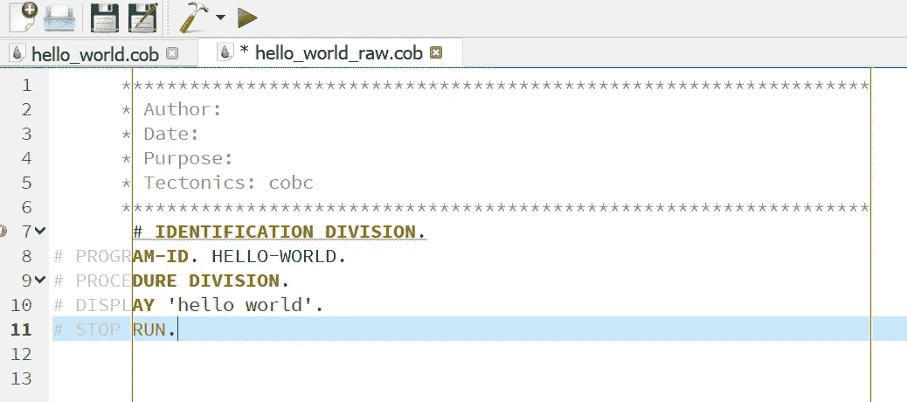
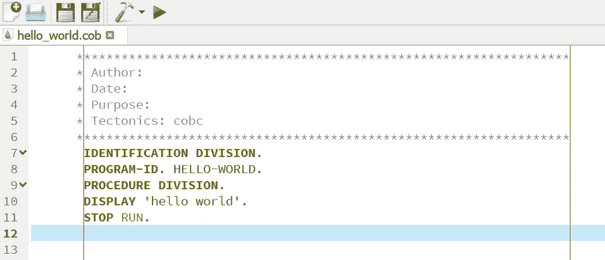
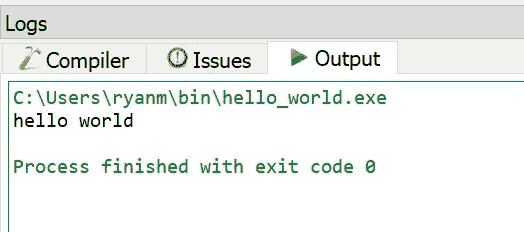
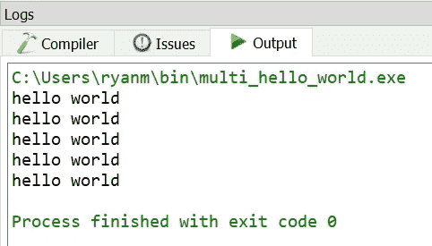
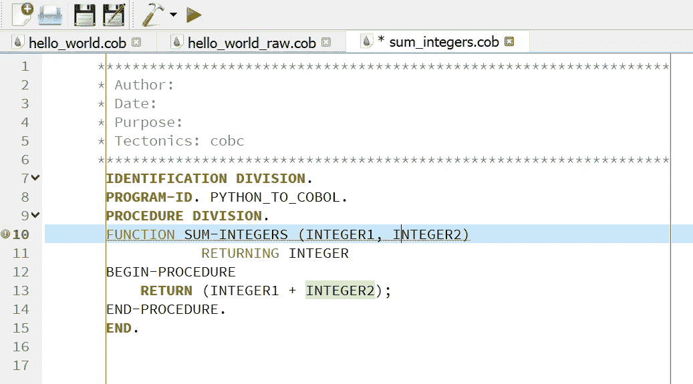
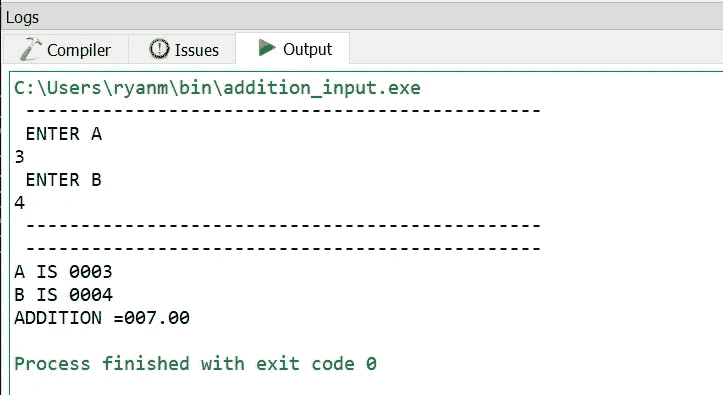

# 用 Codex 和 COBOL 回到未来

> 原文：<https://towardsdatascience.com/back-to-the-future-with-codex-and-cobol-766782f5ae8f?source=collection_archive---------7----------------------->


图片由[皮特·伯肯肖](https://www.flickr.com/people/93001633@N00)通过[维基百科](https://en.wikipedia.org/wiki/Punched_card#/media/File:Used_Punchcard_(5151286161).jpg) (CC BY 2.0)

## OpenAI 的代码生成系统能处理打卡时代的代码吗？

COBOL 已经存在了六十多年。尽管人们齐心协力将越来越多的 COBOL 程序移植到现代语言中，但它并没有很快消失的迹象。仍然有很多 COBOL 在运行— [根据最近的一项估计](https://www.bmc.com/blogs/cobol-trends/#:~:text=According%20to%20Reuters%2C%20you%20can,state%20of%20COBOL%20in%202020.)接近 1/4 万亿行。有没有一种方法可以让我们加速将这些庞大的代码从穿孔卡片时代转移到 21 世纪？

早在 2020 年 GPT-3 问世时，我曾半心半意地试图让它将 COBOL 翻译成 Python，但没有得到任何有用的结果。现在我已经可以访问 Codex，我决定看看专门研究代码生成的模型是否能做得更好。Codex 能处理 COBOL 吗？在这篇文章中，我将描述一些我试图回答这个问题的实验。

## 目标

我想看看能否让 Codex 从 Python 生成有效的 COBOL，或者从 COBOL 生成有效的 Python。我注意到 COBOL 不是 OpenAI 声称 Codex 精通的语言之一，但是我认为这仍然值得一试，因为 Codex 的训练集中可能有一些 COBOL 代码。

## 实验 1:从 Python 到 COBOL 的 hello world

首先，我改编了在[Codex](https://beta.openai.com/docs/guides/completion/working-with-code)介绍中列出的一个例子。这个提示示例用于从 Python 生成 R:

```
# Convert this from Python to R 
# Python version [ Python code ] # End  
# R version
```

我修改了这个提示，使 COBOL 成为目标语言:

```
# Convert this from Python to COBOL
# Python versionprint("hello world")# End# COBOL version
```

果然，根据这个提示，Codex 生成了一些看起来可能是有效的 COBOL 的东西:

我已经有几十年没有用 COBOL 编码了，所以我不能信任我的内部编译器。我需要找到一种方法来测试 Codex 在实际的 COBOL 环境中生成的东西。幸运的是，我能够找到并安装 [OpenCobol IDE](https://opencobolide.software.informer.com/download/) 。有了这个 IDE，我可以练习 Codex 生成的 COBOL“hello world”代码。

我将 Codex 的输出粘贴到 OpenCobol 中，但是它不认为它是有效的 Cobol:



OpenCobol 中 Codex 的原始输出—作者图片

看到这个问题，我隐约记得需要将 COBOL 代码限制在某些列中。这与[为穿孔卡](https://www.mainframestechhelp.com/tutorials/cobol/coding-sheet.htm)上的序列号保留前几列有关。您认为这篇文章的介绍插图是某种玩笑！

为了清理 Codex 的输出，我缩进了所有代码行，使它们从第 8 列开始，并删除了前缀“#”以获得以下代码:



清理了 OpenCobol 中 Codex 的输出—图片由作者提供

我点击锤子图标编译代码，然后点击运行按钮。令我高兴的是，代码运行了！



所以，Codex 可以产生一个最小的 COBOL 程序。在下一个实验中，我们将尝试相反的方向，从 COBOL 到 Python。

## 实验二:从 COBOL 到 Python 的 hello world

将 Python 翻译成 COBOL 是一个有趣的用例，但在现实世界中，从 COBOL 翻译成 Python(或另一种现代语言)可能更有用。让我们看看当我们试图让 Codex 将它在上次实验中生成的 COBOL“hello world”翻译回 Python 时会发生什么。

下面是我们开始时的提示:

```
# Convert this from COBOL to Python
# COBOL versionIDENTIFICATION DIVISION.
PROGRAM-ID. HELLO-WORLD.
PROCEDURE DIVISION.
DISPLAY 'hello world'.
STOP RUN.# End# Python version
```

以下是食品法典委员会得出的结果:

```
print('hello world')
```

为了完全公开，Codex 还运行了 bit 并生成了以下 COBOL:

```
IDENTIFICATION DIVISION.
PROGRAM-ID. HELLO-WORLD.
PROCEDURE DIVISION.
DISPLAY 'hello world'.
DISPLAY 'hello world'.
DISPLAY 'hello world'.
DISPLAY 'hello world'.
DISPLAY 'hello world'.
STOP RUN.
```

在 OpenCobol 中尝试这一点，它如预期的那样工作:



因此，Codex 可以在 Python 和 COBOL 之间来回调用“hello world”。它将如何处理涉及 COBOL 的更复杂的挑战？

## 实验 3:对两个数求和——Python 对 COBOL

生成一个 COBOL“hello world”程序并不是 Codex 的最高标准。它能处理稍微复杂一点的程序吗？为了找到答案，我让它从一个返回两个函数之和的 Python 函数生成 COBOL:

```
# Convert this from Python to COBOL
# Python versiondef sum_integers(integer1, integer2):
    return(integer1 + integer2)# End# COBOL version
```

以下是 Codex 生成的内容:

```
#     IDENTIFICATION DIVISION.
#       PROGRAM-ID. PYTHON_TO_COBOL.
#     PROCEDURE DIVISION.
#       FUNCTION SUM-INTEGERS (INTEGER1, INTEGER2)
#           RETURNING INTEGER
#       BEGIN-PROCEDURE
#           RETURN (INTEGER1 + INTEGER2);
#       END-PROCEDURE.
#     END.
```

我将这段代码粘贴到 OpenCobol 中，并做了与“hello world”程序相同的小清理:



OpenCobol 中两个数相加的 Codex 输出—作者图片

即使我对 COBOL 有模糊的记忆，我也能看出这离工作 COBOL 代码还很远。在某种程度上，我缺乏 COBOL 技能在这个练习中是一个优势，因为我不能真正为 Codex 倾斜天平。要么它产生的 COBOL 只需很少的改动，要么实验失败。在这种情况下，实验失败了。

## 实验 4:将两个数相加——COBOL 到 Python

由于 Codex 无法从一个将两个数相加的 Python 程序中产生有效的 COBOL，我决定尝试另一个方向。我找到了[一个将两个数相加的 COBOL 程序](https://www.codepoc.io/blog/cobol/4039/program-to-add-two-numbers)，我想看看 Codex 是否可以用这个输入生成可用的 Python。

这是我开始使用的 COBOL 程序，改编自将来自[代码 POC](https://www.codepoc.io/) 的两个数相加的程序。我必须做一些修改(去掉反斜杠)才能让代码在 OpenCobol 中正确编译。

这是这个 COBOL 程序在 OpenCobol 中的输出:



以下是 Codex 以 COBOL 程序作为输入生成的初始 Python 输出:

```
# ```
# A = int(input("Enter A: "))
# B = int(input("Enter B: "))
# 
# print("-----------------------------------------------")
# print("A is ", A)
# print("B is ", B)
# print("-----------------------------------------------")
# 
# ANS = A + B
# 
# print("A + B = ", ANS)
# print("-----------------------------------------------")
# ```
```

我清理了这个输出，删除了无关的“#”，得到了最终的 Python 程序:

```
# ```
A = int(input("Enter A: "))
B = int(input("Enter B: "))
# 
print("-----------------------------------------------")
print("A is ", A)
print("B is ", B)
print("-----------------------------------------------")
# 
ANS = A + B
# 
print("A + B = ", ANS)
print("-----------------------------------------------")
# ```
```

在 Python 3.7.4 中运行，代码如预期的那样工作:

```
Enter A: 3
Enter B: 4
-----------------------------------------------
A is  3
B is  4
-----------------------------------------------
A + B =  7
-----------------------------------------------
```

因此，虽然 Codex 不能从 Python 代码生成有效的 COBOL 来对两个数求和，但是当给定一个对两个数求和的 COBOL 程序时，它会生成有效的 Python。

## 结论

以下是我从本文描述的实验中得出的主要观察结果:

*   我不认为从本文中列出的 4 个简单实验的结果中就能决定 Codex 是否能处理 COBOL 的翻译。
*   COBOL 语法与任何现代语言都有很大不同，我之前让 GPT-3 用 COBOL 做任何事情的尝试都令人失望，如果 Codex 没有通过所有 4 项测试，我也不会感到惊讶。此外，Codex 并没有被专门训练来处理 COBOL，它仍然设法处理一些涉及 COBOL 的基本任务。
*   简单来说，Codex 超出了我的预期。Codex 能够双向生成“hello world ”,并且能够从一个(勉强)非平凡的 COBOL 程序生成工作 Python。

从用 Python 等现代语言编写的程序中生成 COBOL 在某些情况下可能是有用的。然而，我认为真正有趣的用例是从 COBOL 程序生成 21 世纪的代码。如果我们能够自动清除目前保持正常运行的 1/4 万亿行 COBOL 代码，并用更易于维护的现代代码来替换这些代码，那将是一件非常美妙的事情。也许法典的后代可以做到这一点，让我们最终结束穿孔卡片的时代。

其他详细信息:

*   你可以在这里看到这篇文章的视频:【https://youtu.be/uTIk2fifO50
*   你可以在这个回购中找到这篇文章的代码样本:【https://github.com/ryanmark1867/codex_experiment
*   更多实验:深入了解为什么 Codex 努力从 COBOL 生成 Python 和使用 Codex 从 COBOL 生成 JavaScript
*   你可以在本文的[中看到一个从英语生成 JavaScript 的 Codex 实验](/a-first-taste-of-codex-71385ee8aaa4)