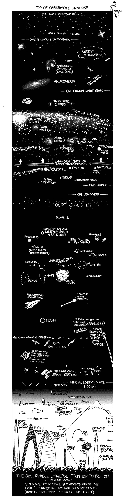
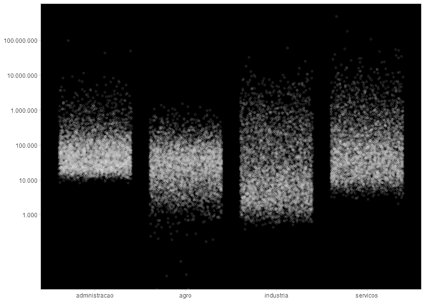
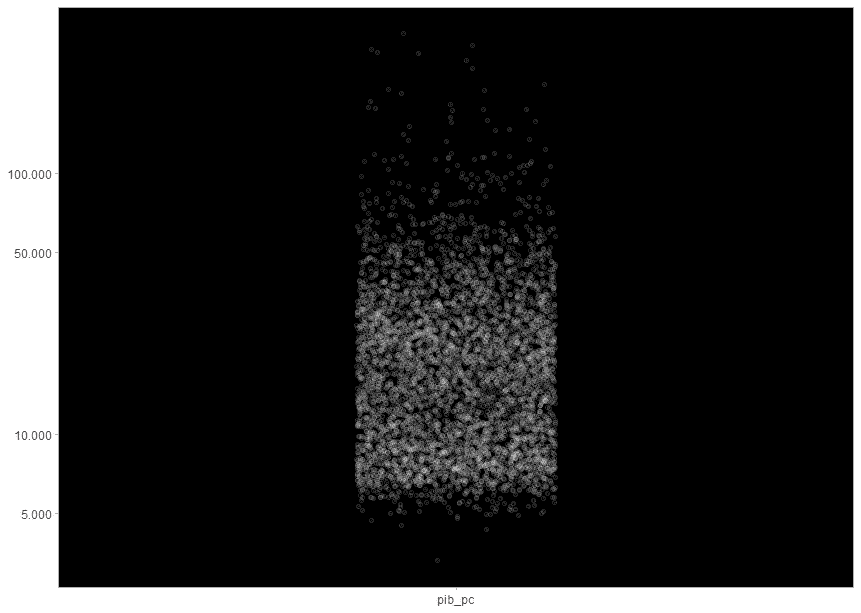
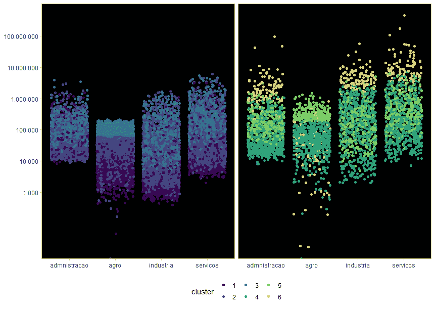
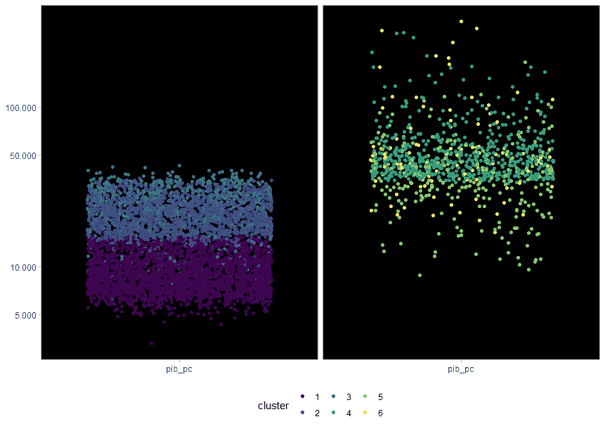
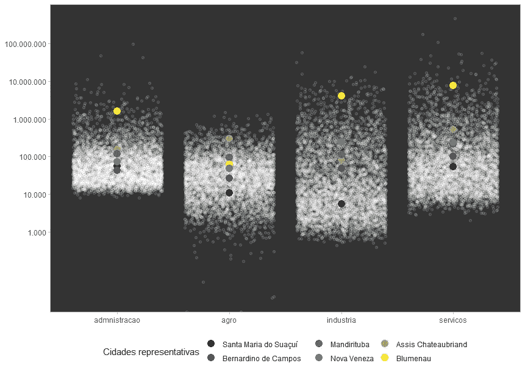
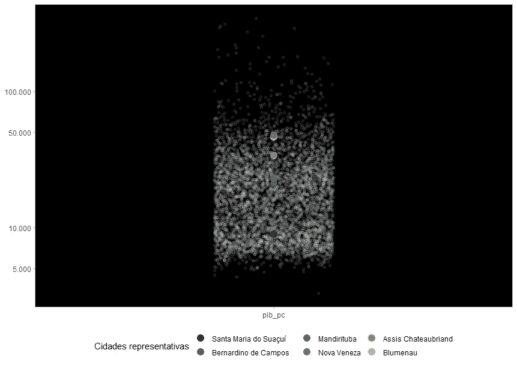
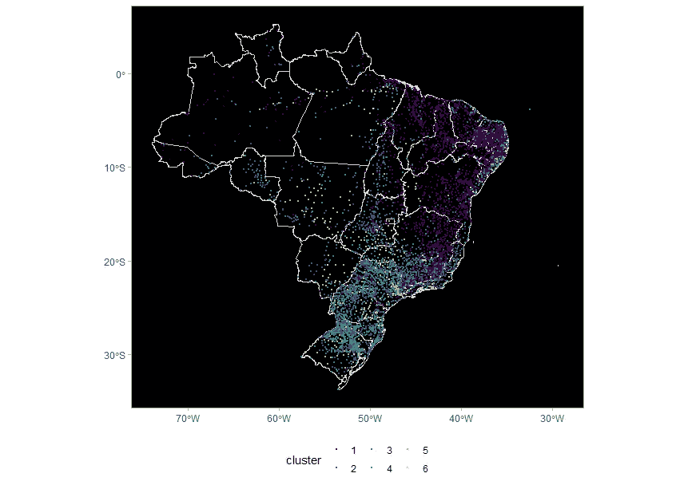
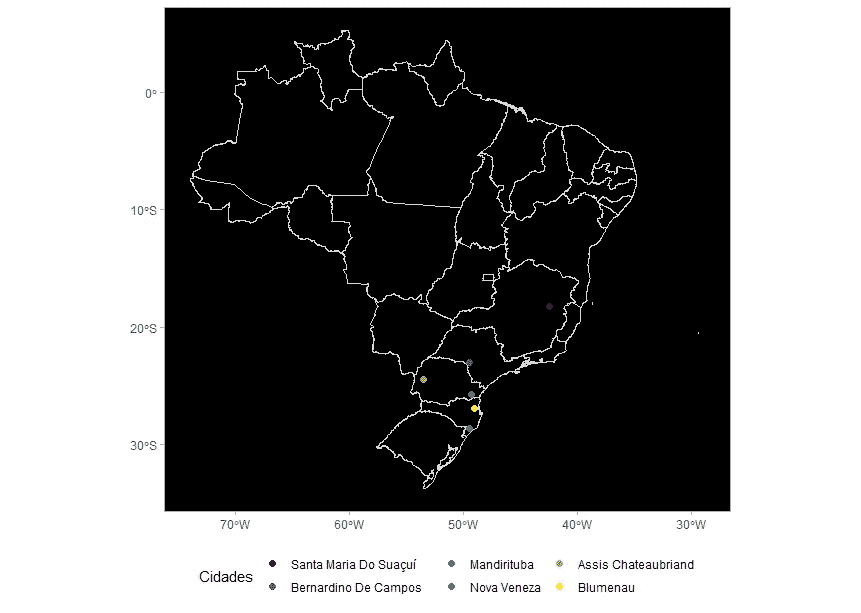
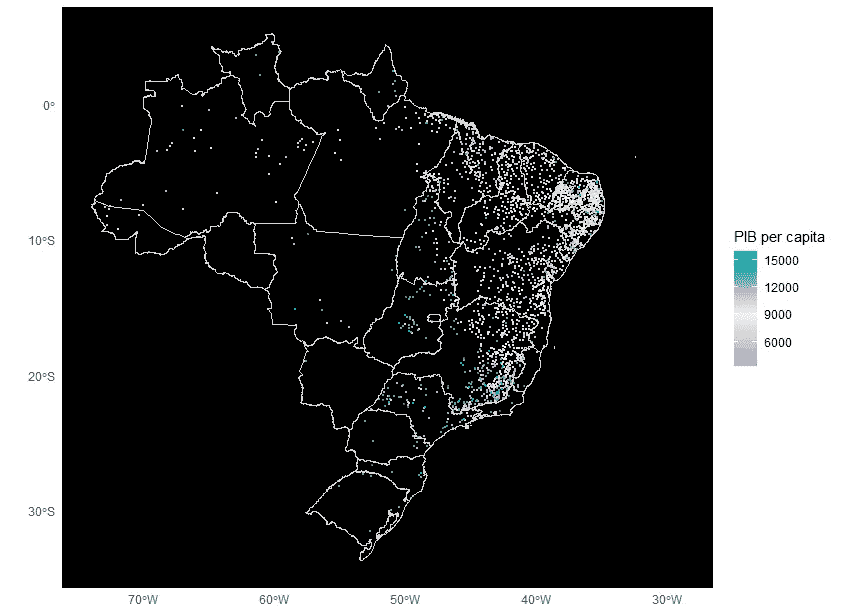

# 回到城市集群:天体和地图

> 原文：<https://towardsdatascience.com/back-to-the-municipality-clusters-celestial-objects-and-maps-55c64e39f805?source=collection_archive---------54----------------------->

塞尔吉奥·索萨在 [Unsplash](https://unsplash.com/s/photos/brazil?utm_source=unsplash&utm_medium=referral&utm_content=creditCopyText) 上的照片

就在 2020 年的八月，我写了一篇[的文章](https://fernandobarbalho.medium.com/mapas-contando-hist%C3%B3ria-o-pib-dos-munic%C3%ADpios-brasileiros-aebb82f06086),展示了从与 GDP 相关的变量中得出的城市集群模型的发现。是时候再次参观这个模型并进行新的实验了。在这里，报告将集中在易于用视觉模式解释的发现上。

这个想法是在分布图和地图中详细描述集群。在 [XKCD](https://xkcd.com/) 天文灵感和它的黑银调色板的帮助下，我们组装了图形，至少在视觉上解决了变量的分布问题。

# 星系、星云和对数

旅程从星星开始。这里使用的数据提出了一个巨大的分布问题。我们比较了像沙普里和圣保罗这样不同的城市。为了有一些成功的图形解释，我们借鉴 XKCD 的想法代表各种天体距离地球。一个对数标度的巨大图表允许把长颈鹿的高度和离这里很远的星云和星系的天文距离放在同一个数字中。

逐渐滚动屏幕，在哈勃望远镜观察到的最遥远的物体和我们踩着的地面之间做出相反的路径。小心不要摔倒。

XKCD 宇宙距离视野:[https://xkcd.com/482/](https://xkcd.com/482/)

# 国内生产总值组成部分和人均国内生产总值的模糊不清

这里评估的变量总是经济部门的组成部分:农业、行政、工业和服务业。我们也分析人均 GDP 数据。记住所有数据都是指巴西各城市的变量。

当对数标度的变量分布完成后，人们可以感知图像的形成，回忆起天文学教科书中描述的[星云](https://en.wikipedia.org/wiki/Nebula)。

各市国内生产总值各组成部分的对数分布(以千雷亚尔计)。作者图片

从上图中可以看出:

*   管理变量在 10，000 和 100，000 之间的范围内呈现大的点集中，然后有大的分散，直到接近 100 Mi。
*   其他变量也显示了浓度范围，尽管密度较低。
*   最分散的变量是工业，对最低值负责的变量是农业，达到最高值的变量是服务业。

各市人均国内生产总值的对数分布(以 1 雷亚尔计)。作者图片

鉴于规模的差异，人均国内生产总值的分析总是在单独的图表中进行，因为它是国内生产总值和人口之间的比率。上图显示了一个浓度，该浓度从略高于 5000 雷亚尔的位置开始，达到 50000 雷亚尔的位置，然后这些点被分散。这些分散特征是确定形成的六个集群的基础。在接下来的部分，我们将看到如何用与每个星团相关的颜色填充星云点。

# 从星团中给星云上色

以变量值表示的巴西不平等最终成为六个集群的决定因素。总体而言，国内生产总值和人均国内生产总值的较低值出现在第 1、2 和 3 组，而较高值出现在第 4、5 和 6 组。利用这一特性，总是可以从两个超簇中进行簇分析。这允许更清晰的视觉分析，从而有助于更好地识别聚类的特征。

作者图片

从上图中可以看出:

*   聚类 4、5 和 6 比其他聚类分布在更大的值范围内
*   第 3 组和第 6 组集中在农业部门
*   第 6 组代表最高值的部门:行政、工业和服务业

作者图片

说到人均 GDP，从上图可以看出:

*   聚类 1 密集地位于最低值中
*   第 5 组尽管分散在国内生产总值的各个组成部分中，但在人均国内生产总值分析中被认为占据了最高值的范围

# 六维中心的水母

用于这项工作的聚类算法的特点是能够识别所谓的水母。这个奇怪的名字与六个维度形成的集群中心点相关联:我们在这里分析的五个变量和总 GDP。

medoids 的概念可以与描述统计学中的平均值和中值进行比较，即确定最能表征一组数据的元素。在我们的研究中，从分析变量的角度来看，medoids 是六个集群中每个集群的最佳特征。

作者图片

当我们分析经济部门的 medoids 时，我们认识到:

*   代表聚类 6 的 Blumenau 与除农业部门之外的其他 medoids 相距甚远。在这种情况下，它排在第三位。
*   Assis Chateaubriand 是第 5 组的特点，在农业部门领先，与其他部门有很大不同。
*   行政部门是聚类 1 至 5 的 medoids 彼此最相似的地方。

作者图片

当分析人均国内生产总值时，人们认识到:

*   Blumenau 和 Nova Veneza(星团 4 的水母)非常接近
*   Santa Maria do Suaç，聚类 1 的水母类完全被其他水母类取代，呈现非常低的值。

# 回到地球和制图表达

现在讨论制图表达，研究结果对聚类及其跨城市的分布特征有什么影响？在八月份的文章中，我们用地图做了第一次实验。现在我们来看另一个例子，它显示了从一个簇的 medoids 分析该簇的影响。但是首先我们将在巴西地图上画出这些集群和它们各自的城市。

作者图片

我用来识别聚类的算法的结果表明，组 1 是最有凝聚力的。据观察，这种凝聚力也是地理上的。东北部各州集中了这个集群中的大部分城市。米纳斯吉拉斯州北部也有大量具有这种特征的城镇。这里值得记住的是，这一组在五个变量中的值最低，特别是人均国内生产总值，这加剧了影响巴西这些地区的收入分配不均和贫困状况。

该地图还显示了圣保罗州的财富带以及主要分布在南部和东南部各州的其他集群。同样值得注意的是，中西部少数几个城市与农业部门的高 GDP 集群有很大关联。

值得记住的是，我们需要回到梅多伊德。我已经指出了这些城市，但我还没有说它们在哪里。下面的地图纠正了这个差距。

作者图片

六个城市集中在东南部和南部地区。巴拉那有两个市，圣卡塔林纳有两个市，圣保罗有一个市，米纳斯吉拉斯有一个市。

总的来说，考虑到南部和东南部地区的城市集中，预计这主要是针对第 2 至第 6 类城市。群组 1 的 medoids 位于米纳斯吉拉斯州也不足为奇，因为 Santa Maria do Suaç uí位于该州北部，因此位于该群组主要城市所在的区域。

使用 medoids 作为参考，可以进行一些地图分析。现在，我将重点介绍第一组的人均国内生产总值。在下面的地图中，接近蓝色的阴影表示人均 GDP 高于圣玛丽亚岛的城市。更接近粉色的颜色是 GDP 低于我们参考值的城市。对于这两个方向，颜色越深表示距离参考点越远。

作者图片

聚类的 medoids 和 GDP 值接近 medoids 的城市位于两种色调之间的过渡范围内。从图例中可以看出，这个过渡带位于所考虑的区间的中间。从视觉上可以观察到色调有一点不平衡。显然，接近粉色调的城市比接近蓝色调的城市要多一些。实际上，集群 1 的分布是这样的:

*   人均国内生产总值高于梅多伊德市的 1221 个市。
*   人均国内生产总值低于梅多伊德市的 1103 个市。

需要注意的是，在上面的地图上，即使在星团内部，地理模式也会重复出现。数值较低的城市正好集中在米纳斯吉拉斯州的东北部和北部。具有最高值的点分散在其他区域中。

# 下一次星际旅行

所介绍的研究结果似乎对主要涉及不平等相关主题的几项研究很重要。因此，发展可能走向与联邦制及其减少不平等的目标有关的研究。研究影响不平等效果甚至其原因的公共政策也可能是有趣的。

还值得注意的是，聚类方法也可以用于定性方法的研究。Medoids 和聚类中其他点到 medoids 的距离有助于识别城市，以便进行更深入的*原位*研究，其中经济产出和 GDP 分布的维度与直辖市的选择相关。甚至试点公共政策项目的城市定义也可以使用这种方法。

最后，希望对不平等的阐述能够有助于各城市之间的社会经济差异越来越少地用天文单位来衡量。

# 代码和数据

代码在我的 [Github](https://github.com/fernandobarbalho/mapas_federalismo) 中。看看那里。我强调使用[地理图书馆在制作地图时总是很有帮助。
其他文本中使用的数据相同。这是 2017 年直辖市的 GDP](https://github.com/ipeaGIT/geobr) [数据库](https://www.ibge.gov.br/estatisticas/downloads-estatisticas.html)。

# 承认

我感谢 Tiago Maranhã提供了最准确的数据可视化技巧，并向我介绍了 XKCD。建议在 [twitter](https://twitter.com/tiagombp) 关注他那里。我也感谢莫尼卡和但丁选择了这些颜色。