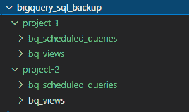
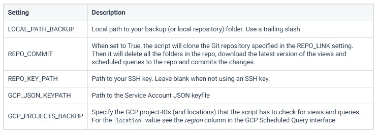

# 备份您有价值的 BigQuery 视图和计划查询

> 原文：<https://towardsdatascience.com/back-up-your-valuable-bigquery-views-and-scheduled-queries-424791b6f2c7?source=collection_archive---------19----------------------->

## 你的宝贝 SQL 也需要一些爱


原图[卡莉·谢伊](https://unsplash.com/@karishea)

**进行数据备份很重要。但是隐藏在视图和预定查询中的宝贵的 SQL 代码呢？本教程将向您展示如何使用 Python 将所有 SQL 代码备份到 Git 存储库中。**

在许多情况下，视图和预定查询包含了所有艰苦工作(和花费的大量时间)的结果。它们基本上包含了很多构建模块。想想数据转换、特征工程、选择甚至模型本身。

> ***注:*** *你喜欢这篇文章吗？阅读* [*原文*](https://stacktonic.com/article/backup-your-valuable-big-query-views-and-scheduled-queries-using-python) *(以及其他许多动手营销技术相关文章)上*[*stacktonic.com*](https://stacktonic.com)*🚀*

*此外，当很多用户积极参与谷歌云平台(GCP)环境的开发时，很难跟踪视图和预定查询的变化。*

*本教程中提供的解决方案将:*

*   ***备份**您的 BigQuery **视图**和**调度查询**到本地文件系统上的`.sql`文件。*
*   *能够提交对一个 **Git** 库的更改。定期运行脚本时，可以跟踪**变更历史**。*
*   *支持**多个** GCP 项目。*

# *准备*

*我们将使用服务帐户对您的 Google 云项目进行身份验证。*

> **通过将此具有正确角色的服务帐户添加到您想要备份的所有 GCP 项目，您可以对所有项目使用相同的服务帐户。**

*如果你不熟悉设置服务账户，请先阅读谷歌文档。*

*   *创建一个服务帐户，并为该帐户启用`BigQuery User`角色。*
*   *为服务帐户生成并下载 JSON 密钥文件。*
*   *在您的 GCP 项目中启用`Data Transfer API`*

# *脚本如何工作*

*   *Python 脚本将获取脚本中配置的 GCP 项目中所有视图和计划查询的 SQL 代码。*
*   *文件被下载到您的本地文件系统。*
*   *当您启用`REPO_COMMIT`设置时，脚本将首先克隆一个(远程)存储库，获取视图和预定查询 SQL，并将更改提交给存储库。在克隆远程存储库之前，它将首先删除旧版本的存储库*

> **当使用 Git 存储库备份 SQL 和跟踪变更历史时，可以使用 SSH 密钥进行认证。参见* [*GitHub*](https://docs.github.com/en/github/authenticating-to-github/connecting-to-github-with-ssh/adding-a-new-ssh-key-to-your-github-account) *或*[*bit bucket*](https://support.atlassian.com/bitbucket-cloud/docs/set-up-an-ssh-key/)的说明*

***文件结构***

*该脚本将根据以下文件夹/文件结构创建和填充:*

****

# *安装和运行代码*

***安装包***

*该脚本需要一些依赖项。使用`pip`来安装这些包:*

```
*pip install google-auth
pip install google-cloud-bigquery
pip install GitPython*
```

*最后一步是调整脚本中的设置:*

**

*现在，您已经准备好运行代码了:*

```
*python backup_views_scheduled_queries.py*
```

# *Python 脚本*

*手动将代码保存到一个文件中，或者直接从我们的 GitHub 库下载代码[。](https://gist.github.com/krisjan-oldekamp/78869851421af2f75325c32302fa2137)*

***backup _ views _ scheduled _ query . py***

# *一些最后的提示*

*   *您可能希望每天安排这个脚本。你可以使用你最喜欢的调度工具，比如 Apache Airflow 或者 good ol' cronjobs。*
*   *在 windows 上，配置 SSH 密钥可能会给您带来一些麻烦。参见 [GitHub](https://docs.github.com/en/github/authenticating-to-github/connecting-to-github-with-ssh/generating-a-new-ssh-key-and-adding-it-to-the-ssh-agent) 和 [Bitbucket](https://support.atlassian.com/bitbucket-cloud/docs/troubleshoot-ssh-issues/) 文档进行故障排除。*