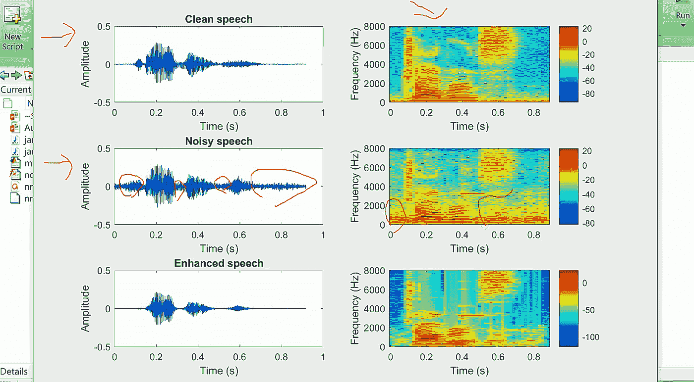
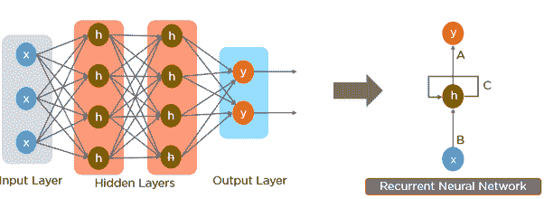

# 背景噪声去除:传统算法与人工智能算法

> 原文：<https://towardsdatascience.com/background-noise-removal-traditional-vs-ai-algorithms-9e7ec5776173?source=collection_archive---------7----------------------->

## 将深度学习噪声去除模型与旧的减法模型进行比较。

凯利·西克玛在 [Unsplash](https://unsplash.com?utm_source=medium&utm_medium=referral) 上的照片

噪音无处不在。无论你是在舒适的家中还是走在街上，垃圾车的声音或你的狗的叫声都会很快成为一种骚扰。尤其是在数字时代，所有这些噪音都会被麦克风拾取，干扰我们的交流。所以，让我们来看看我们如何才能删除它！

***背景噪声去除*** 是通过隔离主导声音来增强嘈杂语音信号的能力。背景噪声消除无处不在——它出现在音频/视频编辑软件、视频会议平台和降噪耳机中。因此，背景噪音消除仍然是一项快速发展的技术，人工智能带来了一个全新的领域来改善这项任务。

今天，让我们通过查看 ***传统方法和基于机器学习的方法*** 来探索背景噪声去除是如何工作的。

# 传统的去噪方法

大多数噪声去除算法是减法，识别具有较高水平背景噪声的某些频率，并从原始信号中减去这些频带。许多这样的方法使用静态滤波器，例如低通、高通和带通滤波器，它们被设计成具有特定的参数，以隔离被认为是主导信号的信号。这些算法最适用于确定性信号，在这种信号中，被滤波的噪声类型和被隔离的噪声类型几乎没有不确定性。实际上，这些滤波器在变化的条件下是非常无效的，特别是在背景噪声的特性与要分离的干净信号重叠的情况下。诺伯特·维纳采取了不同的方法，放弃了给定噪声信号是确定性的假设。

# 维纳滤波

来源:[https://medium . com/audio-processing-by-MATLAB/noise-reduction-by-wiener-filter-by-MATLAB-44438 af 83 f 96](https://medium.com/audio-processing-by-matlab/noise-reduction-by-wiener-filter-by-matlab-44438af83f96)

维纳滤波是动态信号处理的工业标准，广泛用于助听器和其他边缘设备，如电话和通信设备。给定两个音频信号，自适应滤波器工作得最好:一个具有语音和背景噪声，另一个仅测量背景噪声。现代智能手机设计师通常会将两个麦克风放置在彼此相距一定距离的位置，一个放置在说话者的嘴附近，以记录嘈杂的语音，另一个可以测量环境噪声，以滤除噪声。

你可能会想，如果我们有一个背景噪音和嘈杂的语音分离的信号，为什么我们不能简单地从嘈杂的语音减去背景噪音，以分离干净的语音？虽然这种方法看起来很直观，但结果并不完全符合我们的预期。事实证明，这种做法行不通有很多原因。麦克风之间的宏观距离使两者所处的环境略有不同。因此，我们不能通过简单的信号相减来消除大部分噪声元素，因为噪声是由许多因素引起的，包括硬件组件中的静电电荷和环境中的微小振动，所有这些因素都会随着环境的微小变化而发生巨大变化。

然而，维纳滤波器使用这两个信号的特性来产生干净语音的估计。然后计算一个误差，称为均方误差，并将其最小化，以便产生干净语音的最佳估计。

不幸的是，维纳滤波也有缺点:

1.  首先，为了充分发挥其优势，需要两种不同的音频信号。在许多情况下，例如在驾驶舱或智能手机中，双麦克风系统很实用，但在更普遍的情况下，能够处理来自单个音频流的噪声会更有利。
2.  第二，在背景噪声的频谱属性与语音的频谱属性重叠的情况下，音频中可能存在明显的语音失真。滤波器的减法性质可以去除听起来类似于背景噪声的语音部分。随着深度学习的兴起，这些问题很多都得到了解决。

# 人工智能去噪方法

人工神经网络是一个古老的想法，最近以深度学习的形式爆发出来。虽然有不同的深度学习方法来消除噪声，但它们都是通过从训练数据集学习来工作的。

# 噪声去除的训练数据集

建立准确的噪声去除模型的第一步是构建高质量的训练数据集。由于我们的目标是去除背景噪声，我们的数据集应该由干净语音与其嘈杂变体配对的记录组成。

在组装数据集之前，考虑模型的用例非常重要。例如，当训练将应用于来自直升机飞行员麦克风的信号的噪声去除算法时，用被直升机声音的变化扭曲的音频样本来训练网络是最有意义的。对于一个通用的噪声去除模型，用日常背景声音的样本进行训练是有意义的，例如大声的聊天、空调、打字、狗叫、交通、音乐——你明白了。

一旦我们弄清楚了我们想要用什么样的数据进行训练，我们就必须实际生成数据集。最好的方法是找到大量干净的语音信号和纯噪声信号，并以各种方式组合它们。例如，您可以将一个高质量的人说话的样本和一个狗叫的样本组合在一起，生成一个背景中有人说话且有狗叫的新样本。因此，通过提供说话人的原始样本以及带有语音和狗叫声的样本，神经网络可以重复地将其估计的干净语音信号与实际的干净语音信号进行比较，然后调整自身并再次尝试。

最后，我们现在可以将我们的数据集输入到神经网络，这样它就可以学习隔离背景噪音并生成干净的语音。用于音频处理的最流行和最有效的方法之一是递归神经网络。

# 递归神经网络(RNN)

递归神经网络是可以识别和理解序列数据的模型。顺序数据包括音频、文本或对象在一段时间内的位置。

rnn 对于去除背景噪声特别有效，因为它们可以随着时间学习模式，这对于理解音频是必不可少的。

那么 RNNs 是如何工作的呢？首先，让我们来看一个前馈神经网络，它有三个主要层:输入层、隐藏层和输出层。RNNs 从隐藏层引入了一个称为隐藏状态的反馈循环，当模型以某种顺序处理每个项目时，隐藏状态会自我更新。

来源:[https://medium.com/@Aj.程/different-between-CNN-rnn-quote-7c 224795 db 58](https://medium.com/@Aj.Cheng/different-between-cnn-rnn-quote-7c224795db58)

为了了解这一点，让我们观察一个 RNN，它被训练来隔离嘈杂音频样本的背景噪声。我们可以将音频样本分解成一系列均匀间隔的时间间隔。当序列的每个单独的样本被传递到 RNN 时，隐藏状态在每次迭代期间被更新，每次都保留先前步骤的记忆。在迭代结束时，输出通过前馈神经网络发送，以生成背景噪声被完全去除的新音频流。听起来像魔术？是啊，算是吧！

然而，RNN 也有自己的陷阱。最重要的问题是，它们不能有效地长时间保留信息。这是由于在称为反向传播的过程中梯度消失的问题。虽然我不想被细节冲昏头脑，但这里的是了解更多信息的好资源。

这种长期记忆的缺乏使得 RNNs 在长期记忆非常有用的过程中效率较低。因此，研究人员发明了传统 RNN 的变体，使用门来解决这个问题。门是可以学习向隐藏状态添加或删除什么信息的操作。使用这些门的两个主要神经网络是长短期记忆(LSTM)和门控循环单元(GRU)。这两种方法都比简单的递归网络计算量大得多，但更适合我们的去噪任务。

从这里，有各种各样的方向，我们可以去。一些模型被设计成执行背景噪声去除的端到端任务，但是这也意味着它们在计算上更加密集并且在尺寸上更大。这些模型非常强大，经常用于语音识别。其他人采用更混合的方法，使用传统的减法噪声去除来预处理数据，然后应用神经网络来处理样本中仍然存在的任何非静态背景噪声。虽然这两种方法都是有效的，但是它们的使用依赖于开发者的计算资源和期望的精度。

# 那么哪种方法更好呢？

自麦克风发明以来，背景噪声降低一直是音频处理中感兴趣的主要领域。有数百种过滤音频的传统方法，但许多方法(如果不是全部的话)在处理非静态音频时效果不佳，并且当背景噪声与主扬声器混合时会引入失真。随着计算能力的增长和我们建立能够长时间记住复杂模式的深度学习模型的能力，我们已经能够训练计算机在特定任务上变得异常出色。通过用大量数据训练深度学习模型，计算机已经变得格外能够消除音频中的噪声。

那么，哪种方法更好呢？如果计算资源和等待时间无关紧要，人工智能方法远远优于传统方法。这是因为它们是生成性的，而传统模型是减法性的。人工智能方法能够生成一个全新的音频信号，消除背景噪声，并使清晰的语音失真最小。

如果计算资源和等待时间是一个问题，鉴于当今的技术，人工智能方法可能是不切实际的实施。模型的处理时间有时会给处理带来延迟，这在某些情况下是不希望的。然而，在可预见的未来，这肯定不会是一个大问题。神经网络每天都在变得更快、更有效、更容易使用，最终它们将成为标准。

最初发布于 [Audo AI](https://audo.ai/blog/background-noise-removal-traditional-vs-ai-algorithms) 。

…

感谢您花时间阅读本文。一如既往，我感谢您的任何意见/反馈。

欢迎在[我的媒体页面](https://medium.com/@praneethguduguntla)或[奥多艾的博客](https://audo.ai/blog)查看我的其他作品！