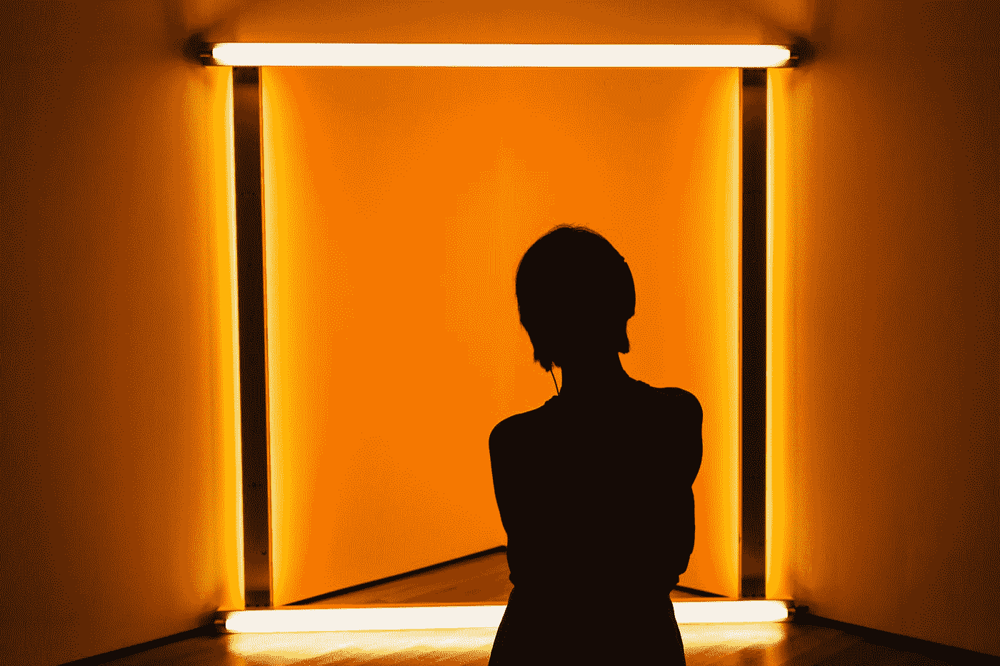
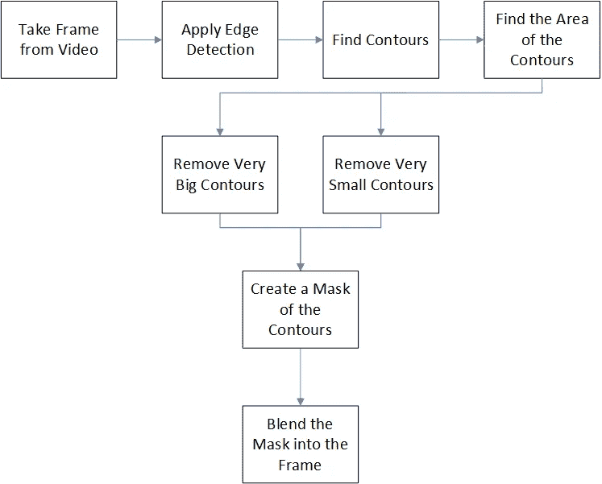
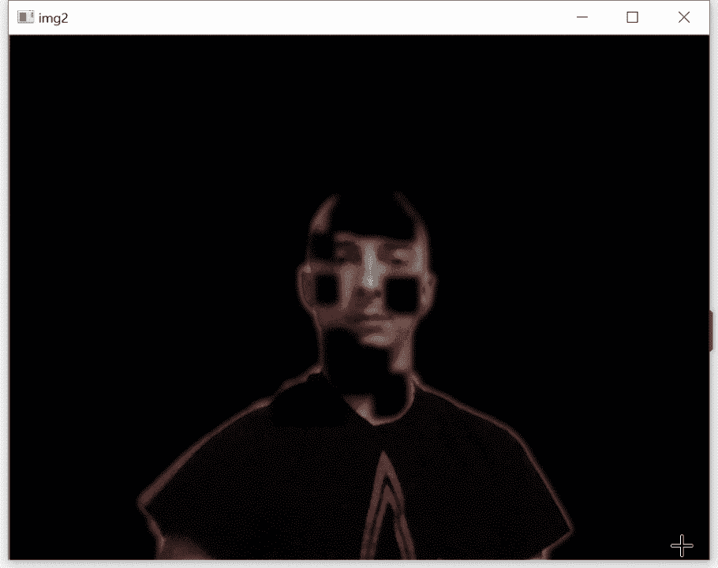
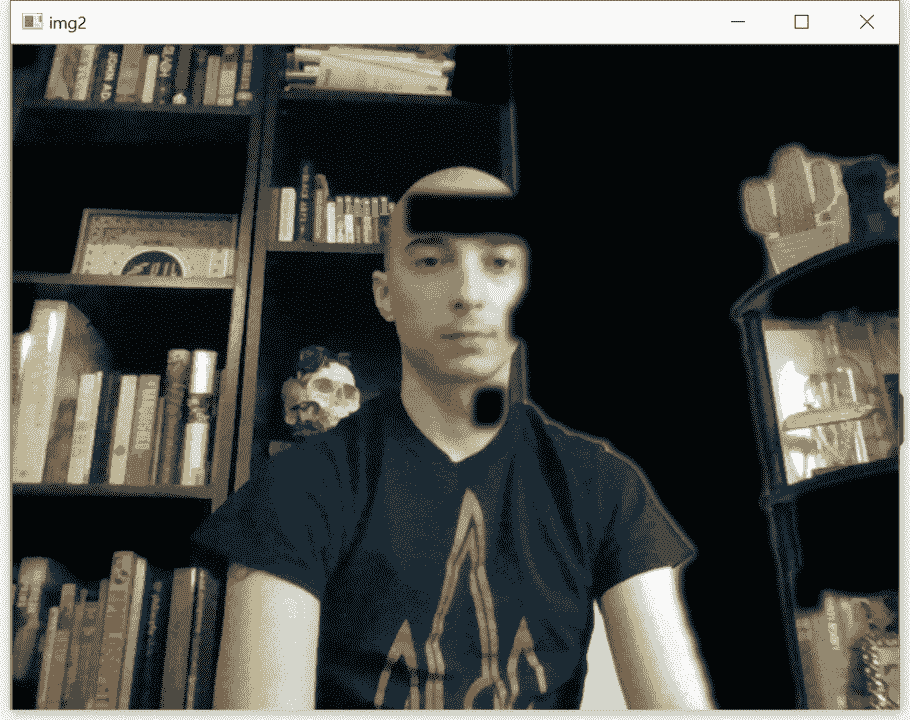

# 使用 Python 去除背景

> 原文：<https://towardsdatascience.com/background-removal-with-python-b61671d1508a?source=collection_archive---------1----------------------->

## 使用 OpenCV 检测前景



奥斯塔普·森尤克在 [Unsplash](https://unsplash.com?utm_source=medium&utm_medium=referral) 上拍摄的照片

我们生活在视频通话的时代。我们通过互联网，使用笔记本或电脑自带的任何相机，向我们的同学、同事和家人直播我们的生活。

但是，有时我们不想广播我们的空间。我的办公室，像许多其他办公室一样，有一些常年的杂物。我身后的墙上也有一把吉他，不总是喊专业。

因此，Zoom 和其他视频通话软件包含了隐藏背景的功能，通常隐藏在您选择的图像后面。虽然大多数人不太想它，但确定图像中前景和背景的实际任务很难忽略。

# 前景检测

前景检测是计算机视觉中最重要的应用之一。除了视频呼叫的例子之外，前景检测可以用于寻找和读取图像中的文本、确定自主车辆中障碍物的位置以及许多其他应用。

因此，已经开发了许多复杂的方法来区分前景和背景。

OpenCV 提供了几个“开箱即用”的[解决方案](https://docs.opencv.org/master/d1/dc5/tutorial_background_subtraction.html)；然而，如果没有任何其他背景，这些都是黑箱，不会提供太多学习的机会。相反，我将使用一个利用几个 OpenCV 模块的定制算法来实现类似的结果。

# 边缘检测和轮廓

我将演示的方法基于两个概念:边缘检测和轮廓。

顾名思义，边缘检测试图在图像中找到对比线或边缘。这个关键的第一步是预处理图像，以帮助区分任何对象。存在几种边缘检测方法，但是 [Canny](https://en.wikipedia.org/wiki/Canny_edge_detector) 方法非常受欢迎，并且与 [OpenCV](https://docs.opencv.org/master/da/d22/tutorial_py_canny.html) 打包在一起。

一旦找到了边缘，寻找轮廓就变得更加容易和准确。在计算机视觉中，[轮廓](https://docs.opencv.org/3.4/d4/d73/tutorial_py_contours_begin.html)仅仅是对比色或强度区域之间的连续边界线。与边缘检测不同，寻找轮廓将在图像中找到突出的形状。

# 该算法

如前所述，OpenCV 中预打包的背景移除器将不会被使用。相反，下面的流程图概述了我将使用的方法:



首先，我们将图像转换成黑白。接下来，将应用边缘检测，并且将找到图像中的轮廓。任何太大或太小而不能作为前景的轮廓都将被移除。

剩余的轮廓将被视为前景。这有一些直观的意义，因为在繁忙的背景下，特别小的细节会产生非常小的轮廓。相比之下，占据大部分屏幕的非常大的轮廓可能不是前景，而是背景的一些视觉假象。

最后，从剩余的轮廓中生成掩模，并将其融合到原始图像中。

# 履行

```
import numpy as np
import cv2
```

在做很多事情之前，需要导入两个库。NumPy 致力于让一些数字运算更有效率。OpenCV 处理图像操作。

```
# Parameters
blur = 21
canny_low = 15
canny_high = 150
min_area = 0.0005
max_area = 0.95
dilate_iter = 10
erode_iter = 10
mask_color = (0.0,0.0,0.0)
```

接下来，分配一组变量，这些变量将影响如何去除背景。每个变量都有独特的效果，可能需要根据视频的主题进行微调。简而言之:

*   模糊:影响背景和前景之间分界线的“平滑度”
*   canny_low:沿其绘制边缘的最小亮度值
*   canny_high:沿其绘制边缘的最大亮度值
*   min_area:前景中轮廓可能占据的最小面积。取 0 到 1 之间的值。
*   max_area:前景中轮廓可能占据的最大面积。取 0 到 1 之间的值。
*   dilate_iter:将在遮罩上发生的膨胀的迭代次数。
*   腐蚀 iter:掩模上腐蚀的迭代次数。
*   mask_color:背景移除后的颜色。

这些解释中的一些可能还没有意义，但是当它们出现在代码中时，将会被进一步解释。与此同时，您可以随意将所提供的值作为默认值来开始使用。

```
# initialize video from the webcam
video = cv2.VideoCapture(0)
```

接下来，初始化网络摄像机(如果可用)。如果没有视频文件的路径，可以用 0 来代替。

```
while True:
    ret, frame = video.read()
```

从摄像机读取帧开始一个无限循环。read 方法返回 2 个值:

1.  一个布尔值，用来判断相机是否正常工作，存储在 ret 变量中
2.  来自视频源的实际帧，记录在 frame 变量中。

```
 if ret == True: # Convert image to grayscale        
        image_gray = cv2.cvtColor(frame, cv2.COLOR_BGR2GRAY) # Apply Canny Edge Dection
        edges = cv2.Canny(image_gray, canny_low, canny_high)
```

if 子句只允许代码在摄像机正确捕获视频的情况下继续执行。该帧被渲染成灰度，因此可以进行下一步，边缘检测。

设置强度值最小值(canny_low 变量)决定了检测对比度的灵敏度。将其调整得太低可能会导致检测到过多的边缘。

将强度值设置为最大值(canny_high 变量)表示任何高于该值的对比度将立即被分类为边缘。将其调得太高可能会影响性能，但将其调得太低可能会错过重要的优势。

```
 edges = cv2.dilate(edges, None)
        edges = cv2.erode(edges, None)
```

这一步严格来说是可选的，但是扩张和侵蚀边缘会使它们更明显，并返回更好的最终产品。

```
 # get the contours and their areas
        contour_info = [(c, cv2.contourArea(c),) for c in cv2.findContours(edges, cv2.RETR_LIST, cv2.CHAIN_APPROX_NONE)[1]]
```

这一行有很多内容，但它是为了性能而这样写的。本质上，OpenCV 函数 findContours 返回一组信息。在这些信息中，我们只关心轮廓，其索引为 1。

对于找到的所有轮廓，实际轮廓本身及其面积的元组存储在一个列表中。

```
 # Get the area of the image as a comparison
        image_area = frame.shape[0] * frame.shape[1]  

        # calculate max and min areas in terms of pixels
        max_area = max_area * image_area
        min_area = min_area * image_area
```

计算图像的面积，然后确定最大和最小面积。

理想情况下，这一步应该在循环之外进行，因为它会影响性能。在流式传输之前拍摄一个初始帧或者简单地预先知道你的相机的尺寸会更有效。也就是说，为了让代码在演示时简单一点，这就足够了。

```
 # Set up mask with a matrix of 0's
        mask = np.zeros(edges.shape, dtype = np.uint8)
```

接下来，创建一个掩码，此时它是一个 0 的矩阵。

```
 # Go through and find relevant contours and apply to mask
        for contour in contour_info: # Instead of worrying about all the smaller contours, if the area is smaller than the min, the loop will break
            if contour[1] > min_area and contour[1] < max_area:
                # Add contour to mask
                mask = cv2.fillConvexPoly(mask, contour[0], (255))
```

对于找到的所有轮廓，将轮廓面积与最小值和最大值进行比较。如果轮廓大于最小值而小于最大值，轮廓将被添加到遮罩中。

如果轮廓小于最小值或大于最大值，它不会被视为前景的一部分。

```
 # use dilate, erode, and blur to smooth out the mask
        mask = cv2.dilate(mask, None, iterations=mask_dilate_iter)
        mask = cv2.erode(mask, None, iterations=mask_erode_iter)
        mask = cv2.GaussianBlur(mask, (blur, blur), 0)
```

像以前一样，扩张和侵蚀面膜在技术上是可选的，但创造了更美观的效果。同样的原理也适用于高斯模糊。

```
 # Ensures data types match up
        mask_stack = mask_stack.astype('float32') / 255.0           
        frame = frame.astype('float32') / 255.0
```

这些行将遮罩和框架转换成它们需要混合在一起的所需数据类型。这是一个平凡但重要的预处理步骤。

```
 # Blend the image and the mask
        masked = (mask_stack * frame) + ((1-mask_stack) * mask_color)
        masked = (masked * 255).astype('uint8') cv2.imshow("Foreground", masked)
```

最后，蒙版和框架混合在一起，使背景被涂黑。最后一行显示结果。

```
 # Use the q button to quit the operation
        if cv2.waitKey(60) & 0xff == ord('q'):
            break else:
        breakcv2.destroyAllWindows()
video.release()
```

作为最后一分钟的清理，前几行创建了一个 exist 条件。如果按下键盘上的“q ”,将会中断循环并终止程序。

else 连接回之前关于相机正确捕捉帧的 if 语句。如果相机出现故障，也会中断循环。

最后，一旦循环中断，显示结果图像的窗口关闭，相机关闭。

# 结果

如果一切顺利，应该会创建一个显示实时背景去除的输出窗口。虽然这里的算法对于非常简单的背景足够好，但是它可能在区分更复杂的“繁忙”或混乱的背景时有更多的困难。然而，总的来说，它很好地证明了这个概念。

下面给出了一个理想的例子，我站在一面普通的白墙边:



理想情况下实时去除背景。作者制作的视频。

算法很容易就能把我和墙区分开来。有一些口吃可能需要消除，但对于第一次尝试来说，它做得很好。

相反，这是我靠在书架上的最坏情况下的结果:



恶劣条件下的背景去除。作者制作的视频。

非常繁忙的背景，如装满书籍和其他配件的书架，会混淆算法，导致不太完美的结果。当我的手臂和脸的大片在背景中闪烁时，它很难区分前景和背景。

我确实有点夸大了这个结果。我把后背靠在书柜上，这样放大了效果。如果我站在书柜前面更远的地方，结果就不会这么糟糕；然而，它说明了在不太理想的情况下背景减除的困难。

实际上，大多数尝试都会产生介于最好和最坏情况之间的结果。

# 结论

前景检测和背景减除这两个相互交织的概念是计算机视觉研究最多的方面之一。虽然存在许多方法，但是边缘检测和在图像中寻找轮廓的简单应用提供了良好的基础。

使用 OpenCV 的内置函数，所使用的方法能够实时渲染背景去除。在理想条件下，该算法几乎完美无缺，但对于复杂或繁忙的背景，可能需要一些额外的调整。