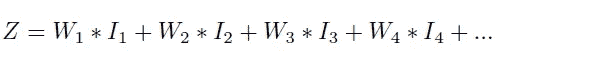
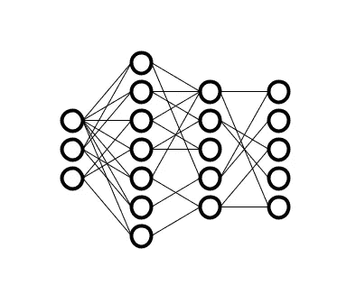

# 从头开始反向传播:神经网络如何真正工作

> 原文：<https://towardsdatascience.com/backpropagation-from-scratch-how-neural-networks-really-work-36ee4af202bf?source=collection_archive---------5----------------------->

神经网络究竟是如何工作的？我将向您展示一个完整的示例，它是用 Python 从头开始编写的，包含您完全理解该过程所需的所有数学知识。

我也会用简单的英语解释一切。你可以跟着读，只读课文，仍然能得到大意。但是要自己从头开始重新实现一切，你必须理解数学和代码。

我看过几篇这样的文章，但在大多数情况下，它们是不完整的。我想给这个话题一个完整的治疗:所有的数学+工作代码，包括电池。

你必须掌握线性代数、微积分和统计学，才能完全理解数学部分:矩阵乘法、点积、偏导数、链式法则、正态分布、概率、标准差等。

# 我们试图解决的问题

我们有一大组图像，每个都是 28 x 28 像素，包含手绘数字。我们需要编写一个应用程序，可以查看图像，并识别那里画的数字。换句话说，如果应用程序看到这张图片…


(图片由作者提供)

…然后它应该打印出这个…

```
[0, 0, 0, 0, 1, 0, 0, 0, 0, 0]
```

…这意味着“我看到了数字 4”:这里有 10 个插槽，第一个对应数字 0，第二个对应数字 1，第三个对应数字 2，依此类推；除了对应于编号 4 的时隙具有值 1 之外，所有时隙都具有值 0。这意味着应用程序已经“识别”了数字 4。

或者如果它看到这个图像…


(图片由作者提供)

…然后它应该打印出这个…

```
[0, 0, 1, 0, 0, 0, 0, 0, 0, 0]
```

…意思是“我看到第二个”。

这被称为**图像识别**，因为我们正在识别图像。它也被称为**分类**，因为我们有一堆输入(数字的图像)需要被分类(归类)到 10 个不同的类别(它们代表的数字种类，从 0 到 9)。

这些图像实际上就是充满数字的矩阵。矩阵中的每个像素都是不同的数字。我们可以使用 28 x 28 的正方形像素矩阵，或者我们可以简单地将每个矩阵展开成一串 784 个数字——软件实际上并不关心形状，只要我们保持一致。

神经网络应该很好地用于图像分类。让我们试着从头开始构建一个。

# 什么是神经元？

神经元是神经网络的基本构件。它有几个输入 Iᵢ和一个输出 o


(图片由作者提供)

内部和 Z 就是所有输入 I 的加权和(乘以它们的权重 W):



通常，Z 的公式末尾会添加一个恒定偏置项 B(因此 Z 通常以“… + B”结尾)。在这篇文章中**我们将忽略偏见**；网络性能会稍微差一些，但数学会更简单。

z 的值可以在很宽的范围内，但是对于 O，我们希望将值保持在一个合理的区间内，比如[0，1]，这类似于概率，只是更容易处理。你还需要一些非线性，否则输出将总是所有输入的线性集合，这肯定不是你想要的。

所以我们需要使用一个函数将 Z 转换成 O，比如 **sigmoid** ，它的输出总是在这个范围内。我们说乙状结肠是神经元的**激活功能**。我们可以使用许多不同的激活函数 A(Z ),但 sigmoid 是一个很好的基本例子，所以我们在这里使用它。


(图片由作者提供)


稍后，我们还需要 sigmoid 的导数，所以我们把它放在这里:


乙状结肠的 Python 代码:

```
def sigmoid(x, derivative = False):
    if derivative:
        return np.exp(-x) / ((np.exp(-x) + 1) ** 2)
    else:
        return 1 / (1 + np.exp(-x))
```

# 什么是神经网络？

神经网络通常由几层组成，每层包含多个神经元:



(图片由作者提供)

为所有连接编写所有方程，根据一些输入计算最终输出可能会非常无聊。一个网络可以有很多连接，这意味着一大堆方程。

然而，**矩阵符号**可以用一个简单得多的矩阵方程代替一个方程组。

对于每一层 l，所有神经元的内部和 Z 是前一层输出的加权和。每层的输出仅仅是应用于该层所有内部和的激活函数。层 l 的矩阵形式:


让我们把这些方程推广到整个网络。

我们将使用 X 符号来表示**输入**(我们正在识别的手写图像)。所以，让我们用矩阵符号来写上面所有的内容，所有的层，所有的值。

Oₙ的最终方程式有点不同(最后一层得到了特殊处理)，我们将在下面讨论 **softmax** 时再回到它。


矩阵用点积相乘。

每个 Wₗ矩阵的形状为矩形；一边的大小是当前层神经元的数量；另一边的大小是上一层神经元的数量；**权值总数是前一层神经元数乘以当前层神经元数的乘积**。这就是点积起作用的“魔力”。

# 初始化网络

当我们创建网络时，我们不知道我们需要什么样的权重。我们可以简单地**给权重**分配随机值。例如，我们可以从标准正态分布中抽取随机值。

为了减少权重可能得到的非常大的值的数量，我们将缩小与权重数量成比例的分布的标准偏差。更多的权重=更窄的分布(更接近 0)。这将避免在计算 z 时必须处理非常大的数字。

神经元的数量有点难以计算。输入和输出已经确定:如果图像中有 784 个像素，则需要 784 个输入。如果你要识别 10 个类别，你需要 10 个输出。对于其他层，它变得更加复杂；一般来说，神经元的数量从输入到输出逐层逐渐“减少”是个好主意。

参见下面的代码。整个网络(“模型”)都在称为“模型”的变量中。它有 4 层。输入层的大小与一个输入样本数据的大小相同(784)。输出的大小与一个输出样本数据(10)的大小相同。其他两层具有中等数量的神经元(128 和 64)。记住，我们只在模型中存储权重 W。

```
def nn_init(lsize):
    # human-readable names for clarity
    input_layer  = lsize[0]
    hidden_1     = lsize[1]
    hidden_2     = lsize[2]
    output_layer = lsize[3]

    # narrowing down the standard deviation by layer size, with np.sqrt()
    # large layers have tighter initial values
    nnet = {
        'w0': np.random.randn(hidden_1, input_layer) * np.sqrt(1\. / hidden_1),
        'w1': np.random.randn(hidden_2, hidden_1) * np.sqrt(1\. / hidden_2),
        'w2': np.random.randn(output_layer, hidden_2) * np.sqrt(1\. / output_layer)
    }
    return nnetlayer_sizes = [x_train[0].shape[0], 128, 64, y_train[0].shape[0]]
model = nn_init(layer_sizes)
```

# 输出

我们正在做分类，所以网络有 K 个输出，每一个输出代表我们正在识别的一类物体。在这种情况下，K = 10，因为对象是数字，并且有 10 个类别(0，1，2，…，9)。

我们可以对每个输出使用 sigmoid 函数，就像我们对网络中所有其他神经元所做的那样。那么每个输出将具有 0 和 1 之间的值，并且最高值(最接近 1)获胜。但是我们可以更进一步:为了使输出看起来像实际的概率，让我们确保它们的总和总是 1。每个输出在 0 和 1 之间，它们的总和需要正好是 1，因为对象在总共 K 个类中的任何一个类中的总概率总是 1(我们从不向网络显示“外来”对象，至少在训练期间不显示，这是重要的部分)。

这可以通过 **softmax** 函数来完成。对于每个输出 Oᵢ，我们如下计算其值:


下面的 Python 函数计算 softmax，但是对指数进行了移位以避免计算非常大的值。结果是一样的，函数看起来有点复杂，但是在实践中表现得更好。

```
def softmax(x, derivative = False):
    # for stability, we shift values down so max = 0
    # [https://cs231n.github.io/linear-classify/#softmax](https://cs231n.github.io/linear-classify/#softmax)
    exp_shifted = np.exp(x - x.max())
    if derivative:
        return exp_shifted / np.sum(exp_shifted, axis = 0) * (1 - exp_shifted / np.sum(exp_shifted, axis = 0))
    else:
        return exp_shifted / np.sum(exp_shifted, axis = 0)
```

# 正向传播

好了，我们有了网络，我们在输入端应用一个样本值(一个数字的图像)，我们如何计算它的输出呢？我们逐层进行，将输入/先前输出乘以权重，应用激活函数(sigmoid ),等等，直到我们到达输出，在那里应用 softmax。让我们再次展示方程式:


仅此而已。**一个训练有素的网络就是这样运作的**。这是一系列的线性代数运算，逐层进行，最终根据输入和网络权重计算输出。

下面的 Python 函数就是这样做的。它假设模型(所有 W 矩阵)是一个全局变量(为了代码简单，这是学校的东西，而不是生产代码)，它将一个输入样本 X 作为参数，并返回一个包含一堆矩阵的字典，每个矩阵包含网络中每一层的 O 和 Z 值。

字典中最后一个矩阵是网络输出。这就是我们想要的结果。

```
def forward_pass(x):
    # the model is a global var, used here read-only

    # NN state: internal sums, neuron outputs
    nn_state = {}

    # "output zero" is the output from receptors = input to first layer in the NN
    # these are activations for the input layer
    nn_state['o0'] = x

    # from input layer to hidden layer 1
    # weighted sum of all activations, then sigmoid
    nn_state['z1'] = np.dot(model['w0'], nn_state['o0'])
    nn_state['o1'] = sigmoid(nn_state['z1'])

    # from hidden 1 to hidden 2
    nn_state['z2'] = np.dot(model['w1'], nn_state['o1'])
    nn_state['o2'] = sigmoid(nn_state['z2'])

    # from hidden 2 to output
    nn_state['z3'] = np.dot(model['w2'], nn_state['o2'])
    nn_state['o3'] = softmax(nn_state['z3'])

    return nn_state
```

# 训练网络

但是如何训练一个网络呢？如果我们从随机权重开始，并应用输入 x(一个图像)，输出 Oₙ将是无意义的，它不会接近“真正的”输出 y

训练的中心思想是，我们必须调整权重 w，直到网络 Oₙ的输出接近 y(“理想”值)。高层次的训练算法可能如下所示:

*   用随机权重初始化网络
*   应用输入样本 X(图像)
*   进行正向传播并计算输出 Oₙ
*   将输出 Oₙ与您想要获得的实际值 y 进行比较
*   调整最后一层的权重，使输出变得稍微“更好”(误差减少)
*   逐层返回并调整权重，以减少误差(这是困难的部分)
*   应用下一个输入样本 X(另一个图像)
*   使用许多不同对的输入 X 和输出 Y 样本，重复上述所有操作数千次，直到网络表现足够好

困难的部分是弄清楚如何调整权重，从输出到输入，从而减少误差。这被称为**反向传播**。但是要实现这一点，我们首先需要创建一些工具。

# 成本函数

假设我们有网络输出 Oₙ，并将其与来自训练数据的“完美”输出 y 进行比较。Oₙ离 y 有多近，我们如何定义“近”？如果我们有一个值随着 Oₙ变得越来越“不同”于 y 而增加的函数，我们可以称之为**成本函数**(因为错误是昂贵的)，我们可以用它来降低成本。

对于这个分类问题，**交叉熵**可以起到代价的作用(在其他情况下使用其他函数)。假设我们有 K 个输出，它是所有输出的和:


其中，Oᵢ是网络上的各种输出，Yᵢ是每个输出的相应训练值。

这个公式有效的原因是 **Yᵢ可以是 0 也可以是 1** 。如果在 Y 样本中有 10 个值，那么其中 9 个值将是 0(对象 X 不属于这些类别中的任何一个)，其中一个值将是 1(对象 X 属于该类别)。那么总和中的一项或另一项变成 0，另一项只取决于 Oᵢ.

如果 O 和 Y 都是 1 维向量(确实如此)，那么在使用点积的矩阵符号中，上面的等式变成:


对数是按元素应用的，差 1-y 也是如此。

Numpy 库可以进行矩阵运算，因此 Python 的 cost 函数是对最后一个公式的直接直译:

```
def part_cost(o, y):
    c = np.dot(y, np.log(o)) + np.dot((1 - y), np.log(1 - o))
    return -c
```

让我们记住这个函数，我们稍后将使用它来评估网络的性能。

# 最小化成本

这是争论的重点:给定从输出 O 和训练值 Y 计算的成本 C，我们想要改变权重 W，使得 C 减少(通过使 O 更类似于 Y)。

如果我们可以计算 C 关于 W 的导数(我们称之为δ)，然后在导数平面的向下方向调整 W，那么 C 会减少。如果导数是正的，那么我们减少 W(因为最小值朝向更小的 Ws)，反之亦然。这项技术的另一个名字是**梯度下降**。


换句话说:想想 W 空间中的成本函数 C。忘了 X 或者别的什么吧。只想到 C(W)。**你需要在 W 空间中穿行 C，直到你在 W 空间中偶然发现某个最小值**。这就是“训练”的含义:找到使 c 最小的最佳 W 值集。

接下来的并不是严格的证明。这更像是一种数学直觉。如果你仔细看这些方程，你会注意到我们滥用数学的几个地方(例如，混淆微分和实际的有限变化)。在实践中，它会成功的——神经网络对错误有很强的抵抗力。

让我们将δ定义为成本 C w r t 的偏导数，内部和 z，对于层 l，这写为:


对于前一层 l-1，我们通过应用链式法则获得:


但是我们从 Z 的定义中知道这是真的:


将最后一个公式代入前一个公式，我们得到:


这个公式是递归的。我们所需要的是最后一层的δₗ，我们可以从 c 和 Zₗ计算出来，这是我们从正向传播中知道的。一旦我们有了δₗ **，我们就可以一层一层地回去，一个接一个地计算所有层的δ值。**

更重要的是，现在我们还可以逐层返回，计算成本函数 c 相对于每层 l 的权重 Wₗ的导数δₗ。**这是我们使反向传播工作真正需要的。我们现在越来越接近了。**

让我们使用链式法则重新计算每层的δ:


换句话说:


但是我们有来自正向传播的所有 Oₗ值(它们是每一层的输出)，并且我们已经计算了上面所有的δₗ值。这意味着我们可以计算所有图层的δₗ，从输出开始，通过网络返回。

一旦我们有了所有大的增量，我们就可以用它们来更新权重。在实践中，更新将通过学习速率因子λ进行加权，学习速率因子λ通常是一个小值(0.001)，因此我们不会对网络进行突然的大的改变。


同样，如果δ(C . W . r . t . W .的导数)为正，这意味着在较小 W 值的方向上将有较小 C 值。所以我们需要减少 W 来使 C 减少。反之亦然。

λ可能很难思考。不要停留在“单位”或类似的东西上。只需选择一个λ值，使 W 的变化足够小——小步前进。不管δ发生了什么，在乘以λ之后，结果应该比 w 小，这就是全部。这足以让算法工作。

# 反向传播和训练

对于每个训练样本，通过反向传播修改网络权重 W 以最小化成本的工作方式如下:

*   将训练样本 X(图像)应用于输入
*   进行正向传播，计算所有图层的所有 Z 和 O(输出)值
*   递归(向后)计算所有层的所有δ矩阵
*   从δ矩阵计算所有δ矩阵
*   更新权重

这是一个完整的反向传播步骤。请参见下面的 Python 代码:

```
def backward_pass(x, y):
    # do the forward pass, register the state of the network
    nn_state = forward_pass(x)

    # small deltas: derivatives of the error w.r.t. z
    nn_state['d3'] = nn_state['o3'] - y
    nn_state['d2'] = np.dot(nn_state['d3'], model['w2']) * softmax(nn_state['z2'], derivative = True)
    nn_state['d1'] = np.dot(nn_state['d2'], model['w1']) * sigmoid(nn_state['z1'], derivative = True)

    # large deltas: adjustments to weights
    nn_state['D2'] = np.outer(nn_state['d3'], nn_state['o2'])
    nn_state['D1'] = np.outer(nn_state['d2'], nn_state['o1'])
    nn_state['D0'] = np.outer(nn_state['d1'], nn_state['o0'])

    return nn_state
```

backward_pass()函数将图像 X 和训练响应 Y 作为参数。该模型是一个全局变量。它返回包含所有 Z、O、D 和 D 矩阵的 nn_state 字典。这里 d 代表δ。D 矩阵是在反向投影期间计算的权重调整项δ。

参见下面的完整培训代码。“时期”是代码需要检查整个训练数据的次数；良好的训练需要多次通过；我们做 5 个纪元。定义了一个训练率 t_rate，用于权重更新——它实际上是我们方程中的λ(抱歉改变了符号)。

您可以在每个输入样本 X 之后更新权重(随机梯度下降)，或者您可以累积整个时期的 W 变化(累积δ矩阵)并在最后应用所有内容(批量梯度下降)，或者您可以在两者之间做些事情。这里我们使用随机下降。

该代码还评估成本(与完美答案的偏差)和准确性(分类正确的次数)。

最后，模型(W 矩阵)被保存到磁盘上。

```
epochs = 5
t_rate = 0.001# train
print('################### training ####################')
for e in range(epochs):
    print('epoch:', e)

    samples = x_train.shape[0]
    cost = 0
    hit_count = 0
    for i in tqdm(range(samples)):
        m_state = backward_pass(x_train[i], y_train[i])
        # add partial cost
        cost += part_cost(m_state['o3'], y_train[i])

        # stochastic gradient descent
        # update weights
        model['w0'] -= t_rate * m_state['D0']
        model['w1'] -= t_rate * m_state['D1']
        model['w2'] -= t_rate * m_state['D2']

        if np.argmax(m_state['o3']) == np.argmax(y_train[i]):
            # successful detection
            hit_count += 1# performance evaluation
    cost = cost / samples
    accuracy = hit_count / samples
    print('cost:', cost, 'accuracy:', accuracy)# save the model
with open('model.pickle', 'wb') as f:
    pickle.dump(model, f)
```

# 评估网络性能

那么网络做得有多好呢？我们用训练数据 x_train 和 y_train 对它进行了训练。但是我们已经为测试留出了数据:x_test 和 y_test。

只保留一些数据用于测试总是一个好主意。这是网络在训练中从未见过的数据。因此，我们保证性能评估将是公平的。大约 20%是留出测试数据的合适大小(假设您有大量的数据——数千个样本或更多)。

评估只是检查测试数据，计算成本和准确性，并打印出结果。

```
# test
print('################### testing ####################')# load the model
if os.path.isfile('model.pickle'):
    with open('model.pickle', 'rb') as f:
        model = pickle.load(f)# run the whole test data
samples = x_test.shape[0]
cost = 0
hit_count = 0
for i in tqdm(range(samples)):
    m_state = forward_pass(x_test[i])
    cost += part_cost(m_state['o3'], y_test[i])
    if np.argmax(m_state['o3']) == np.argmax(y_test[i]):
        hit_count += 1# evaluate performance
cost = cost / samples
accuracy = hit_count / samples
print('cost:', cost, 'accuracy:', accuracy)
```

因为我们不对神经元使用偏置，网络的性能将相当适中:大约 60%的准确率。它肯定可以做得更好。但这是一个学习示例，不是生产代码。

这是训练中的网络性能，请注意它是如何随着每个时期而变得更好的:


(图片由作者提供)

参见下面测试中的性能。它实际上比在训练中要好一点，这不是典型的，但训练算法的行为在某种程度上有点随机。


(图片由作者提供)

这里有一个 Jupyter 笔记本，上面有本文使用的全部代码:

[https://github . com/FlorinAndrei/misc/blob/master/nn _ back prop . ipynb](https://github.com/FlorinAndrei/misc/blob/master/nn_backprop.ipynb)

它下载了 MNIST_784 数据集，这是一组带有手写数字的图像，总共约有 70，000 张图像。它使用 Tensorflow 库中的函数来准备训练/测试分割(这完全是多余的，但是非常方便)。

它训练和测试网络。另外，它生成了本文中使用的一些图像。

# 笔记

所有的图片和代码都是由本文作者创作的。

几年前，我在 Coursera 上参加了吴恩达的机器学习课程，如果你想理解这种算法的数学复杂性，这非常有用。

[](https://www.coursera.org/learn/machine-learning) [## 机器学习

### 4，250，577 已注册讲师:吴恩达字幕:英语、阿拉伯语+11 更多机器学习

www.coursera.org](https://www.coursera.org/learn/machine-learning) 

感谢阅读！