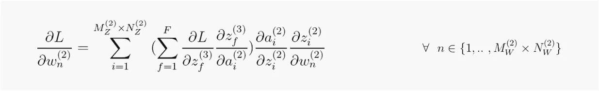

# 全卷积网络中的反向传播

> 原文：<https://towardsdatascience.com/backpropagation-in-fully-convolutional-networks-fcns-1a13b75fb56a?source=collection_archive---------6----------------------->

在 [Unsplash](https://unsplash.com/?utm_source=medium&utm_medium=referral) 上 [NeONBRAND](https://unsplash.com/@neonbrand?utm_source=medium&utm_medium=referral) 拍摄的照片

反向传播是神经网络训练中最重要的阶段之一。作为一个目标，它决定了神经网络的**知识**被理解为对未来冲动做出正确反应的能力。术语“知识”和“适当地”必须考虑两个方面:(I)第一方面由经验给出，或者更好地说，由网络学习从数据集的样本中提取的信息(*特征*)给出(ii)第二方面由误差计算或也称为*损失给出。*在监督学习中，每个样本都标有类别(*分类*)、一个或多个值(*回归*)或两者都有。设 *y_actual* 为主管分配给样本的标签， *y_pred* 为网络预测，反向传播阶段将确保两者之间的距离(*误差*)是可接受的。误差和特征都有与之相关的**权重**，当在反向传播过程中被修改时，就构成了网络的学习知识。

在离开之前，我想再补充几点。反向传播有两个阶段。第一个是计算梯度，或者更好地说，损失函数对每个网络权重的导数。第二是它们的更新( *delta 规则*)。最后一个可以用各种优化算法来执行，例如 Momentum、Adam 等。在本文中，我将只关注第一个阶段，而将第二个阶段的深化留给后续阶段。此外，我没有发现太多的证据证明反向传播适用于卷积网络，每一个计算和解释都是个人研究的结果。如果有错误或误解，我很乐意讨论。谢谢你和良好的阅读。

# **符号**

# 1.核和卷积

我们可能会问的一个问题是，为什么使用卷积神经网络而不是 MLPs 来分析图像？让我们举一些例子。图像是以矩阵形式排列的一系列数值(*像素亮度*)。为了使用 MLPs，我们应该将矩阵转换成向量，并将其呈现给网络的输入层。在这方面，我们考虑大小为(224，224，3)的图像 X，其中 224 表示高度和宽度，而 3 是色标红、绿、蓝中的深度。通过变换，我们得到一个大小为(150，528，1)的向量，如图 4 所示

图 4:输入图像 x 的多层感知器(MLPs)的表示。(图片来源[链接](https://www.instagram.com/p/Bsl5-0XhJL4/)，经作者许可编辑)

这种方法主要有两个错误。首先是**图像是空间有序的数据**。更清楚地说，像素排列形成矩阵的顺序为特征提取提供了很大的帮助。所以这是我们不能丢失的信息。第二是使用 MLPs **的参数数量非常高**。以我们的例子为例，仅输入层就有 150，528 个神经元。考虑到第二层中的 100，000 个神经元，我们的网络仅在第一层和第二层之间就有 150，528×100，000 = 15，052，800，000 个参数，让我们设想考虑整个网络。*(注意:参数数量增加越多，训练需要的时间就越多，找到最优的就越困难，模型在记忆方面的权重就越大* ) *。*

图 5:维度(4，4，1)的图像 X 和维度(2，2)的核 W 之间的卷积，步长 S = [1，1]。输出特征图由 Z 表示，并且具有维度(2，2)(来源:我的图像)

内核的引入解决了这些问题。内核 *W* 是通常尺寸为 2×2、3×3 或 5×5 的正方形矩阵，其沿着图像 X 的宽度 M 和高度 N 行进一定的步幅 S，在内核和重叠区域的值 *w* ( *权重*)之间执行加权求和。这种操作称为**卷积**，考虑了像素的空间顺序，并允许与图像的像素*共享权重**，减少了参数的数量。卷积的一个例子如图 5 所示。输出 Z 是一个**特征图**或者更确切地说是一个新图像，其中 X 的特定特征被强调。假设内核 *W* 突出显示边缘，卷积运算产生如下特征图:***

**

*图 6:强调 X 图像边缘的卷积运算。因子 1/16 被引入以减少特征图中的噪声。(图片来源[链接](https://www.instagram.com/p/Bsl5-0XhJL4/)，经作者允许编辑)*

*可以看出，在图 5 和图 6 中，Z 不具有与起始图像相同的尺寸。这个效果叫做**跨步下采样**。假设尺寸是 X: (Mx，Nx)W:(Mw，Nw)和步距 S，特征图 Z: (Mz，Nz)的尺寸计算如下:*

**

*公式(1)*

# *2.前馈*

**

*图 7:具有两个卷积层的卷积神经网络的表示(来源:Image by me)*

*让我们考虑一个具有两个卷积层的网络，这两个卷积层都具有大小为 2x2 的核 W 和沿高度和宽度的步长 1，并且在输出层中有两个神经元。作为激活函数，我们不特别选择一个，一般用 *g* 表示。网络的输入是大小为 4x4x1 的灰度图像(*单通道*)图 7*

*让我们检查一下正向阶段。在开始最后一个音符之前。为了构建计算图，对于特征图的每个像素，记住在卷积操作期间使用了哪些像素是很重要的。我们需要的是将保存在集合 p 中的*位置**

*   ***卷积输入 X 和第 1 层***

****

*(图片来源:图片由我提供)*

*   ***卷积输出第 1 层和第 2 层***

****

*(图片来源:图片由我提供)*

*   ***全连接***

****

*(图片来源:图片由我提供)*

# *3.计算图形*

*我们在计算图(图 8)中对在正向阶段获得的信息进行分组。这是我们的卷积神经网络的表示，其中每个节点对应一个向前的步骤。具体来说，我们可以看到每个卷积节点 *z* 将索引为 p 的节点作为输入。*

**

*图 8:图 7 中网络的计算图表示(来源:图片由我提供)*

# *4.B **ackpropagation***

**

*公式(2)*

*让我们考虑 l 作为损失函数，计算图形允许你容易地定义梯度向量∇wL.这将被增量规则用来更新网络权重。公式(2)表示图 7 中网络的梯度向量。它包括三个分量，也是向量，关于第 3 层的权重以及分别关于第 2 层和第 1 层的核。下面，我用*链规则*来分析它们每一个偏导数演算。*

*   ***∂L /∂W^(3)微积分***

**

*公式(3)*

*公式(3)是权重 W 层 3 的梯度向量。必须求解单个依赖关系[附录 1.1]才能计算其元素。作为示例，对重量 w1 层 3 的损失导数的计算如公式(4)所示:*

**

*公式(4)*

*用 F ( *完全用*表示)向量公式(3)的每个元素 *n* 的最后一层神经元的数量，我们得到:*

**

*公式(5)*

*   ***∂*/∂w^(2*l)微积分***

**

*公式(6)*

*公式(6)是矩阵 W 层 2 的梯度向量。为了计算它的元素，有必要首先求解由于层 3 的梯度而引起的单个相关性，然后求解每个神经元 *f.* 的多个相关性【附录 1.2】参见图 8， 我们可以看到:( I)由于卷积的共享权重特性，第 2 层中的每个权重 *w* 存在于不同的和 *zi* ^(2 中;( ii)每个神经元 *f* 连接到第 2 层中的每个激活输出，用于完全连接(*，因为它是完全连接的层*)。*

**

*图 9:计算每个第 3 层 zf 节点的下游梯度(来源:图片由 me 提供)*

*作为例子，我们考虑关于层 2 中的权重 *w1* 的梯度计算。为了便于讨论，对于第 2 层的每个激活节点，我们计算通过对各个第 3 层节点 *zf* 的*下游梯度*【附录 2】求和而获得的*上游梯度*。图 9 示出了下游的计算，然后对每一对求和，以形成公式(10)中每个激活的正式上游。*

**

*公式(10)*

*此时，层 2 中相对于 *w1* 的损耗梯度将由公式(11)给出，其中每个 *∂L /∂ai* 上游梯度乘以各自 *ai* 和 *zi* 节点的导数。此后，在上述步骤(I)中，对每个贡献进行求和。*

**

*公式(11)*

*从我们已经看到的和概括的开始，对于层 2 中的每个节点 *ai* ，上游梯度将由公式(12)给出。后者是公式(5 ),其中我们导出激活 *ai* 而不是导出权重 *w* 的 *zf* 层 3，然后将贡献相加。*

**

*公式(12)*

*相反，对于向量公式(6)的每个元素 *n* ，我们得到:*

**

*公式(13)*

*为了完整性，结合公式(12)和(13)我们得到:*

**

*   ***∂/∂w^(1*微积分****

**

*公式(14)*

*公式(14)是矩阵 W 层 1 的梯度向量。与前面的情况相比，对于偏导数的计算，有必要根据完全连接和卷积层来求解多个相关性的不同步骤。查看图 8，可以看到(I)w^(1 的每个权重存在于层 1 的不同 *zj* 加权和中(*共享权重*)。*

*作为一个例子，我们考虑权重 w1 层 1 的梯度的计算。同样，对于第 1 层中的每个激活节点 *aj* ，我们计算公式(15)中形式化的*上游梯度*。为了计算它，我们使用我们已经有的信息。特别是，一旦我们获得 *∂L /∂zi* ^(2 】,公式(10)中的上游梯度将允许我们计算单个下游图 10*

**

*图 10:计算每个节点 zi 层 2 的下游梯度(来源:me 提供的图像)*

**

*公式(15)*

*在这一点上，到 *w1* 层 1 的损耗梯度将由公式(16)给出，其中在公式(15)中形式化的 *∂L /∂aj* 上游梯度中的每一个乘以各自激活节点 *aj* 和 *zj* 的导数。此后，对上述点(I)的每个贡献进行求和。*

**

*公式(16)*

*从我们所看到的和概括的开始，对于第 1 层中的每个节点 *aj* ，上游梯度将由公式(13)给出，其中，代替将第 2 层的 *zi* 导出到权重 *w* ，我们将其导出到第 1 层的 *aj* :*

**

*公式(17)*

*相反，对于向量公式(14)的每个元素 n，我们得到:*

**

*公式(18)*

*为了完整性，结合公式(12)、(17)和(18)，我们得到:*

**

# *5.结论*

*在本文中，我们探讨了反向传播阶段，重点分析了图 7 中虚拟网络的计算图。一般来说，要计算第 l 个卷积层的梯度向量，有必要:*

*   *为了计算来自层 l 的每个激活输出的上游梯度*
*   *对层 l 中 z 相对于 w 的导数的贡献求和(由于共享权重)*

*现代网络要复杂得多。不同之处可能在于每个要素贴图块的通道数量(将多个要素贴图一个接一个地想象为立方体，每个都是一个通道)，从而增加了内核 W 的深度，或者我们可以为每个层使用多个内核，或者我们可以使用批量归一化层，然后在此处应用反向传播，或者为每个层使用一个偏差项，并考虑该项的反向传播。所以本文中的例子是一个简单的，但有希望解释反向传播的例子。*

# *附录*

*在图 11 / 12 / 13 中，以节点 *z* 为例进行了分析，同样的考虑也适用于任何其他功能。*

1.  ***链式法则***

*链式法则是计算复合函数导数的求导法则[1]。*

***1.1 单一依赖***

**

*公式(19)*

*设 *a(t)* 为 *t* 中的可微函数 *z(a(t))* 为 *a* 中的可微函数。 *z* 相对于 *t* 的导数由公式(19)描述。分析用于计算导数的计算图，我们得到:*

**

*图 11:复合函数 z(a(t))的导数的表示*

***1.2 多重依赖***

**

*公式(20)*

*设 *a1(t)* 和 *a2(t)* 为 t 中的可微函数 *z(a1(t)，a2(t))* 为 *a1* 和 *a2* 中的可微函数。 *z* 对 *t* 的导数由公式(20)描述。分析用于计算导数的计算图，我们得到:*

**

*图 12:复合函数 z(a1(t)，a2(t))的导数的表示*

*2.**渐变**【2】*

*设 *a1(。)*和 *a2(。)* be 两个函数和 *z(a1(。)，a2(。))*在 *a1* 和 *a2* 中的一个可微函数。我们定义:*

**

*图 13:单个节点上不同渐变形状的表示*

*   ***上游梯度:**节点 *z* 反向传播时接收的梯度*
*   ***局部梯度:**相对于节点 *z* 的输入计算的梯度*
*   ***下游梯度:**上游梯度和局部梯度之间的乘积(*链式法则*)*

## *参考*

*[1] [链式法则—维基百科](https://en.wikipedia.org/wiki/Chain_rule#:~:text=The%20chain%20rule%20states%20that%20the%20derivative%20of%20the%20composite,%E2%88%9216.25%20%C2%B0C%2Fh.)*

*[2] [第五讲斯坦福在线 pg。54](https://web.stanford.edu/class/archive/cs/cs224n/cs224n.1184/lectures/lecture5.pdf)*

## *更多资源*

1.  *jefkine kafuna，[卷积神经网络中的反向传播](https://www.jefkine.com/general/2016/09/05/backpropagation-in-convolutional-neural-networks/)*