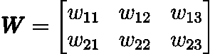
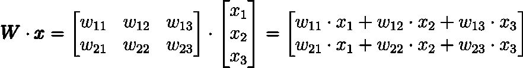
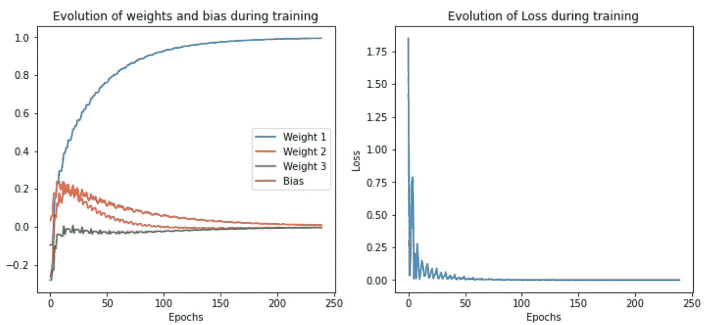
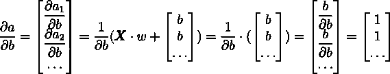
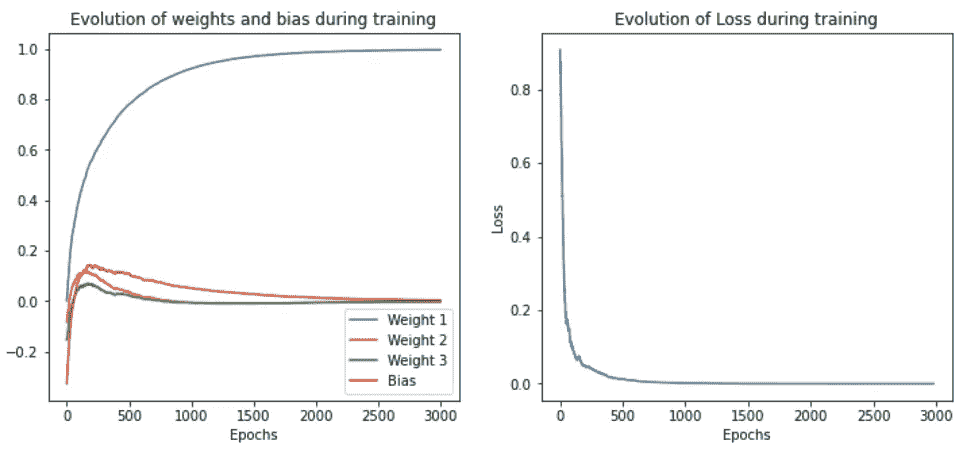
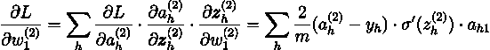

# 神经网络中的反向传播

> 原文：<https://towardsdatascience.com/backpropagation-in-neural-networks-6561e1268da8?source=collection_archive---------5----------------------->

## 从零开始的神经网络，包括数学和 python 代码


照片由 [JJ 英](https://unsplash.com/@jjying?utm_source=medium&utm_medium=referral)在 [Unsplash](https://unsplash.com?utm_source=medium&utm_medium=referral)

# 介绍

你曾经使用过神经网络，并想知道它背后的数学是如何工作的吗？在这篇博文中，我们将从头开始推导前向和后向传播，从中编写一个神经网络 python 代码，并学习线性代数和多元微积分的一些概念。

我将从解释一些线性代数基础开始。如果你对这个足够精通，你可以跳过下一部分。

# 向量和矩阵

简单的数字(标量)用小写字母书写。


作者图片

向量用粗体字母表示，默认情况下它们是列向量。

行向量的名称也用粗体表示，但是用大写字母 T 表示转置。


autor 提供的图像

矩阵用粗体大写字母表示。



autor 提供的图像

当转置一个矩阵时，我们交换行和列。


作者图片

矩阵或向量的维数是:

(行数、列数)


作者图片

# 点积⋅

当两个向量或矩阵乘以点积时，左边向量或矩阵的列数必须与右边向量或矩阵的行数相匹配。



(图片由作者提供)

结果的维数可以计算如下:


作者图片

该乘法中的“内部”维度必须匹配，并在输出维度中消失。

# 元素态乘积(Hadamard 乘积)

当使用元素乘积将两个向量或矩阵相乘时，它们必须具有相同的维数。


(图片由作者提供)

# 矩阵计算

我们还需要向量和矩阵的微积分。我们使用雅可比矩阵的概念。雅可比就是一个向量或导数矩阵。

标量值函数相对于矢量 **𝑥** 的导数定义如下:


作者图片

我们用输出向量 **𝑓** 定义一个函数对单个变量 x 的导数，如下所示:


作者图片

具有输出向量和输入变量向量的函数的导数定义如下:


作者图片

# 向量链规则

矢量链规则看起来非常类似于标量链规则。在这个例子中，向量 **𝑓** 是向量 **𝑔** 的函数，向量 **𝑔** 本身是向量 **𝑥** 的函数。所以**𝑓**(**𝑔**(**𝑥**))相对于 **𝑥** 的导数计算如下:


作者图片

# 单输入向量神经元


作者图片

**𝑥** :是进入神经元的输入样本。在上图中，它有 3 个特征。例如，这可以是一个人的身高(1.75 米)、体重(80 公斤)和年龄(30 岁)。注意，我们一次只输入一个样本(在我们的例子中是一个人)到神经元中。

𝑎:被称为激活，它是神经元的输出。它是神经元根据一个输入样本做出的预测。我们可以选择我们的神经元应该预测什么。在我们人类的例子中，一个有用的预测可能是身体质量指数。

**𝑤** :神经元的权重。它对向量 **𝑥** 的每个输入特征有单独的权重。

𝑏: **神经元的**偏差。一个神经元只有一种偏向。

𝑦:是网络输出的真实值或目标值。我们希望𝑎尽可能靠近𝑦。因此，我们在训练阶段改变权重 **𝑤** 和偏差𝑏。

𝐿:被称为损失。𝑎离𝑦越近，损失越小，因此越好。因此，我们想尽量减少损失。最小化神经网络中损失的最常见方法是梯度下降。在这篇博文中，我将使用“均方误差”损失。

## 梯度下降

在训练期间 **w** 以下列方式更新。


作者图片

其中 **w** 是新更新的权重向量，𝜆是学习率。𝜆是一个超参数，可以自由选择。通常在 0.05 左右。


作者图片

∇𝐿( **w** 是损失相对于权重的梯度。它只是损失𝐿的导数相对于权重的转置。一般来说，函数对某些变量的梯度总是相应导数的转置。


作者图片

𝑏是新的更新的偏见。∇𝐿(𝑏)是损耗相对于权重的梯度。


作者图片

在这种情况下，梯度是导数的转置并不重要，因为它是一个单一的数，转置一个单一的数不会改变它。

## 计算渐变

应用向量链规则:


作者图片

重量的导数:


作者图片

**𝑥** 不依赖于 **w** ，因此它被视为常数，导数必须仅针对**w**

关于偏差的导数:


作者图片

## **梯度下降**


作者图片

## **代码**

作者代码

测试我们神经元的代码:

作者代码

然后，我们用虚拟数据集测试我们的数据，看看它是否有效。每个样本有 3 个特征。如果第一个特征是 1，则期望的输出是 1。其他两个特征对结果并不重要。因此，我们希望第一个权重变为 1，而其他权重和偏差将变为 0。



显示训练过程中权重、偏差和损失变化的图表(图片由作者提供)

我们对训练过的网络在训练中从未见过的样本进行测试，以了解它对未见过的数据的推广情况。

```
Test: 
predicted y: 0.9992918862001037, true y: 1
```

测试样本的输出显示，我们非常接近真实值。

# 能够同时对多个样本进行训练

## 前进传球

每个数据点的大小为 3:

我们有数据点𝑥1，𝑥2，…

圆点表示我们可以输入神经元的数据点(𝑚)的数量是可变的。


作者图片

为了获得输入矩阵，我们垂直堆叠输入向量:


作者图片

我们必须按如下方式调整损失:


作者图片

其中𝑚是我们使用的数据点数。

**𝑎，**激活向量然后以如下方式计算:


作者图片


作者图片

## 偶数道次

应用向量链规则:


作者图片

计算导数。


作者图片

关于重量:


作者图片

关于偏差:



作者图片

## 梯度下降


作者图片

## 密码

作者代码

## 随机梯度下降

随机梯度下降意味着，我们同时对所有训练样本进行训练。

我们可以看到权重、偏差和损失的相同演变，就像在具有单一输入的神经元中一样。


作者图片

我们可以在下面看到，预测的输出非常接近真实的 y:

```
Test: 
predicted y: 0.9999991060923578, true y: 1
```

## 小批量梯度下降

小批量梯度下降意味着，我们同时在训练集的子集上训练神经元。

我们必须编写一个函数来生成随机批次。

作者代码



作者图片

```
predicted y: 0.9956078874633946, true y: 1
```

# 添加激活功能

激活函数是非线性函数。

3 个非常重要的激活函数及其导数:

tanh:


作者图片

西蒙德:


作者图片

整流线性单位:


作者图片

## 前进传球


作者提供的图片

## 向后传球

应用向量链规则:


作者图片

计算导数:


作者图片

np.diag 函数从一个向量构造一个矩阵，其中矩阵的对角线等于该向量，并且它是非对角线的。

关于重量:


作者图片

关于偏差:


作者图片

## 密码

激活功能:

作者代码

神经元:

作者代码

**迷你批次梯度下降**


作者图片

值、权重和偏差收敛到不同于先前的情况。

```
prediceted y: 0.9394357707018176, true y: 1
```

# **深度神经网络**

**向前传球**


作者图片

括号中的上标表示该层。

***第 1 层(=输入层):***


作者图片

***第二层(=输出层):***


作者图片

***损失:***


作者图片

## **向后传球**

***第一层(=输入层):***


作者图片

***第二层(=输出层):***


作者图片

计算第 2 层的导数是一个问题，因为我们必须对矩阵求向量的偏导数，对矩阵求矩阵的偏导数。这将导致张量，这将使它变得不必要的复杂。

我们不使用向量链规则，而是直接计算损失对权重和偏差的最终导数。为此，我们:

1.  用索引符号重写向前传递。在这个符号中，我们可以看到损失的最终导数的每个元素相对于权重和偏差的样子。
2.  计算导数。
3.  为了编写高效的代码，请返回到矢量化形式。

***第一层(=输入层):***


作者图片

***第二层(=输出层):***


作者图片

***损失:***


作者图片

## **向后传球**

***第二层(=输出层):***

为了推导索引符号中的公式，我们可以查看计算图。例如，为了推导第 2 层权重的公式，我们构建了一个计算图，其中所有相互依赖的变量都是相连的。


作者图片

我们用索引符号重写了相同的计算图。


作者图片

我们现在想知道损失对每个重量的导数。对于每个权重，我们必须对该权重出现的所有分支求和。作为层 2 的重量 1 的例子:



作者图片

损失相对于所有重量的导数为:


作者图片

以矢量化形式写回:


作者图片

注意，通过观察等式的左侧，我们可以看到我们的矢量化形式最终必须具有的维数。这有助于我们以正确的方式构造点积，并给我们必须转置的信息。


作者图片

以矢量化形式写回:


作者图片

***第一层(=输入层):***


作者图片

以矢量化形式写回:


作者图片

重新划分偏差:


作者图片

以矢量化形式写回:


作者图片

为了使求和更清楚:


作者图片

“轴= 1”意味着我们对各列求和。

# 通式

为了推广我们上面导出的公式，我们将输入损耗的概念引入到层中的神经元中。输入错误 **𝛿** (𝐿)进入最后一层𝐿是:


作者图片

以矢量化的形式:


作者图片

对于我们网络的所有其他层 l:


作者图片

以矢量化的形式:


作者图片

𝑓表示非线性激活函数。这可以是例如乙状结肠或 relu。𝑓′表示𝑓.的导数

***关于重量的导数:***


作者图片

以矢量化的形式:


作者图片

***关于偏差的导数:***


作者图片

以矢量化的形式:


作者图片

# **最终代码**

此代码可用于创建和训练任意深度神经网络。传递给 __init__ 方法的列表“层”可以更改，这将更改网络。列表的长度等于层数。这些数字等于每层中神经元的数量。第一个必须等于特征的数量。

作者代码

测试我们的代码:

作者代码

我们再次查看输出层的权重和偏差的演变以及训练期间损失的演变。


作者图片

```
predited y: 0.9514167066315814, true y: 1
```

# **结论**

如果你还和我在一起，我祝贺你，虽然这是一个旅程。如果第一次没有成功，也不要绝望。我花了一个多月才想明白这一切。

今天你已经学会了如何在任意深度神经网络中导出权重梯度。你现在也应该能够将这些知识应用到其他问题上，比如线性回归、递归神经网络和强化学习等等。

但是要知道，现在有非常好的自动签名框架，它能够为你数值计算梯度。尽管如此，我仍然认为，手工推导这些公式有助于我们对神经网络如何运行以及出现的一些问题(如香草 RNN 中的消失和爆炸梯度)的总体理解。

## 相关著作

</snake-with-policy-gradients-deep-reinforcement-learning-5e6e921db054>  <https://medium.com/@Vincent.Mueller/einstein-index-notation-d62d48795378>  

## 想联系支持我？

LinkedIn
[https://www.linkedin.com/in/vincent-m%C3%BCller-6b3542214/](https://www.linkedin.com/in/vincent-m%C3%BCller-6b3542214/)
脸书
[https://www.facebook.com/profile.php?id=100072095823739](https://www.facebook.com/profile.php?id=100072095823739)
Twitter
[https://twitter.com/Vincent02770108](https://twitter.com/Vincent02770108)
Medium
[https://medium.com/@Vincent.Mueller](https://medium.com/@Vincent.Mueller)
成为 Medium 会员并支持我(你的部分会费直接归我)
[https://medium.com/@Vincent.Mueller/membership](https://medium.com/@Vincent.Mueller/membership)