# 反向传播:简单的证明

> 原文：<https://towardsdatascience.com/backpropagation-the-natural-proof-946c5abf63b1?source=collection_archive---------7----------------------->

## 是时候真正理解算法是如何工作的了。

人工神经网络与其他机器学习算法的区别在于它们如何有效地处理大数据，以及它们如何对你的数据集假设很少。

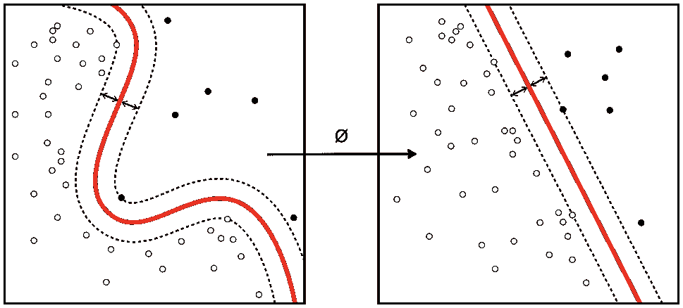

内核诡计[1]

您的神经网络不关心您的分类数据是否不能通过核进行线性分离，或者您的回归数据所遵循的趋势是否是过山车。只要你的数据集是从一个有限空间( *x* )到另一个有限空间( *y* )的连续映射，那么你就可以根据你的架构以任何精度近似这个映射。这是因为它们是通用近似器，正如 [**通用近似理论**](https://en.wikipedia.org/wiki/Universal_approximation_theorem) 所证明的。关键是，当神经网络在 40 年代首次出现时，没有快速的方法来利用神经网络的这一方面。直到 1970 年，**反向传播**——一种神经网络的快速训练算法以其现代形式发表。

在这个故事中，我们将花大部分时间从数学角度理解这种算法是如何工作的。

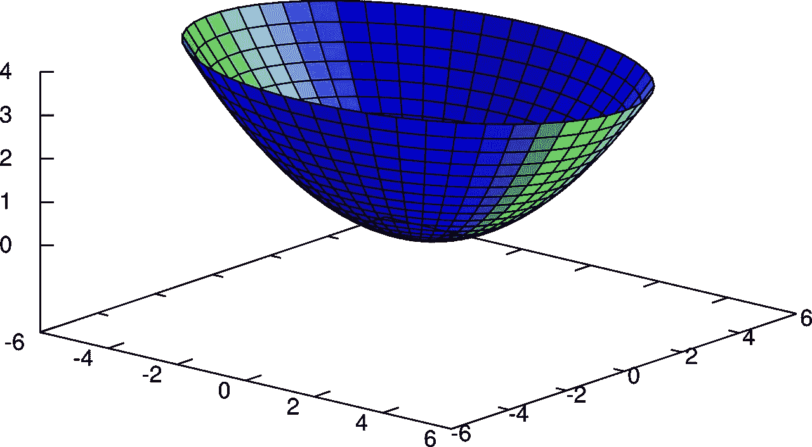

一个全局最小值的例子[2]

在我们深入研究它的证明之前。我想确定你知道两件事。首先，假设给定一个多变量函数***【x，y】***(例如上图所示的曲面)那么最小化 ***f(x，y)*** 就是找到**∂*f*/∂*x****和**∂*f*/∂*y****t22】*如果我们的多变量函数是数百万个变量(权重和偏差)中的某个成本函数，这同样适用。如果我们希望将其最小化，那么只需找到该函数相对于每个参数的偏导数，然后使用梯度下降迭代更新其参数，以最小化损失。
第二个我想让你注意的是**链条法则**。考虑 ***f(x)*** 与 ***x*** 为某变量中的函数 ***w*** *，* 然后去找**∂*f*/∂*w****我们写
**∂*f*/∂w*=(*∂*f*/∂*x*×*(*∂ **x* ₃)*** 与每个***xᵢ****是****w****中的一个函数通过为每个写它然后添加:
**∂*f*/∂w*=(*∂*f +(*∂*f*/∂*x*₂)×*(*∂*x*₂/∂*w)+(*∂*f*/∂*x*₃)×*(*∩*x********

****现在**我们的目标很明确，给我们一个数据集，一个任意的神经网络，一个成本函数 *J* ，我们需要找到 *J* 关于神经网络中每个参数(权重/偏差)的导数，反向传播允许我们这样做，一次一个观察值。这意味着如果我们的损失函数是**

****

**均方误差: **yᵢ** *为观测值****y(xᵢ)****为由于馈网用****【xᵢ】****。* ***d*** *是数据集的长度。***

**为了找到它对某个权重或偏差的导数，我们可以找到**

****

**对于每个单独的训练示例 ***(xᵢ、yᵢ)*** 然后将它们全部相加并除以 **d** 。就像我们在和中引入导数一样。向前看，上面的公式就是我们在写 ***J*** 时所暗指的。**

****

**艺术的例证[3]**

**现在，在我们开始证明之前剩下的是决定一个**符号**。**

**对于权重，设 ***w* ᴸₘₙ** 为从 ***(L-1)* ₜₕ** 层的 **mₜₕ** 神经元到 ***L* ₜₕ** 层的 **nₜₕ** 神经元的权重。例如，从输入层的第三个神经元到隐藏层的第二个神经元的权重将是 ***w* ⁰₃₂** 我们稍后会回头看，让第一个隐藏层的权重为 **L = 0** ，但现在请耐心听我说。**

**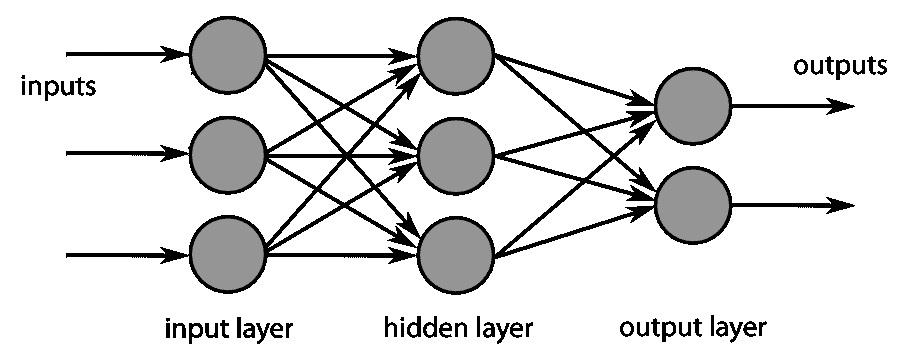**

**神经网络示例[4]**

**除了权重，我们还有神经元特有的激活和偏差。我们将通过 ***a* ᴸₘ** 来表示 **mₜₕ** 神经元在 ***L* ₜₕ** 层的激活，对于偏差我们将做 ***b* ᴸₘ** 。**

**注意，如果我们调用激活函数 ***h*** ，那么我们可以写**

****

**这准确地捕捉到了任意神经元内部发生的情况。激活后的线性组合。现在，如果我们称线性组合为 **z** 可能会对我们有好处，所以下面是真的**

****

**现在，我们要开始证明了吗？好吧，既然我们要实现这个(也许，在[的另一个故事](/implementing-backpropagation-with-style-in-python-da4c2f49adb4)中)，如果我们也讨论一下如何用向量/矩阵符号来写我们到目前为止所介绍的内容，那将会很有帮助。**

**对于神经网络中不是输入层的每一层，我们可以定义如下:**

****Wᴸ** :包含从 **(L-1)ₜₕ** 层到**层权重的权重矩阵。如果 **(L-1)ₜₕ** 层具有 **M** 个神经元，而 **Lₜₕ** 层具有 **N** 个神经元，则这具有维度 **M*N** 。正如你所想象的，元素**wᴸ[m,n】**就是我们之前定义的 ***w* ᴸₘₙ** 。****

******bᴸ** : 任何层的偏置向量都会有其每个神经元的偏置， **bᴸ[m] = bᴸₘ******

******aᴸ** : 任何层的激活向量将具有其每个神经元的激活， **aᴸ[m] = *a* ᴸₘ******

******zᴸ** : 任何层的预激活向量将具有其每个神经元的线性组合， **zᴸ[m] = zᴸₘ******

****使用这个新的符号，如果我们让函数 *h 被*应用于向量元素，那么我们可以写****

********

****请注意， **h** 应用于向量 **z** 中的每个元素。****

****请记住，由于我们的符号， **W** 中的每一列都代表 **Lₜₕ** 层中特定神经元的权重。这一事实以及矩阵乘法的工作原理应该能让你理解上面的公式。****

****还要注意，对于 **L = 0** (第一个隐藏层)，当且仅当我们用 ***x*** 代替激活时，上述关系成立。我们没有给输入层 **L = 0** 的唯一原因是，这将使 **Wᴸ** 、 **bᴸ** 等。对于 **L = 0** 未定义。我们不妨让最后一层有 **L = H** ，这样我们就可以很容易地在证明中突出它。这也使得 **H** 成为我们网络中的隐藏层数。****

********

****正在进行的证明的说明。[5]****

****让我们从找到 **∂J/∂ *w* ᴸₘₙ** 开始我们可以利用这样一个事实，即**t5】zᴸₙ**是**wᴸₘₙ**中的一个函数，通过使用链式法则，如下所示****

********

****通过将 ***z* ᴸₙ** 代入其定义，并考虑到 ***b* ᴸₙ** 不是 ***w* ᴸₘₙ** 中的函数，我们得到****

****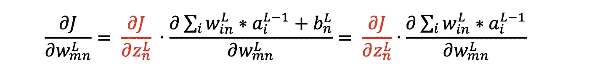****

****现在，因为在求和中唯一能经受住微分的权重是 i = m，我们可以写为****

********

****在我们证明的大部分时间里，我们会试图找到红色的术语；因此，给它一个名字是值得的。姑且称之为δᴸₙ吧。注意，每个神经元都有自己的 **δᴸₙ** 。对于整个图层，我们可以像写 bᴸ的**、 **aᴸ的**和 zᴸ的**一样写矢量 **δᴸ的**。********

**所以我们在索引符号中的结果变成了**

****

**在向量符号中**

****

**这直接来源于外积的定义和我们的指数符号结果。**

**现在让我们利用类似的事实来找到∂J/∂bᴸₙ，即 zᴸₙ是 bᴸₙ的一个函数**

****

**将 **zᴸₙ** 代入其定义，并考虑到总和*不是 **bᴸₙ** 中的*函数，我们得到**

**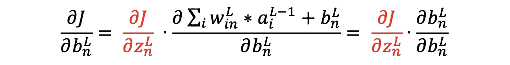**

**这意味着**

****

**或者用向量符号表示**

****

**所以证明的结论可以归结为找到 delta。还记得我们的成本函数是什么样的吗？**

****

*****【y(x)】***其实只是最后一层的激活，所以我们可以这样写**

****

**因为 ***J*** 在***【aᴴ***中明确是一个函数，这应该会诱使你利用链式法则并涉及**去寻找**【δᴴₙ**。****

****

**这样，我们就隐含地假设***【aᴴₙ】***只是该层中**【zᴴₙ】**的一个函数，这对于你遇到的大多数成本函数来说是正确的，但对于 **soft-max** 来说不是，因为任何 ***aₙ*** 都是该层中所有 **zₙ** 的函数。在这种情况下，我们需要用链式法则的多变量版本来考虑它们。但是我们下次再做吧。**

**这两个术语都很容易找到。第一次**

**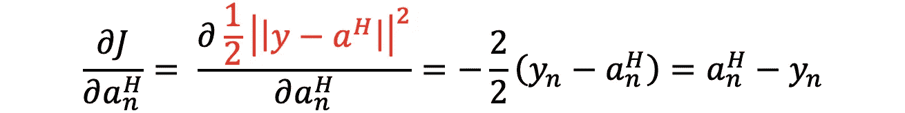**

**因为这适用于最后一层中的任何神经元，所以我们可以将向量形式写为**

****

**现在是第二学期，我们有**

****

**在矢量形式中，它只是简单的***h’(*z*ᴴ)****其中**h’**将按元素应用于矢量 **z *ᴴ*** *。****

**在索引符号中结合这两者产生**

****

**因为它在索引符号中的样子，如果我们用ⵙ来表示两个向量的元素乘积，那么我们可以通过写来实现向量符号中的公式**

****

**但是，当我们为网络中的任何神经元寻找**δ**(**δᴸₙ**)时，这只能说明最后一层。**

**因为我们知道最后一层的δ，所以使用它来找出其它层的δ的一种方法是找出当前层 L 的δ与下一层的δ的关系。让我们试试看。**

**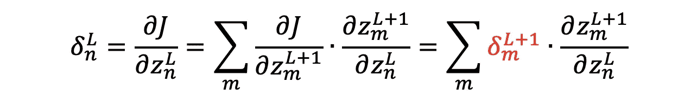**

**这里我们需要求和，因为下一层中的每一个 **zₘ** 都是**zₙ**(***h*(zₙ)**的函数，对吗？).
对于下一个术语，将 **z** 代入其定义，考虑到***a*ᴸ*ᵢ***只是 **zᴸₙ** 中的一个函数，当 **i = n** 时，我们可以写成:**

**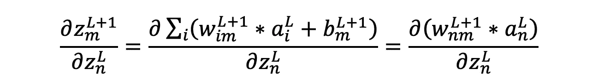**

**现在回想一下****aᴸₙ=h(*z*ᴸₙ)****我们可以写****

***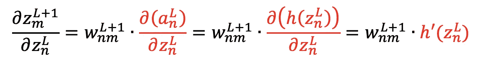***

***通过代入δᴸₙ，在索引符号中我们得到***

***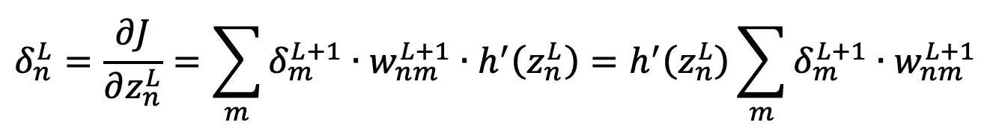***

***请注意，我们在 sum 中所做的相当于权重矩阵中对应于神经元的行与整个 delta 向量(列)之间的点积。如果我们将权重矩阵乘以增量向量，这正是幕后发生的情况，除了因为它发生在 W 中的所有行，所以我们得到一个考虑所有神经元数量的向量。因为对于每个我们简单地乘以 *h(* z *ᴸₙ)* 我们可以再次利用ⵙ作为元素式乘积，并写出:***

****

**深呼吸。证明到此结束。**

**为了编译我们用索引符号导出的所有方程，我们可以写**

**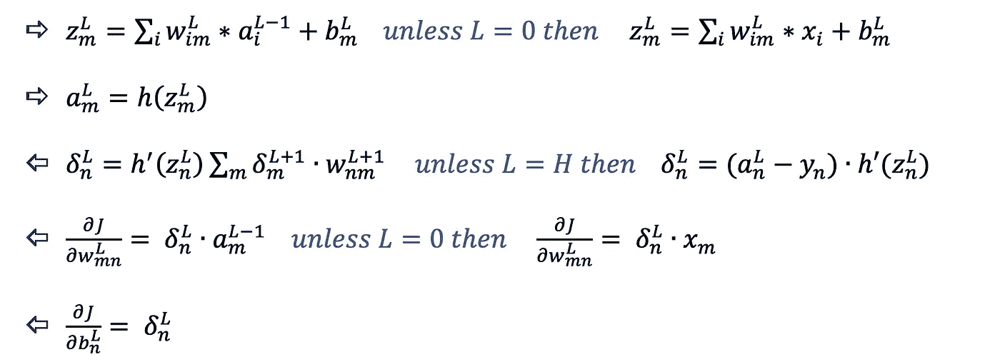**

**用向量符号表示(一层一层)**

**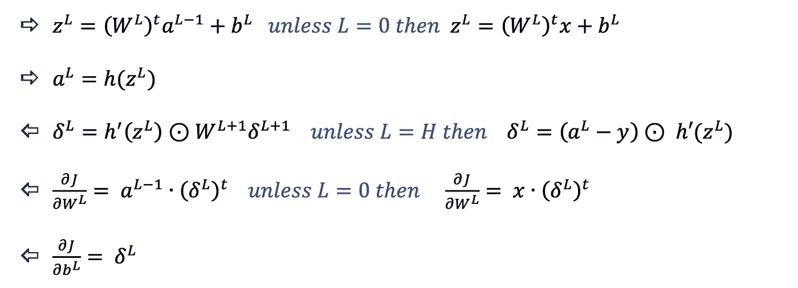**

**证明只帮助我们得出方程；算法就是雇佣他们的东西。**它** **一次考虑一个例子，如下所示:****

****1-** 找 ***aᴸ*** 和 **z *ᴸ*** 找层 **0** 到 **H** 通过把一个例子馈入网络。(用前两个方程。)这就是所谓的“向前传球”。**

****2-** 分别用 **δᴴ** 、 **δᴸ** 的公式计算 **H** 到 **0** 层的 **δᴸ** 。(用第三个等式。)**

****3-** 同时计算层 **H** 到 **0** 的 **∂J/∂Wᴸ** 和 **∂J/∂bᴸ** 因为一旦我们有了 **δᴸ** 我们就可以找到这两个。(用最后两个等式。)这就是所谓的“倒传”。**

****4-** 重复更多示例，直到网络的权重和偏差可以通过梯度下降进行更新(取决于您的批量):**

****

**假设 d 是数据集的长度。**

**正如你可能已经注意到的，步骤 2 和 3 是这个算法的名字；为了找到参数，我们必须反向传播。在下一个故事中，我们可能会考虑用 Python 来实现。**

**如果你喜欢阅读，并希望看到更多这样的故事，那么请考虑给帖子一些掌声，并跟我来。下次见，再见。**

****参考文献:****

**[1]“文件:内核 Machine.Png—维基共享”。*Commons.Wikimedia.Org*，2011，[https://commons.wikimedia.org/wiki/File:Kernel_Machine.png.](https://commons.wikimedia.org/wiki/File:Kernel_Machine.png.)**

**[2] Pixabay，2015，[https://pix abay . com/de/vectors/抛物面-mathematik-schale-fl % C3 % a4che-696804/。](https://pixabay.com/de/vectors/paraboloid-mathematik-schale-fl%c3%a4che-696804/.)于 2021 年 9 月 21 日访问。**

**[3]“文件:English.Png 多边网络——维基共享”。*Commons.Wikimedia.Org*，2010 年[https://commons . wikimedia . org/wiki/File:MultiLayerNeuralNetworkBigger _ English . png .](https://commons.wikimedia.org/wiki/File:MultiLayerNeuralNetworkBigger_english.png.)**

**[4]布特，威廉。“档案:美国旧金山旧金山现代艺术博物馆(Unsplash Rkjf2bmrljc)。Jpg —维基共享”。*Commons.Wikimedia.Org*，2017，[https://commons . wikimedia . org/wiki/File:San _ Francisco _ Museum _ of _ Modern _ Art，_San_Francisco，_ United States _(Unsplash _ rkjf 2 bmrljc). jpg .](https://commons.wikimedia.org/wiki/File:San_Francisco_Museum_of_Modern_Art,_San_Francisco,_United_States_(Unsplash_RkJF2BMrLJc).jpg.)**

**[5]“在白板上写字的女人”。 *Pexels* ，2021，[https://www . Pexels . com/photo/woman-writing-on-a-white board-3862130/。](https://www.pexels.com/photo/woman-writing-on-a-whiteboard-3862130/.)于 2021 年 9 月 21 日访问。**

****学习资源:****

**尼尔森迈克尔。*神经网络和深度学习*。2019，CHP。1,2.**