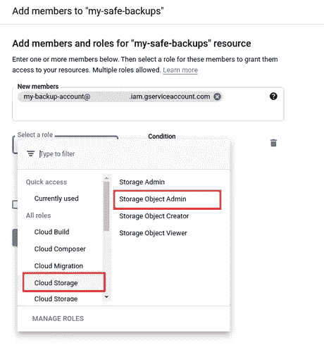

# 将数据库备份到 Google 云存储

> 原文：<https://towardsdatascience.com/backup-database-to-google-cloud-storage-5348a916f791?source=collection_archive---------19----------------------->

## 设置定期数据库备份到 Google 云存储的流程


由 [Kelvin Ang](https://unsplash.com/@kelvin1987?utm_source=medium&utm_medium=referral) 在 [Unsplash](https://unsplash.com?utm_source=medium&utm_medium=referral) 上拍摄的照片

我有几个托管在数字海洋服务器上的小网站。他们每个人都有一个 MySQL 数据库，我想定期设置上传完整的数据库导出到数字海洋之外的一些独立位置，以便更平静地睡觉。由于我的生活围绕着谷歌云，我对存储的偏好很明显。目标是使用 crontab 定期运行 bash 脚本来执行 MySQL 数据库导出和 **gsutil** 命令来将文件复制到云存储桶。要配置整个过程，需要几个步骤，我将在本文中进行描述。我与谷歌云项目的互动，我使用网络用户界面，虽然所有步骤都可以通过命令行界面完成。

## 1.为备份创建一个云存储桶

第一步是创建一个云存储桶，用于存储备份文件。在 Cloud Console 中，我们转到云存储部分，然后单击按钮 Create bucket。


有几件事需要设置。由于这是一个备份桶，我将存储类设置为 **Nearline** (而不是 Standard ),因为这是为不太频繁的访问而设计的，而且有点便宜(数据访问也要收费)。我还设置了一个**保留策略**，只保留最近 3 个月的对象。


## 2.创建服务帐户

因为这个操作是在服务器上完成的(在 Google Cloud 之外),所以我将使用一个服务帐户来认证和访问 Google Cloud 项目。


下一步是下载密钥文件。在服务帐户列表中，单击您创建的帐户。


切换到“密钥”选项卡，然后点击“添加密钥”，然后“创建新密钥”，文件将自动下载。


您的互联网浏览器将下载该文件。

最后一步是将这个文件复制到服务器，我使用的是 **scp** 命令:

```
scp service_account.json <myusername>@<SERVER>
```

## 3.设置服务帐户对存储桶的访问权限

由于脚本会将数据库导出文件上传到存储桶，因此我需要为备份存储桶的服务帐户设置正确的权限，目前该服务帐户不需要其他访问/角色。

要设置云存储桶的访问权限，请在云存储桶列表中，单击相关的桶名称。


然后切换到**权限**选项卡，点击**添加**按钮，添加对服务账户的访问权限。


在“新成员”字段中，我添加了服务帐户的完整电子邮件地址“my-backup-Account @ iam . gserviceaccount . com”

最小的角色是**存储对象管理员**(在云存储部分下)。注意:存储对象创建器是不够的，因为当使用 **gsutil** 命令时，它也对桶使用“列表”操作(出于某种原因)。



使用保存按钮保存设置。


将服务帐户添加到存储桶后，它会列在“成员”列表中。


在此过程中，仅授予此存储桶的访问权限，服务帐户将无法访问其他云存储存储桶。

## 3.在服务器上下载和安装 Google Cloud SDK

安装 Google Cloud SDK 有几种方法。一种方法是直接将其作为操作系统包安装。我使用的方法包括从源文件安装。

谷歌云 SDK 的安装就是基于这些步骤【https://cloud.google.com/sdk/docs/install#linux 。为简洁起见:

```
curl -O [https://dl.google.com/dl/cloudsdk/channels/rapid/downloads/google-cloud-sdk-337.0.0-linux-x86_64.tar.gz](https://dl.google.com/dl/cloudsdk/channels/rapid/downloads/google-cloud-sdk-337.0.0-linux-x86_64.tar.gz)

tar -zxvf google-cloud-sdk-337.0.0-linux-x86_64.tar.gz

./google-cloud-sdk/install.sh
```

根据您如何配置其他东西，我需要做这个额外的步骤:

作为我的服务器上的默认版本，Python 2.7 已设置，Google Cloud SDK 对此有问题，所以我使用 [pyenv](https://github.com/pyenv/pyenv) 来支持多个 Python 版本。为了将 Google Cloud SDK 指向我想要的 Python 版本，我将 bash_profile 中的环境变量 CLOUDSDK_PYTHON 设置为指向 pyenv 的 Python3 解释器。

```
export CLOUDSDK_PYTHON=/home/ubuntu/.pyenv/shims/python3
```

## 4.使用服务帐户对 Cloud SDK 进行身份验证。

为了使用我创建并下载的服务帐户对 gcloud 进行身份验证，我使用了以下命令

```
gcloud auth activate-service-account my-backup-account@iam.gserviceaccount.com --key-file=/<PATH TO KEY>/service_account.json
```

如果一切正常，它将打印以下消息:

```
Activated service account credentials for: [my-backup-account@iam.gserviceaccount.com]
```

现在我们可以使用像 **gcloud** 和 **gsutil** 这样的云 SDK 工具与 Google Cloud 项目进行沟通。

## 5.Bash 脚本

脚本 backup.sh 包括将数据库转储到一个临时文件夹，然后从该文件夹上传到云存储桶:

```
#!/bin/bash

DUMP_FOLDER="/tmp"
GCS_BUCKET="my-safe-backups"

DT=$(date "+%Y%m%d")

function backup() {
  database=$1
  filename="${database}_${DT}.sql"
  output_file="${DUMP_FOLDER}/${filename}"
  echo $output_file
  mysqldump "$database" >"$output_file"
  if test -f "$output_file"; then
    gsutil cp "$output_file" "gs://${GCS_BUCKET}/${database}/${filename}"
    echo "${database} dump uploaded"
    rm "${output_file}"
  else
    echo "No dump file ${output_file}"
  fi
}

backup mydb_1
backup mydb_2
```

DUMP_FOLDER 是将导出数据库的本地路径，GCS_BUCKET 是在第一步中创建的云存储存储桶的名称。

因为我有多个数据库，所以我为每个数据库创建一个备份，调用 backup 函数，将数据库名作为输入参数。

## 6.设置 cron

我已经将备份脚本设置为每周执行一次。

```
10 0 * * 1 /home/ubuntu/bin/backup.sh
```

## 结论

由于大多数数据库都有自己的导出命令，因此也可以很容易地进行编辑以用于备份。