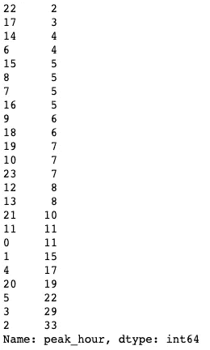
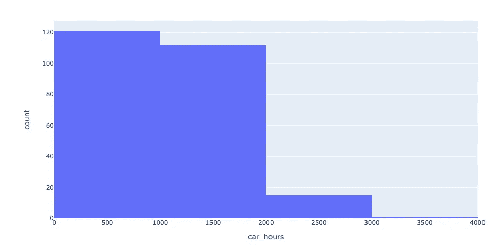
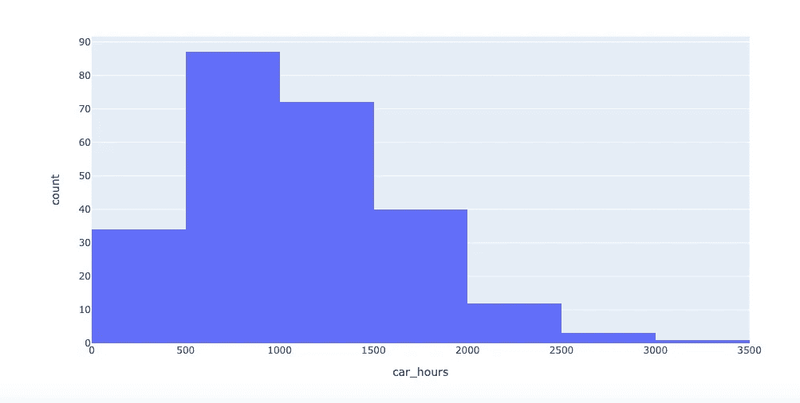
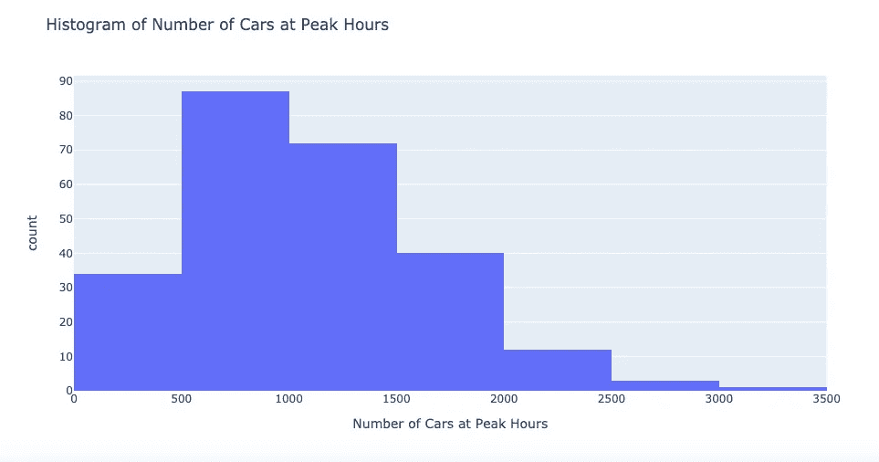
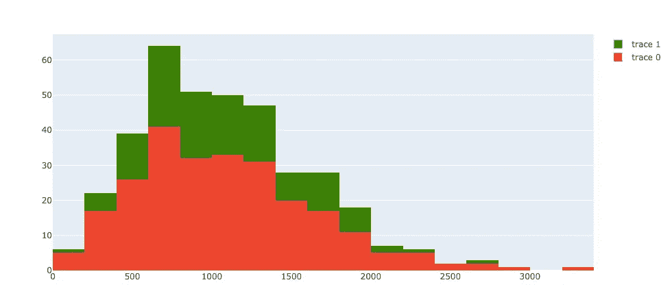
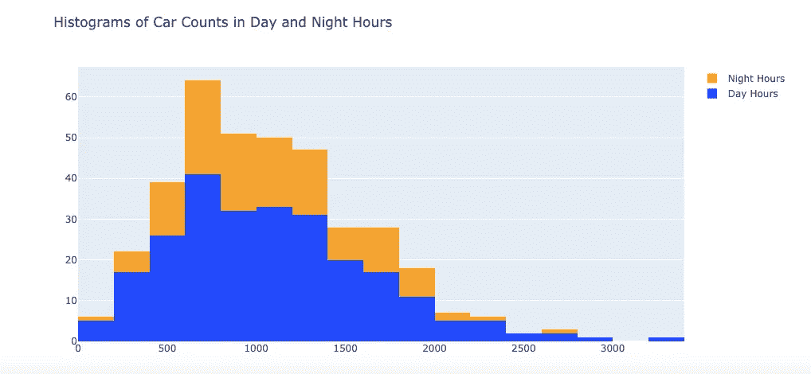
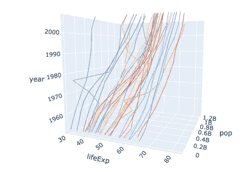

# 糟糕的数据可视化以及如何修复它们

> 原文：<https://towardsdatascience.com/bad-data-visualizations-and-how-to-fix-them-432444213c01?source=collection_archive---------25----------------------->

## 使用数据可视化原理来修复误导和无信息的图表

[Firmbee.com](https://unsplash.com/@firmbee?utm_source=medium&utm_medium=referral)在 [Unsplash](https://unsplash.com?utm_source=medium&utm_medium=referral) 上拍照

构建数据可视化:数据科学周期中的一个阶段，在此阶段，您在理解和清理数据集之后，可以展示您的发现。我相信你一定想知道以图形方式显示数据的最佳方式是什么，以及你所做的不同选择，无论是颜色、标题、标签还是单位，会如何影响观众对你的结果的感知。那么，视觉化是好是坏呢？

直观地说，一个好的可视化应该清晰准确地传达关于其内容的信息。虽然这看起来似乎是一个足够简单的任务，但使用大量工具来构建图表，很容易陷入制作不必要的复杂图表的困境，这些图表要么难以理解，要么可以在更简洁的图表中得到更好的简化。因此，在考虑向观众传达数据时，设计和内容似乎都是最重要的。

让我们考虑一个不满足好的可视化标准的可视化的例子。首先，让我们从导入 Plotly 开始，这是我们获取内置数据集的首选包，并打开 carshare 数据集:

乍一看，似乎有一个纬度和经度列，其中也包含单词“质心”，所以我可能认为它们代表某种多边形的中心。该数据还有一个名为 peak_hour 的列，这似乎是高峰汽车份额可用性的 24 小时格式的小时，还有一个 car_hours 列，这不是立即可以理解的。在 Plotly 文档中，我们被告知这与蒙特利尔一个月内的汽车可用性有关，因此这可能是一个月内每个高峰小时汽车数量的平均值。现在，我们想进一步探索数据，但在此之前，让我们先看看数据是否需要清理。

小时数据有没有 0 到 23 以外的奇怪数值？

不，不是的。car_hours 栏呢？它是否有低于 0 等不可能的值？

我们得到的是一个空的系列。因此，看起来数据状态良好，我们可以继续对其进行可视化处理。

## 示例 1:直方图

该数据集中的一个关键变量是 car_hours，我们假设它表示某个位置高峰时段的汽车共享车辆数。由于这是一个数字变量，我们可以使用直方图来可视化它，为了显示您在构建图表时做出的选择有多重要，让我们设置一个非常低的 bin 计数。

从这个直方图中我们能注意到什么？首先，它是向左倾斜的:在 1000 年和 2000 年似乎有更多的峰值汽车数量，而不是大于 2000 年。也有极少数地点的高峰车流量超过 3000 辆。我们如何知道这是否是有益的，或者我们的箱子应该有多大？我们现在的图表是否违反了我们任何好的图表设计原则？可以说，是的:如果我们考虑到我们正在比较不同车辆计数的频率这一事实，一个非常小的箱大小并不能帮助我们推断这些计数在高峰时间是如何分布的。

幸运的是，我们可以使用斯特奇规则，这是一个很好的确定 bin 大小的经验法则: **K = 1 + 3。322 logN，**其中 K 是容器大小，N 是我们拥有的观察值或数值的数量。在这种情况下，对于 N = 249(如在 249 个峰值汽车计数观察中)，K = 8.9 或大约 9。那么，让我们来看看实际情况。

现在直方图更加精确了，我们可以看到数据中更具体的趋势。例如，看起来最常见的值是每个区域 500 到 1000 辆车(高峰时段)，直方图是左偏的，但现在更清楚不同的计数如何细分为箱。

那么，我们能进一步改进这个图表吗？嗯，使用像 Plotly 这样的 Python 可视化包，我们可以控制图表的许多属性，比如颜色、标签和标题。当前的标签是否为查看者提供了足够的信息来清楚地理解图表所显示的内容？可能不会，因为我们已经确定 car_hours 标签有点模糊。因此，让我们修复它们，并添加一个描述性标题:

## 2.覆盖直方图

接下来，让我们想象一下 car_hours 在白天和晚上的分布情况。在这个图表中，我将从早上 5 点到晚上 8 点定义为白天，晚上 8 点到凌晨 4 点定义为晚上。下面是进行过滤和显示直方图的代码:

我在这里故意犯了一个错误。你能说出这是什么吗？这是为重叠直方图选择的颜色:红色和绿色。红色和绿色色盲是最常见的色盲类型，您在设计图表时必须记住，它们需要让您的所有观众都可以访问，这通常意味着要考虑可视化组件的设计，而不仅仅是它所呈现的内容。还有一个方法:在图例中添加正确的标签和合适的标题。所以让我们解决所有这些问题。

我们注意到什么有趣的趋势了吗？首先，这两个直方图似乎在它们覆盖的 x 值上有相似的分布。其次，两个直方图的大量数据似乎都集中在 500 到 1500 的范围内，这有点令人惊讶，因为我们会认为与白天相比，晚上的汽车共享服务可用性会更低。

## 3.互动和额外元素

要为图表添加额外的功能，您有许多选项可供选择。一个例子是为你的数据添加工具提示，当你将鼠标悬停在某个点上时，工具提示会显示该点的值。这在检查异常值时很有用，例如上面直方图中 3000 个区间，因为它们提供了对这些数据点的额外洞察。当您创建直方图时，Plotly 会自动创建这些工具提示，并帮助您的图表获得全面的信息。

那你怎么知道什么时候添加额外的元素，比如工具提示呢？您是否冒着使可视化过于复杂的风险，或者元素本身对于赋予图形意义是不可或缺的？对于最后一个例子，让我们来看看来自 Plotly 内置数据集的亚洲国家预期寿命数据的 3D 图表。

以上是结果。它看起来确实非常吸引人，比以前的视觉化效果更现代。但是，问题是:这个第三维度给数据增加了任何信息吗？这个图表可以被分成两个更容易理解的 2D 吗？我想是的。在我看来，如果我们只看每一对，就更容易看出年和预期寿命或年和人口之间的关系。虽然我们注意到这些年来预期寿命有明显的上升趋势，但很难准确确定国家之间的差异或人口增长如何影响预期寿命。总的来说，我认为这个图表很难解释，所以你应该把它分成两三个线图。

既然我们已经看到了一些如何提高我们的可视化的例子，那么主要的收获是什么呢？首先，考虑图表的设计:它的颜色和标签，同时记住，你要让你的图表尽可能简单直接，便于观众理解。接下来，你可能要抵制诱惑，不要选择看起来更复杂的图表，而要选择更简单、更容易显示变量之间关系的图表。

感谢你的阅读，我希望你喜欢这个故事！