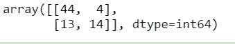
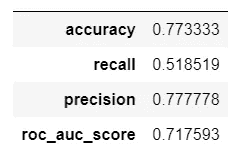
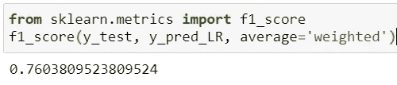

# 令人困惑的真阳性和真阴性概念

> 原文：<https://towardsdatascience.com/baffling-concept-of-true-positive-and-true-negative-bffbc340f107?source=collection_archive---------7----------------------->

## 了解 TP/TN 和 FP/FN

Michael Dziedzic 在 Unsplash 上拍摄的照片

在机器学习和统计学中，我们经常使用术语“真正”和“真负”,但人们仍然会感到困惑，因此他们的矩阵被称为混淆矩阵。现在的问题是什么是真和假，什么是正和负。我们可以读定义，可以更迷惑。所以，用简单的话来说，我们会明白的。

**什么是积极和消极？**

正面和负面无非就是两类，比如幸存/未幸存，癌症/未癌症，信用卡诈骗/未诈骗，垃圾邮件/未垃圾邮件等。它不仅在两个发生/没有发生之间，而且还可以分为猫/狗、雄性/雌性。因此，我们认为一类是积极的，另一类是消极的。这是任意的，或者取决于研究的目的，你认为一个是积极的，另一个是消极的。这里面没有好的(积极的)或坏的(消极的)方面。

**什么是真假？**

当有来自某个群体的样本数据时，我们使用建模来预测它的类别/标签。“真”表示模型能够识别其类的记录，而“假”表示模型不能识别的记录。

**混乱矩阵**

混淆矩阵是表示分类问题预测结果汇总的表格。我们可以在下面看到一个混淆矩阵。预测值和实际值的位置改变了假阴性(FN)和假阳性(FP)的位置，但是真阳性(TP)和真阴性(TN)保持在矩阵中彼此对角放置的相同位置。但正因为如此，情况变得扑朔迷离。

作者图片

简单的例子来更好地理解这个概念。在这个例子中，有两类水果。我们有 9 个苹果和 10 个草莓，但是模型只正确识别了 6 个苹果(真阳性)和 8 个草莓(真阴性)，此外，模型预测 2 个草莓是苹果(假阳性)，3 个苹果(假阴性)是草莓。在另一个例子中，怀孕/未怀孕是两个类。有 8 名妇女怀孕，8 名妇女未怀孕，该模型正确地将 6 名怀孕(真阳性)和 5 名未怀孕(真阴性)的妇女分类，但将 3 名未怀孕(假阳性)的妇女分类为怀孕，将 2 名怀孕(假阴性)的妇女分类为未怀孕。

作者图片

通过下面的 GIF，你可以更清楚地理解这个概念。

作者图片

**绩效评估措施**

从混淆矩阵中，我们还可以计算模型的准确率、精确召回率和 F1 值。这些度量有助于理解模型的性能。从公式中，我们可以计算这些措施，并计算我们可以使用混淆矩阵。公式在下面的矩阵中给出。这里 NPV 是负的预测值。如上所述，随着实际值和预测值的位置改变，度量的位置也改变。

***用更简单的术语定义:***

*准确性:*准确性是模型正确分类的记录占记录总数的比率。例如，如果有 10 个红色球和 10 个紫色球，其中 8 个红色球和 7 个紫色球你识别正确，那么你的准确度是 8+7/20=0.75，因此，准确度是 75%。

*Precision:* Precision 是模型正确识别的阳性记录与全部阳性记录的比率。例如，如果有 10 个红色球和 10 个紫色球，人们必须识别哪些是红色球，并且出于任何原因，您将 8 个红色球和 2 个紫色球识别为“红色球”，那么您的精度是 8/10，即 80%。

*敏感性:*检测正确识别真阳性的能力(患有疾病的人和模型如此识别)。

*特异性:*检测正确识别真阴性的能力(没有患病的人和模型如此识别)。

*F1 得分:*F1 得分是精度和召回率/灵敏度的加权平均值，最佳得分为 1，最差得分为 0。公式如下。

作者图片

作者图片

**Python 代码**

我们可以构建这些混淆矩阵，甚至使用 Python 轻松计算这些度量。所用数据取自 UCI 库存“[https://archive . ics . UCI . edu/ml/datasets/Heart+failure+clinical+records](https://archive.ics.uci.edu/ml/datasets/Heart+failure+clinical+records)”。代码如下:

Sklearn.metrics 提供了不同的选项来制作混淆矩阵，首先只是为了显示数字，一个选项是混淆矩阵，它给出的矩阵如下。

作者图片

而且，为了绘制混淆矩阵，sklearn.metrics 有两个选项，即 ConfusionMatrixDisplay 和 plot_confusion_matrix。通常使用 plot_confusion_matrix，因为只有在选项 normalize 为“真”时，才可以获得归一化混淆矩阵图。

作者图片

我们也可以使用 python Seaborn 的热图来制作如下的混淆矩阵，“不能”选项保持 false 会删除矩阵中的数字。

作者图片

下面是获得准确度、召回率、F1 得分、精确度、roc auc 得分(根据预测得分计算受试者操作特征曲线下面积(ROC AUC))的代码。

作者图片

作者图片

虽然有一些简单的选择来创建混淆矩阵和计算评估措施，但我们最好理解这些概念和公式，以便我们能够理解和解释这些分析。

感谢阅读！

参考资料:

[https://sci kit-learn . org/stable/modules/classes . html # module-sk learn . metrics](https://scikit-learn.org/stable/modules/classes.html#module-sklearn.metrics)