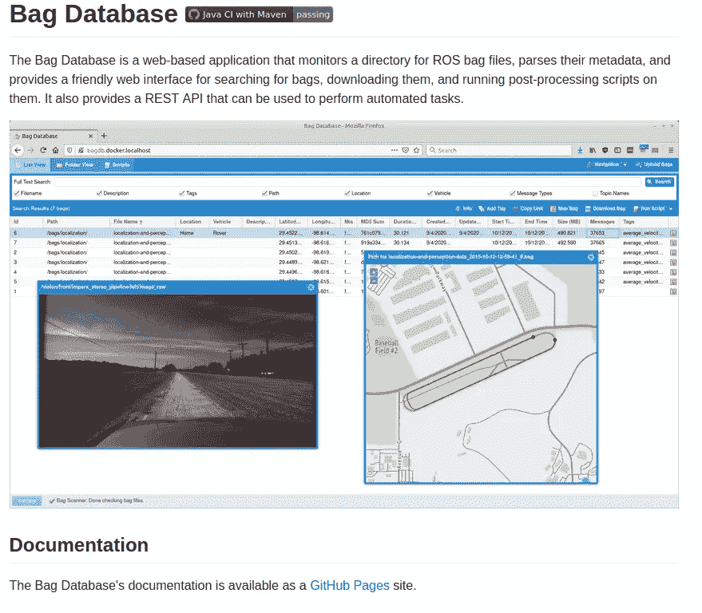
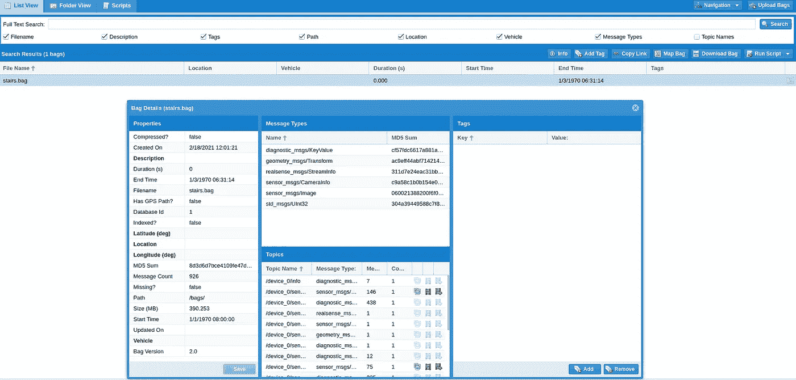
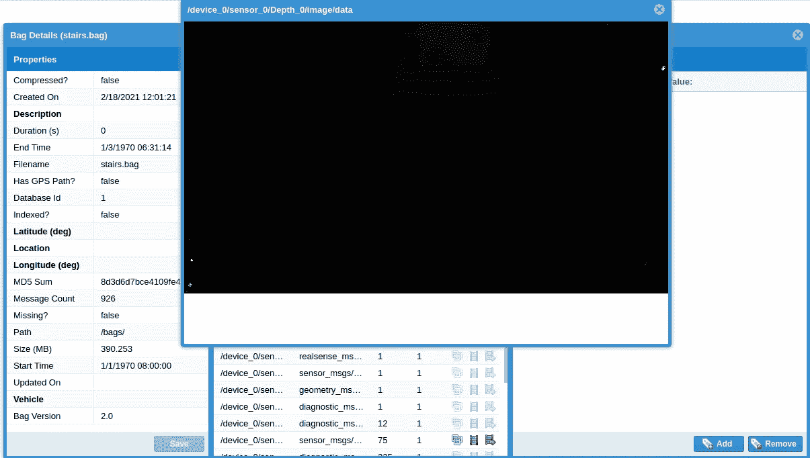
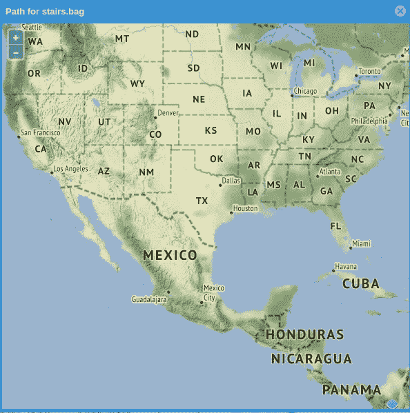

# 利用 Bag 数据库进行 bag 文件管理

> 原文：<https://towardsdatascience.com/bag-file-management-using-bag-database-44d774d54df3?source=collection_archive---------31----------------------->

## 一个来自 [swri 机器人](https://github.com/swri-robotics/bag-database)的开源项目。

照片由[尼古拉斯·佩罗尔](https://unsplash.com/@mrfargey?utm_source=unsplash&utm_medium=referral&utm_content=creditCopyText)在 [Unsplash](https://unsplash.com/s/photos/auto-car?utm_source=unsplash&utm_medium=referral&utm_content=creditCopyText) 拍摄

如今，自动驾驶汽车越来越普遍。像特斯拉这样的大公司正在让无人驾驶汽车成为现实。为了收集数据以便 auto car 可以在现实世界中学习和适应，我们需要处理大量的包文件。

> *包*是 ROS 中用于存储 ROS [消息](http://wiki.ros.org/Messages)数据的文件格式。包——如此命名是因为它们。包扩展——在 ROS 中有着重要的作用，并且已经编写了各种工具来允许您存储、处理、分析和可视化它们。

示例 ROS 包文件可以从[http://real sense-HW-public . S3 . amazonaws . com/RS-tests/test data/stairs . bag](http://realsense-hw-public.s3.amazonaws.com/rs-tests/TestData/stairs.bag)中获得。

箱包数据库管理

最简单的开始方式是从 docker-compose 触发箱包数据库，无需认证。在您的目录中创建 docker-compose.yml 文件:

**注意:**在 docker-compose 之前，您需要创建/var/local/bags 和/var/lib/docker/volumes/bag-database _[scripts，indexes，postgres]。

运行后

`docker-compose up`

我们将看到 bag-database 正在端口 8080 上运行

我们可以观看录像

或者直接看地图

希望有帮助。

开心编码~

# 参考

 [## 未经认证

### 如果你在一个内部网络上，并且你信任可以访问服务器的用户，那么设置一个包的最简单的方法是…

swri-robotics.github.io](https://swri-robotics.github.io/bag-database/installation/docker/without-authentication)  [## swri-机器人/箱包-数据库

### Bag 数据库是一个基于 web 的应用程序，它监视 ROS bag 文件的目录，解析它们的元数据，并…

github.com](https://github.com/swri-robotics/bag-database)