# 包装决策树——解释清楚

> 原文：<https://towardsdatascience.com/bagging-decision-trees-clearly-explained-57d4d19ed2d3?source=collection_archive---------10----------------------->

## 整体技术-装袋

照片由[皮查拜](https://www.pexels.com/@pixabay?utm_content=attributionCopyText&utm_medium=referral&utm_source=pexels)从[派克斯](https://www.pexels.com/photo/scenic-view-of-rice-paddy-247599/?utm_content=attributionCopyText&utm_medium=referral&utm_source=pexels)拍摄

# 决策树

决策树是监督机器学习算法，用于分类和回归任务。

在本文中，我介绍了以下概念。

*   如何建立决策树？用什么标准来分割决策树？
*   如何克服决策树中的过度拟合？
*   什么是装袋？包装决策树是如何工作的？

决策树是一种树状模型，可用于预测目标变量的类别/值。决策树有效地处理非线性数据。

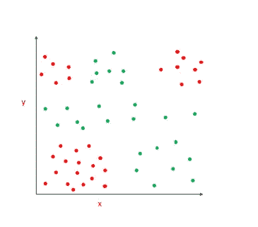

作者图片

假设我们有难以线性分类的数据点，决策树提供了一种简单的方法来确定决策边界。

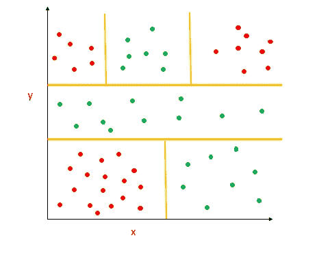

作者图片

它通过递归分割整个区域来实现。让我们看看分裂是如何进行的。

# 节点类型

1.  根节点—决策树中最顶端的节点称为根节点。
2.  内部节点—进一步分裂的子节点称为内部节点。
3.  叶节点—不会进一步拆分的节点称为叶节点

# 如何在决策树中进行拆分？

在决策树中，在每个节点，基于特征进行分割。如果特征是连续变量，则在某个阈值上形成分裂条件。【比如年龄> 50】。如果特征是分类变量，则对所有值进行分割。【例如。性别=男性】。
选择杂质减少更多的分流。

用于计算最佳分割的标准是

1.  分类误差
2.  熵
3.  基尼指数

# 分类误差

## **如何计算分类误差？**

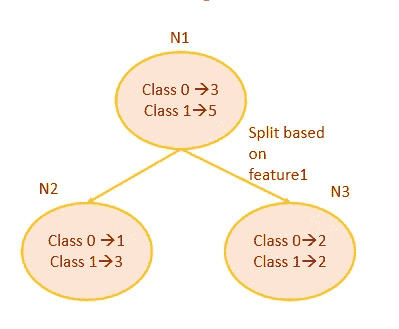

根据拆分条件，节点 N1 被拆分为 N2 和 N3[图片由作者提供]

**步骤 1:计算节点 N1 处的分类误差【分割前】**

P[类 0]= 3/8
P[类 1]=5/8

1- max[p(c)]=1-[3/8，5/8]= 1–5/8 = 3/8

`classification error before split =3/8`

**步骤 2:计算节点 N2 的分类误差**

P[0 级]= 1/4
P[1 级]=3/4

1- max[p(c)]=1-[1/4，3/4]= 1–3/4 = 1/4

***第三步。在节点 N3*** 计算分类误差

P[0 级] = 2/4
P[1 级]= 2/4

1- max[p(c)]=1-[2/4，2/4]= 1–2/4 = 2/8

***第四步。子节点的平均分类误差。***

节点 n2 中数据点的比例= 4/8
*【8 个数据点中有 4 个在节点 N2】*

节点 n3 中数据点的比例= 4/8
*【8 个数据点中有 4 个在节点 n3】*

加权分类误差= 4/8 * 1/4 + 4/8 * 2/4 = 3/8

`classification error after split =3/8`

**5。分类错误变更:**

分割前的分类误差= 3/8
分割后的分类误差= 3/8

分类误差变化= 3/8–3/8 = 0

`Classification error for the above split is 0`

分割是基于每个特征进行的。对于每个特征，计算分类误差的变化，选择产生最大*分类误差变化*的特征进行分割。

但有时，分类误差变化将为零。[在上面的例子中，分类误差变化为零]。所以，这不是首选。*基尼指数和熵优于分类误差。*

# 熵

熵用于度量决策树中节点的同质性。如果节点是同质的，熵是 0。熵指的是杂质。

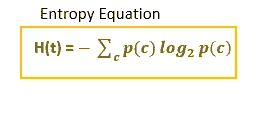

熵公式

**熵的范围从 0 到 1【针对 2 类问题】**

1.  如果节点是同质的，并且所有数据点都属于类 0 p[class=1]=0。熵将为 0。[纯节点-无杂质]
2.  如果节点是同质的，并且所有数据点都属于类 1，p[class=1]=1。熵将为 0。[纯节点]
3.  如果节点包含相同数量的属于类 0 和类 1 的数据点，则 p[c=1]=0.5。熵将是 1。

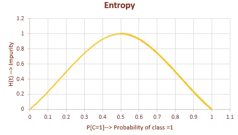

# 信息增益

熵(杂质)的减少被称为信息增益。如果特定拆分的信息增益更大，则首先执行该拆分条件。

`Information gain= Entropy before split — Entropy after split`

## **为上述决策树计算熵。**

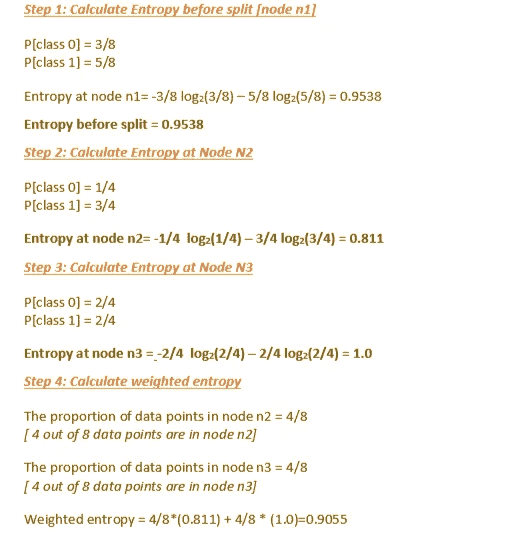

计算分裂前后的熵[图片由作者提供]

## 计算信息增益。

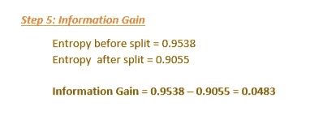

分割是基于所有特征完成的。对于每个特征，计算信息增益，并选择给出更多信息增益[杂质减少更多]的特征用于第一次分离。

# 基尼指数

基尼指数是衡量杂质的另一个标准。

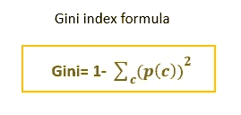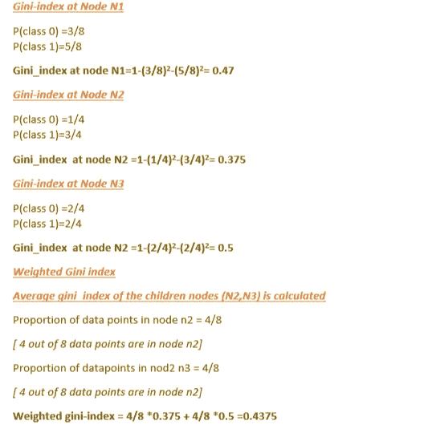

**基尼指数下降**

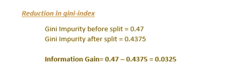

> 基尼系数的范围从 0 到 0.5。
> 熵的范围从 0 到 1。

# 决策树中的问题

决策树往往会过度拟合。它将继续增长，直到所有的叶节点都是纯的。所有叶节点都是同质的[属于一个类]。这将产生一个精确符合训练数据的树。所以，它不会很好地概括，也不会在测试数据中表现良好。

# 如何克服决策树中的过拟合？

为了防止过度拟合，应该有一些停止标准。

避免过度拟合的两种方法。

1.  截断或预修剪→有许多超参数来截断树。这是一种自上而下的方法。
2.  让树完全长大，然后修剪。这是一种自下而上的方法。

## **预剪枝→决策树停止准则—决策超参数**

1.  **最大深度** →树被允许生长到提到的最大深度。
2.  **min_samples_split** →拆分决策节点所需的最小样本数。[决策节点是具有进一步拆分的节点]。如果决策节点的样本数少于 min_samples_split 中提到的样本数，则不会进一步分割。
3.  **min_samples_leaf** →一个叶节点所需的最小样本数。
4.  **max_features** →进行分割时要考虑的特征数量。

通过调整这些参数，它可以防止树过度拟合。

## **后期修剪→减少错误修剪**

这是一种自下而上的方法。一棵树完全长大后，再修剪。

训练数据分为训练集和验证集。迭代地修剪节点，并在确认集和训练集中检查修剪树的性能。如果验证集中被修剪的树的准确度大于训练集的平均值，则该节点被修剪。修剪意味着删除以该节点为根的子树。

# 为什么要用装袋？

决策树是高方差模型。这意味着训练数据的微小变化，将导致完全不同的模型。决策树通常会过拟合。为了克服这种情况，可以使用集成技术——bagging。

# 什么是装袋？

Bagging 表示**自举聚合。** Bagging 是指利用样本子集建立不同的模型，然后聚合不同模型的预测值以减少方差。

# 装袋如何减少差异？

假设我们有一组' **n'** 的独立观测值，比如说 **Z1，Z2…Zn** 。个体观察的方差为 **σ2** 。

所有数据点的平均值将为( **Z1+Z2+…)。+Zn)/n** 类似地，该平均值的方差将是 **σ2/n.**

因此，如果我们增加数据点的数量，均值的方差就会减小。这就是装袋决策树背后的概念。

同样，如果我们在给定的数据集上训练多个决策树，然后聚合预测。方差将会减小。

# 引导样本

装袋分两步

1.  拔靴带
2.  聚合

## 拔靴带

我们已经知道，如果我们对一组观察值进行平均，方差将会减少。但是我们只有一个训练集，我们必须建立多个决策树。

引导有助于从训练数据中创建多个子集。然后，我们可以在自举样本上构建多个树。

Bootstrapping 将从训练集中随机选择重复的数据点，并创建多个子集-替换采样。

如果在训练集中有**‘n’**个数据点，

在 bootstrap 样本中选择特定数据点的概率= **1/n**

bootstrap 样本中特定数据点未被选择的概率=
**1-1/n**

所以，自举样本中每个点未被选中的概率=
**(1–1/n)^n**

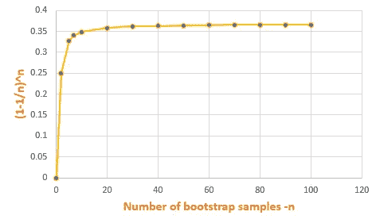

引导样本中未选择的数据点的百分比-按作者分类的图像

这种方法也被称为 **0.632 自举**。表示 bootstrap 样本中每个数据点被选中的概率=63.2%。

每个引导样本将包含原始训练数据的 **63.25%** 。剩余的数据点将是重复的。
每个引导样本将不包含 **36.8%** 的训练数据。这用作从该样本构建的模型的测试数据。

# 汇总输出

现在，我们有了不同的引导样本，并为每个引导样本构建了' **B'** 决策树。下一步是汇总输出。

**套袋分类树**

对于测试集中的每个数据点，通过' **B'** 树来预测输出类。基于多数表决机制，计算最终类。

另一种方法是从“B”树中获得类的概率，并且根据概率的平均值对最终的类进行分类。

**装袋回归树**

对于回归→对于测试集中的每个数据点，从“B”回归树的所有预测的平均值计算目标值。

> Bagging 是引导聚集

通过从训练数据集创建引导样本，然后在引导样本上构建树，然后聚合所有树的输出并预测输出，来完成决策树的打包。

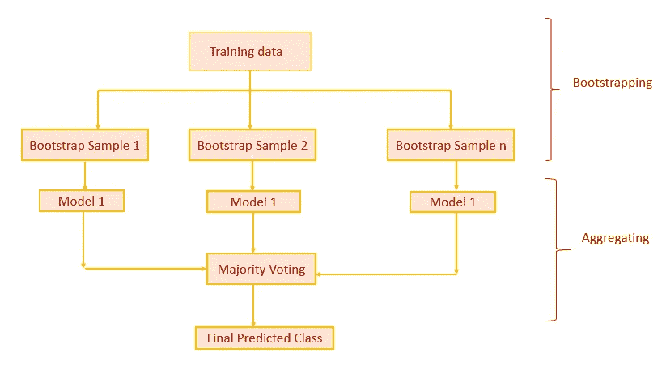

bagging[图片由作者提供]

# 如何计算装袋误差？

我们知道，在每个 bootstrap 样本中，大约有三分之一的数据点被遗漏(36.8%)。来自训练集的大约只有三分之二的原始数据点被包括在引导样本中(63.2%)

因此，对于基于自举样本构建的每棵树，误差是根据该特定自举样本的未使用样本计算的。测量所有误差的平均值。这就是所谓的**出 BagError。**

# 如何计算特征重要性？

通过使用基尼指数/熵来计算特征重要性。

在为每个引导样本构建树时，基于信息增益在节点中进行分裂。我们将查看所有树中该特征的信息增益。然后在所有树中平均该特征的信息增益。

# 袋装决策树的优势

1.  模型的方差减小。
2.  可以同时训练多个树。

# 包装决策树的问题。

如果一个特征是最强的预测值，并且它对目标变量均值有更大的影响，则基于不同引导样本构建的所有树将首先基于该最强的预测值进行分割。因此，在不同引导样本上训练的所有树将是相关的。所以，它不会减少模型的方差。

为了克服这种情况，使用了随机森林。同样在随机森林中，我们将训练多棵树。但是数据点和特征都是随机选择的。通过这样做，树不相关，这将改善方差。

# 结论

决策树使用像基尼指数/熵这样的分裂标准来分裂节点。决策树往往会过度拟合。为了克服过度拟合，使用预修剪或后修剪方法。装袋决策树也被用来防止过度拟合。

我希望这篇文章对你有所帮助。感谢阅读！

# 进一步阅读:

 [## 理解机器学习中的决策树

### 决策树背后的数学以及如何使用 Python 和 sklearn 实现它们

better 编程. pub](https://betterprogramming.pub/understanding-decision-trees-in-machine-learning-86d750e0a38f) 

*如果你喜欢看我的更多教程，就关注我的* [***中***](https://medium.com/@IndhumathyChelliah) ，[***LinkedIn***](https://www.linkedin.com/in/indhumathy-chelliah/)***，***[***Twitter***](https://twitter.com/IndhuChelliah)***。***

*点击这里成为中等会员:*[*https://indhumathychelliah.medium.com/membership*](https://indhumathychelliah.medium.com/membership)