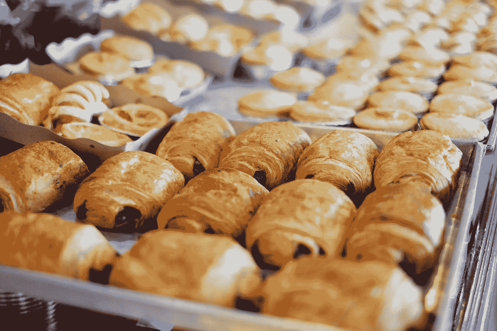

# 烘焙扫描和细胞扫描

> 原文：<https://towardsdatascience.com/bakeryscan-and-cyto-aiscan-52475b3cb779?source=collection_archive---------18----------------------->

## 人工智能识别面包的意外结果

最近有人问我这个问题:“你为什么决定学数据科学？”我首先想到的是一些事件，比如在我以前的安全工作的停工期自学 Python，编写 Python 脚本来输入并在飞行地图上显示公司旅行者的数据，或者只是我在报告我的工作大楼里哪些门最常使用时获得了多少乐趣。然而，我越想越意识到，这些都是促使我决定学习数据科学的因素，而不是主要原因。主要原因来自一个故事，自从我第一次听到这个故事，它就一直萦绕着我。

## 大脑有限公司

2007 年，日本科技公司 Brain Co. Ltd .向大公司出售软件取得了一定的成功。例如， [TEX-SIM](http://corp.bb-brain.co.jp/archives/package/tex-sim) 是他们开发的用于设计纺织品图像的用户界面工具。他们还帮助开发了在个人电脑上显示汉字的软件，甚至制作了设计桥梁的软件。当地一家面包店找到了这些才华横溢的软件工程师，他们希望解决一个问题，Brain 公司对此一无所知，但他们对这个问题的解决方案将会定义他们，并将产生比他们计划的更大的影响。

## 日本的糕点问题

T2 的面包店以拥有种类繁多的新鲜出炉的糕点而自豪。一些面包店每天早上会制作数百种不同种类的糕点给 T4。在面包店进行的分析研究发现，售出的糕点总量与售出的不同种类的糕点总量直接相关。一家提供 100 种糕点的面包店的销售额是提供 30 种糕点的两倍。该研究还发现，顾客更喜欢没有包装的糕点，并且喜欢放在敞开的篮子里，如下图所示。

照片由[水貂在](https://unsplash.com/@minkmingle?utm_source=medium&utm_medium=referral) [Unsplash](https://unsplash.com?utm_source=medium&utm_medium=referral) 上混合而成

当面包店根据分析研究实施这些变革时，一个新的、不可预见的问题出现了。因为糕点根本不需要包装，所以没有办法在上面贴上条形码。顾客会把糕点交给收银员，收银员必须识别糕点，并正确记住它的价格。其中一些面包店有数百种不同价格的独特糕点，所以这开始给收银员带来明显的压力。培训新员工意味着教他们如何正确识别所有糕点并记住它们的价格。面包店老板开始注意到培训新店员需要几周的时间，即使训练有素的店员也要花相当多的时间才能正确识别顾客的物品。因此，当地一家面包店找到 Brain Co .询问他们是否有更好的解决方案。

# 贝克斯坎和大脑试验公司。

大脑公司面临着一个难以置信的任务。该团队无法获得神经网络所需的大量数据，因此他们必须想出另一种解决方案。除了这个难题之外，2008 年的金融危机发生在项目开始一年之后。Brain Co .发现他们所有的其他商业机会都已经枯竭，公司的生存突然取决于这个项目的成功。大脑公司的团队将他们的一切投入到这个项目中，这个项目将成为 BakeryScan AI。《纽约客》的詹姆斯·萨默斯描述了该团队如何开发解决方案:

> 计算机视觉领域的最新技术包括将一系列算法拼凑在一起，每一种算法负责一项特定的任务。假设你想建立一个行人识别系统。你首先要有一个算法来调整你图像的亮度和颜色，这样你就不会被某人的红色衬衫所困扰。接下来，你可以添加识别感兴趣区域的算法，也许是通过注意人行横道的斑马图案。只有这样，你才能开始分析图像“特征”——梯度和对比度的模式，可以帮助你挑出某人肩膀的独特曲线，或躯干和腿形成的“A”。在每一个阶段，你都可以从数十种甚至数百种算法中进行选择，并选择组合它们的方式。

使用这种“算法管道”导致了许多问题，这些问题都记录在团队的开发文档中。问题很多——例如，他们发现房间的照明会显著影响面包店扫描的准确性。他们发现，当两个糕点靠得很近时，面包店会有麻烦，必须开发一种方法来辨别这种情况何时发生。当糕点被撕开或损坏时，也会发生同样的情况。有时他们会遇到一些问题，比如一个甜甜圈投在甜甜圈孔上的阴影会阻止面包店正确识别商品。他们以首席执行官 Hisashi Kambe 所描述的“疯狂”的专注持续解决这些问题。有一次，该团队在两年的时间里开发了 10 个原型。最后，在 2013 年:

Brain 公司 5 年的努力得到了回报。他们开发了一种人工智能，可以以令人难以置信的准确度识别 50 多种不同的糕点。BakeryScan 通过摄像头识别糕点，然后向店员显示其名称和价格，只需几秒钟。BakeryScan 大受欢迎，每台售价 20，000 美元，现已在日本 400 多家商店使用。

## 贝克斯坎的遗产

这个故事本身是鼓舞人心的；一个软件开发团队，他们的生计岌岌可危，他们将所有的一切投入到一个看似不可能的任务中，并取得了成功。然而，故事并没有到此结束。

2017 年，一名在京都路易·巴斯德医学研究中心工作的医生看到了一则面包店的广告。经过一番思考，他有了一个非常有趣的认识。他认为被人工智能扫描的面包店食品与他一直在研究的癌细胞有着惊人的相似性。因此，他决定联系 Brain Co .看看他们是否有兴趣进行测试，看看 BakeryScan 是否能够在显微镜下检测癌细胞。

# 细胞扫描

贝克斯坎能够在显微镜下以 98%的准确率识别出癌细胞**。起初，它一次只能观察一个细胞。经过一些修改和测试，人工智能能够在显微镜下观察整个细胞切片，并突出显示哪些细胞是癌变的，准确率再次达到 98%的**。在治疗癌症时，癌症发现得越早，存活率就会大大提高。使用人工智能极大地提高了实验室技术人员整理样本和检测癌细胞存在的速度。Brain Co .给改造后的 BakerScan 起了一个新名字:“Cyto-AiSCAN”，目前正在日本神户和京都的两家大医院接受医生的使用和培训。****

****当我听到这个故事时，我立即想到他们一定已经显著改变了贝克斯坎检测癌细胞的操作方式。《纽约客》的记者詹姆斯·萨默斯也有同样的想法。他向 Brain Co .的首席执行官 Hisashi Kambe 提出了同样的问题。****

> ****我问 Kambe 它是如何工作的——它使用深度学习吗？“原路，”他说。然后，带着灿烂的笑容，“和面包一样。”****

****不，和面包一样。****

# ****一个人创造的东西的影响****

****我经常想，在 2008 年开发 BakeryScan 的团队是否曾想过他们的人工智能会发展成这样。尽管我很怀疑是否有人能预见到这个结果。一名医生意识到糕点在显微镜下看起来几乎像癌细胞，于是心血来潮联系了该公司！这一事件导致这个人工智能从识别糕点到协助医生拯救生命。我想回到 2008 年，Brain Co .团队在开发 BakeryScan 时经历了一些非常令人沮丧的日子。我希望在那些日子里，有人能回到过去，让他们看看他们的小 AI 会变成什么样子。****

****这是我最喜欢的故事之一，因为它不仅仅是一个故事。这是一个艰难、胜利和奉献的故事。谁能想到面包扫描仪能拯救无数生命？我几乎可以保证他们没有。他们对这个项目的奉献和热情把他们带到了一个目的地，在他们到达之前，他们甚至不知道这个目的地的存在。****

****这个故事是我想学习数据科学的主要原因。也许它不会是用深度学习训练一个人工智能，或者创建一个神经网络，但我确实希望我能有幸创造一些有影响力的东西；一些超出我预期的东西。一些让我感到自豪和充满激情的事情。数据科学领域是我最擅长做类似事情的地方。我希望 Brain Co .团队为自己感到骄傲，知道即使他们的小 AI 不会被永远使用，他们创造的影响也会在未来很长一段时间内被记住。****

****参考****

****"设计用来区分糕点类型的人工智能识别癌细胞的准确率达到 99% . "Express Digest ，Express Digest . com/ai-designed-to-discriminate-types-of-pastes-identified-cancer-cells-with-99-accuracy/。****

****"人工智能糕点扫描仪正在与癌症作斗争."*正在与癌症作斗争的人工智能糕点扫描仪——CES 2022*，2018 年 5 月 20 日，[www . CES . tech/Articles/2021/May/The-AI-Pastry-Scanner-That-Is-Now-Fighting-Cancer . aspx .](http://www.ces.tech/Articles/2021/May/The-AI-Pastry-Scanner-That-Is-Now-Fighting-Cancer.aspx.)****

****“bakery scan-瞬间识别所有糕点！-." *YouTube* ，YouTube，2020 年 12 月 24 日，[www.youtube.com/watch?v=vTwxKXokVB8.](http://www.youtube.com/watch?v=vTwxKXokVB8.)****

****詹姆斯·萨默斯。“学会抗癌的糕点人工智能”《纽约客》，2021 年 3 月 18 日，[www . New Yorker . com/tech/annals-of-technology/The-pastry-ai-that-learn-to-fight-cancer。](http://www.newyorker.com/tech/annals-of-technology/the-pastry-ai-that-learned-to-fight-cancer.)****