# 平衡行为:不平衡数据的分类

> 原文：<https://towardsdatascience.com/balancing-act-classification-with-imbalanced-data-cea06df39781?source=collection_archive---------13----------------------->

## 帮助您的数据找到平衡点，以确保创建质量分类模型

Niklas Ohlrogge 在 [Unsplash](https://unsplash.com/s/photos/balance?utm_source=unsplash&utm_medium=referral&utm_content=creditCopyText) 上拍摄的照片

瑜伽、放松、感恩日记:所有这些都可能帮助你找到平静与和谐。但是你的数据集也需要你的帮助来达到一个理想的平衡——而且，就像人类的自我保健一样，如果我们不花时间去寻找平衡，事情可能会出错。

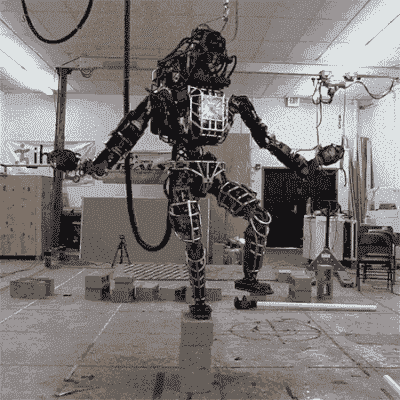

*图片 via* [*GIPHY*](https://media.giphy.com/media/Q1LPV0vs7oKqc/giphy-downsized.gif)

了解您的训练数据在您想要预测的类中的分布并做出相应的调整是创建质量分类模型的关键步骤。当您试图预测一些不经常发生的事情时，例如很少发生的欺诈性交易或不寻常的设备故障，不平衡的数据集尤其容易发生。然而，不管您的特定领域是什么，您总是想要评估目标类的分布。

深吸一口气，让我们来探索如何和为什么与不平衡的数据集进行斗争。这里我们将关注*二元*分类，这里有两种可能的目标变量结果。我们将在 Alteryx Designer、Alteryx 机器学习和 Python 中使用一些工具来简化这个过程。

# 用 EDA 解放你的思想

这可能已经是您数据分析例行程序的一部分，但是彻底的探索性数据分析(EDA)对于成功的模型构建是至关重要的。特别是，为了我们的目的，你要密切注意你的结果变量的分布。无论您是尝试构建二元分类模型(只有两个类)还是多类分类模型(有两个以上的选项)，如果您的数据非常均匀地分布在各个类中，那么前进的道路是最简单的。

当然，事情很少会如此顺利。让我们以来自 Kaggle 的[信用卡欺诈检测数据集](https://www.kaggle.com/mlg-ulb/creditcardfraud)为例来看看。我为这个演示创建了一个较小版本的数据集，有 57，355 行，每行代表一个事务。不过，我保留了欺诈/非欺诈交易之间的不平衡，其中只有 492 笔交易被标记为欺诈。

在 Alteryx Designer 中，使用[基本数据分析工具](https://help.alteryx.com/20213/designer/basic-data-profile-tool)和[频率表工具](https://help.alteryx.com/20213/designer/frequency-table-tool)以及其他选项，很容易快速了解变量的分布。后者生成如下图所示的直方图，使数据集中的不平衡非常明显。

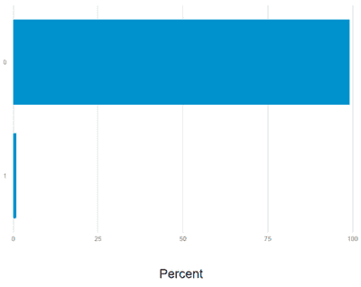

*“类别”字段中 0 和 1 标签的直方图，其中 1 代表相对较少的欺诈交易。图片作者。*

# 失去平衡

如果你反复随机选择这个数据集中的一行，然后问我这是不是一次欺诈交易，如果我只是一遍又一遍地说“不是”，我就很有可能是对的。类似地，如果你简单地根据这些不平衡的数据训练一个模型，并且只看你的模型的准确性，看起来你有一个令人惊讶的模型。您可以在本文中阅读更多关于为分类模型[选择正确指标的信息；现在，请记住，对于不平衡的数据来说，准确性本身确实会产生误导。](https://community.alteryx.com/t5/Data-Science/Metric-Matters-Part-1-Evaluating-Classification-Models/ba-p/719190?utm_content=841878&utm_source=tds)

*图像通过* [*GIPHY*](https://media.giphy.com/media/cIo1NeFPtGd2obXG2P/giphy-downsized.gif)

举个简单的例子，让我们把我的迷你数据集分成 70%用于训练，30%用于验证。我可以天真地构建一个随机的森林模型，不调整目标类之间的平衡。(您可以通过打开 Alteryx 社区上原始帖子的[附带的 Alteryx 包来跟进。)一开始我可能会印象深刻:哇，模型只错分了 40149 个观测值中的 70 个！但是让我们仔细看看:](https://community.alteryx.com/t5/Data-Science/Balancing-Act-Classification-with-Imbalanced-Data/ba-p/841878?utm_content=841878&utm_source=tds)

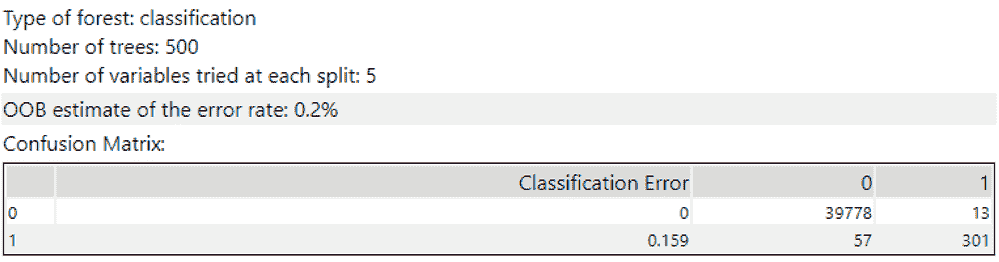

图片作者。

不幸的是，正如你所看到的，这个模型在预测非欺诈交易方面做得很好——但是，对不起，是信用卡账户持有人；它在检测欺诈的实际工作中表现不佳。是时候做些调整以获得更好的结果了！

# 关于抽样的思考

谢天谢地，我们有一些平衡数据集的方法来避免这种情况。让我们探索一些选项，从最简单到最复杂排列(但是仍然非常容易管理！).

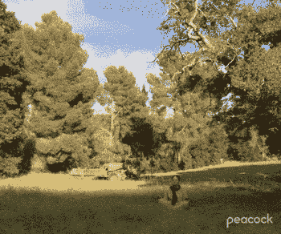

*图片经由* [*GIPHY*](https://media.giphy.com/media/zhRA0okWxTGiu78uSk/giphy-downsized.gif)

## *Alteryx 机器学习*

如果你是第一批使用 [Alteryx 机器学习](https://www.alteryx.com/products/alteryx-machine-learning?utm_content=community)的用户之一，你会很幸运——尤其是当你正在与不平衡的数据进行斗争的时候。Alteryx 机器学习将自动检查类标签的分布(例如，0/1、真/假等。)在您的数据集中。然后，它会根据数据集的大小应用适当的过采样或欠采样，以适应它发现的任何不平衡。例如，它可以应用过采样技术 SMOTE，我们稍后会讨论这一点。

在最初的“Auto Insight”数据探索阶段，Alteryx 机器学习生成了一个易于下载的图，如下图所示，显示了目标变量的类标签分布。

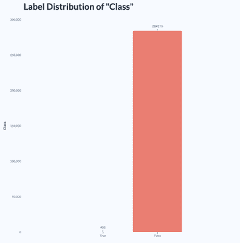

*Alteryx 机器学习的目标变量标签分布柱状图。图片作者。*

在这种情况下，如下图右侧所示，Alteryx 机器学习决定从我的不平衡数据集中的多数类(非欺诈性交易)中进行欠采样，然后构建一系列模型，以查看哪个表现最好。(Alteryx 机器学习速度如此之快，以至于我可以使用完整的数据集来代替样本。)

在这里，我选择了平衡精度作为评估模型的度量，随机森林分类器在比较中脱颖而出。当对维持数据进行评估时，该模型在过程的下一步中表现更好，平衡精度为 91%。

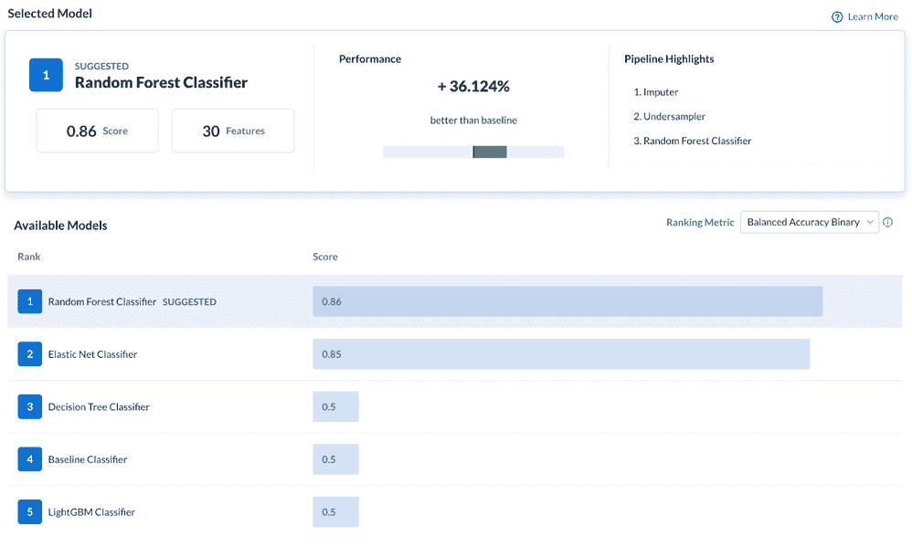

图片作者。

## *Alteryx 智能套件*

使用 Designer 中的智能套件，您有几个选项。首先，您可以使用 AutoML 工具来自动构建和评估模型，这些模型优先考虑您选择的度量标准。在该工具的高级参数选项中，您可以选择一个更适合不平衡数据集的[指标](https://community.alteryx.com/t5/Data-Science/Metric-Matters-Part-1-Evaluating-Classification-Models/ba-p/719190?utm_content=841878&utm_source=tds)，或者尝试多个选项以查看它们的比较情况。例如，您可以告诉工具在评估各种模型时优先考虑平衡的准确性或日志损失。

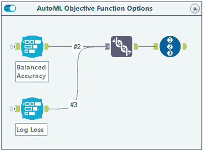

*使用两种不同的适合不平衡数据的目标函数选项设置 AutoML。图片作者。*

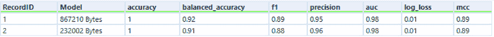

*来自两个自动生成模型的结果。图片作者。*

在这里，辅助建模也是一个选项，但是您需要仔细查看模型排行榜，以了解各种指标的情况。同样，准确度不是唯一要考虑的指标，所以一定要检查每个型号的平衡准确度和 F1 分数，并确保您对您选择的型号在各个班级的表现感到满意。

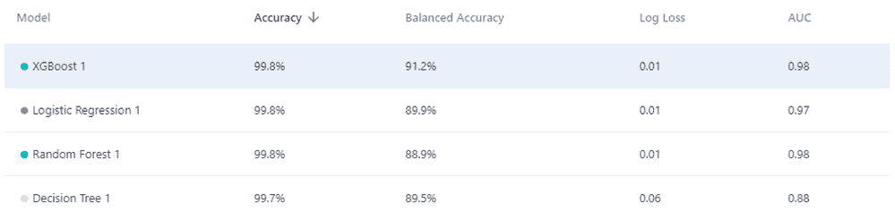

*这些数据的辅助建模分类模型的结果。图片作者。*

## *过采样现场工具*

[过采样现场工具](https://help.alteryx.com/20213/designer/oversample-field-tool)包含在 Designer 中，非常容易使用，尽管它的名字有点混乱；它真正欠采样你的多数类，而不是过采样你的少数类。只需将它放入您的工作流中，告诉它您希望它调整哪个变量，该变量的“正”类是什么(例如，在本例中，“1”表示“欺诈性的”)，以及您希望数据集中的类比例是多少。本质上，这个工具将随机删除足够多的“负面”案例，以达到这些比例。

但是，根据数据集的大小和正类的相对出现频率，最终可能会留下非常少的记录，因此，您没有多少信息来构建模型。例如，如果您有 1000 条记录，其中只有 100 条表示正类，并且您要求工具为您实现 50/50 的平衡，那么您最终将只有 200 条记录来构建您的模型。对于您的特定建模需求来说，这可能不太理想。

## *简单过采样*

另一种平衡方法是根据目标变量的值对训练数据进行分层，然后从较小的“少数”类中随机抽样替换。目标是在训练数据集中过多地呈现这些观察结果。然而，这种[“幼稚”的采样方法](https://machinelearningmastery.com/random-oversampling-and-undersampling-for-imbalanced-classification/)会产生重复的数据，并可能导致您的模型从这些数据点学到太多东西，从而可能导致过度拟合。

幸运的是，聪明的机器学习研究人员已经开发出更复杂的方法来实现平衡。

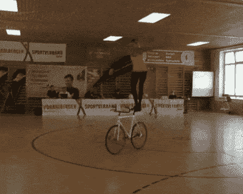

*图像通过* [*GIPHY*](https://media.giphy.com/media/7PKa9lH51xLLW/giphy-downsized.gif)

## *介绍 SMOTE*

另一种平衡数据的方法是 SMOTE，代表合成少数过采样技术。SMOTE 是一种广泛使用的处理类不平衡的技术。基本上，这种方法会为您弥补一些数据，但这是一种好的方式。“合成”部分是指生成与少数类中的数据相似的额外数据的过程，这些额外数据可以添加到数据集中以平衡这些类。

SMOTE 的工作方式是选择一个表示少数类的观测值，查找其最近邻点(您可以指定数量)，并使用所选观测值和邻点之间的关系来生成少数类的新示例。

## *SMOTE 家族宏*

应用 SMOTE 的一种方法是使用 SMOTE 家族宏，它是由 Alteryx 社区成员[@ Timothy](https://community.alteryx.com/t5/user/viewprofilepage/user-id/26394)创建的，包含在本文所附的 Alteryx 包中。这个基于 R 的宏使用了 [smotefamily](https://cran.r-project.org/web/packages/smotefamily/smotefamily.pdf) 包，其中包含了各种实现基于 SMOTE 技术的方法。

例如，在所附的工作流中，通过 SMOTE 系列宏传递数据并使用常规 SMOTE 选项，实现了更好的平衡:39，791 个非欺诈性交易和 39，738 个“欺诈性”交易。后者中，只有 492 个在我的原始数据中，而其余的都是合成的。

接下来，让我们重新看看我之前尝试的随机森林模型，但是现在使用的是后 SMOTE 数据集。我的模型现在可以从更多的例子中了解欺诈交易(即使其中大多数是合成的)，因此，它可以更好地对数据进行分类:

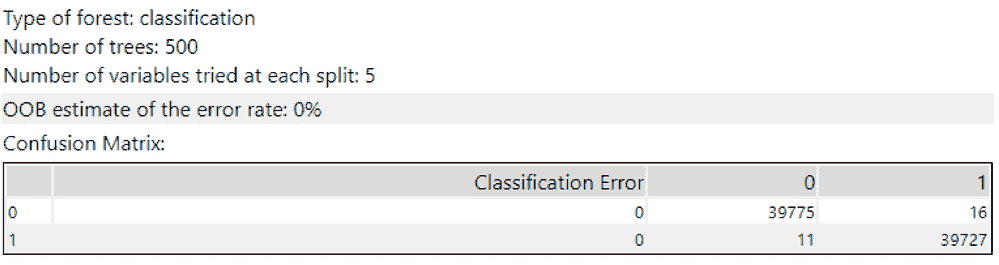

*通过 SMOTE 系列宏处理的数据构建的模型的性能。图片作者。*

后 SMOTE 模型并不完美，但它只对 27 个交易进行了错误分类，并且它的准确性在两个类别中大致相同，而不是在一个类别中比另一个类别中犯更多的错误。

除了宏中提供的配置选项之外，请记住，您还可以打开宏并根据自己的需要修改它的代码。[本文](https://community.alteryx.com/t5/Alteryx-Designer-Knowledge-Base/A-Cheat-Sheet-of-Functions-to-Use-in-the-R-Tool/ta-p/178979?utm_content=841878&utm_source=tds)提供了在 Designer 中使用 R 的一些细节。

*图像通过* [*GIPHY*](https://media.giphy.com/media/yHKOzZnHZyjkY/giphy-downsized.gif)

## *Python 中的 SMOTE*

最后，如果您最喜欢 Python 解决方案，您可以使用[不平衡学习](https://imbalanced-learn.org/stable/index.html)库来实现各种采样方法，这些方法可以解决您的数据不平衡，包括 SMOTE。在工作流中使用这种方法只需要 Python 工具中的几行代码，正如您在附带的演示中所看到的。然而，这种方法提供了大量的定制选项。

您将需要安装该软件包，因为它不包含在设计器中；这意味着您需要以管理员身份运行 Designer。这一步完成后，您只需将数据集分为预测变量和目标变量，使用 SMOTE 或您从库的[选项](https://imbalanced-learn.org/stable/user_guide.html)中选择的方法进行重新采样，然后重新组装数据集。然后，您可以从 Python 工具中写出更加平衡的、部分合成的数据，以便在工作流中以您喜欢的方式进一步使用。

我正是这样做的，然后再次使用森林模型工具来构建一个随机的森林模型。结果看起来很像基于上述 SMOTE 系列宏数据构建的模型的结果:

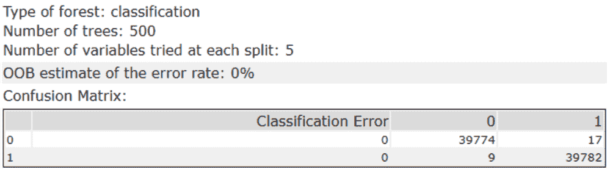

*通过 SMOTE 处理数据建立的模型的性能，通过 Python 工具中的不平衡学习实现。图片作者。*

这里，总体准确性更好，并且模型的错误在两个类之间平均分布，而不是在原始数据中较少表示的“少数”类上表现不佳。

让我们将所有三个模型——简单模型和两个 SMOTE 'd 模型——都放入模型比较工具中，以便进行整体观察:

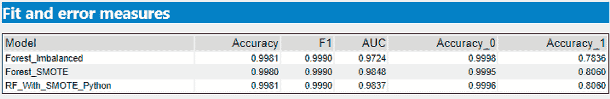

*模型比较工具对三种模型性能的报告。图片作者。*

从上表的比较报告中可以看出，所有三种型号的总体*准确率都超过了 99%。然而，建立在不平衡数据上的朴素模型对欺诈交易的性能较低。这两个建立在更平衡数据基础上的模型表现都稍好。如果我们使用 Kaggle 上提供的完整数据集，有近 300，000 个事务，我们可能会获得更好的性能。此外，如果像检测欺诈这样的潜在成本很高的事情，即使是很小的性能改进也可能在财务上非常有意义。*

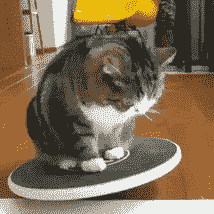

*图像通过* [*GIPHY*](https://media.giphy.com/media/myDXHnYYPxT4od4NEN/giphy-downsized.gif)

# 找到完美的平衡

现在，您拥有了新的工具，可以在数据和生活中找到平衡！好吧，至少在数据上是这样，尽管更好的模型可能也会给你带来快乐。请务必查看下面推荐的阅读链接，了解解决这一重要问题的更多信息和选项。

## **推荐阅读**

*   [SMOTE:合成少数过采样技术](https://arxiv.org/abs/1106.1813)(原始研究论文)
*   [用 Python 攻击不平衡分类](https://machinelearningmastery.com/smote-oversampling-for-imbalanced-classification/)
*   [不平衡分类项目的分步框架](https://machinelearningmastery.com/framework-for-imbalanced-classification-projects/)
*   [使用不平衡学习库的例子](https://imbalanced-learn.org/stable/auto_examples/index.html)
*   另一种策略:[如何处理不平衡的分类，无需重新平衡数据](https://www.kdnuggets.com/2021/09/imbalanced-classification-without-re-balancing-data.html)

*原载于* [*Alteryx 社区数据科学博客*](https://community.alteryx.com/t5/Data-Science/Balancing-Act-Classification-with-Imbalanced-Data/ba-p/841878?utm_content=841878&utm_source=tds) *。*