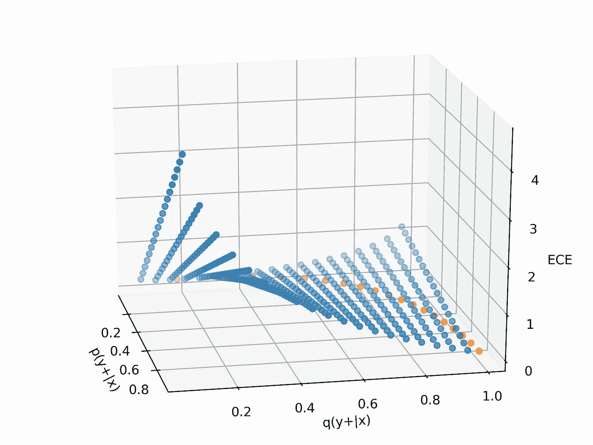

# 平衡就是不平衡

> 原文：<https://towardsdatascience.com/balancing-is-unbalancing-5f517936f626?source=collection_archive---------33----------------------->

## [入门](https://towardsdatascience.com/tagged/getting-started)，机器学习

## 不平衡分类背后的理论

由[阿马尔·埃拉米尔](https://unsplash.com/@ammarelamir?utm_source=medium&utm_medium=referral)在 [Unsplash](https://unsplash.com?utm_source=medium&utm_medium=referral) 上拍摄的照片

不平衡分类是一个监督的最大似然问题，其中类别分布非常不均匀(例如，5%正的和 95%负的)，并且通常，对具有少数类别标签的数据的决策是重要的，是正确的。在这种情况下，训练更具挑战性，因为使用普通方法，模型越来越偏向于估计具有多数标签的类(多数类)，而大多数时候，我们关心的是正确估计少数类。开发了不同的技术来克服这一挑战，例如重采样或加权；都试图以某种方式创建一个平衡的数据集，然后使用共同的方法。虽然这些技术在应用中是有益的，但它们对我来说都是启发性的，我无法找到该问题的精确数学定义。所以我决定思考到底会发生什么，这份文件是我对不平衡数据挑战的理解。

# 判别模型是如何工作的？

监督概率机器学习的主要关注点是使用条件似然最大化来估计具有参数分布的*p(y | x)**q(y | x，θ)* ，这可以通过采用交叉熵损失函数(又名 log-loss)来完成。此外，最小化交叉熵损失函数等价于最小化真实条件分布和估计条件分布之间的 *KL* 散度:

在这个等式中， *H(Y|X)* 是常数，所以为了最小化期望的 *KL* 散度，我们应该最小化第二项，它等于对数损失。为了最小化对数损失，首先，我们需要来自 *p(x，y)* 的样本来估计期望值，然后，我们可以解决一个优化问题，找到 *q(y|x，θ)* 作为对 *p(y|x)的估计。*

但是如果我们只有来自 *p'(x，y) = p(x|y) p'(y)* 的样本而不是 *p(x，y)* 其中 *p'(y)* 是不同于 *p(y)* 的经验边际分布呢？我们可以将对数损失改写如下，并使用样本重量:

它表明，要学习 *p(y|x)* 我们需要将样本权重设置为*p(y)/p’(y)*，如果经验边际分布与真实边际分布相同，则等于 1。因此，如果 *p(y+)=5%* ，但是数据集是平衡的并且 *p'(y+)=50* %,我们需要将样本权重设置为 *0.1* 。这与我们对不平衡数据集所做的正好相反，在不平衡数据集上，我们认为平衡后权重相等。因此，主要问题是**使用不平衡数据集的真实边际分布有什么问题？困难就在这里，平衡是解决问题的方法。**

# 不平衡数据有什么特别之处？

当我开始思考这个问题时，首先我记得偏向多数类并以此预测所有样本，因此我认为这个问题可能是由于优化问题的难度和陷入局部最优。事实上，对于不平衡的数据集，边缘分布和条件分布在很大程度上几乎是相同的，这与平衡数据集不同。所以通过设置 *q(y|x)=p(y)* 并用 *p(y)* 预测 *p(y|x)* ，交叉熵等于 *H(Y)* 这么小。因此，我认为用多数类预测可能是参数空间中的强局部最优。但后来我想起，损失函数是凸的逻辑回归，所以它应该训练没有任何问题。在下面的例子中，在没有使用任何平衡技术的情况下，逻辑回归在不平衡数据上工作得很好，我们可以用 *σ(wᵀx)* 很好地估计 *p(y+|x)* :

图一。在不平衡数据集(5%-95%)上进行 logistic 回归的结果确实不错。

经过这次模拟，我提醒说，在我的经验中，不存在少数类概率接近 1 的特征空间区域(如上图)，通常多数类几乎处处可见，只是概率不同。作为另一个例子，考虑下图，让我们看看逻辑回归是如何工作的:

图二。在另一个不平衡数据集(5%-95%)上的 logistic 回归结果确实很差。

你可以观察到，logistic 回归模型没有学好，我们无法用 *σ(wᵀx).估计 *p(y|x)** 通过这些观察，我们可以提出一个重要的问题:**为了使我们能够用 *σ(wᵀx)* 来估计 *p(y|x)* ，应该满足的关于数据的潜在假设是什么？**答案可在【1】中找到:类后验分布 *p(y|x)* 可写成 *σ(wᵀT(x)当且仅当*类条件分布( *p(x|y+)* 和 p(x|y-))来自同一个具有充分统计量的指数族 *T(x)。*例如，一个常见的情况是当类条件分布都是正态分布，我们想要区分它们；在这种情况下，充分统计量是*【x，x】*，这导致二次判别式。**如果我们想要一个线性判别式，正态分布的协方差矩阵应该是相同的**，这导致二次项的消除(参见【2】的 4.84)。因此，假设我们有一个给我们带来具有相同协方差矩阵的正态类条件分布的特征提取器， *σ(wᵀx)* 是 *p(y|x)的一个好的估计量。*

现在，让我们假设输入(或从输入中提取的特征，例如通过使用神经网络(参见[3]))具有正态类条件分布，并且我们正在处理一个不平衡数据集，其中多数类几乎在任何地方都具有高概率，甚至在少数类的区域中也是如此(与图 2 完全一样)。).在这种情况下，类别条件句的协方差矩阵不可能相同，并且**固有地，多数类别的规模更大**。此外，我们不能通过转换到核空间来克服这个问题，因为无论转换是什么，多数阶级都出现在少数阶级的区域中，此外还有其他一些少数阶级不存在的区域。因此，线性函数的逻辑 sigmoid 不是后验分布的良好估计。

# 平衡有什么帮助？

假设我们在选择逻辑回归模型时非常激进，尽管它是不平衡数据后验分布的弱学习器，但我们想使用它。在这种情况下，**平衡使我们能够构建一个核空间，在其中我们对类条件分布**具有相同的尺度，并且使逻辑回归成为一个合理的候选。这样一来，平衡就是一种躲闪:与其估计 *p(y|x)* (由于*p(y)**的不均匀性，这是不可能的)，不如先在平衡设置下估计 *p'(y|x)* ，然后重构 *p(y|x)。*因此，当我们平衡数据集时，我们破坏了真正的边际分布，更准确地说，我们破坏了它的本性。*

*假设我们已经正确预测了*p’(y | x)*，在通过将 *p(y)* 变为*p’(y)*进行重采样并构建平衡数据集之后，其中*p’(y+)*和*p’(y-)*都是 0.5。现在是重建 *p(y|x)* 的时候了，这可以通过下面的方法来完成:*

**

*其中我们在第二个方程中使用了 *p'(x|y)=p(x|y)* (因为我们刚刚改变了 *y* 和 *p(x|y)* 的边际分布与 *p'(x|y)* 相同)。因此，具有*p’(y | x)*导致具有 *p(y|x)* 的缩放版本，这足以做出决策。*

*现在让我来讨论另外两个有趣的直觉，在第一个直觉中，我关注了少数群体的重要性，在第二个直觉中，我提出了我们如何用助推来模拟这个问题。*

## *扩展交叉熵*

*考虑图 2，如果数据集是不平衡的，则逻辑斯蒂模型不能很好地预测后验分布，并且存在许多坏的局部最优，其中，只有少数高估了少数类的后验分布，而大多数低估了它。相反，通常，少数类的重要性更高，我们宁愿高估它的概率而不是低估它。通过增加来自少数类的样本的权重，我们将损失函数改变为以下形式并扩展交叉熵:*

**

*其中 *ECE* 是扩展的交叉熵，α表示 0 和 1 之间的样本权重，对于少数类较大，对于多数类较小(例如α₊=0.8 和α₋=0.2，其和为 1)。以下两个数字比较了α₊=0.5 和α₊=0.8.的 ECE 很明显，在图 4 中，我们对 *p(y+|x)* 低估的惩罚远远大于对其高估的惩罚。*

**

*图三。α₊=0.5 欧洲经委会(无余额)。*

**

*图 4。α₊=0.8.欧洲经委会高估比低估受到的惩罚要少。*

*同样将 *ECE* 相对于 *q* 的导数设置为零，我们可以发现 *ECE* 的极小值为:*

**

*即等于 *p(y+|x)* 如果α₊=0.5.这个等式也给了我们一种从 *q(y|x)* 重建 *p(y|x)* 的方法，其中 *q* 是在平衡数据集上估计的。*

## *平衡和增压*

*逻辑回归是不平衡数据的弱分类器，但是正如我们所知，将一些弱分类器组合起来可以得到一个强分类器。Boosting 是通过在每一步增加误分类样本的权重来顺序集成弱学习者的方法之一。平衡数据集就像考虑一个两阶段 AdaBoost，其中第一个弱分类器只学习多数类，第二个在 50–50 平衡数据集上训练，然后它被用作主分类器。*

# *笔记*

1.  *阿林达姆·班纳吉。*逻辑模型分析:指数家庭联系和在线绩效。2007 年 SIAM 数据挖掘国际会议论文集。**
2.  *克里斯托弗·m·毕晓普*模式识别和机器学习*。斯普林格，2006 年。*
3.  *考虑到深度分类器使用逻辑 sigmoid 或 softmax 函数来估计提取特征空间上的 *p(y|x)* ，这种讨论的重要性更加明显。事实上，深度模型首先将数据转换到输出层之前的层中的特征空间，然后使用与逻辑回归相同的方法来估计后验分布。因此，如果有任何重要的假设，深度模型应该能够建立一个拥有这些假设的特征空间。*