# Bamboolib:你见过的最有用的 Python 库之一

> 原文：<https://towardsdatascience.com/bamboolib-one-of-the-most-useful-python-libraries-you-have-ever-seen-6ce331685bb7?source=collection_archive---------3----------------------->

## 大蟒

## **这是我对这个很酷的 Python 库的看法，以及为什么你应该试一试**


照片由来自 [Pexels](https://www.pexels.com/photo/man-holding-mug-in-front-of-laptop-842548/?utm_content=attributionCopyText&utm_medium=referral&utm_source=pexels) 的[安德里亚·皮亚卡迪奥](https://www.pexels.com/@olly?utm_content=attributionCopyText&utm_medium=referral&utm_source=pexels)拍摄

我喜欢写关于 Python 库的文章。如果你读过我的博客，你可能知道我写过关于多个图书馆的文章。在写之前，我测试了一些 Python 库，检查了它们最显著的特性，如果我喜欢，我会写一些关于它们的内容。通常，我会尝试在同一个博客中包含几个库，以使它更具知识性。然而，偶尔，我发现那些非常酷的图书馆应该拥有自己的博客。Bamboolib 就是这样！

Bamboolib 是那种让你思考的库:我以前怎么不知道呢？是的，这听起来有点戏剧性，但是相信我，你会惊讶的。Bamboolib 可以为需要一段时间才能编写的东西构建代码，比如复杂的 group by 子句。让我们直接开始吧，因为我很高兴向你们展示它是如何工作的。

# bamboo lib——适合初学者和专业人士

Bamboolib 自称可以让任何人不用成为程序员或搜索语法就可以用 Python 进行数据分析。根据我的测试，这是真的！它要求零编码技能。然而，我认为它对于时间紧迫的人或者不想为简单的任务键入长代码的人来说是非常方便的。我也可以看到学习 Python 的人如何利用它。例如，如果你想学习如何用 Python 做一些事情，你可以使用 Bamboolib，检查它生成的代码，并从中学习。

不管是哪种方式，我们来探讨一下你如何使用它，你可以决定它是否对你有帮助。我们开始吧！

# 装置

安装 Bamboolib 很简单。我在这个博客中写过不同的安装方法，展示了如何在安装 Bamboolib 之前创建一个环境。如果你没有心情创建一个新的环境，你可以在你的终端中输入`pip install — upgrade bamboolib — user` ，它会工作得很好。现在你可以通过输入`import bamboolib as bam`将它导入到 Jupyter 笔记本中，我们就可以开始了。

现在，我们需要一个数据集。我将使用[所有视频游戏销售](https://www.kaggle.com/deepcontractor/top-video-games-19952021-metacritic)数据集，因为它看起来很有趣，但你可以使用任何你喜欢的东西。一旦你下载了你的数据集，让我们导入它，这时我们就可以开始使用 Bamboolib 了。

# 第一步

还记得我说过 Bamboolib 不需要编码吗？我是认真的。要将数据集导入到您的 Jupyter 笔记本中，请键入`bam`，它将向您显示一个用户界面，您可以通过三次点击来导入数据集。

```
Type bam > Read CSV file > Navigate to your file > Choose the file name > Open CSV file
```

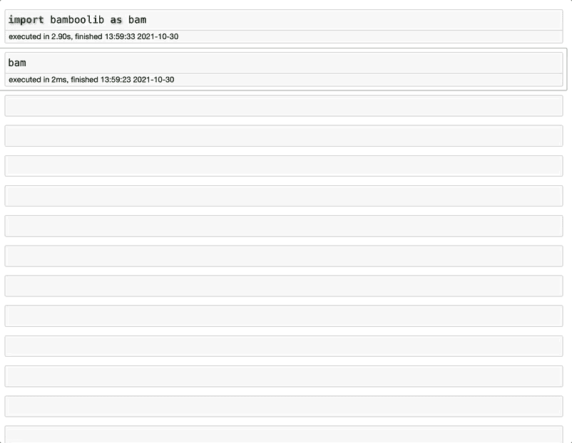

作者 GIF

注意 Bamboolib 导入了 Pandas 并为您创建了代码。是的，在整个项目中都会这样。

# 数据准备

## 将字符串更改为日期时间

您加载了数据，并意识到日期列是一个字符串。然后，单击列类型(列名旁边的小字母)，选择新的数据类型和格式，如果需要，选择一个新名称，然后单击执行。

你是否看到单元格中也添加了更多的代码？

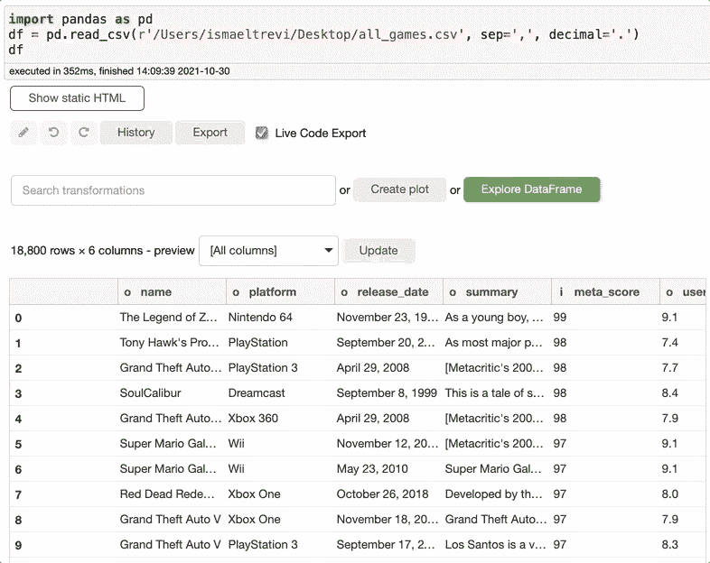

作者 GIF

另外，`user_review`列似乎是一个对象。让我们通过创建一个整数来解决这个问题。

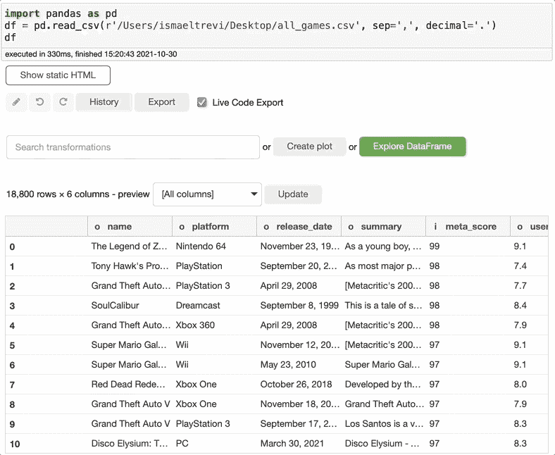

作者 GIF

还记得我说过列名旁边的小字母是列数据类型吗？如果你看一下`user_review` 列名旁边的字母，你会看到一个`f`，而不是整数中的`i`，尽管我把数据类型改成了整数。这是因为 Bamboolib 将数据类型理解为 float，所以它没有抛出错误，而是为您修复了错误。

## 用不同的数据类型和名称创建新列

如果您不需要更改列的数据类型和名称，而是需要一个具有不同数据类型和名称的新列，该怎么办呢？只需单击列数据类型，选择新的格式和名称，然后单击执行。您将立即看到数据集中的新列。

在下图中，我选择了`meta_score`列，将数据类型改为 float，选择了一个新名称，新列就创建好了。

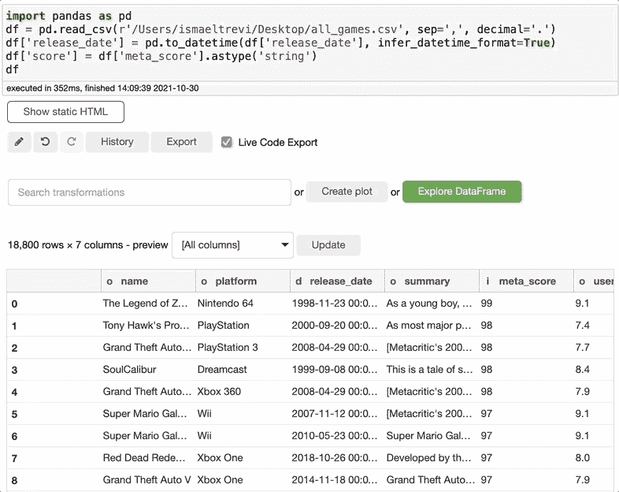

作者 GIF

## 删除列

如果您意识到不需要列，只需在搜索转换框中搜索 drop，选择 drop，选择要删除的列，然后单击执行。

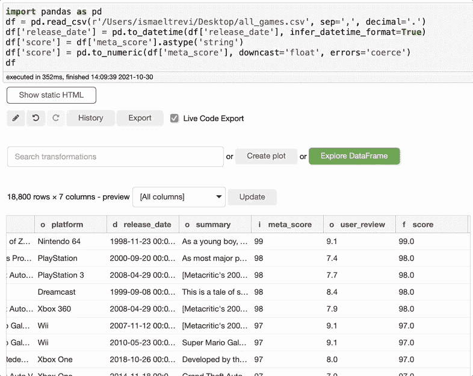

作者 GIF

## 重命名列

现在您需要重命名一个列，这再简单不过了。只需搜索 rename，选择要重命名的列，写下新的列名，然后单击 execute。您可以选择任意多的列。

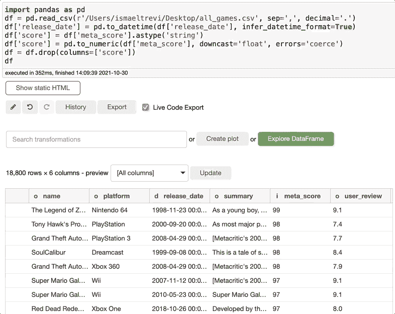

作者 GIF

## 拆分字符串

假设您需要将包含人名的列拆分为两列，一列包含名字，另一列包含姓氏。你可以很容易做到这一点。出于演示的目的，我将游戏名称拆分，这实际上没有意义，但您可以看到它是如何工作的。

只需在搜索转换框中键入 split，选择要拆分的列、分隔符和最大列数。嘣！

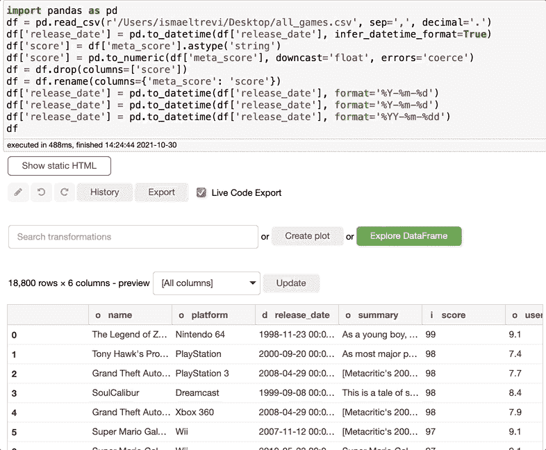

作者 GIF

因为这只是一个演示，所以让我们删除额外的列。搜索删除，选择要删除的列，然后在执行中单击。

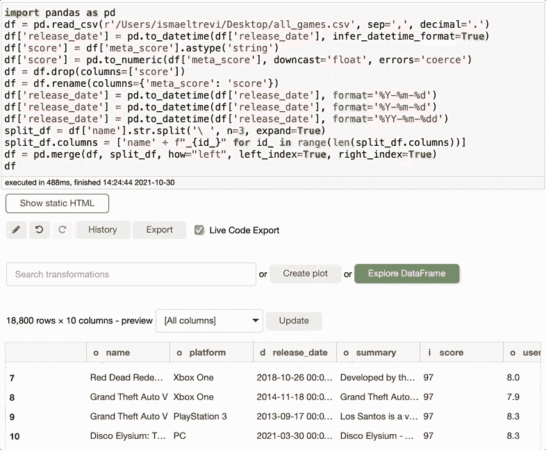

作者 GIF

## 选择列

然后，我们可以选择只显示几列。在这里，我将选择游戏名称、平台和分数。只需在搜索转换中键入 select，选择您想要选择的列并执行。

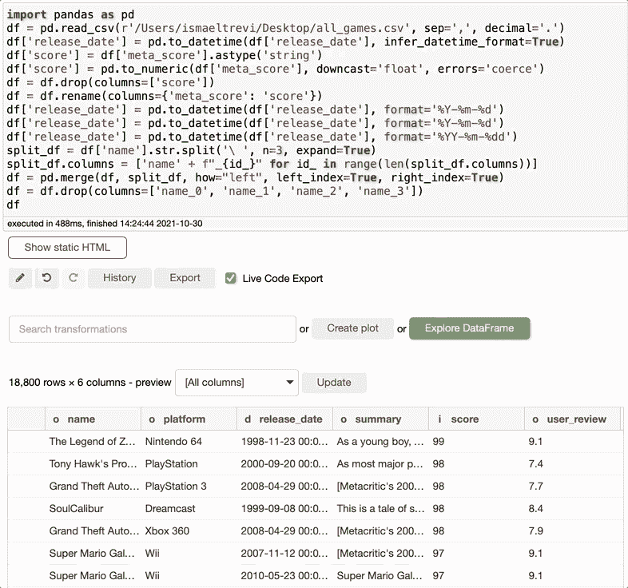

作者 GIF

在这些步骤的最后，Bamboolib 创建了以下代码，即使某人没有安装 Bamboolib，也可以使用这些代码。很酷，对吧？

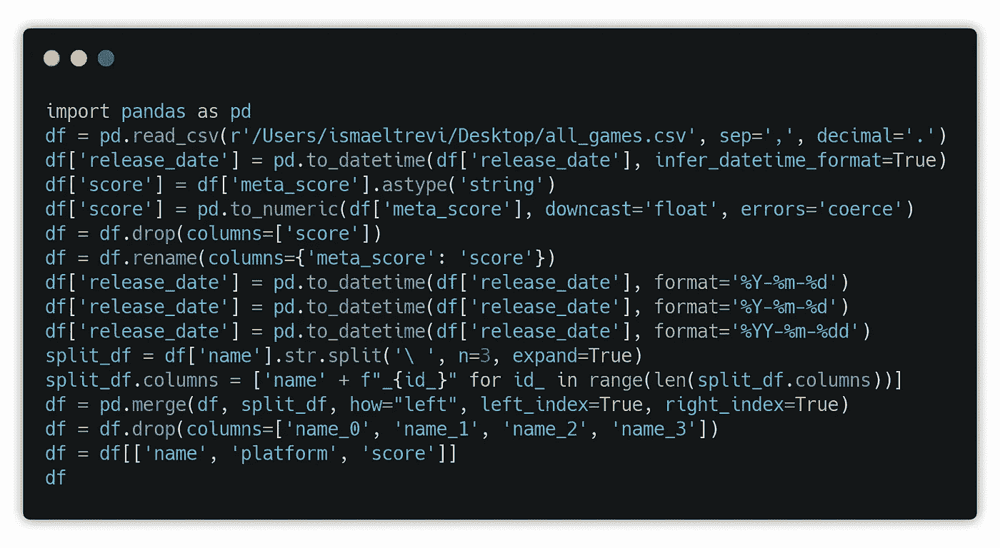

作者图片

# 数据转换

## 过滤数据

如果您想要过滤您的数据集或使用过滤的信息创建一个新的数据集，您可以在搜索转换中搜索过滤器，选择您想要过滤的内容，决定您是否想要创建一个新的数据集，然后单击执行。就这么简单！

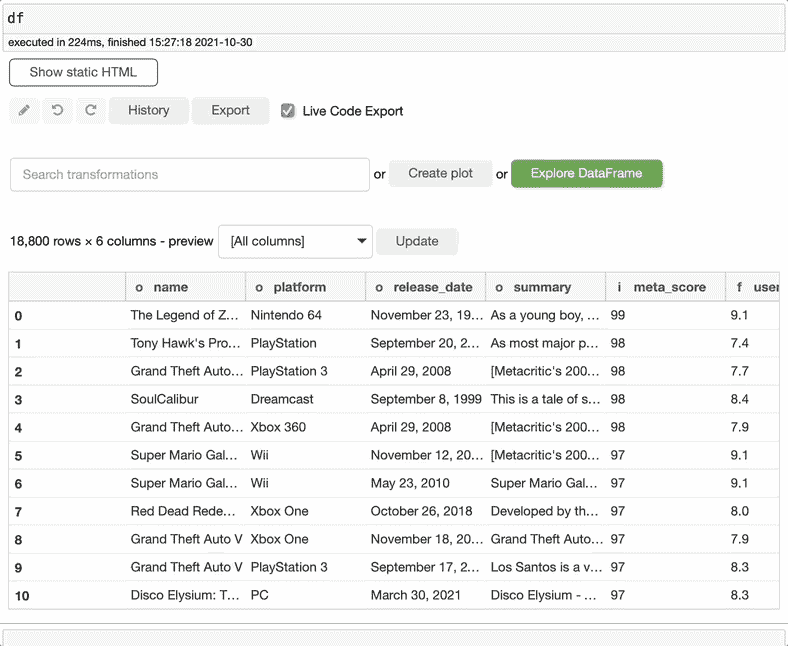

作者 GIF

## 合并数据

如果需要合并两个数据集，只需搜索 merge，选择要合并的两个数据集、连接类型，选择要用于合并数据集的键列，然后单击“执行”。您可以创建一个新的数据集或只编辑当前的数据集。

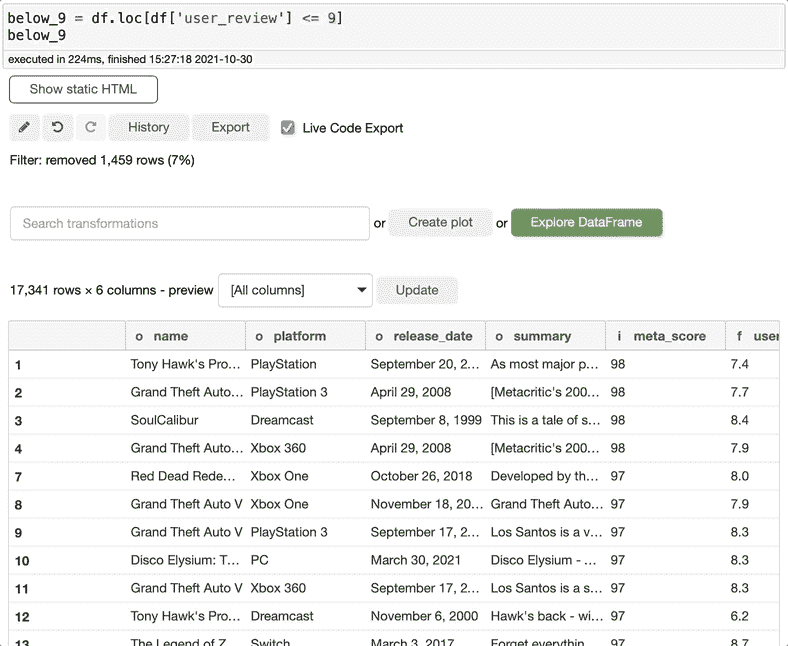

作者 GIF

## 提取日期时间属性

如果您想从日期列中提取一个字符串，比如星期几和月份，您知道代码吗，或者您必须搜索它吗？嗯，有了 Bamboolib，两者都不需要。只需搜索 extract datatime 属性，选择 date 列，然后选择要提取的内容。

有多种选择供你选择。我必须承认，我不知道如何做到这一点，甚至不知道用熊猫做这件事是否可能…我只是学到了一些新东西。

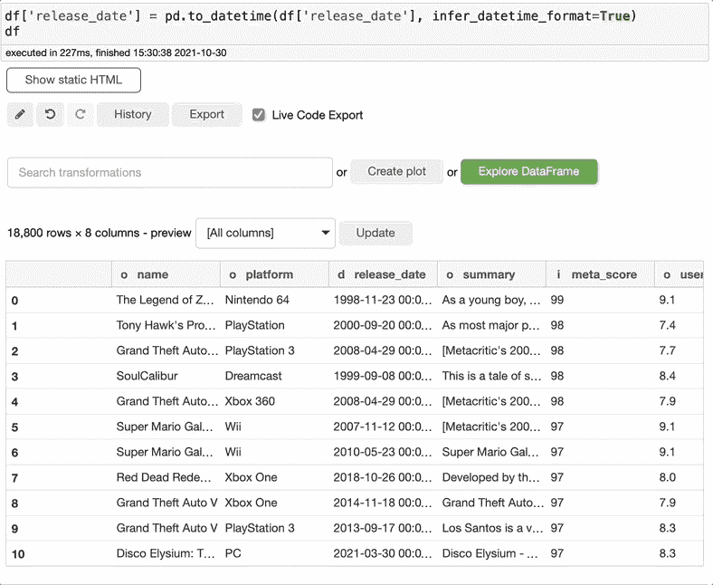

作者 GIF

## 分组依据

使用分组是你可以对熊猫做的最有价值的事情之一。然而，它有时会变得非常复杂。幸运的是，Bamboolib 可以让分组变得非常直观和简单。搜索“分组依据”在“搜索转换”框中，选择要分组的列，然后选择要查看的计算。

在这个例子中，我希望看到每个平台的游戏的计数和平均分数。这样做，我才知道 PlayStation 4 在所有平台中平均得分最低。

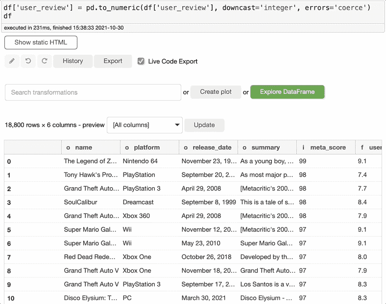

作者 GIF

# 数据可视化

Bamboolib 是创建快速数据可视化的伟大工具。例如，要创建直方图，单击 create plot，选择图形类型、x 轴，就差不多了。你刚刚用四次点击创建了一个漂亮的图表。

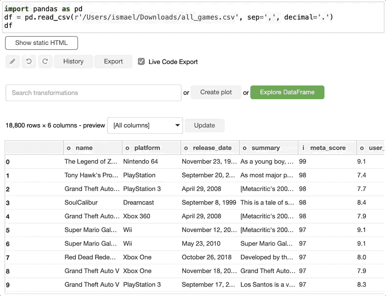

作者 GIF

或者您可以创建一个箱形图。过程非常相似。很好很容易！

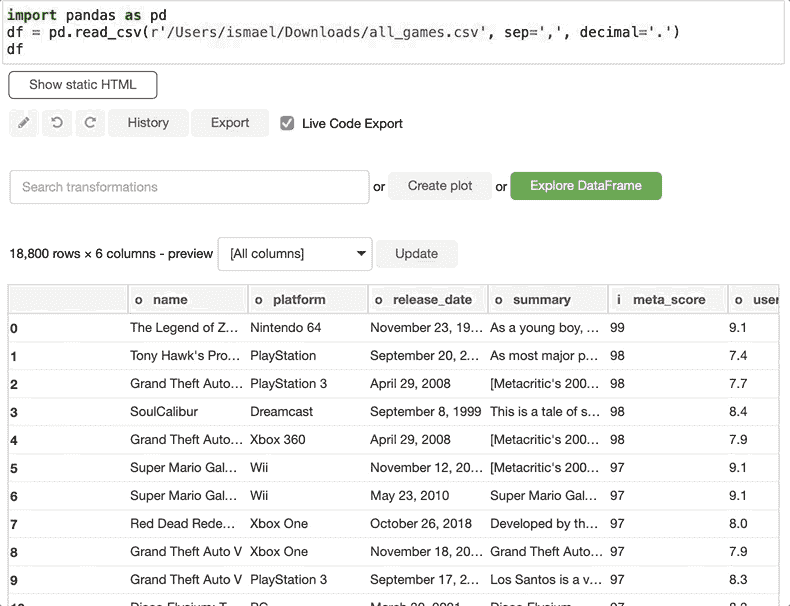

有许多其他类型的图表可供探索，但 all games 数据集并不是创建图表的最佳选择。不过，您可以用其他数据集来测试这个特性。有很多值得探索的地方。

# 数据探索

Bamboolib 让数据探索变得超级简单。只需点击一下，您就可以从您的数据集中获得见解。为此，单击 Explore DataFrame，它将返回诸如平均值、中值、四分位数、标准偏差、观察值数量、缺失值、正面和负面观察值数量等信息。它还创建图表，以便您可以了解数据分布。

如果数据集中有 DateTime 数据类型，它还可以创建图表来显示数据在一段时间内的变化情况。因此，您不必浪费时间创建单独的图表来理解数据集，而是可以使用此功能来深入了解数据集。

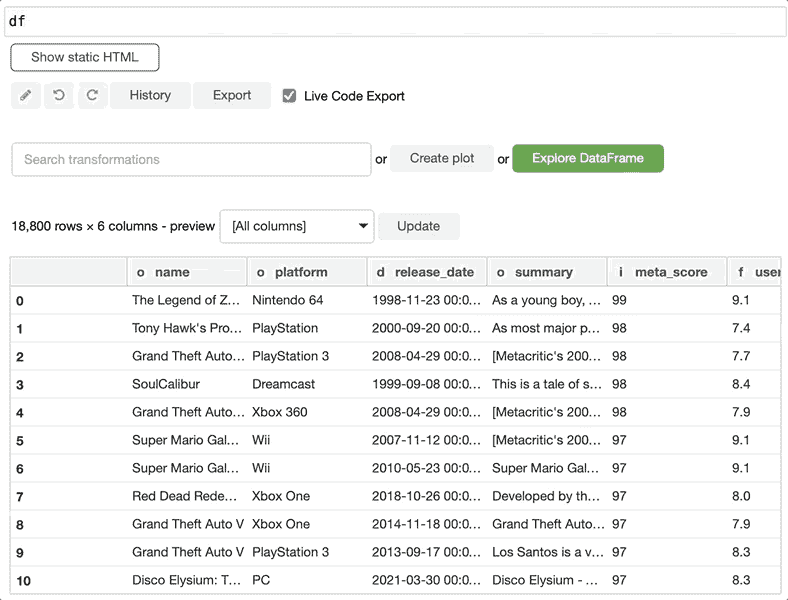

作者 GIF

# 最后的想法

唷！我现在对给予这个图书馆应有的关注感到满意。是的，我知道这不是第一个关于 Bamboolib 的博客，但是我想谈谈我的看法。还有很多要探索的。Bamboolib 有很大的潜力来改变我们分析数据和学习的方式。我使用熊猫已经有几年了，我学到了一些我们可以使用 Bamboolib 做的新东西。感谢阅读，下一篇博客再见。

**你可能也会喜欢…**

[*5 个你不知道但应该知道的 Python 库*](/5-python-libraries-that-you-dont-know-but-you-should-fd6f810773a7) [*4 个你应该知道的很酷的 Python 库*](/4-cool-python-libraries-that-you-should-know-about-bea9619e481c)[*4 个你现在就应该尝试的神奇的 Python 库*](/4-amazing-python-libraries-that-you-should-try-right-now-872df6f1c93)