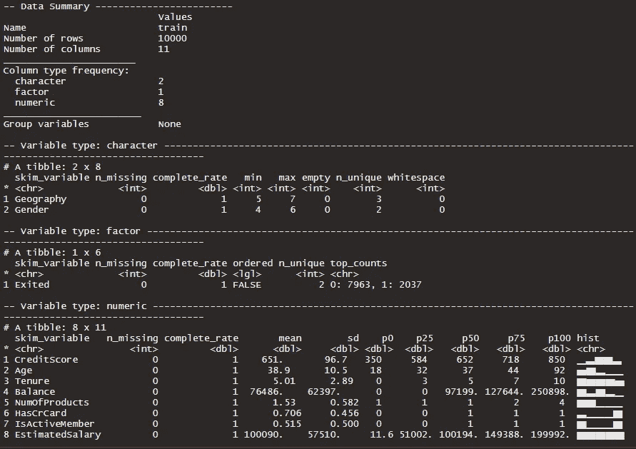
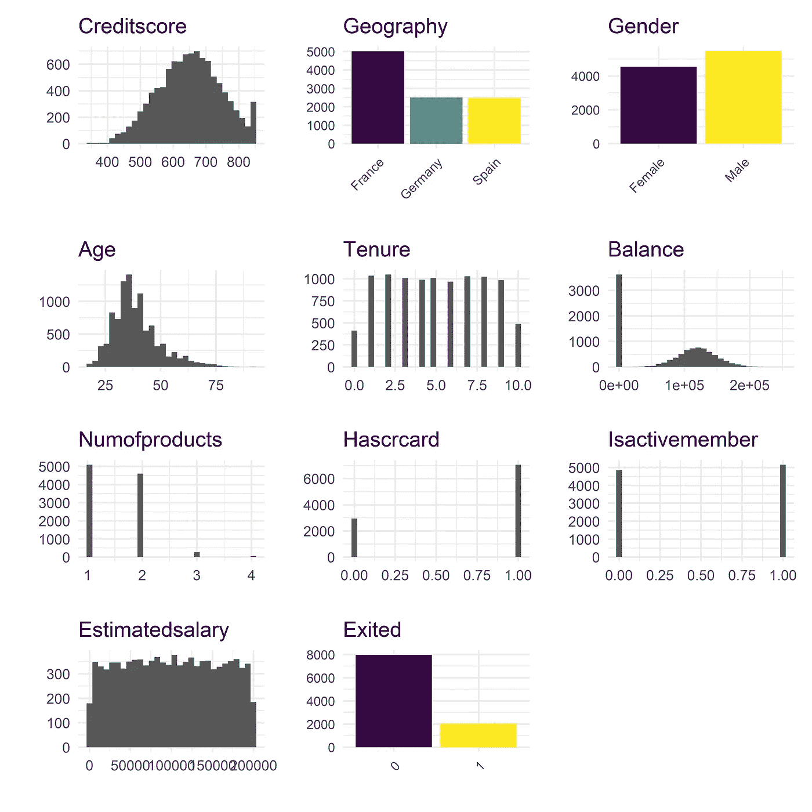
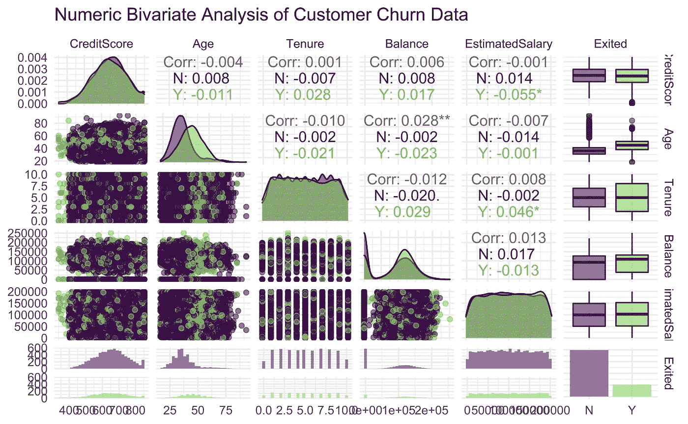
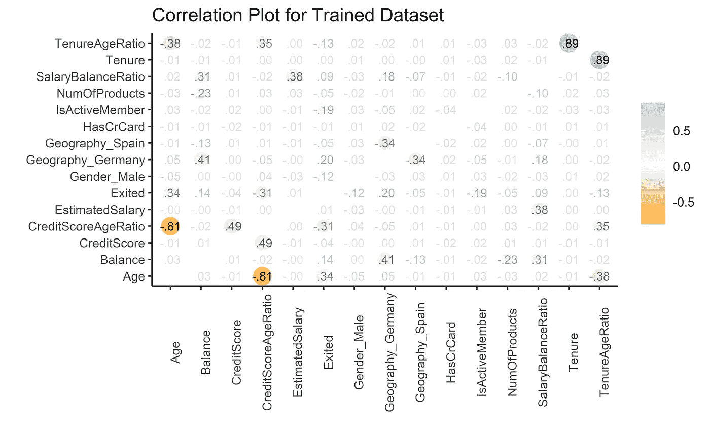
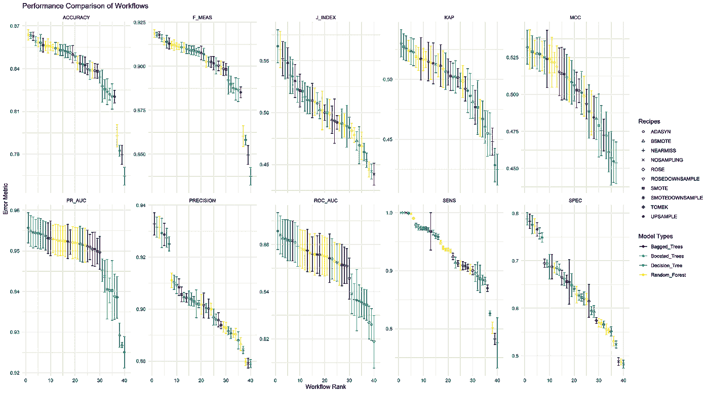
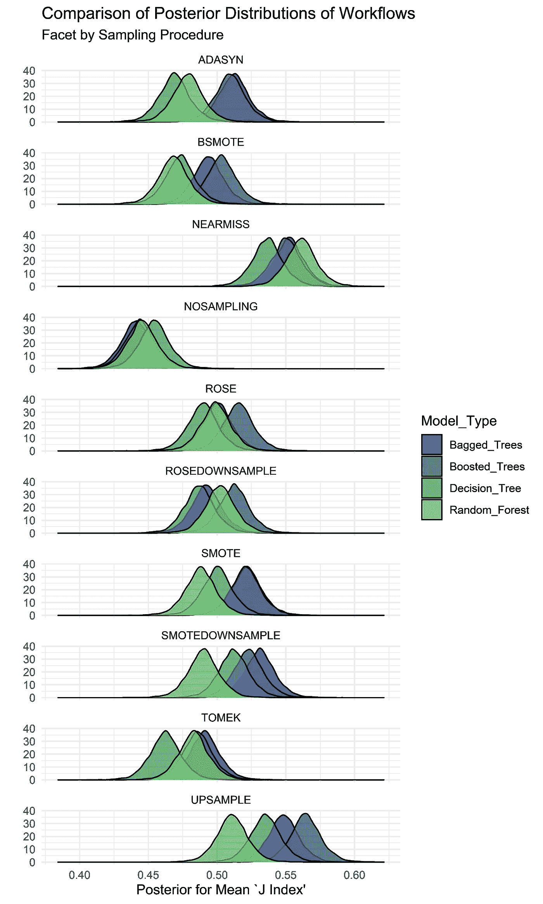

# 银行客户流失的潮汐模型——第一部分模型开发

> 原文：<https://towardsdatascience.com/bank-customer-churn-with-tidymodels-part-1-model-development-cdec4eeb131c?source=collection_archive---------21----------------------->

## 利用潮汐模型探索不平衡分类

假设您是一家大型跨国银行的数据科学家，首席客户官找到您，希望开发一种预测客户流失的方法。您开发了一个包含 10，000 个客户的快照数据集，客户的类别不平衡度为 1:4，这有利于客户不离开来训练这样的二元分类模型。为了帮助模型开发，您决定研究各种可能有助于解决类别不平衡的采样技术。


Jorge Fernández Salas 在 [Unsplash](https://unsplash.com?utm_source=medium&utm_medium=referral) 上拍摄的照片

这个由多个部分组成的系列将涵盖开发和解释模型过程中的以下主题，重点是将模型输出转化为业务成果，并与高级风险承担者进行沟通。

*   第 1 部分不平衡分类的模型开发
*   [第二部分阈值分析和成本影响](/bank-customer-churn-with-tidymodels-part-2-decision-threshold-analysis-c658845ef1f)
*   第 3 部分用 DALEXtra & Tidymodels 解释 ML
*   第 4 部分使用生存分析的替代方法

最终目标是创建一个模型，使银行能够锁定可能被归类为客户流失的当前客户，并应用一些干预措施来防止客户流失。干预是有代价的，所以我们将寻求平衡假阴性率和假阳性率。我们将在第 2 部分用[可能是](https://probably.tidymodels.org/index.html)包开发一个成本函数和阈值分析。

第 3 部分将通过使用 [DALEX/DALEXtra](https://modeloriented.github.io/DALEXtra/index.html) XAI 套餐，重点了解客户流失更为突出的可变空间，并使我们能够在本地和全球层面了解导致客户流失的主要因素。

在第 4 部分中，我们将采用不同的方法，将生存分析方法应用于该数据集，因为它经过了适当的审查，并利用最近在 tidymodels 中发布的生存分析功能，突出了事件发生时间(任期)和结果。

**加载包**

```
library(tidymodels)
library(themis) **#Recipe functions to deal with class imbalances**
library(tidyposterior) **#Bayesian Resampling Comparisons**
library(baguette) **#Bagging Model Specifications**
library(corrr) **#Correlation Plots**
library(readr) **#Read .csv Files**
library(magrittr) **#Pipe Operators**
library(stringr) **#String Manipulation**
library(forcats) **#Handling Factors**
library(skimr) **#Quick Statistical EDA**
library(patchwork) **#Create ggplot Patchworks**
library(GGally) **#Pair Plots**options(yardstick.event_first = FALSE) **#Evaluate second factor level as factor of interest for yardstick metrics**
```

**加载数据**

数据取自[https://www.kaggle.com/shivan118/churn-modeling-dataset](https://www.kaggle.com/shivan118/churn-modeling-dataset)(License[CC0:Public Domain](https://creativecommons.org/publicdomain/zero/1.0/))并加载如下。

```
train <- read_csv("Churn_Modelling.csv") %>% 
  select(-c(Surname, RowNumber, CustomerId))
```

**探索性数据分析**

我喜欢 skimr 包快速提供所有数据集变量的摘要。

```
skim(train)
```



从 Skim 输出(图片由作者提供)

我们的目标变量 Exited 在两种可能的结果之间具有大约 4:1 的比率，其中 Exited = 1 表示客户流失。为了形象化这一点，我们采用下面的自定义函数。

```
viz_by_dtype <- function (x,y) {
  title <- str_replace_all(y,"_"," ") %>% 
           str_to_title()
  if ("factor" %in% class(x)) {
    ggplot(train, aes(x, fill = x)) +
      geom_bar() +
      theme_minimal() +
      theme(legend.position = "none",
            axis.text.x = element_text(angle = 45, hjust = 1),
            axis.text = element_text(size = 8)) +
      scale_fill_viridis_d()+
      labs(title = title, y = "", x = "")
  }
  else if ("numeric" %in% class(x)) {
    ggplot(train, aes(x)) +
      geom_histogram()  +
      theme_minimal() +
      theme(legend.position = "none") +
      scale_fill_viridis_d() +
      labs(title = title, y = "", x = "")
  } 
  else if ("integer" %in% class(x)) {
    ggplot(train, aes(x)) +
      geom_histogram() +
      theme_minimal() +
      theme(legend.position = "none") +
      scale_fill_viridis_d()+
      labs(title = title, y = "", x = "")
  }
  else if ("character" %in% class(x)) {
    ggplot(train, aes(x, fill = x)) +
      geom_bar() +
      theme_minimal() +
      scale_fill_viridis_d() +
      theme(legend.position = "none",
            axis.text.x = element_text(angle = 45, hjust = 1),
            axis.text = element_text(size = 8)) +
      labs(title = title, y  ="", x= "")
  }
}
variable_list <- colnames(train) %>% as.list()
variable_plot <- map2(train, variable_list, viz_by_dtype) %>%
  wrap_plots(               
    ncol = 3,
    heights = 150,
    widths = 150)
ggsave("eda.png", dpi = 600)
```



viz_by_dtype 函数的输出(图片由作者提供)

从上面我们可以更好地理解连续变量的分布和离散变量的计数。

*   信用评分大致呈正态分布
*   地理分布在三个国家，以法国为主
*   性别几乎是均等的
*   年龄近似右偏正态分布
*   任期没有明显的分布，大多数客户的任期在 2-9 年之间
*   余额通常分配给大量余额为零的客户
*   大多数客户要么有 1 种，要么有 2 种产品
*   有信用卡表明 70%的客户有信用卡
*   活跃会员显示 51.5%的客户是活跃用户
*   估计工资没有明显的分布

**二元数值分析**

现在我们将使用 GGally::ggpairs()来了解数字变量之间是否有任何关系

```
ggpairs(train %>% 
          select(-c(HasCrCard,IsActiveMember,NumOfProducts, Gender, Geography)) %>% 
          drop_na() %>% 
          mutate(Exited = if_else(Exited == 1, "Y","N")), ggplot2::aes(color = Exited, alpha = 0.3)) + 
  scale_fill_viridis_d(end = 0.8, aesthetics = c("color", "fill")) + 
  theme_minimal() +
  labs(title = "Numeric Bivariate Analysis of Customer Churn Data")
```



按目标排列的数值对图(按作者排列的图片)

上面唯一值得注意的是，有过搅动的客户向右移动，这表明年纪大的客户离开的可能性更大。

**分类变量分析**

下一步是确定分类变量和目标之间是否有任何关系。

下文描述了汇总数据框架的创建，该数据框架计算每个分类变量和目标变量的平均值和 95%置信区间。

```
train %>% 
  mutate(Exited = if_else(Exited == 1, "Y", "N"),
         HasCrCard = if_else(HasCrCard == 1, "Y", "N"),
         IsActiveMember = if_else(IsActiveMember == 1, "Y", "N"),
         NumOfProducts = as.character(NumOfProducts)) %>% 
  select(Exited,where(is.character)) %>% 
  drop_na() %>% 
  mutate(Exited = if_else(Exited == "Y",1,0)) %>% 
  pivot_longer(2:6, names_to = "Variables", values_to = "Values") %>% 
  group_by(Variables, Values) %>% 
    summarise(mean = mean(Exited),
              conf_int = 1.96*sd(Exited)/sqrt(n())) %>% 
  ggplot(aes(x=Values, y=mean, color=Values)) +
    geom_point() +
    geom_errorbar(aes(ymin = mean - conf_int, ymax = mean + conf_int), width = 0.1) +
    theme_minimal() +
    theme(legend.position = "none",
        axis.title.x = element_blank(),
        axis.title.y = element_blank()) +
   scale_color_viridis_d(aesthetics = c("color", "fill"), end = 0.8) +
   facet_wrap(~Variables, scales = 'free') +
   labs(title = 'Categorical Variable Analysis', subtitle = 'With 95% Confidence Intervals')
```


95%置信区间的分类变量分析(图片由作者提供)

值得注意的是，我们看到性别、非活跃会员、产品数量和地理位置显示出明显不同的流失倾向。相反，客户是否有信用卡对客户流失的可能性没有显著影响。考虑到阶级的不平衡，这一点应该有所保留。

**模型开发**

数据分割—r 样本

使用 rsample::initial_split()，我们指定了一个 3:1 的训练数据拆分。

```
set.seed(246)
cust_split <- initial_split(train, prop = 0.75, strata = Exited)
```

**型号规格— Parnsip &长方形**

我们将使用 parsnip 和 baguette 包(针对 bag_trees)将模型规范的范围限制为那些基于树的模型，这些模型的复杂性在不断增加。每个模型指定其各自的超参数设置为 tune()，用于下一步筛选。

```
dt_cust <- 
decision_tree(cost_complexity = tune(), tree_depth = tune(), min_n = tune()) %>% 
  set_engine("rpart") %>% 
  set_mode("classification")rf_cust <- 
rand_forest(mtry = tune(), trees = tune(), min_n = tune()) %>% 
  set_engine("ranger", importance = "impurity") %>% 
  set_mode("classification")xgboost_cust <- 
boost_tree(mtry = tune(), trees = tune(), min_n = tune(), tree_depth = tune(), learn_rate = tune(), loss_reduction = tune(), sample_size = tune())  %>% 
  set_engine("xgboost") %>% 
  set_mode("classification")bagged_cust <- 
bag_tree(cost_complexity = tune(), tree_depth = tune(), min_n = tune()) %>% 
  set_engine("rpart") %>% 
  set_mode("classification")
```

**特征工程—配方**

接下来，我们将使用 recipes 包指定特征工程步骤。我们将利用这一阶段开发 10 个配方，每个配方都有不同的采样技术来处理类别不平衡。 [themis](https://themis.tidymodels.org/index.html) 包提供了方便不同取样技术的配方步骤。

*   SMOTE——合成少数过采样技术
*   ROSE——随机过采样技术
*   边界合成少数过采样技术
*   向上采样-将重复的少数类数据添加到与多数类的指定比率中
*   ADASYN——自适应合成过采样
*   TOMEK-删除多数类中的 TOMEK 链接
*   NEARMISS 通过欠采样移除多数类实例
*   无采样—无采样程序
*   平滑缩减采样-生成合成少数实例并移除多数实例
*   ROSE-下采样-过采样少数实例，下采样多数实例

```
recipe_template <-
    recipe(Exited ~., data = training(cust_split)) %>% 
    step_integer(HasCrCard, IsActiveMember, zero_based = T) %>% 
    step_integer(NumOfProducts) %>% 
    step_mutate(**SalaryBalanceRatio = EstimatedSalary/Balance,
              CreditScoreAgeRatio = CreditScore/Age,
              TenureAgeRatio = Tenure/Age,
              SalaryBalanceRatio = if_else(is.infinite(SalaryBalanceRatio),0,SalaryBalanceRatio)**) %>% 
    step_scale(all_numeric_predictors(), -c(HasCrCard, Age, IsActiveMember, NumOfProducts)) %>% 
    step_dummy(all_nominal_predictors()) %>% 
    **step_samplingmethod**(Exited) **#Change or Add Sampling Steps Here as Necessary**
```

上面我们已经设计了附加功能，采用不同连续变量的商。

**相关图— corrr**

我们可视化整个训练数据集的相关图，使用没有应用采样技术的配方。

```
cust_train <- recipe_8 %>% prep() %>% bake(new_data = NULL)
cust_test <- recipe_8 %>% prep() %>% bake(testing(cust_split))cust_train %>% 
  bind_rows(cust_test) %>% 
  mutate(Exited = as.numeric(Exited)) %>% 
  correlate() %>%
  rplot(print_cor = T, .order = "alphabet") +
    scale_color_gradient2(low = 'orange', high = 'light blue') + 
    theme(axis.text.x = element_text(angle = 90)) +
    labs(title = "Correlation Plot for Trained Dataset")
```



训练数据集的相关图(图片由作者提供)

在上面，年龄和我们生成的衍生比率之间的负相关并不令人惊讶。Exited 与年龄正相关，与 credit score 比率稍负相关，与 SalaryBalanceRatio 比率稍正相关。

**工作流图—工作流集**

使用 workflowsets 软件包，我们可以在 parsnip 和 recipes 组合之间生成 40 个工作流程的列表，并为每个工作流程筛选 20 个超参数组合。我们使用 rsample::vfold_cv()创建一个 5 重交叉验证对象，使用 strata kwarg to Exited，这样每个折叠都具有目标变量水平的一致比率。

```
recipe_list <- 
list(SMOTE = recipe_1, ROSE = recipe_2, BSMOTE = recipe_3, UPSAMPLE = recipe_4, ADASYN = recipe_5, TOMEK=recipe_6, NEARMISS = recipe_7, NOSAMPLING = recipe_8, SMOTEDOWNSAMPLE= recipe_9, ROSEDOWNSAMPLE = recipe_10)model_list <- 
list(Decision_Tree = dt_cust, Boosted_Trees = xgboost_cust, Random_Forest = rf_cust, Bagged_Trees = bagged_cust)wf_set <- 
workflow_set(preproc = recipe_list, models = model_list, cross = T)set.seed(246)
train_resamples <- 
vfold_cv(training(cust_split), v = 5, strata = Exited)class_metric <- metric_set(accuracy, f_meas, j_index, kap, precision, sensitivity, specificity, roc_auc, mcc, pr_auc)doParallel::registerDoParallel(cores = 12)
wf_sample_exp <- 
  wf_set %>% 
  workflow_map(resamples = train_resamples, 
               verbose = TRUE, 
               metrics = class_metric, 
               seed = 246)
```

我们使用 parsnip::metric_set()函数创建一组定制的评估指标。这些自定义指标与 wf_set 对象一起传递给 workflow_map，以筛选所有 40 个工作流并输出每个工作流的所有指标计算。现在可以分析产生的 workflow_set 对象 wf_sample_exp，并将其用于模型比较。

这在计算上相当费力，所以我建议启动所有可用的内核来缓解这一问题。

```
collect_metrics(wf_sample_exp) %>% 
  separate(wflow_id, into = c("Recipe", "Model_Type"), sep = "_", remove = F, extra = "merge") %>% 
  group_by(.metric) %>% 
  select(-.config) %>% 
  distinct() %>%
  group_by(.metric, wflow_id) %>% 
  filter(mean == max(mean)) %>% 
  group_by(.metric) %>% 
  mutate(Workflow_Rank =  row_number(-mean),
         .metric = str_to_upper(.metric)) %>% 
  arrange(Workflow_Rank) %>% 
  ggplot(aes(x=Workflow_Rank, y = mean, color = Model_Type)) +
    geom_point(aes(shape = Recipe)) +
    scale_shape_manual(values = 1:n_distinct(recipe_list)) +
    geom_errorbar(aes(ymin = mean-std_err, ymax = mean+std_err)) +
    theme_minimal() +
    scale_color_viridis_d() +
    labs(title = "Performance Comparison of Workflows", x = "Workflow Rank", y="Error Metric", color = "Model Types", shape = "Recipes") +
    facet_wrap(~.metric,scales = 'free_y',ncol = 4)
```



通过各种分类指标比较所有工作流。(图片由作者提供)

以上内容的目的是展示一个分类指标的示例，人们可能会看到一个不平衡的数据集。我们想要一个能充分区分不同类别的模型，但考虑到我们的特殊问题，我们需要尽量减少假阴性(客户流失，但预测会不同)。第 2 部分讨论了一个成本函数，以找到干预成本和阶级分化之间的平衡。

***鉴于类别不平衡，ROC AUC 和准确性不是合适的指标。*** 我们考虑精确召回的 AUC、KAP、J 指数、Mathews 相关系数和特异性。考虑到这一点，UPSAMPLE_Boosted_Trees 是一个强有力的候选，在所有这些指标上都有良好的结果。

**贝叶斯模型比较—tidy poster**

关注 J 指数，我们可以使用 tidyposterior 比较重采样后验分布。tidyposterior::perf_mod()采用包含 workflow_map 结果的 wf_sample_exp 对象，完成重采样的贝叶斯比较，并生成感兴趣的度量平均值的后验分布。注意:workflow_set 对象必须计算目标度量，否则将不起作用。

```
jindex_model_eval <- 
  perf_mod(wf_sample_exp, metric = "j_index", iter = 5000)
jindex_model_eval %>% 
  tidy() %>% 
  mutate(model = fct_inorder(model)) %>% 
  separate(model, into = c("Recipe", "Model_Type"), sep = "_", remove = F, extra = "merge") %>% 
  ggplot(aes(x=posterior, fill = Model_Type)) +
    geom_density(aes(alpha = 0.7)) +
    theme_minimal() +
    scale_fill_viridis_d(end = 0.8) +
    facet_wrap(~Recipe, nrow = 10) +
    labs(title = "Comparison of Posterior Distributions of Model Recipe Combinations", 
       x = expression(paste("Posterior for Mean J Index")), 
       y = "")
```



工作流程的比较和取样程序对 J 指数的影响。(图片由作者提供)

上面有很多内容需要解释，但简而言之，它展示了处理类不平衡的采样过程的影响以及对 J 指数的影响。这可以针对任何度量来完成，并且我认为这是探索不同的上采样和下采样过程的影响的有用练习。**我们注意到，与袋装采油树方法一样，助推采油树通常表现良好，这都取决于取样程序。**

**结束语**

我们已经展示了一个具有 4:1 不平衡数据集的二元分类器的模型开发过程。我们性能最好的工作流以 XGBoost 模型为特色，该模型带有一个上采样过程来平衡类的比率。在第 2 部分中，我们将拟合模型，并使用 probably 包完成决策阈值分析，并开发两个场景——要么改变决策阈值以最小化流失和干预的成本，要么实现更好的阶级区分。第 2 部分将重点关注将模型输出转化为业务涉众，并使他们能够围绕客户流失的成本和风险做出明智的决策。

谢谢你的阅读，请留意后面的部分。我希望你能像我喜欢写作一样喜欢阅读这篇文章。如果你不是媒介会员，使用下面我的推荐链接，定期从我和其他优秀的媒介作者那里获得新出版物的更新。

<https://mmgillin.medium.com/membership> 