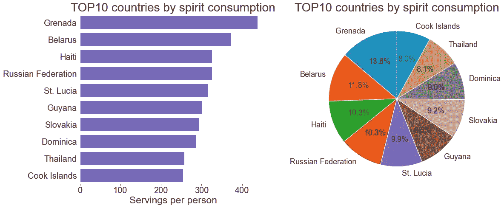
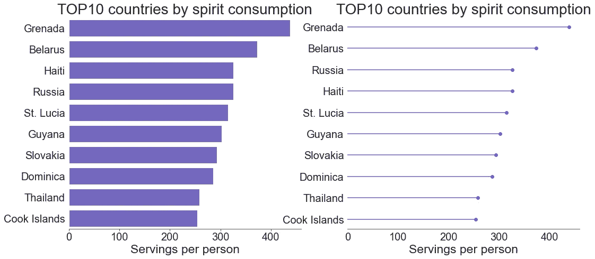

# 条形图:备选方案和特定类型

> 原文：<https://towardsdatascience.com/bar-plots-alternatives-specific-types-9d10ef250e5?source=collection_archive---------15----------------------->

## 何时以及是否使用它们


[来自 Unsplash](https://unsplash.com/photos/OGTEP0LyYNk)

当显示整体中不同元素的比例时，条形图似乎是最佳选择。有没有其他功能与他们相似的图表？让我们使用 Kaggle 的一个与酒吧相关的数据集来探究这个问题— [世界各地的酒精消费量](https://www.kaggle.com/codebreaker619/alcohol-comsumption-around-the-world)🤩🍷特别是，我们将关注饮料消费量排名前十的国家。此外，我们将快速了解还有哪些其他类型的条形图，以及何时可以使用它们。

让我们看看熊猫的数据:

```
import pandas as pd
import matplotlib.pyplot as plt
import seaborn as snsdf = pd.read_csv('drinks.csv')
print(df.head(3))**Output:** country  beer_servings  spirit_servings  wine_servings  \
0  Albania             89              132             54   
1  Algeria             25                0             14   
2  Andorra            245              138            312   

   total_litres_of_pure_alcohol  
0                           4.9  
1                           0.7  
2                          12.4 
```

并提取必要的信息:

```
top10_spirit = df.sort_values('spirit_servings', 
                              ascending=False)[:10]\
                 .reset_index(drop=True)\
                 [['country', 'spirit_servings']]
```

# 圆形分格统计图表

饼图或其版本的环形图(中心区域被切掉)是条形图最常见的替代方案。然而，如果要在它们和条形地块之间做出选择，第二个似乎是更安全的选择。事实上，饼状图是基于角度而不是长度，通常更难阅读和从中提取见解。如果我们在一个饼图中有许多类别和/或几乎相等比例的类别，即使试图找到最大/最小的类别也是相当复杂的，更不用说按值排序了:

```
fig, ax = plt.subplots(figsize=(16,8))
fig.tight_layout(pad=4)# Creating a case-specific function to avoid code repetition
# (will be used for comparing with 2 more plot types)
def plot_hor_bar_2():
    ax = sns.barplot(x='spirit_servings', y='country',
                     data=top10_spirit, color='slateblue')
    plt.title('TOP10 countries by spirit consumption', fontsize=28)
    plt.xlabel('Servings per person', fontsize=23)
    plt.xticks(fontsize=20)
    plt.ylabel(None)
    plt.yticks(fontsize=20)
    sns.despine(left=True)
    ax.grid(False)
    ax.tick_params(bottom=True, left=False)
    return Noneplt.subplot(1,2,1)
plot_hor_bar_2()plt.subplot(1,2,2)
plt.pie(top10_spirit['spirit_servings'],
        labels=top10_spirit['country'],
        startangle=90, autopct='%1.1f%%')
plt.title('TOP10 countries by spirit consumption', fontsize=28)
matplotlib.rcParams['font.size']=18
plt.show()
```



作者图片

即使我们只有 10 个国家出现在这两张图表上(2010 年饮酒量排名前 10 的国家)，我们也无法从饼状图中获得太多信息。事实上，这些扇区看起来彼此非常相似，即使将`startangle`参数赋值为 0 并添加%标签也没有真正提高第二个图表的可读性。

这些图表的另一个缺点是，我们必须为每个类别使用不同的颜色，而正如我们前面所讨论的，在条形图上，对所有的条形图使用相同的颜色就足够了(如果我们不想特别强调什么)。这意味着在饼图上，每个类别都有两个特征:颜色和角度，这会产生冗余的视觉信息。如果我们有很多类别，因此有很多颜色，那么我们的饼状图就会变得铺天盖地。同样，上图只有 10 个元素，看起来已经严重超载了。

最后，在几个饼图的情况下，每个饼图代表一个以不同比例细分为相同元素的类别(类似于分组条形图)，几乎不可能跟踪所有元素的趋势或找出数据中任何有意义的模式。

基于以上所述，条形图应优先于饼图。

# 树形图

像条形图和饼图一样，树状图显示了所有数据的组成。它将分层数据显示为一组嵌套的矩形，每个矩形的面积与相应数据的值成比例。为了定制一个树形图，我们可以为矩形分配一个颜色列表，为标签分配颜色和字体大小，以及其他一些参数。

让我们复制上面的条形图，这次将它与相应的树形图进行比较:

```
import squarify# Renaming Russian Federation into Russia to avoid too long lables
top10_spirit.at[3, 'country'] = 'Russia'fig, ax = plt.subplots(figsize=(16,8))
fig.tight_layout(pad=4)plt.subplot(1,2,1)
plot_hor_bar_2()plt.subplot(1,2,2)
cmap = matplotlib.cm.tab20
colors = []
for i in range(len(top10_spirit.index)):
    colors.append(cmap(i))    
squarify.plot(sizes=top10_spirit['spirit_servings'],
              label=top10_spirit['country'],
              color=colors,
              text_kwargs={'fontsize': 16})
plt.title('TOP10 countries by spirit consumption', fontsize=28)
plt.axis('off')
plt.show()
```


作者图片

我们可以确认，树形图看起来比之前创建的饼图更有洞察力:感知区域肯定比感知角度容易得多。我们没有在树形图中添加值或百分比；然而，仍然有可能从定性的角度来估计前 10 名中饮酒最多和最少的国家(我的国家和海地并列第三😔).不过，在一个可视化中使用大量颜色的问题也存在于树形图中。

# 茎图

stem 图是一个很好的替代条形图的方法，它有许多条，或者有相似长度的条。它最大化了图表的数据-油墨比率，使其更具可读性。要创建一个水平茎图，我们可以使用`stem()`或`vlines()`功能，创建一个垂直茎图，只有`hlines()`与`plot()`结合使用。这些函数有许多参数需要调整，以改善结果图的外观。在[这篇文章](/spaceborn-visualizations-69058ad6c2df)中，你可以找到更多关于如何定制茎图和树状图的信息。

```
fig, ax = plt.subplots(figsize=(16,8))
fig.tight_layout(pad=4)plt.subplot(1,2,1)
plot_hor_bar_2()top_sorted = top10_spirit.sort_values('spirit_servings',
                                      ascending=True)\
                         .set_index('country')plt.subplot(1,2,2)
plt.hlines(y=top_sorted.index, xmin=0, xmax=top_sorted,
           color='slateblue')
plt.plot(top_sorted, top_sorted.index,
         'o', color='slateblue')
plt.title('TOP10 countries by spirit consumption', fontsize=28)
plt.xlabel('Servings per person', fontsize=23)
plt.xticks(fontsize=20)
plt.xlim(0, None)
plt.ylabel(None)
plt.yticks(fontsize=20)
sns.despine(left=True)
ax.grid(False)
ax.tick_params(bottom=True, left=False)
plt.show()
```



作者图片

第二个图看起来不那么杂乱，更优雅，这种效果在有许多类别的情况下变得更加明显。另外，我们可以注意到俄罗斯和海地交换了位置，有相同的值。

# 条形图的特定类型

有一些特殊类型的条形图，它们在某些相当有限的情况下很有用:

*   **径向条形图**看起来像渐开线条形图，不是用笛卡尔坐标而是用极坐标绘制的。每个条从不同的径向点开始，并且具有圆形形状而不是直线。尽管这些可视化看起来相当有效，但几乎总是应该避免，因为它们严重扭曲了对背后数据的感知，并且难以分析:条形具有不同的周长(而不是长度，如常见的条形图)，内部的条形应该是最小的，看起来甚至更小，外部的条形看起来更大，即使它们中的一些可能具有相同的长度。在这样的图上没有 y 轴会造成额外的混乱。有时径向条形图被误称为圆形，这实际上是另一种类型的图表，我们很快就会看到。你可以查看[这篇 StackOverflow](https://stackoverflow.com/questions/49729748/create-a-circular-barplot-in-python) 关于如何用 Python 创建径向条形图的帖子。
*   **圆形和极坐标条形图**以不同长度的线段形式显示条形图，从圆形(圆形版本)或点(极坐标版本)开始，而不是传统条形图中的直线。这种图形最适合大量具有明显循环模式的类别(条形)。但是，在所有其他情况下，圆形和极坐标条形图并不是一个好的选择，因为存在一些问题:缺少 y 轴，难以直观地解释线段之间的长度差异，较小条形(靠近基圆或基点的条形)的视错觉甚至更小。这里的演示了如何在 matplotlib 中创建一个极坐标条形图。
*   [**甘特图**](https://en.wikipedia.org/wiki/Gantt_chart) 。说明项目进度、不同活动之间的关系以及当前进度状态。
*   [**瀑布图**](https://en.wikipedia.org/wiki/Waterfall_chart) 。显示在数据序列中连续应用正或负变化后，起始值如何被修改(增加或减少)到最终值。

# 结论

简而言之，即使条形图仍然是最流行的可视化类型来说明整体由什么组成，为了更有效地讲故事，我们总是可以考虑一些特定情况的替代方案，或者在特定类型的条形图之间进行选择。为了进一步阅读，你可以找到有用的[这篇文章](/bar-plots-best-practices-and-issues-30f1ad32c68f)，讨论了如何创建有意义的条形图的最佳实践和问题。

感谢阅读！

```
 /.---.\
   |`````|
   \     /
    `-.-'           ____
      |    /\     .'   /\
    __|__  |K----;    |  |
   `-----` \/     '.___\/
```

如果你喜欢这篇文章，你也可以发现下面这些有趣的:

[](/bar-plots-best-practices-and-issues-30f1ad32c68f) [## 条形图:最佳实践和问题

### 如何创建一个有洞察力的图表

towardsdatascience.com](/bar-plots-best-practices-and-issues-30f1ad32c68f) [](https://medium.com/geekculture/creating-a-waterfall-chart-in-python-dc7bcddecb45) [## 用 Python 创建瀑布图

### 做这件事最简单的方法

medium.com](https://medium.com/geekculture/creating-a-waterfall-chart-in-python-dc7bcddecb45) [](/testing-birthday-paradox-in-faker-library-python-54907d724414) [## 在 Faker 库中测试生日悖论(Python)

towardsdatascience.com](/testing-birthday-paradox-in-faker-library-python-54907d724414)