# 棒球和机器学习:2021 年击球预测的数据科学方法

> 原文：<https://towardsdatascience.com/baseball-and-machine-learning-a-data-science-approach-to-2021-hitting-projections-4d6eeed01ede?source=collection_archive---------7----------------------->


萨凡纳·罗莱德在 [Unsplash](https://unsplash.com?utm_source=medium&utm_medium=referral) 上的照片

## [实践教程](https://towardsdatascience.com/tagged/hands-on-tutorials)

## 一个接一个的统计看最好的预测者和一个预测离群值的探索

如今，体育界的名人喜欢抨击分析。很难在体育广播中听五分钟的棒球谈话而不听到有人对“书呆子接管”做出贬损的评论具有讽刺意味的是，他们随后立即推出体育博彩广告，猜猜看，伙计们…任何时候你下注，因为“巨人队总是在华盛顿输”或其他什么，这是一种基本的分析形式，没有实际的建模。我还注意到一种流行的观点，即高级统计和建模将产生一种单一的(阅读:无聊的)游戏方式。如果发生这种情况，那是因为缺乏想象力。我坚信分析的许多方面代表了一种类型的棒球知识。传统的棒球本能和经验是另一个，当两个领域协调工作时，你会得到最好的结果。我确实认为棒球中的分析有扩展的空间，并且可以更深入地进入数据科学领域。

这就是说，我终于有足够的时间来构建机器学习模型，以构建我今年的棒球预测。只是提醒一下:这篇文章将会很密集。我将向您介绍我的方法、思维过程以及我在研究这些模型时的失误。对于以棒球为中心的读者来说，它在数据科学上有点沉重，对于数据科学家来说，它在棒球上有点沉重。但是这一切都很酷，如果你关心这些话题的话。这个会比较长，所以我打算分成两篇:一篇关于击球，一篇关于投球。作为背景，我在三月份，赛季开始前建立了这些模型，所以我没有包括本赛季前几周的数据。只是花了一些时间来整理这篇文章。

## 数据:从哪里开始

这是容易的部分。[尖括号](https://www.fangraphs.com/)。总是从尖牙形开始。对此，我想考虑我可能获得的每一份数据，并尽量减少关于什么是可预测的和不可预测的先入为主的观念…所以我从一切开始。一切？

 <paraphrase><garyoldman>
eeeevverythiiiing！
</garyoldman>
</释义></paraphrase>

不过，说真的，你可以做到的。FanGraphs 允许你[提取他们保存的每个统计数据](https://www.fangraphs.com/leaders.aspx?pos=all&stats=bat&lg=all&qual=0&type=c,3,4,5,6,7,8,9,10,11,12,13,14,15,16,17,18,19,20,21,22,23,24,25,26,27,28,29,30,31,32,33,34,35,36,37,38,39,40,41,42,43,44,45,46,47,48,49,50,51,52,53,54,55,56,57,58,59,60,61,62,63,64,65,66,67,68,69,70,71,72,73,74,75,76,77,78,79,80,81,82,83,84,85,86,87,88,89,90,91,92,93,94,95,96,97,98,99,100,101,102,103,104,105,106,107,108,109,110,111,112,113,114,115,116,117,118,119,120,121,122,123,124,125,126,127,128,129,130,131,132,133,134,135,136,137,138,139,140,141,142,143,144,145,146,147,148,149,150,151,152,153,154,155,156,157,158,159,160,161,162,163,164,165,166,167,168,169,170,171,172,173,174,175,176,177,178,179,180,181,182,183,184,185,186,187,188,189,190,191,192,193,194,195,196,197,198,199,200,201,202,203,204,205,206,207,208,209,210,211,212,213,214,215,216,217,218,219,220,221,222,223,224,225,226,227,228,229,230,231,232,233,234,235,236,237,238,239,240,241,242,243,244,245,246,247,248,249,250,251,252,253,254,255,256,257,258,259,260,261,262,263,264,265,266,267,268,269,270,271,272,273,274,275,276,277,278,279,280,281,282,283,284,285,286,287,288,289,290,291,292,293,294,295,296,297,298,299,300,301,302,303,304,305,306,307,308,309,310,311,312,313,314&season=2020&month=0&season1=2020&ind=0&team=0,ts&rost=&age=&filter=&players=0&startdate=&enddate=)并导出到一个整洁的 csv 文件中。从 2015 年到 2020 年，我每年都是这么做的。这样做将获得大量重复数据，包括许多完全相关的列——我们将在进行过程中对它们进行分类。

## 建模第 1 部分:回归方法

这一点是为了预测 2021 年的具体统计数据，这意味着这必须是一种回归方法，而不是一种分类方法(或者说，我是这样认为的……这方面还有更多的内容)。回归问题对选项的限制远远超过分类问题:这是一个过于简化的问题，但我主要是从线性回归、随机森林和 XGBoost 中进行选择。线性回归在这里并不是一个很好的选择，因为它假设输入变量之间是独立的，而在这里却不是这样。也仅限于寻找线性关系。

随机森林回归本来是一个非常合理的选择，但是我选择 XGBoost 来构建模型，因为它是对随机森林的改进。XGBoost 是一种流行的集成决策树算法，它结合了许多连续的决策树，每棵树都从其前身学习，并改进前一棵树的残差。它在这类问题上也表现得很好。

我计划的步骤是:清理和准备数据。
2。确定目标变量。
3。将模型拟合到 2017 年和 2018 年的数据，试图预测随后一年的统计数据。
4。将模型的超参数调整到最佳设置。
5。结合 2017 年和 2018 年的数据，重新训练模型，重新调整超参数，并评估差异。
6。使用 2019 年和 2020 年的混合输入数据集，使用生成的模型预测 2021 年的统计数据。

让我们打开最后一件行李。2020 年提出了一个问题，你可能还记得，我们有一点疫情问题，所以我们只有 60 场比赛。我最初的计划是制作一个 2019 年和 2020 年的混合数据集。我这样做是通过准备两年的加权平均数据，然后将它们扩展到 162 场比赛。如果一个球员在 2020 年没有比赛，我使用 2019 年的总数。这种方法的好处是，我有一个数据集，它不会过度依赖于被最不正常的环境包围的短暂季节。主要的缺点是，我丢失了一年的模型训练数据，所以我必须使用 2017 年和 2018 年的数据。最终，我认为丢失这一年的数据更糟糕。我最终合并了 2019 年的数据，并将 2020 年的数据扩展到 162 场比赛(这远远不是一个完美的解决方案，但它比我想象的要好……我们将会实现这一点)。

## 数据清理/准备

这些数据带来了一些挑战，但不是人们通常在真实世界数据集上看到的那种挑战。很高兴事先知道这些数字基本上是干净的。有一些空值需要处理，但这是最小的痛苦。绝大多数缺口都在 Statcast 字段中，很明显，这主要是因为所讨论的事件没有发生。如果投手不投滑球，就很难确定他们的平均滑球速度。我处理缺失数据的一般方法是:如果一列填充了不到 60%的内容，我就剪切该列，因为估算那么多缺失值是没有用的。否则，我用两种方法填充空白:对于百分比，我用零填充空值。这似乎是合乎逻辑的，因为这些百分比与包含未发生事件的其他字段相关。否则，我用每一列中的中值填充空值(对于每一年，我在整个数据准备过程中保持年份分开)。

我手动添加了一些字段。这些可能会在随后的研究中发挥更大的作用，但我想看看他们在这些模型中的表现。我增加了联赛的变量(0 代表 AL，1 代表 NL)，球员是否在之前的淡季更换了球队和/或联赛，以及他们是否在赛季中更换了球队/联赛，考虑了交易/削减/签约。这最后一部分有一些灰色地带，因为在这一年中有几个球员在两支以上球队之间流动的例子。我对这些做了判断。如果有人跳槽到四支球队，我会查看他们打比赛最多的地方。如果一个人在美联球队打了六年，在休赛期被一个国联球队签下，并为他们打了七场比赛，然后在这一年的剩余时间里被交易回美联…我不认为这是改变联盟。无论如何，这些都是数字编码的。我 [one-hot-encoded](https://www.kaggle.com/dansbecker/using-categorical-data-with-one-hot-encoding) 玩家的团队，看看加入某个特定的团队是否有任何影响。

我还为大约 20 个统计数据添加了滞后变量(即前一年统计数据的值)。我说我想消除关于什么是预测性的先入为主的观念，但是我也需要确保不要忽略简单的概念，比如，“过去两年中每一年的 RBI 都是下一季 RBI 的最具预测性的度量。”包含滞后变量的不利方面是有相当多的球员在之前的赛季中没有积累统计数据。我选择从数据集中删除那些案例。这是一个艰难的决定，但我在这里的假设是，使用滞后变量的收益大于排除那些没有上年数据的变量的损失。我还认为在这种情况下使用中间值是不正确的。举例来说，如果我这样做了，数据中显示的每个新秀赛季都会假设球员在上一年有有效的联盟平均表现，我认为这将是一个非常不正确的假设，对模型的影响比删除这些行更大。

## 目标变量

我们到底在预测什么？最初，我专注于十个统计数据:出场数(PA)，跑垒数(R)，本垒打数(HR)，安打数(RBI)，盗垒数(SB)，抢断数(cs)，击球率(AVG)，上垒率(OBP)，以及上垒率+击球率(OPS)。我为 2016 年至 2019 年的每个数据集添加了这些统计数据的目标列。这仅仅包括从下一年的数据集中映射各自的字段。对于 2019 年，我使用了 2020 年数据的一个版本，该版本的目标是 162 场比赛。这最初是为了探索的目的。敬请关注。

任何在下一年没有数据的玩家都被从当年的数据集中删除。此算法的目标不能包含空值。为了好玩，我还包括了由 FanGraphs 计算的“美元价值”(Dol)数字。我并不期望这些表现良好，但由于它们是基于整体生产，我认为测试它们会很好。如果结果和个人数据的质量水平相当，那将会是一个有趣的结果。

现在，我们一次只能预测这些目标变量中的一个，所以这意味着有 11 套不同的模型。没问题。

## 首批型号:全进

标题在这里说明了一切。我运行了一组模型，基本上包括了输入变量集合中的所有内容，并观察了它们中哪一个具有最大的影响。在这个阶段，我对超参数进行了一定程度的调整，主要是为了查看输入变量的影响是否发生了变化以及变化了多少。我不会在这里做太多的详细说明——结果是我做了一些功能工程，并减少了我的输入尺寸。本质上，我删除了所有的 Statcast 字段，因为它们在预测任何目标变量时似乎没有移动指针。出于同样的原因，我也放弃了所有的团队变量。

## 最终回归模型

使用这个修剪过的数据集，我运行了新的 XGBoost 回归模型，并稍微仔细地调整了超参数。我还测试了它们每年的一致性:我分别为 2017 年、2018 年和 2019 年的数据集建立了模型，预测了下一年的目标变量。

我分几个步骤进行了超参数调整。我从一些常见的中间值开始:

```
param_dict = {'n_estimators':500, 'learning_rate':0.01, 'max_depth':5, 'subsample':0.1, 'colsample_bytree':0.3}
```

然后，我连续几轮进行了网格搜索。首先，我调整了最大树深度，这是一个防止模型过度拟合的关键超参数。在没有最大深度的情况下，该算法可以构建能够完美适应您的训练数据的多级决策树，但永远不会推广到其他数据(XGBoost 确实假设默认的 max_depth 为 6，但对其进行优化仍然是一种很好的做法)。接下来，我一起调优了 colsample_bytree 和 subsample。这两者是相关的。随着算法增长其决策树，子采样选择训练数据的指定部分，这进一步有助于防止过度拟合。在那之后，我调整了学习速率，听起来是这样的:你可以指定算法从每一次决策树迭代中学习的速度。最后一次迭代是调整估计数，即模型中树的数量。在每个阶段，我都重写了上面的参数字典，以匹配最佳参数。我将上述所有内容打包在一个函数中，然后针对每年的训练数据运行它。令我惊讶的是，调整后的超参数每年产生完全相同的最佳参数(每个统计数据不同，但每年一致)。这既可疑又令人鼓舞。

每年数据的精确度和准确度都很相似。有趣的是，尽管 2019 年的数据比其他几年更差，但它并没有明显更差，尽管它是基于新冠肺炎疫情期间 60 场比赛的规模数据。它表现得足够好，我能够将它纳入我的主数据集中，这是 2016 年至 2019 年的总和。

## 建模第 2 部分:陷阱(哈…抱歉)

大多数模型表现良好。我会说，输出是完全可以接受的，如果我们追求一般的准确性，将它们投入生产会很舒服。问题是:机器学习，一般来说，在预测非异常值方面做得很好。不幸的是，在棒球中，我们最关心的是预测异常值。我们想知道谁脱颖而出，谁又平平无奇。为此，XGBoost 回归模型没有削减它。这里有一个例子。这是针对 RBI 的调整模型的性能:

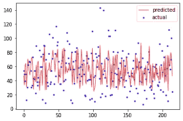

如你所见，预测在中间。而且它很大程度上预测得很好…除了它基本上错过了每一个 90 分以上的球季以及每一个 30 分以下的球季。不理想。

那我们该怎么办？我的方法:我基本上把它变成了混合回归/分类练习。对于每一个统计数据，我们知道回归模型在哪里做得好，在哪里做得不好，我们也知道这些异常值的范围。使用这些范围，我能够很容易地将统计数据分成不同的层，这些层使我能够构建 XGBoost 分类器模型来尝试预测它们。计划是将回归工作和分类工作的结果结合起来，以产生全面的预测。

这里有一个例子:本垒打的回归模型可靠地预测了 6-29 之间的任何事情。它在 0-5 和 30+之间摇摆不定。我对我的训练数据进行了编码，0–5 是 0，6–29 是 1，30+是 2。分类器算法会根据上面使用的所有输入数据，尝试预测每个玩家的 0、1 和 2。对于预测为 1 的任何东西，我使用回归预测。对于 0 和 2，我分别使用 0–5 和 30+范围，然后将回归模型的输出映射到我对这些范围的假设。

一个额外的复杂因素是:即使划分到层中，这些值仍然是异常值，这意味着我们正在处理不平衡的数据。这是一个有点问题的问题，因为算法可以为任何事情选择多数类，并且很大程度上是准确的。我采用过采样数据的方法来解决这个问题。过采样是一种复制代表性不足的数据以平衡建模数据集的方法。我尝试了几种不同的方法，最终决定采用 SMOTE(合成少数过采样技术)，它构建了未充分表示的数据的合成示例，而不是添加直接的副本。起初，我在使用这种方法时遇到了一点麻烦，因为我的模型中的交叉验证步骤似乎抵消了过采样。我发现我不正确地进行了过采样，在分割成交叉验证折叠之前应用了它。[这篇文章](https://kiwidamien.github.io/how-to-do-cross-validation-when-upsampling-data.html)很好地/更深入地解释了如何正确地实现这一点(以及哪里可能出错)。我最终用不平衡学习包通过管道实现了它，这是专门为此目的设计的。

```
from imblearn.pipeline import Pipeline, make_pipeline
from imblearn.over_sampling import SMOTE
RANDOMSTATE = 120imb_pipeline = make_pipeline(SMOTE(random_state=RANDOMSTATE), 
                              xgb.XGBClassifier(eval_metric='merror', **param_dict, verbosity=0, use_label_encoder=False))

scores = cross_val_score(imb_pipeline, xtrain, ytrain, scoring='f1_micro', cv=5)
print("Mean cross-validation score: %.2f" % scores.mean())kf_cv_scores = cross_val_score(imb_pipeline, xtrain, ytrain, scoring='f1_micro', cv=kfold)
print("K-fold CV average score: %.2f" % kf_cv_scores.mean())
```

我将这些分类器算法的成功定义为它们正确预测异常值的能力。我研究了精度(正确预测的离群值的比例)和召回率(识别的所有离群值的比例)，以及在应用 SMOTE 技术后这些度量如何变化。所有人都有所改善。总的来说，精确度非常好:在标记为异常值的统计数据中，算法在正确选择它们方面做得非常好。不过，召回率并不高，这意味着有很多算法没有发现的异常值。总结如下:

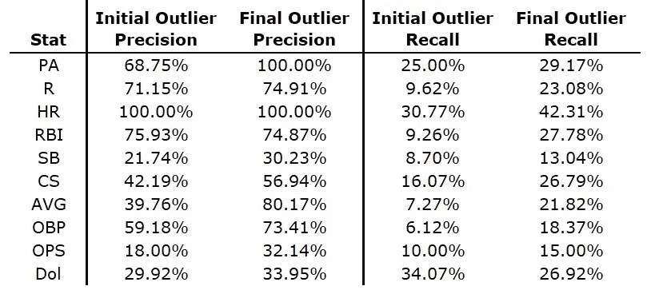

# 结果

但是天哪，伙计…结果在哪里？！？告诉我们发生了什么事！好吧好吧。让我们一点一点来。我将展示通过调整算法得到的最佳超参数，然后使用 SHAP 软件包中提供的精彩摘要图向您展示哪些输入变量对模型产生了最大的影响。我发现这些是令人惊奇的解释工具:输入特征按照对模型的重要性排列。对于每个特征，你会看到一个红到蓝的光谱:红色是较高的值，蓝色是较低的值。各个点从左到右排列，显示对模型的影响程度。因此，如果 RBI Lag_1(即前年的 RBI)的所有红点都在右边，这意味着 2019 年的较高 RBI 值对模型的积极影响比较低的值更大。

有些结果是直观的。以盗垒为例:最具预测性的变量是前一年的盗垒，速度(Spd)，前两年的盗垒，前一年被抓到的盗垒，跑垒(BsR)，以及前两年被抓到的盗垒。这似乎是显而易见的。其他一些数据则不然。我发现最令人吃惊的是年龄在其中的作用。我知道这很重要，但是对于这些数据中的一半来说，它是第一号预测因素，而且它在大多数情况下都排在前五位。

## 板材外观(PA)

```
Best hyperparameters:
{'n_estimators': 500,
  'learning_rate': 0.01,
  'max_depth': 3,
  'subsample': 0.5,
  'colsample_bytree': 0.25}
```


## **运行(R)**

```
Best hyperparameters:
{'n_estimators': 400,
  'learning_rate': 0.01,
  'max_depth': 4,
  'subsample': 0.5,
  'colsample_bytree': 0.15}
```

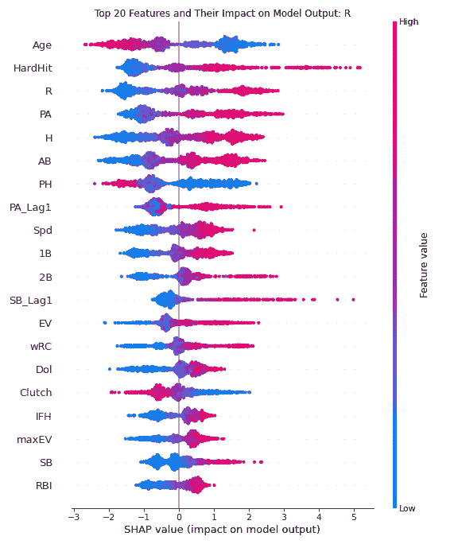

## 本垒打(小时)

```
Best hyperparameters:
{'n_estimators': 500,
  'learning_rate': 0.01,
  'max_depth': 4,
  'subsample': 0.6,
  'colsample_bytree': 0.3}
```

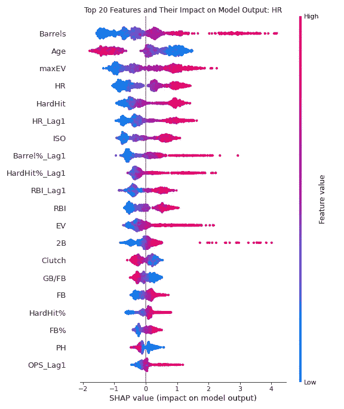

## 击球得分(打点)

```
Best hyperparameters:
{'n_estimators': 500,
  'learning_rate': 0.01,
  'max_depth': 6,
  'subsample': 0.4,
  'colsample_bytree': 0.3}
```

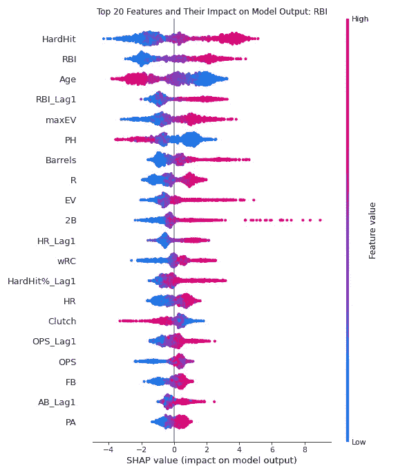

## 偷垒(某人)

```
Best hyperparameters:
{'n_estimators': 400,
  'learning_rate': 0.01,
  'max_depth': 3,
  'subsample': 0.4,
  'colsample_bytree': 0.35}
```

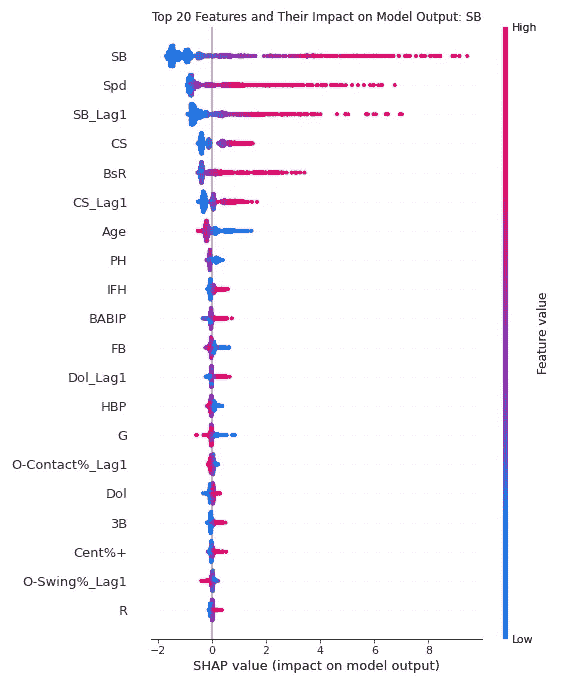

## 偷窃被抓(密室)

```
Best hyperparameters:
{'n_estimators': 300,
  'learning_rate': 0.01,
  'max_depth': 3,
  'subsample': 0.7,
  'colsample_bytree': 0.35}
```

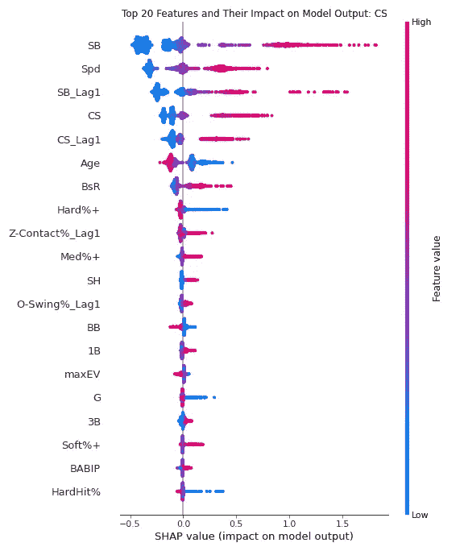

## 击球率(AVG)

```
Best hyperparameters:
{'n_estimators': 500,
  'learning_rate': 0.01,
  'max_depth': 3,
  'subsample': 0.4,
  'colsample_bytree': 0.25}
```

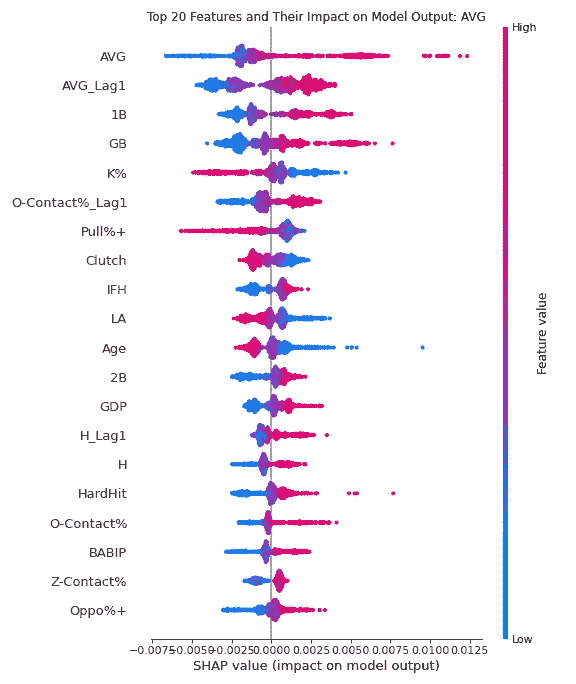

## 上垒百分比(OBP)

```
Best hyperparameters:
{'n_estimators': 500,
  'learning_rate': 0.01,
  'max_depth': 3,
  'subsample': 0.5,
  'colsample_bytree': 0.15}
```

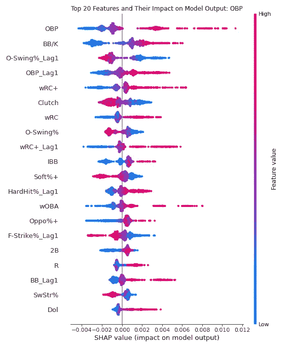

## 上垒百分比+击球百分比(OPS)

```
Best hyperparameters:
{'n_estimators': 500,
  'learning_rate': 0.01,
  'max_depth': 3,
  'subsample': 0.7,
  'colsample_bytree': 0.15}
```

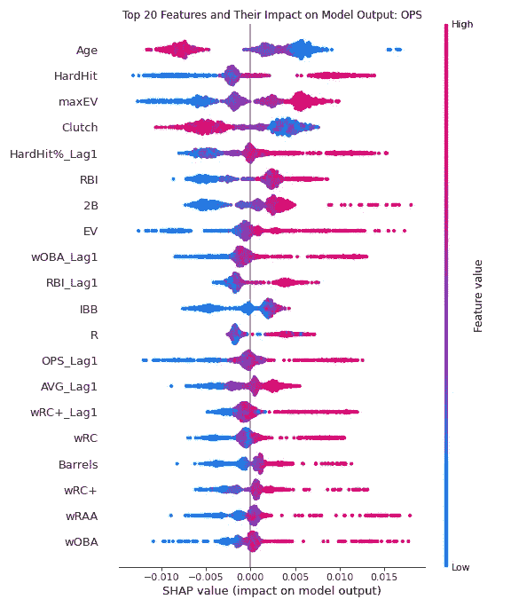

## 美元价值

```
Best hyperparameters:
{'n_estimators': 500,
  'learning_rate': 0.01,
  'max_depth': 3,
  'subsample': 1.0,
  'colsample_bytree': 0.35}
```

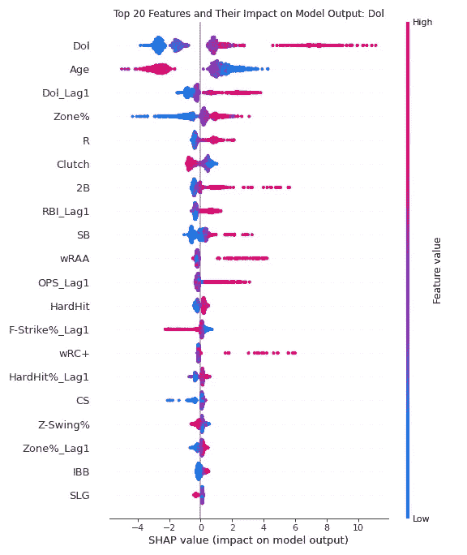

# 投影输出

一旦我有了完整的计划，我就根据自己的评分公式计算分数。我想看看它们与公布的投影相比如何，所以我使用了德里克·卡蒂的精彩的 [THEBAT 投影](https://www.fangraphs.com/projections.aspx?pos=all&stats=bat&type=thebat)(我认为这是技术上最先进的投影系统)。然后，我用给自己打分的方式给它们打分，这样我就可以检查它们之间的差异。我只看了那些平均选秀位置在 300 或更低的球员，因为，嗯，那些更有趣。首先，我们有一些球员，我预测他们会比棒球手表现得更好:

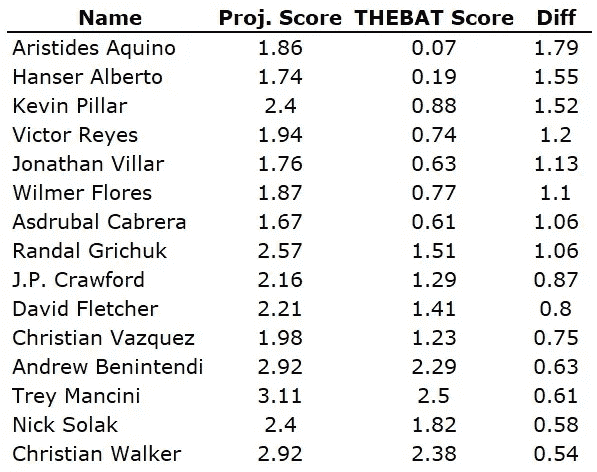

首先，我的预测没有考虑玩家是否已经开始工作。这就是为什么你会在这里看到像皮勒和维拉尔这样的人。算法不知道那些球员是作为替补签的。我们将看到这些在 2021 赛季的过程中如何发展。现在，让我们看看模型预测的产量比实际产量差的地方:

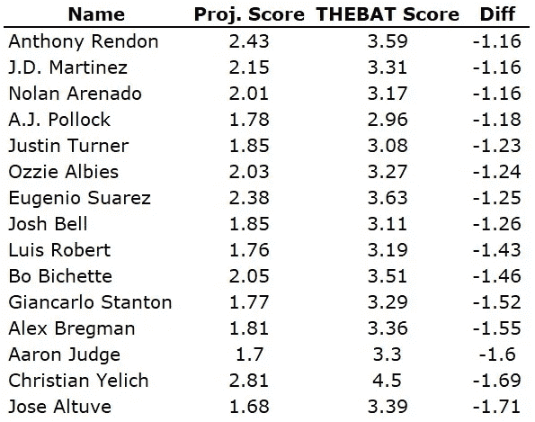

我从这套模型中看到的最大收获是:
1)我的模型对 2020 年糟糕表现的惩罚超过了对手。正如我之前讨论的，2020 年的数据有很多问题。在这个世界分崩离析的时候，60 场比赛中有太多我们不知道的东西。我的模型对那些因伤错过很多时间的球员更加悲观。在年底重温这些将会非常有趣。

## 包裹

如果你已经走到这一步，恭喜你。我希望你觉得这很有趣。接下来的一周左右，我们将推出这个版本。

你觉得我的方法怎么样？在未来的迭代中，我应该做哪些不同的事情？我正在让我的代码和数据文件在 GitHub 上可用。