# 棒球和机器学习第 2 部分:2021 年投球预测的数据科学方法

> 原文：<https://towardsdatascience.com/baseball-and-machine-learning-part-2-a-data-science-approach-to-2021-pitching-projections-530dbfe6dcc4?source=collection_archive---------27----------------------->


Jose Francisco Morales 在 [Unsplash](https://unsplash.com?utm_source=medium&utm_medium=referral) 上的照片

## 看看投球的最佳预测

在[棒球和机器学习第一部分](/baseball-and-machine-learning-a-data-science-approach-to-2021-hitting-projections-4d6eeed01ede)中，我概述了我在 3 月份使用回归和分类算法组合构建 2021 年 MLB 击球预测的方法。然后我骗了你。可怕地。我答应在“一周左右”内完成我的项目哎呀。我想我应该在这个估计中包含一个置信区间。将近六个星期后，我终于分娩了。

从今年开始，我越来越意识到这是一个多么糟糕的赛季。2020 年是现代历史上试图用作预测基础的最不正常的一年:60 场比赛，比正常情况开始得晚得多，有一个收缩的上升期，由于 COVID 而频繁取消。哦，让我们不要忽视在疫情期间演奏的心理影响。现在，我们可以加上 MLB 打击投手在投球时使用异物的影响，这一影响尚未确定。不过，我还是做了预测，所以让我们来看看。

该方法与我在第 1 部分中阐述的方法基本相同——请查看完整的文章。我将在这里给出一个简要的概述，但我将主要关注我们看到的投球与击球的具体差异以及投球的结果。

# 方法概述

## 源数据

[方块字](https://www.fangraphs.com/leaders.aspx?pos=all&stats=pit&lg=all&qual=y&type=8&season=2020&month=0&season1=2020&ind=0)。我的起始数据集包含了他们报告的所有投球统计数据。我自己加了几个字段，都是手动编译的。这些包括联赛的指标变量(0 代表 AL，1 代表 NL)，球员是否在之前的淡季更换了球队和/或联赛，以及他们是否在赛季中更换了球队/联赛，考虑了交易/削减/签约。这个变量比你想象的更加主观。如果一个球员在一个赛季中出现在几个球队，我会查看他们在哪里打了最多的比赛。如果有人在美联效力了六年，在休赛期被国联球队签下，并为他们打了七场比赛，然后在这一年的剩余时间里被交易回美联，我不认为这是改变联赛。我最初包含了团队的指标变量，但是在特性工程阶段我删除了它们。

我还为大约 20 个统计数据添加了滞后变量(即前一年统计数据的值)。这带来了一些问题，因为有相当多的球员在前几个赛季没有累积数据。我选择从数据集中删除这些案例，是基于这样一种假设，即包含这些变量的收益大于删除这些区域中的空行的损失。

我使用 2016-2019 年的数据来训练我的模型。对于先发投手，我使用了 60 局的最低投球局数，并删除了低于该阈值的所有数据点。对于替补投手，我设定了 40 局。

## **数据准备**

对于这个练习中最重要的部分，我在特性工程阶段从输入特性集中删除了几乎所有的 Statcast 字段。我更犹豫要不要为投球数据采取那一步。不过，我确实减少了，因为 Fangraphs 显示了来自多个来源的许多统计数据。我删除了 Pitch f/x 版本的 stats(在 Fangraphs 上标记为“(pi)”)并保留了 Statcast 版本(标记为“(sc)”)。这些字段也是您会发现绝大多数缺失数据的字段。这是合乎逻辑的:不是每个投手都投每种类型的球，所以自然会有差距。我处理缺失数据的一般方法是，如果填充的数据少于 60%,就删除一列，因为我认为填充这么多缺失值是没有用的。否则，我用两种方法填充空白:对于百分比，我用零填充空值，因为百分比是从包含未发生事件的其他字段中计算出来的。否则，我用每一列中的中值填充空值(按年份——在整个数据准备过程中我将年份分开)。

## 目标变量

我使用不同的模型预测了 11 个投球统计数据:投球局数(IP)，胜场数(W)，失球数(L)，救球数(SV)，吹救球数(BS)，持球数(HLD)，允许本垒打数(HRA)，三振数(K)，平均得分(ERA)，每局投手保送+安打数(WHIP)，以及 Fangraphs 的计算美元值(Dol)。对于训练数据，我使用了下一年的每个统计数据的结果。对于 2019 年的数据，目标变量是我缩放到 162 场的 2020 年数据。这不是一个理想的解决方案，但已经足够好了。

## 模型

我为这个练习构建了两种类型的模型。第一个使用 XGBoost 回归来产生上面列出的 2021 年统计数据的一组预测。我分几个步骤调优了这些模型:首先，我调优了最大树深度。接下来，我一起按树进行子抽样和列抽样。第三步是学习率，最后一步是估计数。我使用 kfold 交叉验证了十次折叠和平均绝对误差。这产生了坚实的整体结果，但遇到了机器学习的一个常见问题:它在预测中间值方面很好，但在确定离群值方面很糟糕。不幸的是，离群值是我们在预测棒球统计数据时最关心的。

为了解决这个问题，我准备了第二组模型，这次使用 XGBoost 分类器。先发投手和替补投手天生产生非常不同的统计范围，所以我在这个练习中把他们分成两个数据集。我将各种统计数据分成不同的等级，并预测这些等级(例如，对于先发投手，0-49 次三振是 0 级，50-179 次是 1 级，180 次以上是 2 级；第 0 层和第 2 层代表异常值)。因为我故意试图预测异常值，这些是严重不平衡的数据集。为了优化不平衡数据的模型，我对代表性不足的类使用了 SMOTE 过采样。和回归练习一样，我用 kfold 进行了十次交叉验证。不过，在这种情况下，我在交叉验证中使用了微平均 F1 分数，因为我在寻找精确度和召回率之间的最佳平衡。

我用分类模型预测异常值的能力来定义分类模型的成功。总的来说，精确度非常好:在标记为异常值的统计数据中，算法在正确选择它们方面做得非常好。回忆没有那么好，但在这方面投球比击球表现得更好。总结如下。这里有一些奇怪的东西。例如，救援投手投球局数以 0%的准确率和召回率开始，以 100%的准确率结束。这部分是因为中继局只有两层:少于 55 个 IP 是第 0 层，多于 55 个 IP 是第 1 层，第 0 层代表唯一的异常值。最初，算法预测每个人都在第 1 层。在应用 SMOTE 后，该模型使那些标记为第 0 层的 100%正确，但仅识别出那些异常值的 21.43%。

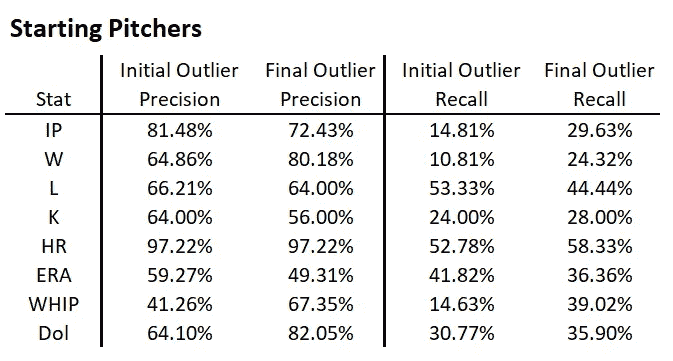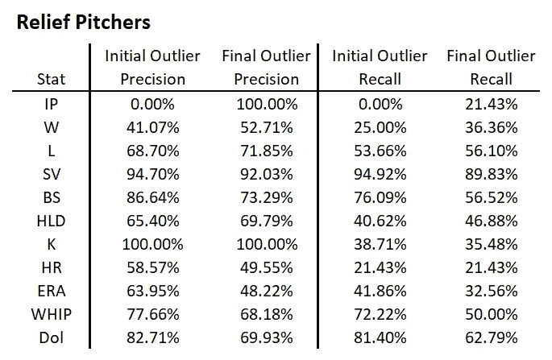

一旦所有模型都调优并最终确定，我就将结果组合起来构建我的预测:对于任何预测的中间层，我都使用回归结果。对于极端情况，我使用分类结果，将各层扩展到预期范围。

# 结果

让我们来看看每个统计数据。我将给出优化的超参数，然后向您展示哪些输入变量对模型的影响最大。汇总图来自 SHAP 包，它按照对模型影响从大到小的顺序显示输入要素。对于每个特性，都显示一个红到蓝的光谱，其中红色值较高，蓝色值较低。各个点从左到右排列，显示对模型的影响程度。因此，如果所有代表年龄的红点都在最左边，这意味着年龄越小，对模型的正面影响越大。

记住，输入的特征是针对上一季的，所以如果你看到 IP 预测 IP，说明是某一年的 IP 预测下一年的 IP。当您看到“Lag1”附加到一个 stat 上时，例如 IP_Lag1，它表示两年前投的局数。一个注意事项:我注意到有两个标签没有正确传递。如果您看到“#NAME？”，表示“-WPA”(所有负赢概率加事件的总和)，以及“#NAME？. 1”表示“+WPA”(所有负获胜概率相加事件的总和)。我不会在这里浪费你的时间来定义所有的 sabermetric 统计数据，所以如果你看到一个你不认识的统计数据，你应该查阅关于 Fangraphs 的 [sabermetrics 词汇表，或者，你知道，谷歌。](https://library.fangraphs.com/pitching/)

## 投球局数

```
Best hyperparameters:
{'n_estimators': 400,
  'learning_rate': 0.01,
  'max_depth': 3,
  'subsample': 0.8,
  'colsample_bytree': 0.1}
```

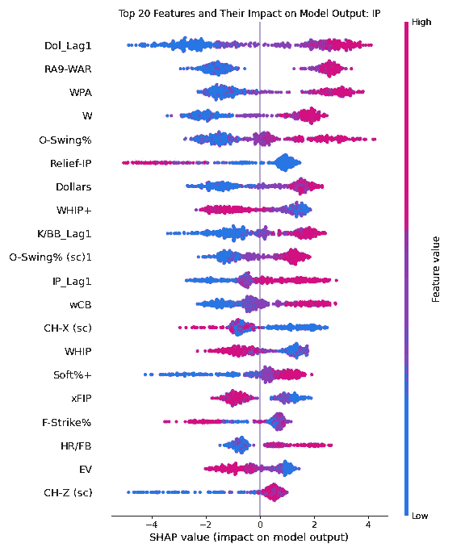

## 胜利(W)

```
Best hyperparameters:
{'n_estimators': 300,
  'learning_rate': 0.01,
  'max_depth': 7,
  'subsample': 0.5,
  'colsample_bytree': 0.2}
```

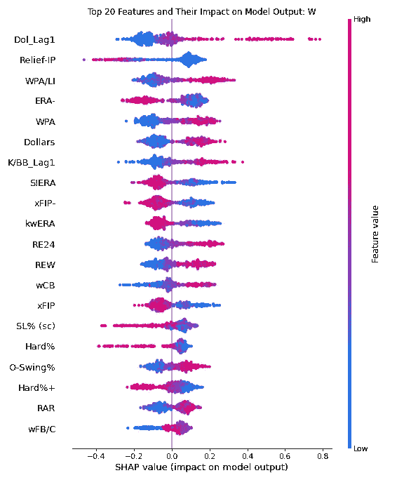

## 损失(L)

```
Best hyperparameters:
{'n_estimators': 300,
  'learning_rate': 0.01,
  'max_depth': 6,
  'subsample': 1.0,
  'colsample_bytree': 0.1}
```

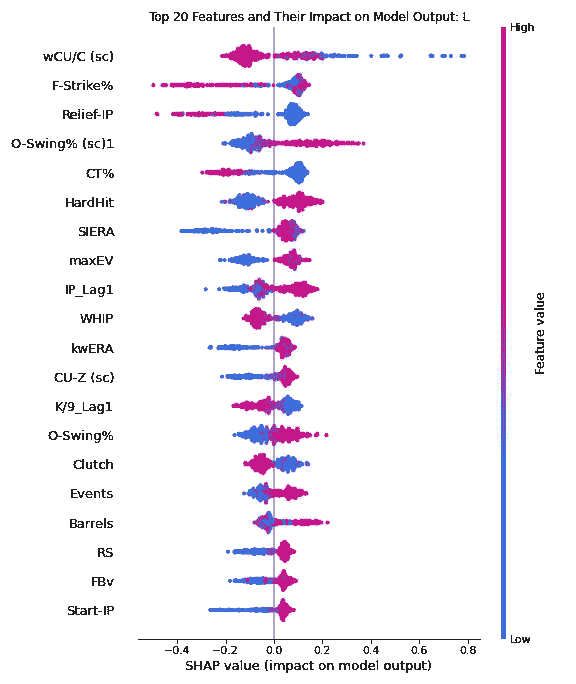

## 保存(服务)

```
Best hyperparameters:
{'n_estimators': 200,
  'learning_rate': 0.01,
  'max_depth': 6,
  'subsample': 0.4,
  'colsample_bytree': 0.3}
```

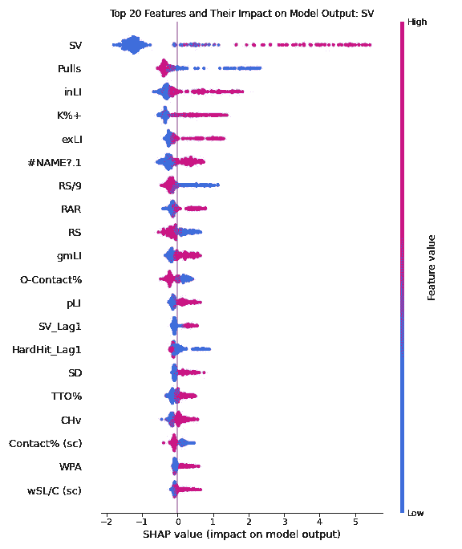

## 吹救(BS)

```
Best hyperparameters:
{'n_estimators': 200,
  'learning_rate': 0.01,
  'max_depth': 6,
  'subsample': 0.4,
  'colsample_bytree': 0.1}
```

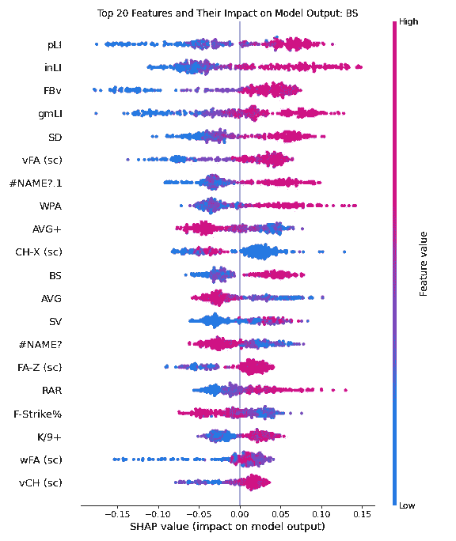

## 保留(HLD)

```
Best hyperparameters:
{'n_estimators': 200,
  'learning_rate': 0.01,
  'max_depth': 6,
  'subsample': 0.6,
  'colsample_bytree': 0.15}
```

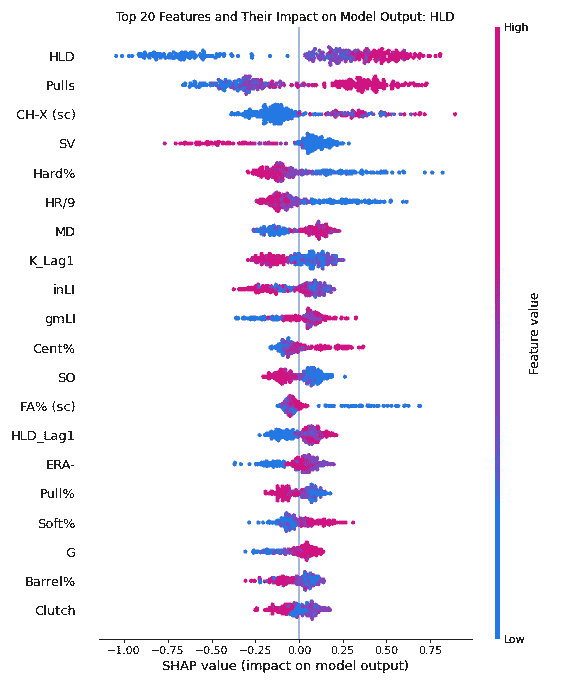

## 删除线(K)

```
Best hyperparameters:
{'n_estimators': 500,
  'learning_rate': 0.01,
  'max_depth': 3,
  'subsample': 0.4,
  'colsample_bytree': 0.2}
```

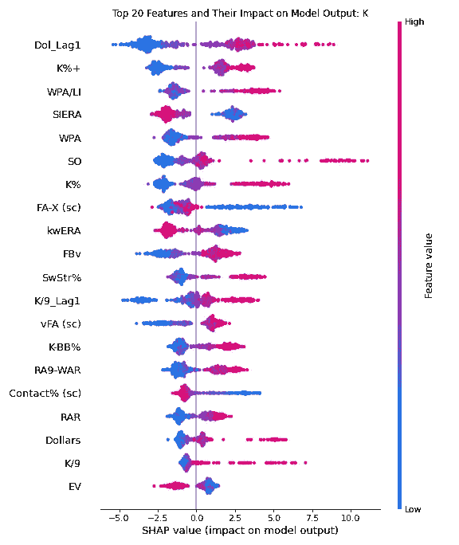

## 允许本垒打

```
Best hyperparameters:
{'n_estimators': 300,
  'learning_rate': 0.01,
  'max_depth': 8,
  'subsample': 0.8,
  'colsample_bytree': 0.1}
```

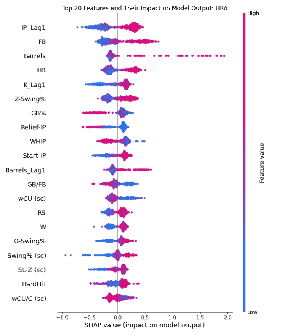

## 挣得运行平均值(ERA)

```
Best hyperparameters:
{'n_estimators': 500,
  'learning_rate': 0.01,
  'max_depth': 6,
  'subsample': 0.4,
  'colsample_bytree': 0.15}
```

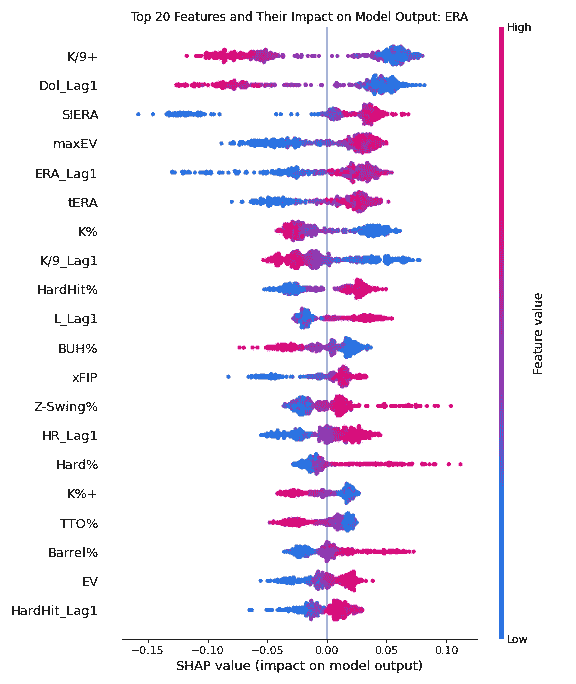

## 每局投球保送+安打数(鞭笞)

```
Best hyperparameters:
{'n_estimators': 500,
  'learning_rate': 0.01,
  'max_depth': 7,
  'subsample': 0.6,
  'colsample_bytree': 0.2}
```

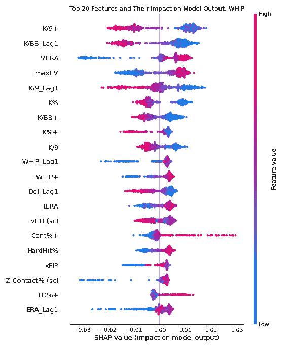

## 美元价值

```
Best hyperparameters:
{'n_estimators': 300,
  'learning_rate': 0.01,
  'max_depth': 4,
  'subsample': 0.5,
  'colsample_bytree': 0.15}
```

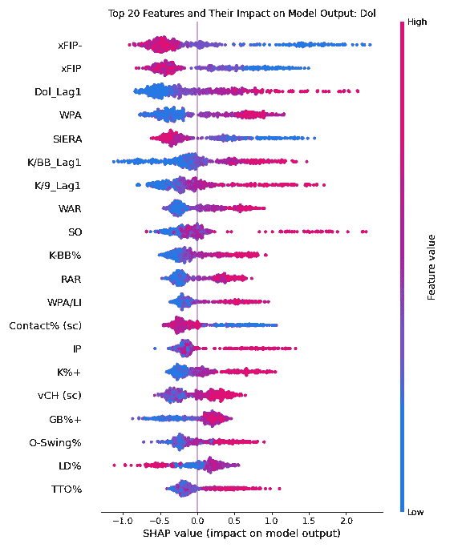

# 外卖食品

这些结果对我来说很有趣。首先映入我眼帘的是明显缺少年龄这一因素。在我的[击球文章](/baseball-and-machine-learning-a-data-science-approach-to-2021-hitting-projections-4d6eeed01ede)中，你可以看到年龄是大多数击球统计的头号预测因素，而在投球方面却无处可寻。

另一件让我特别感兴趣的事情是，一些整体价值指标扮演了多么突出的角色——尤其是尖牙尖牙的美元价值。奇怪的是，两年前的美元价值(Dol_Lag1)是最具预测性的因素。它是 IP、W 和 K 的头号预测因子，在其他几个统计数据中也占有显著地位。我还在消化这个结果。很耐人寻味。

K/9+是 ERA 和 WHIP 比率的强预测因子。我感觉好像专家们不久前就开始关注这个问题了，但在实践中看到这一点还是很有趣的。K/BB+也表现强劲。那一个最近几年在专家中非常流行。

我怀疑在投球局数类别中有一些混淆的变数。投球局数、先发投手 IP 和中继投手 IP 都在这些模型中出现，但它们之间有很大的相关性，所以算法只能在每个决策树中选取一个。当你把所有的树加起来得到集合模型时，这意味着一个或多个局的投球类别可能在最终结果中被缩短。

# 投影输出

【2022 注:在 2022 年 4 月评估这些结果时，我发现了一个重大错误。我的分数是正确的，但是蝙蝠的分数是错误的。更多详情请见[2022 文章](https://johnpette.medium.com/2022-machine-learning-baseball-projections-a-look-back-at-things-to-come-b6fce211bc9d)。]

一旦我有了完整的计划，我就用我开发的评分公式计算分数。然后我用同样的公式给德里克·卡蒂的[底部预测](https://www.fangraphs.com/projections.aspx?pos=all&stats=bat&type=thebat)打分，这样我就能看到最大的差异在哪里。我只看了那些有 60 局或更多预测局数的球员——比较那些没有被预测一个完整赛季的人的预测是没有用的。首先，我们有一些球员，我预测他们会比棒球手表现得更好:

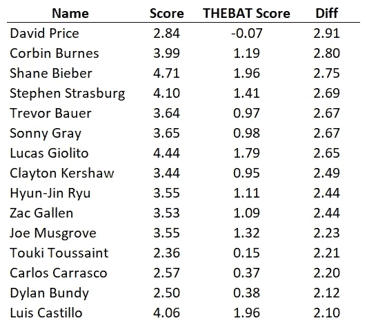

我将借此机会重申，这是进行这种特定练习的最愚蠢的一年，COVID 年被纳入了训练数据，MLB 改变了球，大量的受伤(其中一些与上面的 miiiight 有关)，现在，MLB 打击使用粘性物质。上面的名字已经有一大块受伤了。一些人失去了他们最初的工作(我们永远不会知道大卫·普莱斯的预测会如何发展)。我们还有很多赛季，但其中一些电话看起来真的很好(伯恩斯，默斯格罗夫)，其他人看起来像巨大的失误(邦迪，卡斯蒂洛)。

现在，让我们看看模型预测的产量比实际产量差的地方:

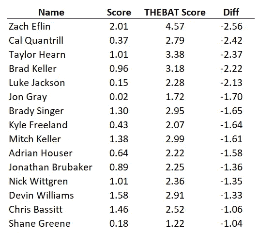

这批有意思。到本赛季的这个时候，算法似乎已经击中了比他们错过的悲观主义团队更多的东西。杰克逊、布鲁贝克、维特格伦、威廉姆斯和巴西特都是这份名单上的常客。其他 10 个与我的预测一致得多(尽管我们可以暂时放过谢恩·格林，因为他失业的时间太长了)。

## 包裹

伟大的投球探索到此结束。我希望它以某种方式为你打开了齿轮。

我很想听听你的意见。你觉得我的方法怎么样？在未来的迭代中，我应该做哪些不同的事情？我在 [GitHub](https://github.com/jpette/baseball_projections_2021) 上发布我的代码和数据文件。