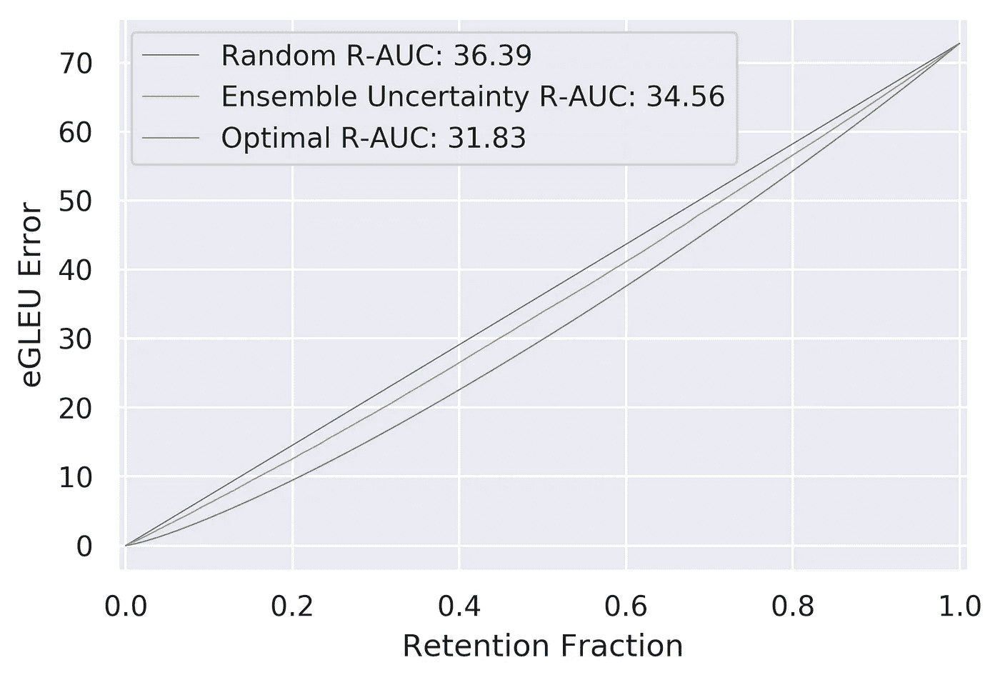

# NeurIPS 2021 轮班挑战赛机器翻译任务的基线演练

> 原文：<https://towardsdatascience.com/baseline-walkthrough-for-the-machine-translation-task-of-the-shifts-challenge-at-neurips-2021-e432c92882de?source=collection_archive---------11----------------------->

## 让你自己站起来跑起来！


图片由 Yandex 提供

分布式转移(训练和部署数据之间的不匹配)在现实世界的任务中普遍存在，并对人工智能系统的安全和可靠使用提出了重大挑战。今年在 NeurlPS 上，我们组织了 [***转变挑战***](https://research.yandex.com/shifts) ，在那里我们调查了在真实的工业规模应用中对分布转变和不确定性的鲁棒性。本博客仅针对此次挑战的机器翻译任务，是对[官方 Github 页面](https://github.com/yandex-research/shifts/tree/main/translation)上的说明的补充，带有关于数据集、培训和评估流程的*附加说明*。本教程是对黄的《换挡挑战赛车辆运动预测任务教程[的后续。](https://medium.com/@andrehuang0/baseline-walkthrough-of-the-vehicle-motion-prediction-task-in-shifts-challenge-at-neurlps-2021-22f5d51d854b#7570)

本教程的结构如下:

1.  任务概述
2.  设置环境和存储库
3.  下载数据和基线
4.  将数据预处理成 Fairseq 格式
5.  模特培训
6.  获得预测和不确定性估计
7.  模型评估和提交
8.  改进方向

# 1.任务概述

作为轮班数据集的一部分，我们检查机器翻译的任务。翻译服务，如 Google Translate 或 Yandex Translate，在其翻译查询中经常遇到非典型和不寻常的语言使用。这通常包括俚语、脏话、糟糕的语法、拼写和标点符号，以及表情符号。这对现代翻译系统提出了挑战，现代翻译系统通常是在语言使用更“标准”的语料库上训练的。因此，对于模型来说，重要的是既要对非典型语言的使用具有鲁棒性，以提供高质量的翻译，又要能够指出它们何时不能提供高质量的翻译。这在机器翻译系统用于翻译敏感的法律或外交文件时尤其重要，在这种情况下，意义不“在翻译中丢失”是至关重要的。因此，我们希望模型能够在一系列场景中表现良好，并在它们不能表现良好时进行指示。这分别对应于 ***鲁棒性*** 和 ***不确定性*** 的预测。在*转变* *挑战*中，我们评估了分布转变下的预测稳健性和不确定性*。*

在大多数先前的工作中，不确定性估计和对分布变化的稳健性是分开评估的。鲁棒性通常通过对特定任务的预测性能的度量来评估，例如分类错误率。同时，不确定性估计的质量通常通过区分与训练数据匹配的“域内”数据集和基于不确定性测量的移位或“域外”(OOD)数据集的能力来评估。然而，我们认为这两个问题是一个共同整体的两个部分，因此必须一起评估*。此外，它们必须在包含大量匹配或“域内”数据和大量移位数据的数据集上进行联合评估[1]。我们将在评估部分描述更多细节。*

*翻译本质上是一个 ***结构化预测*** 任务，因为输出序列中的标记之间存在依赖关系。通常我们必须对这些依赖的形式做出假设；例如，大多数现代翻译系统是从左到右自回归的。然而，我们可以考虑条件独立预测或其他因子分解顺序。这些假设的性质使得获得理论上合理的不确定性度量具有挑战性。直到最近，人们才开始开发结构化预测的原则性不确定性测量方法[2，3，4，5，6]。然而，这仍然是一个未解决的任务和一个富有成果的研究领域。本教程研究了如何在自回归结构化预测【2】中基于[不确定性估计建立和运行基线系统。](https://openreview.net/pdf?id=jN5y-zb5Q7m)*

# *2.设置环境和存储库*

*要开始这项任务，您必须首先设置所有必需的包和适当的环境。请注意代码有点过时，使用的是 **Fairseq 0.9** 和 **PyTorch 1.6.0。**我们计划很快创建一个更干净的最新实现。因此，你将需要 **python 3.7** 和 **CUDA 10.2。***

*首先，启动您的 shell，克隆并安装轮班质询存储库:*

```
*git clone [https://github.com/yandex-research/shifts.git](https://github.com/yandex-research/shifts.git)*
```

*在目录中，您会发现一个“requirements . txt”——继续安装所有这些包:*

```
*pip install matplotlib numpy torch==1.6.0 sacrebleu==1.4.3 nltk==3.4.5*
```

*这也将安装与 Fairseq 0.9 兼容的所有必需软件包的版本。最后，克隆一个自回归结构化预测【2】中[不确定性估计的实现。](https://openreview.net/pdf?id=jN5y-zb5Q7m)*

```
*git clone [https://github.com/KaosEngineer/structured-uncertainty.git](https://github.com/KaosEngineer/structured-uncertainty.git)
cd structured-uncertainty 
python3 -m pip install — user — no-deps — editable .*
```

*现在，您已经设置了环境、班次库和结构化不确定性库，应该为下一步做好准备了。*

# *3.下载数据和基线*

*现在您已经设置了您的存储库，您可以下载培训和开发数据以及基线模型。注意，**下载数据的脚本也做一些初始预处理。***

*要下载培训和发展数据，请运行预处理脚本:*

```
*chmod +x ./shifts/translation/data/prepare_data.sh ./shifts/translation/data/prepare_data.sh*
```

*这将对数据进行预处理，将所有训练数据合并为一个数据，并从训练数据中移除重复和复制的示例。接下来，下载基线模型:*

```
*wget [https://storage.yandexcloud.net/yandex-research/shifts/translation/baseline-models.tar](https://storage.yandexcloud.net/yandex-research/shifts/translation/baseline-models.tar)tar -xf baseline-models.tar*
```

*这将产生以下顶级目录结构:*

```
*./
├── baseline-models
├── mosesdecoder
├── orig
├── shifts
├── structured-uncertainty
├── subword-nmt
└── wmt20_en_ru*
```

***orig** 、 **wmt20_en_ru** 和 **baseline-models** 目录应包含以下内容:*

```
*orig
├── dev-data
│ ├── LICENSE.md
│ ├── newstest2019-enru-ref.ru.sgm
│ ├── newstest2019-enru-src.en.sgm
│ ├── reddit_dev.en
│ ├── reddit_dev.meta
│ └── reddit_dev.ru
└── train-data
 ├── 1mcorpus
 │ ├── corpus.en_ru.1m.en
 │ └── corpus.en_ru.1m.ru
 ├── WikiMatrix.v1.en-ru.langid.en
 ├── WikiMatrix.v1.en-ru.langid.ru
 ├── WikiMatrix.v1.en-ru.langid.tsv
 ├── commoncrawl.ru-en.en
 ├── commoncrawl.ru-en.ru
 ├── en-ru
 │ ├── DISCLAIMER
 │ ├── README
 │ ├── UNv1.0.en-ru.en
 │ ├── UNv1.0.en-ru.ids
 │ ├── UNv1.0.en-ru.ru
 │ └── UNv1.0.pdf
 ├── extra
 ├── news-commentary-v15.en-ru.en
 ├── news-commentary-v15.en-ru.ru
 ├── news-commentary-v15.en-ru.tsv
 ├── news.en
 ├── news.en.translatedto.ru
 ├── news.ru
 ├── news.ru.translatedto.en
 ├── paracrawl-release1.en-ru.zipporah0-dedup-clean.en
 ├── paracrawl-release1.en-ru.zipporah0-dedup-clean.ru
 ├── readme.txt
 ├── wikititles-v2.ru-en.en
 ├── wikititles-v2.ru-en.ru
 └── wikititles-v2.ru-en.tsv
wmt20_en_ru
├── code
├── reddit_dev.en
├── reddit_dev.ru
├── test19.en
├── test19.ru
├── tmp
│ ├── bpe.reddit_dev.en
│ ├── bpe.reddit_dev.ru
│ ├── bpe.test19.en
│ ├── bpe.test19.ru
│ ├── bpe.train.en
│ ├── bpe.train.ru
│ ├── bpe.valid.en
│ ├── bpe.valid.ru
│ ├── reddit_dev.en
│ ├── reddit_dev.ru
│ ├── test19.en
│ ├── test19.ru
│ ├── train.en
│ ├── train.en-ru
│ ├── train.ru
│ ├── train.tags.en-ru.clean.tok.en
│ ├── train.tags.en-ru.clean.tok.ru
│ ├── train.tags.en-ru.tok.en
│ ├── train.tags.en-ru.tok.ru
│ ├── valid.en
│ └── valid.ru
├── train.en
├── train.ru
├── valid.en
└── valid.ru
baseline-models/
├── dict.en.txt
├── dict.ru.txt
├── model1.pt
├── model2.pt
├── model3.pt
├── model4.pt
└── model5.pt*
```

# ***4。将数据预处理成 Fairseq 格式***

*既然您已经下载了数据，清理并预处理了它，现在必须将它转换成一个 Fairseq 特定的格式。这可以使用以下命令来完成:*

```
*python3 structured-uncertainty/preprocess.py — source-lang en — target-lang ru — trainpref wmt20_en_ru/train — validpref wmt20_en_ru/valid — testpref wmt20_en_ru/test19,wmt20_en_ru/reddit_dev — destdir data-bin/wmt20_en_ru — thresholdtgt 0 — thresholdsrc 0 — workers 24*
```

*如果您使用提供的基线模型，请使用以下命令进行预处理:*

```
*python3 structured-uncertainty/preprocess.py — srcdict baseline-models/dict.en.txt — tgtdict baseline-models/dict.ru.txt — source-lang en — target-lang ru — trainpref wmt20_en_ru/train — validpref wmt20_en_ru/valid — testpref wmt20_en_ru/test19,wmt20_en_ru/reddit_dev — destdir data-bin/wmt20_en_ru — thresholdtgt 0 — thresholdsrc 0 — workers 24*
```

*上面的命令使用基线模型附带的字典，这些字典与您通过运行前面几节中的脚本得到的字典略有不同。以上两个命令应该创建一个新目录' ***data-bin*** '，其结构如下:*

```
*data-bin/
└── wmt20_en_ru
 ├── dict.en.txt
 ├── dict.ru.txt
 ├── test.en-ru.en.bin
 ├── test.en-ru.en.idx
 ├── test.en-ru.ru.bin
 ├── test.en-ru.ru.idx
 ├── test1.en-ru.en.bin
 ├── test1.en-ru.en.idx
 ├── test1.en-ru.ru.bin
 ├── test1.en-ru.ru.idx
 ├── train.en-ru.en.bin
 ├── train.en-ru.en.idx
 ├── train.en-ru.ru.bin
 ├── train.en-ru.ru.idx
 ├── valid.en-ru.en.bin
 ├── valid.en-ru.en.idx
 ├── valid.en-ru.ru.bin
 └── valid.en-ru.ru.idx*
```

*其中 ***测试*** 为域内开发数据集— ***新闻测试 19******测试 1*** 为转移后的开发数据— ***reddit_dev*** 。*

# *5.模特培训*

*现在，如果您想要重新创建基线，可以运行以下命令:*

```
*python3 structured-uncertainty/train.py data-bin/wmt20_en_ru — arch transformer_wmt_en_de_big — share-decoder-input-output-embed — fp16 — memory-efficient-fp16 — num-workers 16 — optimizer adam — adam-betas ‘(0.9, 0.98)’ — clip-norm 0.0 — lr 5e-4 — lr-scheduler inverse_sqrt — warmup-updates 4000 — dropout 0.1 — weight-decay 0.0001 — criterion label_smoothed_cross_entropy — label-smoothing 0.1 — max-tokens 5120 — save-dir MODEL_DIR — max-update 50000 — update-freq 16 — keep-last-epochs 10 — seed 0*
```

*这用于产生基线，只有种子不同。如果你正在训练的 GPU 不是 V100 或 A100，那么很可能你不应该使用 FP16，因为这种模式在数值上可能不稳定。请注意，您可能希望使用不同的设置、不同的历元数或使用不同的体系结构来训练您的模型，因此该命令的详细信息可能会有所不同。*

# *6.获得预测和不确定性估计*

*现在，您已经有了一个基线模型或您自己的模型的集合，您可以对单个模型或集合运行推理，如下所示。要运行单一模型基线:*

```
*mkdir single 
for i in test test1; do 
   python3 structured-uncertainty//generate.py wmt20_en_ru/ — path      baseline-models/model1.pt — max-tokens 4096 — remove-bpe — nbest 5 — gen-subset ${i} >& single/results-${i}.txt
done*
```

*要运行集合基线:*

```
*mkdir ensemble
for i in test test1; do 
 python3 structured-uncertainty/generate.py wmt20_en_ru/ — path baseline-models/model1.pt:baseline-models/model2.pt:baseline-models/model3.pt — max-tokens 1024 — remove-bpe — nbest 5 — gen-subset ${i} — compute-uncertainty >& ensemble/results-${i}.txt
done*
```

*注意，如果您正在使用 ***集合*** ，您应该只使用“ ***—计算不确定性*** ”标志。这产生了翻译的原始输出和相关的不确定性分数，然后需要进一步处理。所有文件都保存在目录“single”和“ensemble”中，结构如下:*

```
*ensemble
├── results-test.txt
└── results-test1.txt*
```

# *7.模型评估和提交*

*既然您已经成功地用您的模型运行了推理，我们现在需要评估模型的输出并创建一个提交文件。请记住，test 是您的 newstest19，即非转移开发数据，而 test1 是 reddit_dev，即转移开发数据。我们将对这两个模型进行评估。*

*这可以通过运行以下脚本轻松完成:*

```
*chmod +x ./shifts/translation/assessment/eval_single.sh
chmod +x ./shifts/translation/assessment/eval_ensemble.sh./shifts/translation/assessment/eval_single.sh
./shifts/translation/assessment/eval_ensemble.sh*
```

*该脚本现在将修改单个目录和集合目录，如下所示:*

```
*ensemble
├── results-test.txt
├── results-test1.txt
├── test
│ ├── aep_du.txt
│ ├── aep_tu.txt
│ ├── entropy_expected.txt
│ ├── ep_entropy_expected.txt
│ ├── ep_epkl.txt
│ ├── ep_mkl.txt
│ ├── ep_mutual_information.txt
│ ├── epkl.txt
│ ├── expected_entropy.txt
│ ├── hypo_ids.txt
│ ├── hypo_likelihoods.txt
│ ├── hypos.txt
│ ├── log_probs.txt
│ ├── logcombo.txt
│ ├── logvar.txt
│ ├── mkl.txt
│ ├── mutual_information.txt
│ ├── npmi.txt
│ ├── ref_ids.txt
│ ├── refs.txt
│ ├── score.txt
│ ├── score_npmi.txt
│ ├── tmp
│ ├── var.txt
│ └── varcombo.txt
└── test1
 ├── aep_du.txt
 ├── aep_tu.txt
 ├── entropy_expected.txt
 ├── ep_entropy_expected.txt
 ├── ep_epkl.txt
 ├── ep_mkl.txt
 ├── ep_mutual_information.txt
 ├── epkl.txt
 ├── expected_entropy.txt
 ├── hypo_ids.txt
 ├── hypo_likelihoods.txt
 ├── hypos.txt
 ├── log_probs.txt
 ├── logcombo.txt
 ├── logvar.txt
 ├── mkl.txt
 ├── mutual_information.txt
 ├── npmi.txt
 ├── ref_ids.txt
 ├── refs.txt
 ├── score.txt
 ├── score_npmi.txt
 ├── tmp
 ├── var.txt
 └── varcombo.txt*
```

*除了假设 id(***hypo _ ids . txt***)、引用( ***refs.txt*** )假设(***hypo . txt***)和假设可能性(***hypo _ likelihoods . txt***)之外，大多数输出都是代码产生的不同的不确定性度量。假设文件应该比参考文件长射束尺寸的倍数。例如，如果光束宽度为 5，那么假设文件应该比参考文件长 5 倍。*

*一旦我们获得了假设和(许多不同的)不确定性分数，我们就可以评估相对于参考文献的预测，然后创建提交文件。首先，让我们讨论如何评估模型。*

*使用 BLEU 和 GLEU 指标评估模型的性能。然而，BLEU 仅在*语料库级别*是鲁棒的，而 GLEU 在*句子级别*是鲁棒的。由于我们对评估每个翻译句子的*质量感兴趣，我们的鲁棒性和不确定性质量的 ***联合评估*** 使用 GLEU。我们计算模型相对于适当的参考转录产生的每个假设的 GLEU。回想一下，该模型可以为每个输入产生多个平移假设(例如:如果波束宽度为 5，则每个输入 5 个)。我们分别通过取最大值或所有假设的加权平均值来计算最大(最佳)GLEU 和预期 GLEU。每个假设的权重可以用不同的方式计算。一种方法是对每个假设的长度归一化似然性进行指数化和归一化。这将产生一组总计为 1 的 5 个正权重。最后，我们在**联合域内和移位数据集(*测试+测试 1* )上取平均 maxGLEU 或 expectedGLEU。****

*现在，我们已经评估了我们的模型在联合域内和移位集上的预测质量，我们可以通过构建误差保留曲线来评估不确定性估计的质量。为此，我们首先通过从 100 中减去(这样越低越好)，将我们的 GLEU 度量转换为“ *GLEU 误差*”。接下来，按照不确定性递减的顺序，用从神谕中获得的基本事实转录替换模型的预测，从而构建误差保留曲线，从而减少误差。理想情况下，模型的不确定性与其误差相关，因此误差最大的预测将首先被替换，随着更多预测被替换，这将产生平均误差的最大减少。这代表了一种混合的人类-人工智能场景，其中模型可以在困难的情况下向先知(人类)寻求帮助，并从先知那里获得关于这些例子的完美预测。*

*随着原始预测的保留部分减少，GLEU 误差也减少。最后，我们测量误差保留曲线下的面积(R-AUC)。保留曲线下面积(R-AUC)是一个用于联合评估对分布变化的稳健性和不确定性估计质量的指标。R-AUC 可以通过改进模型的预测来降低，使得它在任何给定的保留率下具有更低的总误差，或者通过提供与误差更好相关的不确定性的估计，使得最不正确的预测首先被拒绝。*

**

*在上面的保留曲线中，除了基于不确定性的排名，我们还包括了代表“随机”排名和“最佳”排名的曲线，前者不确定性估计值完全没有信息，后者不确定性估计值与误差完全相关。这些代表作为不确定性质量函数的 R-AUC 性能的下限和上限。根据评估数据(10 月 17 日相关数据)获得最低 R-AUC 的提交材料将胜出。*

*现在我们已经讨论了评估，让我们讨论如何创建提交文件。如果您已经运行了上面描述的所有内容，那么您的顶级目录中应该已经有一个“submission.json”文件了。该文件是通过运行以下命令创建的:*

```
*python shifts/translation/assessment/create_submission.py ensemble/test ensemble/test1 — save_path ./submission-ensemble.json — beam_width 5 — nbest 5 — ensemble — uncertainty_metric SCR-PE*
```

*这个脚本接受域内数据( ***测试*** )，然后是移位数据( ***测试 1*** )，保存路径，解码期间的波束宽度是多少( ***beam_width*** )，要使用的假设有多少( ***n_best*** )，是否使用了 ***集合*** 输出，以及要包含哪些不确定性度量(**)然后，该脚本将输出处理成一个 json-list 文件，其结构如下:***

```
*jsn_list = [jsn0, jsn1, ..., jsonN]jsn0 =  {‘id’: ‘001’,
	‘hypos’: [hypo1, hypo2, hypo3],
	‘uncertainty’: 9000}

hypo1 = {‘text’: “Кошка сидела на столе”,
	 ‘confidence’: 0.3}*
```

*然后可以在*班次*网站上提交该文件。注意，如果您使用自定义的不确定性度量，那么您必须修改这个脚本。*

# *8.改进方向*

*这篇博客只涉及轮班挑战中机器翻译任务的基线方法。有几个方向可以带来有趣的发现和改进:*

*   *增强集合中模型的多样性。这可以通过使用测试时数据扩充来实现，例如 BPE 丢失或在测试时在每个系综成员中启用“正常”丢失。*
*   *考虑组合对数据做出不同假设的模型集合，如从左到右、从右到左自回归模型、非自回归模型和允许考虑任意分解顺序的模型，如 XL-Net [7]。*
*   *考虑调整和评估不需要使用模型集合的确定性方法[9]。*

*但是，你可以自由地找到自己的问题解决方案，只要他们遵守[这里描述的*和*](https://research.yandex.com/shifts/terms)的规则和计算限制。*

# *参考*

*[1] A. Malinin、N. Band、Ganshin、Alexander、G. Chesnokov、Y. Gal、M. J. F. Gales、A. Noskov、A. Ploskonosov、L. Prokhorenkova、I. Provilkov、v .刘冰、v .刘冰、Roginskiy、Denis、M. Shmatova、P. Tigas 和 B. Yangel，“转变:跨多个大规模任务的真实分布转变数据集”，2021 年。*

*[2] Andrey Malinin 和 Mark Gales，“自回归结构化预测中的不确定性估计”，ICLR 2021。*

*[3]萧，蒂姆·Z 和戈麦斯，艾丹·丹和加尔·亚林，“Wat heb je gezegd？用变分变压器检测非分布翻译”，贝叶斯深度学习研讨会，NeurIPS 2019*

*[4]王，刘硕，杨，王，晁，栾，黄波，孙，茅松，“基于不确定性的置信度估计改进回译”。2019*

*[5] Fomicheva，Marina 和 Sun，Shuo 和 Yankovskaya，Lisa 和 Blain，Frederic 和 Guzman，Francisco 和 Fishel，Mark 和 Aletras，Nikolaos 和 Chaudhary，Vishrav 和 Specia，Lucia，《神经机器翻译的无监督质量估计》，2020 年*

*[6]诺廷、帕斯卡尔和埃尔南德斯-洛巴托、何塞·米格尔和加尔、亚林。
“高维数据的原则性不确定性估计”，深度学习研讨会中的不确定性&鲁棒性，ICML，2020 年*

*[7]杨，，戴，子航，杨，，卡波内尔，海梅，萨拉赫丁诺夫，鲁斯和勒，郭五，“XL-Net:语言理解的广义自回归预训练”，NeurIP，S2019*

*[8] Joost van Amersfoort，Lewis Smith，Yee Whye Teh，Yarin Gal，“使用单一深度确定性神经网络进行不确定性估计”，ICML，2020 年*