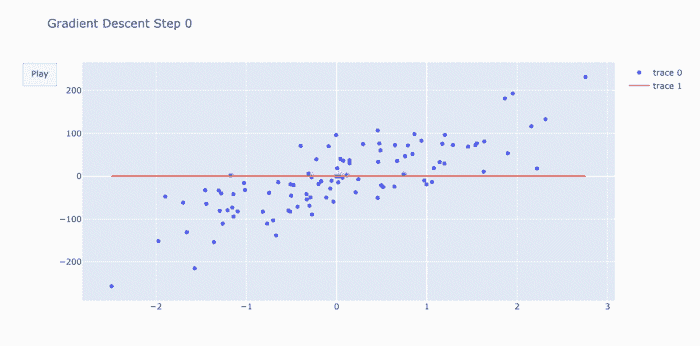
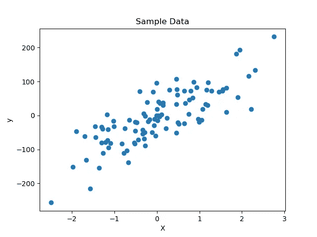
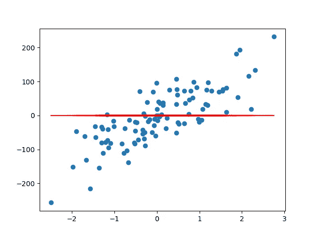
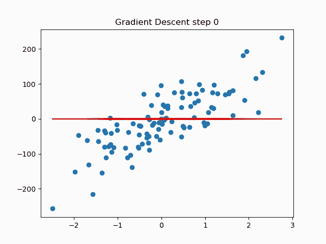
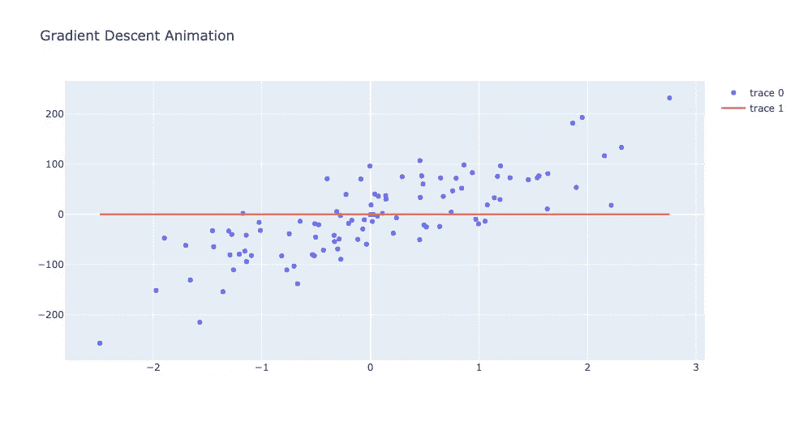

# 用 Matplotlib 和 Plotly 实现基本动画。

> 原文：<https://towardsdatascience.com/basic-animation-with-matplotlib-and-plotly-5eef4ad6c5aa?source=collection_archive---------13----------------------->

## 使用最流行的 python 绘图库制作简单动画的最短路径。

有时候动画视觉效果是有意义的。动画可以帮助更完整地理解数据。如果你的媒介是屏幕，你可能会发现自己偶尔需要动画。你要问的下一个问题是，“我应该为动画使用哪个工具包。”在这里，我用 [Matplotlib](#eb2d) 和 [Plotly](#685f) 比较了创建如下基本动画的过程。



# 数据

> 如果你不在乎数据，我不会评判你— [跳到动画](#eb2d)

我们将使用梯度下降来制作线性回归模型拟合的动画。我选择这个是因为这个动画很简单，但是有两个不同的部分:

*   数据点的散点图
*   可视化拟合过程的动画线

我使用`sklearn.datsets.make_regression`生成随机数据，如下所示:

```
from sklearn.datasets import make_regression
X, y = make_regression(n_features = 1, noise=50, random_state=543)
```

这是我们测试数据的样子。我们将尽可能保持代码简单，所以我不会做任何额外的格式化，尽管这会给我们双方带来痛苦。



# 回归

我们不能使用 statsmodels 或 sklearn 的 LinearRegression 模型，因为我们需要存储回归的每次迭代，而不仅仅是最终的拟合线。相反，我借用了 Joseph Bautista 文章[中的代码，在 10 行代码](/linear-regression-using-gradient-descent-in-10-lines-of-code-642f995339c0)中使用梯度下降进行线性回归，并对其进行了修改，以返回拟合的每次迭代的斜率和截距列表。

这对于动画来说是不需要理解的，但是这是回归函数。

```
def linear_regression(X, y, m_current=0, b_current=0, epochs=1000, learning_rate=0.0001):
    N = float(len(y))

    ms = [m_current] # a place to store our m values
    bs = [b_current] # a place to store our b values

    for i in range(epochs):
        y_current = (m_current * X) + b_current
        cost = sum([data**2 for data in (y-y_current)]) / N
        m_gradient = -(2/N) * sum(X * (y - y_current))
        b_gradient = -(2/N) * sum(y - y_current)
        m_current = m_current - (learning_rate * m_gradient)
        b_current = b_current - (learning_rate * b_gradient)

        ms.append(m_current)
        bs.append(b_current)

    return ms, bs
```

## 预测

为了生成线条拟合动画的数据，我们将我们的`X`数据输入到`linear_regression`函数中，并计算出绘制的连续线条。

```
# run the linear regression and store the m and b values
ms, bs = linear_regression(X.ravel(), y, 
                           epochs=200, learning_rate=0.01)# build the lines, mx + b for all ms X's and b's
y_lines = (ms * X + bs).T # transpose for easier indexing
```

现在你们一直在等待的…

# 动画— Matplotlib

matplotlib 的动画 api 很简单，但是如果你在 jupyter 笔记本中，你的动画**将不会在 GUI 后端设置为** `**inline**` **的情况下运行。我将 GUI 后端设置为`notebook`。还有其他的解决方案。**

制作动画的过程是这样的:

## 1)创造一个开始的情节

*   实例化 matplotlib 图形
*   用`plt.scatter`绘制数据
*   绘制初始回归线并保存到`line`以便我们以后更新，`line`后的逗号(`,`)从`plt.plot`返回的列表中解包单个`Line2D`对象。

```
# we will need the fig object later
fig = plt.figure)# plot our original data
plt.scatter(X,y)# create a line to update
line, = plt.plot(ms[0], bs[0], c='r', linewidth=5)
```



## 2)制作线条动画

为了制作线条动画，我们编写了一个函数，用它的`set_ydata`方法更新`line`对象中的数据。然后我们使用 Matplotlib 的`FuncAnimation`方法为动画中的每一帧调用该函数。

```
from matplotlib.animation import FuncAnimation# update the frames based on the parameter i
def animate(i):

    # set the title to indicate the iteration
    plt.title(f'Gradient Descent step {i}')

    # change the data for the y axis points of the line
    line.set_ydata(y_lines[i])return line,# run the animation
animation = FuncAnimation(fig, animate, frames=len(ms), interval=20)
```

这给了我们这个！多酷啊。



这里使用的`FuncAnimation`属性是:

*   `fig`:应用动画的人物对象
*   `func`:更新每一帧要调用的函数
*   `frames`:调用上述函数的总次数。这等于最终动画中的总帧数。
*   `interval`:帧与帧之间的延迟，单位为毫秒。

## 3)保存动画

用 matplotlib 保存动画可以说是最令人困惑的部分。因为 matplot 库正在为每一帧生成光栅化图像，我们将把这个绘图保存到 mp4 文件。这些步骤是:

*   实例化一个编写器来定义输出文件参数
*   使用刻录机将 mp4 文件写入光盘

```
# Set up formatting for the movie files
from matplotlib.animation import writers
Writer = writers['ffmpeg']
writer = Writer(fps=12.5)# save an mp4 of the animation
animation.save('matplotlib.mp4', writer=writer)
```

还不算太糟。让我们用 Plotly 试试

# Plotly

现在我们将通过`plotly`创建相同的情节。因为我们的动画将由多个图组成(散点图和线图),我们将使用`plotly.graph_objects`作为我们图形的元素。

## 1)创建起始情节

*   为我们的散点图创建一个`graph_object`—`points`
*   创建一个初始行— `line`。这也是用 Plotly 中的`Scatter`对象完成的
*   创建一个布局对象`layout`来设置动画前的标题(可选)
*   将以上元素组合成一个图形— `fig`

```
import plotly.graph_objects as go# create the scatter plot
points = go.Scatter(x=X.flatten(), y=y, mode='markers')# create initial line
line = go.Scatter(x=X.flatten(), y=y_lines[0])# create a layout with out title (optional)
layout = go.Layout(title_text="Gradient Descent Animation")# combine the graph_objects into a figure
fig = go.Figure(data=[points, line])

# to see what we have so far
fig.show()
```



## 2)制作线条动画

为了制作这条线的动画，我们需要再创建两个对象，一列`Frame`对象和一个`Layout`对象。`Layout`更新了我们的标题，并添加了一个播放按钮，图中的*开始动画*和*设置动画速度*。

流程是

*   通过回归线列表(`y_lines`)循环创建各自的动画帧。
*   实例化一个添加播放按钮并设置标题的`Layout`对象

```
# create a list of frames
frames = []# create a frame for every line y
for i in range(len(y_lines)): # update the line
    line = go.Scatter(x=X.flatten(), y=y_lines[i]) # create the button
    button = {
        "type": "buttons",
        "buttons": [
            {
                "label": "Play",
                "method": "animate",
                "args": [None, {"frame": {"duration": 20}}],
            }
        ],
    } # add the button to the layout and update the 
    # title to show the gradient descent step
    layout = go.Layout(updatemenus=[button], 
                       title_text=f"Gradient Descent Step {i}") # create a frame object
    frame = go.Frame(
        data=[points, line], 
        layout=go.Layout(title_text=f"Gradient Descent Step {i}")
    )# add the frame object to the frames list
    frames.append(frame)
```

然后，我们将上述所有内容组合成一个单独的`Figure`对象

```
# combine the graph_objects into a figure
fig = go.Figure(data=[points, line],
                frames=frames,
                layout = layout)

# show our animation!
fig.show()
```

就这样:


## 3)保存动画

Plotly 没有将动画保存到电影文件的机制。然而，它有一个非常简单的方法来导出你可以嵌入网页的 html。为了保持我们用播放按钮设置的动画速度，我们必须设置`auto_play = False`。

```
# save the figure
fig.write_html("plotly.html", auto_play=False)
```

## 3)保存动画

Matplotlib 和 Plotly 采用相似但不同的方法制作动画。我个人觉得 Matplotlib 的`FuncAnimation`方法更直观，我会将它用于 jupyter 笔记本中的内嵌动画，或者用于 mp4 必须转换为 gif 才能包含的中型文章。

因为 Plotly html 文件使用 javascript 生成矢量图像，所以我们希望 html 文件比从 Matplotlib 导出的电影要小。事实并非如此。Matplotlib mp4 导出为 874 KB，而 Plotly 的 html 导出为 5.2 MB(哇！).在 Plotly html 文件的情况下，大小是由于包含了用于离线渲染的整个 Plotly js 库，这很方便。

最后，我会根据动画出现的位置在 Matplotlib 和 Plotly 之间做出决定。如果动画是在一个网页上，它将受益于互动，我会使用 Plotly。对于不能嵌入 html(比如 Medium)的视频或网站，我会推荐 Matplotlib。

**你会选哪个？**

Matplotlib 动画文档:[https://matplotlib.org/stable/api/animation_api.html](https://matplotlib.org/stable/api/animation_api.html)

Plotly 动画文档:[https://plotly.com/python/animations/](https://plotly.com/python/animations/)

本文的所有代码都可以在:[https://github.com/benbogart/matplotlib-plotly-animations](https://github.com/benbogart/matplotlib-plotly-animations)获得