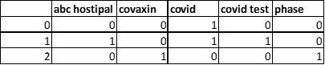
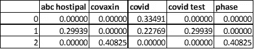
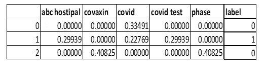

# 自然语言处理(NLP)模型和 Python 实现的基本概念

> 原文：<https://towardsdatascience.com/basic-concepts-of-natural-language-processing-nlp-models-and-python-implementation-88a589ce1fc0?source=collection_archive---------6----------------------->


来源:照片由 Ogelamar 在 Unsplash 上拍摄

在数据科学领域，自然语言处理(NLP)是一个非常重要的组成部分，因为它在各个行业/部门都有广泛的应用。对于一个人来说，理解这种语言是很容易的，但是机器没有足够的能力来轻松识别它。NLP 是一种使机器能够解释和理解人类交流方式的技术。

目前，社交媒体是自然语言的黄金数据矿，无论是来自任何在线网站(亚马逊、谷歌等)的任何类型的评论。)，或者只是在 Twitter、脸书、LinkedIn 或电子邮件上发帖。每个领域的业务用例(分类、文本摘要、分类、交互式语音应答(IVR)、语言翻译、聊天机器人)可能不同，但 NLP 定义了这些用例的核心基础解决方案。

自然语言是文本的自由形式，这意味着它在本质上是非结构化的。因此，在开发任何模型时，清理和准备数据以提取特征对于 NLP 之旅非常重要。本文将在下面介绍基本但重要的步骤，并展示我们如何使用不同的包在 python 中实现它们，并开发一个基于 NLP 的分类模型。

> **A)数据清理**
> 
> **B)标记化**
> 
> **C)矢量化/单词嵌入**
> 
> **D)模型开发**

# ***A)数据清理***

如上所述，数据清洗是自然语言处理中基本但非常重要的步骤。以下是数据清理的几种方法。让我们考虑下面这条线。

```
line = ‘Reaching out for HELP. Please meet me in LONDON at 6 a.m xyz@abc.com #urgent’
```

**1。移除停用词:**有几个词是人类互动时非常常用的，但这些词没有任何意义，也没有增加任何额外的价值。此外，对于手头给出的业务案例，可能有一些词语是不需要的。所以，这些词需要从数据中删除。

NLTK 包为不同的语言(如英语)定义了一组停用词。在这里，我们将集中讨论“英语”停用词。如果需要，还可以考虑附加的停用词。

```
import nltkimport refrom nltk.corpus import stopwords# Additional stopwords
extra_list = [“let”, “may”, “might”, “must”, “need”, “apologies”, “meet”]stopword = stopwords.words(“english”)stopword.extend(extra_list)line = ‘ ‘.join([i for i in line.split() if i not in stopword])
```

**2。Make 小写:**要求所有的单词都用小写，以保持一致性。

```
line = line.lower()
```

**3。词汇化:**这有助于将单词简化为单一形式。例如:

```
def lemmatize_text(text):w_tokenizer = nltk.tokenize.WhitespaceTokenizer()lemmatizer = nltk.stem.WordNetLemmatizer()return [lemmatizer.lemmatize(w) for w in w_tokenizer.tokenize(text)]lemmatize_text(line)
```

**4。词干化:**这有助于将单词还原成它们的词根形式。例如:

```
def stem_porter(text):w_tokenizer = nltk.tokenize.WhitespaceTokenizer()ps = nltk.PorterStemmer()return [ps.stem(w) for w in w_tokenizer.tokenize(text)]stem_porter(line)
```

除了*波特斯特默*之外，还有两种词干。那些是兰卡斯特炮泥和雪球。雪球是对波特词干的改进。

**5。正则表达式的去除:**正则表达式有助于识别和去除文本中不需要的不同模式。

```
line = re.sub(‘\S*@\S*\s?’,” “,line) #email removeline = re.sub(‘\s+’,” “,line) #new line character removeline = re.sub(“\’”,” “,line) #single quote removeline = re.sub(‘_’,” “,line) #underscore removeline = re.sub(‘http\S*\s?’,” “,line) #link removeline = ‘ ‘.join([i for i in line.split() if i.find(‘#’) < 0]) #hasgtag removeline = ‘ ‘.join([i for i in line.split() if i in re.findall(r’\w+’,line)]) #only keep words and numbers
```

**6。词性标注:**这有助于识别词性。基于用例，人们可以保留或删除其中的一些。

```
import spacyfrom spacy.tokenizer import Tokenizernlp = spacy.load(“en_core_web_sm”)tokens_spacy = nlp(line)for token in tokens_spacy:print(token.text, ‘: ‘, token.pos_, ‘: ‘, token.is_stop)
```

**7。命名实体识别(NER):** 这有助于识别和分类不同的组，包括名称、地点、货币等。

```
for ent in tokens_spacy.ents:print(ent.text, ‘: ‘, ent.label_)
```

# **B)标记化**

这是处理文本数据时的常见做法之一。这有助于将一个短语、句子或段落分成像单词或术语这样的小单元。每个单元称为一个令牌。有不同类型的标记化。我们已经在上面的例子中使用了词干分析、词性标注和 NER。以下是对文本进行标记的不同方法。

```
str1 = “I am eating pizza and, coke.”
```

**1)使用 split()函数的标记化:**返回给定字符串被指定分隔符打断后的字符串列表。默认情况下，分隔符是一个空格。

```
str1.split()[‘I’, ‘am’, ‘eating’, ‘pizza’, ‘and,’, ‘coke.’]
```

**2)使用正则表达式的标记化:**返回基于正则表达式的列表。

```
re.findall(“[\w]+”,str1)[‘I’, ‘am’, ‘eating’, ‘pizza’, ‘and’, ‘coke’]
```

**3)使用 NLTK 进行标记化:**NLTK 包下有不同类型的标记化器，像 word tokenizer (word_tokenize)、regex tokenizer (RegexpTokenizer)、whitespace tokenizer(whitespace tokenizer)等。

3.1)

```
from nltk import word_tokenizeword_tokenize(str1)[‘I’, ‘am’, ‘eating’, ‘pizza’, ‘and’, ‘,’, ‘coke’, ‘.’]
```

3.2)

```
space_tokenizer = nltk.tokenize.WhitespaceTokenizer()space _tokenizer.tokenize(str1)[‘I’, ‘am’, ‘eating’, ‘pizza’, ‘and,’, ‘coke,’]
```

3.3)

```
reg_tokenizer = nltk.tokenize.RegexpTokenizer(“[A-Za-z]+”)reg_tokenizer.tokenize(str1)[‘I’, ‘am’, ‘eating’, ‘pizza’, ‘and’, ‘coke’]
```

此外，我们可以使用这些标记化的形式来计算文本中的单词数或单词在文本中的出现频率。

# **C)矢量化/单词嵌入**

一旦清理和标记化完成，从干净的数据中提取特征是非常重要的，因为机器不理解单词，而是数字。矢量化有助于将单词映射到实数向量，这进一步有助于预测。这有助于提取重要的特征。以下是用于此目的的几种技术:

**1。CountVec:** 统计特定单词在文档中出现的次数。CountVectorizer 有助于获得这个计数。

```
from sklearn.feature_extraction.text import CountVectorizercount_vec = CountVectorizer(analyzer=’word’, ngram_range=(1, 3), stop_words = ‘english’)count_vec.fit(str2)count = count_vec.transform(str2)vectors = count_vec.get_feature_names()smatrix = count_vec.transform(str2)dense = smatrix.todense()dense_list = dense.tolist()df_countvec = pd.DataFrame(dense_list,columns=vectors)
```

**2。TF-IDF:** 词频逆文档频率(TF-IDF)提供了一个词在文档中的总体权重。TfidfVectorizer 有助于获得这个加权分数。

```
from sklearn.feature_extraction.text import TfidfVectorizertfidf_vec = TfidfVectorizer (analyzer=’word’, ngram_range=(1, 3), stop_words = ‘english’)tfidf_vec.fit(str2)tfidf = tfidf_vec.transform(str2)vectors = tfidf_vec.get_feature_names()smatrix = tfidf_vec.transform(str2)dense = smatrix.todense()dense_list = dense.tolist()df_ tfidf = pd.DataFrame(dense_list,columns=vectors)
```

**比较:** CountVec 可能会提供偏向最常用词的结果。这忽略了可能具有更高重要性的罕见单词。这意味着我们需要惩罚最常用的单词。TF-IDF 启用惩罚效果。它通过测量文档中出现的单词来衡量计数。举个例子，

```
str2 = [‘I am going to test Covid’,‘It seems ABC hospital is doing the Covid test’,‘Covaxin is still in WIP phase’]
```



CountVec 输出(图片由作者提供)



TF-IDF 输出(图片由作者提供)

这两种模型都为每个单词提供了一个数字(计数或重量)。但是要理解每个单词的上下文并识别其内容，每个单词一个向量要合适得多。 **Word2Vec** 通过浏览给定文档，为每个单词提供一个向量，这比简单的单词包或 TF-IDF 更有用。但 Word2Vec 缺乏对这种关系的“本地理解”，这一点由 **Glove** 回答。Glove 是一种预先训练的矢量化技术，它不仅理解本地上下文，还理解与全局单词的关系。除了 Glove， **FastText** 是另一种流行的单词嵌入技术，它对罕见单词或未收录单词(OOV)更有效。

说了这么多，单词包或 TF-IDF(主要)至今仍被广泛使用，并且是日常 NLP 问题中非常重要的一部分。由于本文只打算介绍基本的 NLP 概念，Glove 或 FastText 没有详细介绍。

# d)模型开发

最后一部分来了！最后，我们有一个基于计数或 TF-IDF 矩阵和因变量(标签)来开发模型。



作者图片

人们可以使用任何分类模型，如逻辑回归、随机森林(RF)、支持向量机(SVM)或任何深度学习模型，如 RNN、LSTM 或最先进的模型，如 BERT、GPT3 来预测标签。作为准确性 ROC、回忆、F1 分数的度量，可以基于手头的问题陈述来使用。

在运行模型之前，让我们将数据分成训练和测试。

```
X = df.drop(columns=’label’)y = df[‘label’]X_train, X_test, y_train, y_test = train_test_split(X, y,test_size=0.2, random_state=420,stratify=y)
```

现在，建立数据模型并检查准确性指标。

```
from sklearn.linear_model import LogisticRegression, RandomForestClassifiermodel = LogisticRegression()#model = RandomForestClassifier()model.fit(X_train, y_train)y_pred_class = model.predict(X_test)print(‘Accuracy: ‘, metrics.accuracy_score(y_test, y_pred_class))print(confusion_matrix(y_test, y_pred_class))
```

除了分类问题之外，自然语言处理还可以用于文本摘要、问答、主题建模(链接)、文本翻译等。

希望这篇文章能帮助你了解如何解决任何基于 NLP 的问题。在那之前，学习愉快！

*免责声明:本文中表达的观点是作者以个人身份发表的意见，而非其雇主的意见*