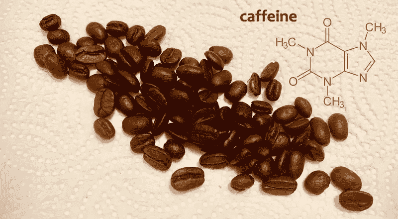
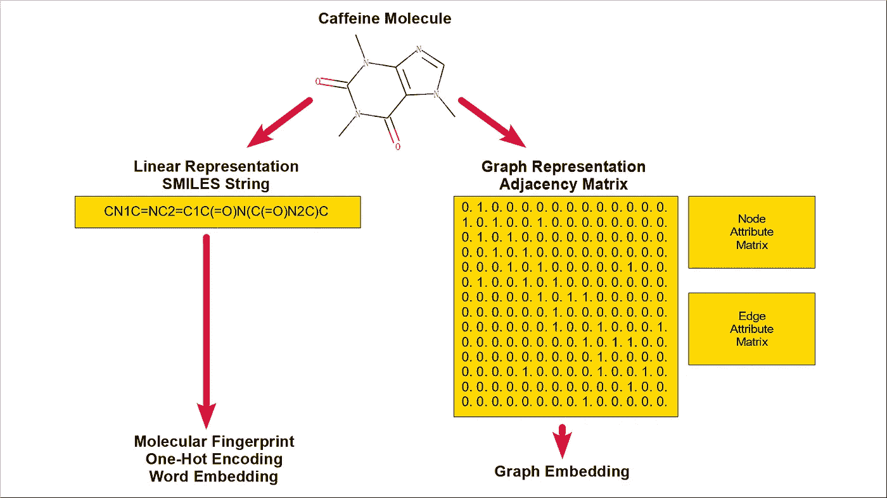
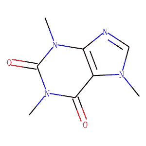
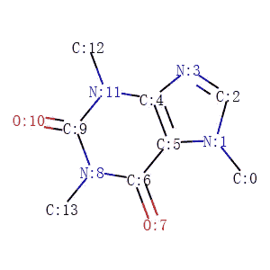
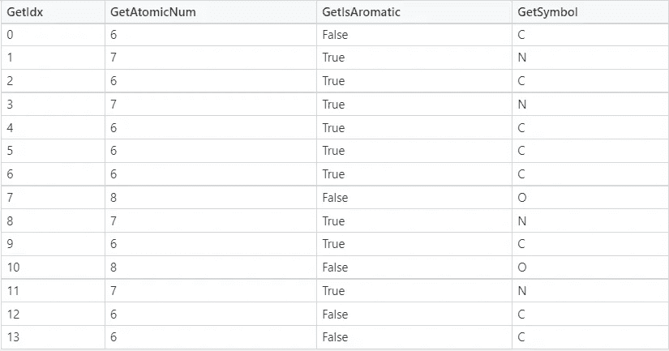
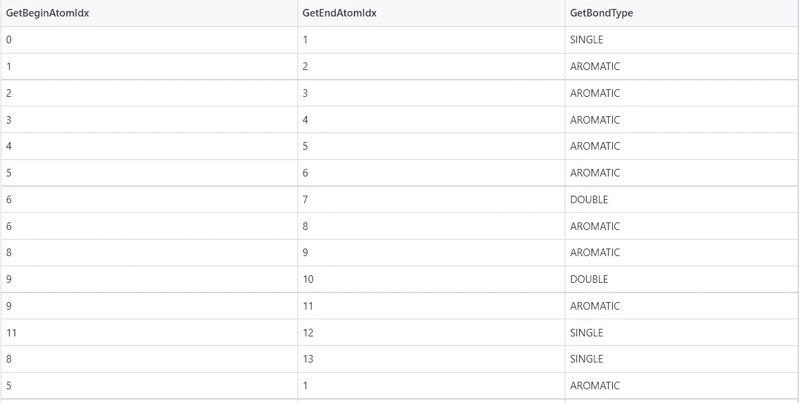
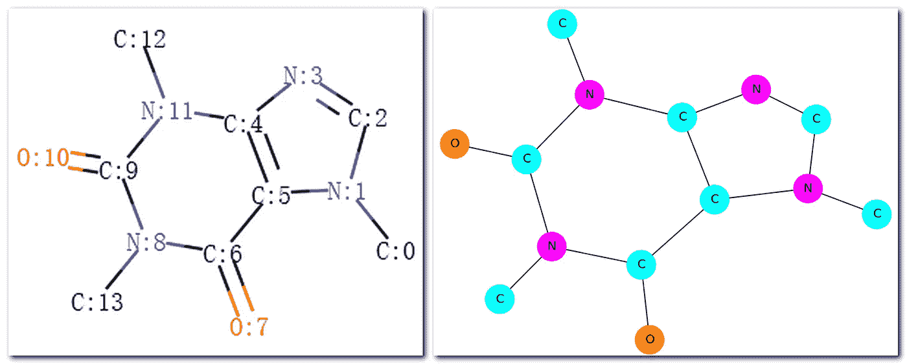

# 机器学习的基本分子表示

> 原文：<https://towardsdatascience.com/basic-molecular-representation-for-machine-learning-b6be52e9ff76?source=collection_archive---------3----------------------->

## [思想和理论](https://towardsdatascience.com/tagged/thoughts-and-theory)

## 从微笑到单词嵌入和图形嵌入

作者图片

机器学习已经应用于化学信息学和生命科学中的许多问题，例如，[研究分子性质](https://moleculenet.org/)，[开发新药](https://zitniklab.hms.harvard.edu/drugml/)。这些应用的问题解决流程中的一个关键问题是选择适当的分子表示，以表征目标数据集并服务于下游模型。图 1 显示了不同分子表示的概念框架。通常，一个分子由一个线性形式表示为一个[微笑](https://en.wikipedia.org/wiki/Simplified_molecular-input_line-entry_system)串，或者由一个[图](https://en.wikipedia.org/wiki/Graph_theory)形式表示为一个相邻矩阵，可能与原子的节点属性矩阵和键的边属性矩阵一起。SMILES 字符串可以进一步转换成不同的格式，比如分子指纹、一键编码或单词嵌入。另一方面，分子表示的图形形式可以被下游模型直接使用或者被转换成用于任务的图形嵌入。

**图 1。分子表示的概念框架**

本帖描述了在实现上述概念框架时使用的一些代码，包括:

*   阅读、绘图、分析分子，
*   从微笑串生成分子指纹，
*   从 SMILES 字符串生成一位热码编码，
*   从 SMILES 字符串生成单词嵌入，以及
*   在图形中生成分子表示。

# 阅读、绘制和分析分子

[RDKit](https://www.rdkit.org/docs/GettingStartedInPython.html) 是一个用于化学信息学的开源库。图 2 显示了读取咖啡因[的微笑字符串并绘制其分子结构的代码。请注意，在微笑字符串中，C 是碳，N 是氮，O 是氧。如图 3 所示，可以显示没有标记碳的分子，或者如图 4 所示，显示有标记碳的分子。](https://en.wikipedia.org/wiki/Caffeine)

**图二。阅读并画出咖啡因的分子。[** [**3**](https://www.rdkit.org/docs/GettingStartedInPython.html#drawing-molecules) ，**[**4**](https://chemicbook.com/2021/03/01/how-to-show-atom-numbers-in-rdkit-molecule.html)**]****

****

****图 3。caffeine.png****

****

****图 4。咖啡因 _with_prop.png****

**图 5 显示了显示咖啡因分子中原子和键的代码。**

****图 5。展示咖啡因分子中的原子和键。【**[**5**](https://github.com/dakoner/keras-molecules/blob/dbbb790e74e406faa70b13e8be8104d9e938eba2/convert_rdkit_to_networkx.py)**】****

**图 6 和图 7 分别显示了咖啡因分子中原子和键的细节。注意事项:**

1.  **术语“*芳烃*”在下表中可简单视为“*环*”。图 6 中的 *GetIsAromatic* 表示原子是否在环中，图 7 中的 *GetBondType* 表示键是否在环中。**
2.  **图 6 和图 7 可以被视为图 1 所示概念框架中的简单原子属性矩阵和简单键属性矩阵。**
3.  **图 7 中的键列表可以表示分子的图形形式，即邻接矩阵的链表。**

********

****图 6。咖啡因的原子。****

********

****图 7。咖啡因的结合。****

# **从微笑字符串生成分子指纹**

**RDKit 支持几个[指纹函数](https://www.rdkit.org/docs/GettingStartedInPython.html#fingerprinting-and-molecular-similarity)，其输出可用于计算分子相似性或作为下游机器学习模型的输入。图 8 显示了检索 RDKit 指纹和 Morgan 指纹的代码，图 9 显示了这些指纹函数的结果。**

****图 8。检索 RDKit 指纹和 Morgan 指纹****

****图九。RDKit 指纹和 Morgan 指纹。****

# ****从 SMILES 字符串中生成一位热码****

**将 SMILES 字符串视为自然语言中的文本，可能 SMILES 字符串最简单的表示方法是字符级的[一键编码](https://en.wikipedia.org/wiki/One-hot)。图 10 显示了在 SMILES 字符串的字符级生成一键编码的代码。**

****图 10。SMILES 字符串字符级的一键编码。【**[**6**](https://iwatobipen.wordpress.com/2017/01/22/encode-and-decode-smiles-strings/)**

****注意，一键编码也可以用在原子级或原子/键属性矩阵中。****

# ****从 SMILES 字符串生成单词嵌入****

****在语言建模的背景下，生成分子表示的更复杂的方法是将[单词嵌入](https://en.wikipedia.org/wiki/Word_embedding)的方法应用于分子的子结构。图 11 中的代码显示了使用 [mol2vec](https://github.com/samoturk/mol2vec) 和 [word2vec](https://radimrehurek.com/gensim/models/word2vec.html) 为 [HIV](https://moleculenet.org/datasets-1) 数据集中的所有分子生成单词嵌入的过程。数据集中有 41127 个分子(图 12)，每个分子被编码为一个 300 维向量(图 13)。注意，代码摘自“ [*化学研究中的简单 ML:rd kit&mol 2 vec*](https://www.kaggle.com/vladislavkisin/tutorial-ml-in-chemistry-research-rdkit-mol2vec)”，详细解释了预测 HIV 活性的解决方案。****

******图 11。为艾滋病毒数据集中的分子生成单词嵌入******

******图 12。HIV 数据集的列和行。******

******图 13。HIV 数据集中分子的 Mol2vec 嵌入******

# ****在图形中生成分子表示****

****在 RDKit 中操纵分子/原子/键的过程为生成分子表示的图形形式提供了基础。上面的图 5、图 6 和图 7 显示了咖啡因的邻接矩阵、节点属性矩阵和边属性网络。然而，将 RDKit 中的分子转换成 [NetworkX](https://networkx.org/documentation/stable/tutorial.html) (一个用于网络分析的开源库)中的图形，可以利用传统图形算法和现代图形模型的研究来调查分子结构和性质。图 14 显示了将 RDKit 中的分子转换成 NetworkX 中的图形的代码。图 15 显示了由 RDKit 和 NetworkX 绘制的分子图。****

******图 14。将 RDKit 中的分子转换为 NetworkX 中的图形******

********

******图 15。RDKit 和 NetworkX 的分子图******

****图网络中的一个重要研究领域是图嵌入。一般来说，图嵌入由三个主题组成:*节点级嵌入*(将图中的节点编码为向量)、*边级嵌入*(将图中的边编码为向量)、g *图级嵌入*(将整个图编码为向量。)在本文中，我们将术语*图嵌入*视为*图级嵌入*，它为一个分子找到一个向量，该向量可以用作下游模型的输入。图 16 显示了将 RDKit 中的分子转换为 NetworkX 中的图形，并通过 [Graph2Vec](https://github.com/benedekrozemberczki/graph2vec) 在 [KarateClub](https://github.com/benedekrozemberczki/karateclub) 下生成其图形嵌入的代码。Graph2Vec 是一个图形嵌入算法，KarateClub 是一个为图形数据提供无监督机器学习模型的包。图 17 显示了 HIV 数据集中分子的 Graph2Vec 嵌入。KarateClub 在库中介绍了几种图形嵌入算法。****

******图 16。为 HIV 数据集中的分子生成图形嵌入******

******图 17 是 HIV 数据集中分子的 Graph2Vec 嵌入图******

# ****结论****

****这篇文章描述了几种分子表示，包括基于字符串的格式，基于图形的格式，以及一些变体，如单词嵌入和图形嵌入。这些分子表示，加上不同的机器学习算法，包括深度学习模型和图形神经网络，可以作为处理分子机器学习问题的基线。****

****感谢阅读。如果你有任何意见，请随时给我留言。****