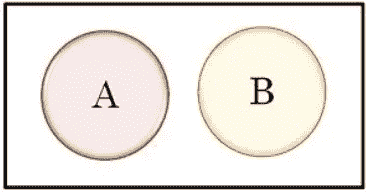
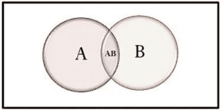
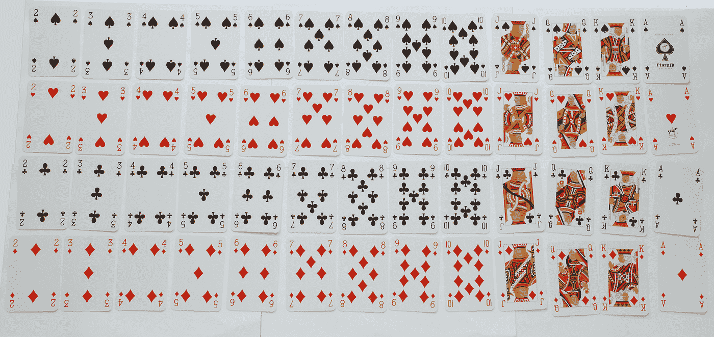

# 数据科学的基本概率概念(Stat-08)

> 原文：<https://towardsdatascience.com/basic-probability-concepts-for-data-science-eb8e08c9ad92?source=collection_archive---------23----------------------->

## 概率有助于预测任何事件的未知结果

莫里茨·金德勒在 [Unsplash](https://unsplash.com?utm_source=medium&utm_medium=referral) 上拍摄的照片

## 动机

概率是最常见的术语之一，不仅在数学中如此，在现实世界中也是如此。我们经常使用*概率*这个词。大约七年前，我还在读中学，开始接触概率这个术语，这是一个数学话题。那时，我已经解决了许多关于概率的数学问题。不幸的是，我对此不感兴趣。最后，当我在探索垃圾邮件过滤技术时，我惊讶地发现用于检测垃圾邮件过滤的最流行的机器学习算法是朴素贝叶斯分类器。有趣的是，分类器的主要思想来自于概率。所以我开始深入学习概率的概念，发现了这么多数据科学中不可或缺的实际用途。它激励我更实际地学习。现在，是分享知识的时候了。

## ✪概率

概率是一个数字概念，用于衡量任何特定事件或结果发生的可能性。概率值的范围是从 0 到 1。如果该值更接近 1。那么我们可以假设它发生的概率很高。相反，如果该值更接近 0。那么可以说它消失的概率很大。概率是一种用于非平凡应用的有效技术。诸如

*   Gmail 收件箱的垃圾邮件过滤器。
*   用于医学图像分析的图像识别系统。

两种不同的过程被用来寻找概率。

***我)。*** *实验或经验概率。*

***ii)。*** *理论概率。*

➤ **实验或经验概率**

经验概率是通过实验来估计概率的过程。我们考虑一个掷硬币事件；如果我们掷硬币，只会有两种结果正面或反面。假设，我们想知道人头落地的概率。我们可以通过以下步骤找到它。

***我)。*** 起初，我们可以抛几次硬币。我们假设掷硬币 200 次。

***ii)。*** 我们可以数硬币落在头上的次数。我们假设硬币落在头上 79 次。

***三世)。*** 现在我们可以用数字头除以我们抛硬币的总次数的数字。

[行政长官](https://unsplash.com/@executium?utm_source=medium&utm_medium=referral)在[广场](https://unsplash.com?utm_source=medium&utm_medium=referral)拍照

所以得人头的概率= 79/200 = 0.395

为了说明，我们可以考虑另一个现实生活中的例子；你想在市场上推出两种不同类型的新产品。在投放市场之前，你必须了解人们的喜好。

为了进行这个实验，你随机选择数百人，然后你让他们选择他们喜欢的产品。完成后，你发现 85 人更喜欢第一种产品，其余的人选择第二种。所以，第一个乘积的经验概率= 85/100。

我认为你可以理解经验概率。

➤ **理论概率**

理论概率是基于推理估计概率的过程。考虑之前抛硬币的例子。我们必须按照下面的步骤找到理论概率。

***我)。*** 首先，我们要知道有利结果的总数。这里，对于 tail，它只有一种可能的结果。

***ii)。*** 最后，我们要知道结果的总数。这里，我们可能有两种可能的结果:头和尾。

所以，理论概率= 1/2= 0.5

让我们假设另一个现实生活中的例子，从一副牌中取出一张红色的牌。如果我们计算一下红起来的概率，会是。

p(红色)= 13/52

这里，获得红色的有利结果的数量是 13。结果的总数是 52。

## ✪一些基本的概率术语

➤ **结果&事件:**我们可以将结果表示为一个事件。实验结果的总数称为一个事件。我们也可以说结果是一个事件所有可能的结果。假设我们想预测下周的天气。可能有不同种类的可能情况。

(I)一周中的所有天都将是晴天、雨天或阴天。

(ii)三天将是雨天、晴天或多云，另外三天将是多云、晴天或雨天。

此外，还会发生更多的情况。

所有可能的结果都被称为结果。给定条件下所有可能的结果统称为事件。

➤ **样本空间:**样本空间表示集合中所有可能的结果。假设掷骰子有六种可能的结果。我们可以把所有的结果写成一组。如:{1，2，3，4，5，6}。此外，事件是样本空间的子集。

## 概率中不同类型事件的✪类型

在这一部分，我们将试图用概率来解释不同种类的事件。

➤ **不可能且确定的事件:**如果一个事件发生的可能性为 0，则称之为不可能事件。而如果任何事件发生的可能性为 1，则称之为确定事件。假设你掷一个有六种可能结果的骰子。得到 1-6 之间的数字的几率是 1。这是这个实验的必然结果。但是得到大于 6 的数的可能性是 0。因为可能的结果介于 1–6 之间，所以是不可能事件，这个实验就叫不可能事件。

➤ **简单事件:**只有一种可能结果的事件称为简单事件。例如:s={23}，这个事件只有一个可能的结果。所以，这是一个简单的事件。

➤ **复合事件:**有一个以上可能结果的事件称为复合事件。例如:s={23，34，45}，这个事件有三种可能的结果。

➤ **独立和相关事件:**如果一个事件不依赖于任何其他事件，或者一个事件完全不受其他事件的影响，则称之为独立事件。受其他事件影响的事件称为相关事件。假设你从一个袋子里一个接一个地抽出两个球。如果你先抽第一个球，再抽第二个球，而没有把第一个球放回去，就会受到第一个球的影响。相比之下，如果你把第一个球放回袋子里，然后抽第二个球。不会受到第一个球的影响。

➤ **互斥事件:**互斥事件是指两件事情不能同时发生。它还可以表示任何事件的发生都完全独立于其他事件的发生。比如扔硬币有两个事件 s ={H，T}，这两个事件是完全不同的。

图 1:互斥事件的维恩图(图片由作者提供)。

图 2:互不互斥事件的维恩图(图片由作者提供)。

➤ **穷举事件:**如果所有的事件一起表示一个样本空间叫做互斥事件。

## ✪概率中的一些规则

➤ **概率的加法法则**

加法规则规定获得 A 或 B 的概率将是获得 A 的概率和获得 B 的概率之和，也用 *'* ***U'* 表示。**

➣ **互斥事件的加法规则:**在这里，两个事件互不影响。该事件的公式为

P(A U B) = P(A) + P(B)

如果事件有两个以上的事件，则公式变为

P(A ∪ B C…..)= P(A) + P(B) + P(C)……..

假设我们从一副牌中拿起一张牌。现在，拿到红卡或黑卡的概率。

p(红色或黑色)= 26/52 + 26/52

在这里，红色和黑色事件并不相互影响。

➣ **非互斥事件的加法法则:**这里，两个事件是相互影响的。该事件的公式为

P(A U B) = P(A) + P(B) — P(A ∩ B)。

这里我们必须减去两个同时发生的事件的价值。

假设，我们抽一张有国王或红心的牌。*(如果你想了解 52 副牌，请* [***访问***](https://en.wikipedia.org/wiki/Standard_52-card_deck) *这个网站。)*在这里，可能会发生三种情况。

***我)*** 牌将为王。

***ii)*** 这张牌可能是红心。

***iii)*** 这张牌可能同时是国王和红心。

为了说明概率，我们必须将获得国王的概率和获得红心的概率相加，并减去获得国王和红心的概率。

P(国王 U 红心)= P(国王)+ P(红心)— P(国王∩红心)

= 4/52 + 13/52–1/52

来源:[https://commons.wikimedia.org/wiki/File:Piatnikcards.jpg](https://commons.wikimedia.org/wiki/File:Piatnikcards.jpg)(免费许可证)

这里只有四张牌是王，13 张是红心。还有，普通卡只有一张。我想你能理解这个题目。

**➤乘法概率规则**

当两个事件相继发生时，这里使用乘法规则。它用“∩”符号表示。

➣ **互斥事件的乘法法则:**这里，两个事件相继发生，并且都是独立的。该事件的公式为

P(A ∩ B) = P(A)*P(B)

假设，我们掷骰子两次，想求得到 1 和 3 的概率。

P(1 ∩ 3) = P(1)*P(3)

如果我们每次掷骰子，得到 1 到 6 之间的数字的概率是 1/6。这里，当前事件得到这个范围内的数的概率不依赖于前一个事件。如果我们掷骰子两次、三次或任意次，我们得到的数字在 1 和 6 之间的概率值是相同的。

在这个例子中，

P(1)= 1/6

P(3) = 1/6

所以，P(1 ∩ 3) = 1/6 *1/6

如果你不明白，我想你可以阅读下一部分。所以不用担心！！！！！！！

➣ **非互斥事件的乘法法则:**这里，两个事件相继发生，并且都是相互依赖的。假设，你正从一副 52 张牌中拿一张牌。你拿了一张红牌。同样，你拿了一张牌，但没有把红牌放回牌堆。在这里，可能会发生两件事。

***i)*** 当你拿第一张牌的时候，当时牌的总数是 52 张。

***ii)*** 其次，当你拿起第二张牌时，当时总牌数为 51，因为你没有放回这副牌中的第一件物品。

在这个场景中，我们发现这两个事件相互依赖。假设，你想拿两张牌。首先，你要挑一张红牌，然后是一张国王。所以拿到红王和王的概率是

P(R ∩ K) = P(R)*P(K/R)，

我们发现一个新的术语 P(K/R)，叫做条件概率。我们将在下一部分描述它。它被称为给定 r 的 K 的概率，这意味着我们要计算 K 的概率，它取决于前一个事件。所以，

P(R ∩ K) = 1/52 * 1/51

这里，P(R) = 1/52，因为我们从总共 52 张卡中取出了一张。

P(K/R) = 1/51，因为我们从总共 51 张卡中取出了一张。

我们可以对互斥事件使用条件概率。对于这种情况，

P(A ∩ B) = P(A)*P(B/A)

= P(A)*P(B)这里，事件 B 不依赖于 A

条件概率

当一个事件发生时，它可能与其他事件有关系，称为条件概率。依赖于事件 A 的事件 B 的条件概率的规则是

P(B/A) = P(A ∩ B) /P(A)

假设，两个事件

**事件 A:** 明天会是晴天。它有 0.5 的概率。

事件 B: 你明天要去逛街。它有 0.7 的概率。

如果这两个事件之间有联系，条件概率就适用。

由 [petr sidorov](https://unsplash.com/@m_malkovich?utm_source=medium&utm_medium=referral) 在 [Unsplash](https://unsplash.com?utm_source=medium&utm_medium=referral) 上拍摄的照片

在使用术语预测的地方，概率以某种方式包含在其中。今天的世界是技术的世界，人们喜欢知道未来的结果，预测不同的情况，等等。概率在这方面起着重要的作用。也是数据科学不可回避的话题。

## 参考:

*【1】。*[*https://byjus.com/maths/types-of-events-in-probability/*](https://byjus.com/maths/types-of-events-in-probability/)

*【2】。*[*https://courses . lumen learning . com/无量-统计/章节/概率-规则/*](https://courses.lumenlearning.com/boundless-statistics/chapter/probability-rules/)

*【3】。*[*https://key differences . com/difference-between-mutual-exclusive-and-independent-events . html*](https://keydifferences.com/difference-between-mutually-exclusive-and-independent-events.html)

*【4】。*[*https://www . statistics show to . com/probability-and-statistics/statistics-definitions/conditional-probability-definition-examples/*](https://www.statisticshowto.com/probability-and-statistics/statistics-definitions/conditional-probability-definition-examples/)

## 关于数据科学统计学的完整系列文章

1.  [*少即是多；采样的‘艺术’(Stat-01)*](/less-is-more-the-art-of-sampling-dda8b59d399?source=your_stories_page-------------------------------------)
2.  [*熟悉数据科学最重要的武器~变量(Stat-02)*](/get-familiar-with-the-most-important-weapon-of-data-science-variables-48cc7cd85dc5?source=your_stories_page-------------------------------------)
3.  [*要提高数据分析能力，您必须了解频率分布(Stat-03)*](/to-increase-data-analysing-power-you-must-know-frequency-distribution-afa438c3e7a4?source=your_stories_page-------------------------------------)
4.  [*通过可视化频率分布找到数据集的模式(Stat-04)*](/find-the-patterns-of-a-dataset-by-visualizing-frequency-distribution-c5718ab1f2c2?source=your_stories_page-------------------------------------)
5.  [*比较多个频率分布，从数据集中提取有价值的信息(Stat-05)*](/compare-multiple-frequency-distributions-to-extract-valuable-information-from-a-dataset-10cba801f07b?source=your_stories_page-------------------------------------)
6.  [*通过简短的讨论消除你对 Mean 的误解(Stat-06)*](https://medium.datadriveninvestor.com/eliminate-your-misconception-about-mean-with-a-brief-discussion-a9fed67d4b08?source=your_stories_page-------------------------------------)
7.  [*通过规范化提高您的数据科学模型效率(Stat-07)*](https://medium.datadriveninvestor.com/increase-your-data-science-model-efficiency-with-normalization-918484b4626f?source=your_stories_page-------------------------------------)
8.  [*数据科学的基本概率概念(Stat-08)*](/basic-probability-concepts-for-data-science-eb8e08c9ad92?source=your_stories_page-------------------------------------)
9.  [*从朴素贝叶斯定理到朴素贝叶斯分类器的路线图(Stat-09)*](/road-map-from-naive-bayes-theorem-to-naive-bayes-classifier-6395fc6d5d2a?source=your_stories_page-------------------------------------)
10.  [*数据科学爱好者需要知道的假设检验(Stat-10)*](https://medium.datadriveninvestor.com/all-you-need-to-know-about-hypothesis-testing-for-data-science-enthusiasts-30cfe1dce028?source=your_stories_page-------------------------------------)
11.  [*多组间统计比较用 ANOVA (Stat-11)*](/statistical-comparison-among-multiple-groups-with-anova-d4ac27f6e59e?source=your_stories_page-------------------------------------)
12.  [*用卡方检验比较分类变量的相关性(Stat-12)*](/compare-dependency-of-categorical-variables-with-chi-square-test-982baff64e81?source=your_stories_page-------------------------------------)