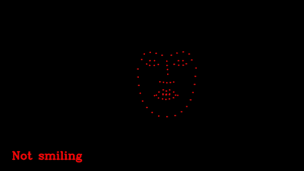
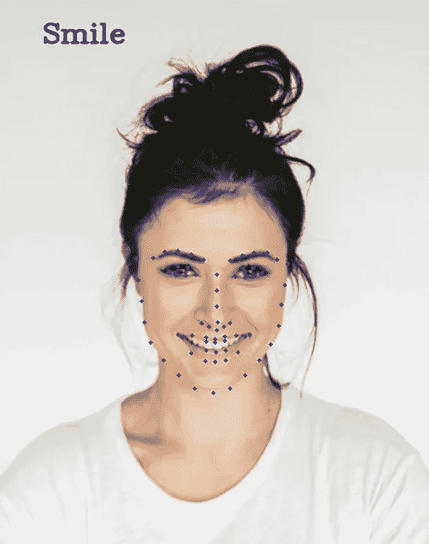

# 基于 OpenCV 和 DLIB 的基本微笑检测

> 原文：<https://towardsdatascience.com/basic-smile-detection-using-opencv-and-dlib-aeb22afb9e67?source=collection_archive---------15----------------------->

稳定面部标志上的基本微笑检测(由 Felipe Cunha 制作的 gif)

在本文中，我们将实现一个基于面部标志位置几何的基本微笑检测器。

基本的情绪检测包括分析一个人的面部标志的几何形状。在微笑的情况下，嘴角之间的距离增加。然而，不同的人有不同的嘴的大小，你可以通过除以下巴的距离来标准化这个度量，并获得一个可以用于不同对象的通用比率。

一旦我们检测到面部标志，我们可以通过(landmarks[0]访问坐标。parts()[i]。x，地标[0]。parts()[i]。y)，其中 I 是指数，来计算这个比值。下图显示了每个 Dlib 标志在面部的位置。

来自 iBUG 300-W 数据集的 68 个面部标志坐标(来源:[https://www.pyimagesearch.com/](https://www.pyimagesearch.com/)

在我们的基本检测器中，我们将使用点 49、55、3 和 15 的 x 坐标来计算比率。

稳定阈值是一个实验过程，我尝试了不同的图像，对我有效的是 0.36。你可以让它更敏感或更不敏感，但越敏感就越容易出错。

在下面的要点中，你可以找到代码的解释和下载模型的链接，这样你就可以自己尝试了！

由[杰克·纳科斯](https://unsplash.com/@jakenackos?utm_source=unsplash&utm_medium=referral&utm_content=creditCopyText)在 [Unsplash](https://unsplash.com/s/photos/smile?utm_source=unsplash&utm_medium=referral&utm_content=creditCopyText) 上拍摄的照片

我希望你们喜欢这个关于如何实现微笑检测器的简单教程。你可以使用相同的策略来检测其他事情，例如，如果对象的眼睛是闭着的(车辆安全)或者面部表情与其他感觉有关，如愤怒或厌恶。