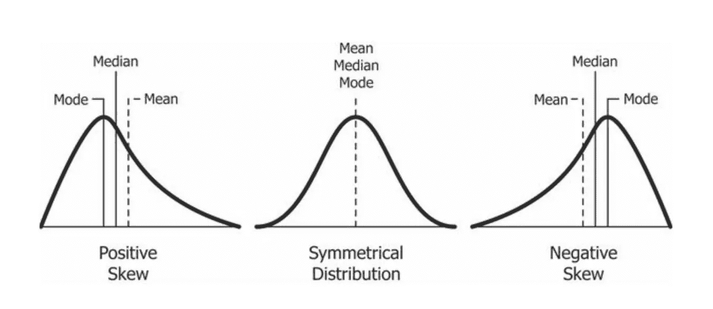
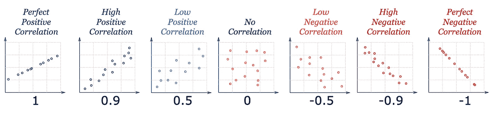
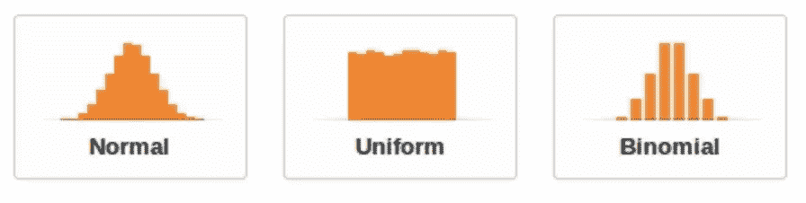

# 每个数据科学家都必须知道的基本统计概念

> 原文：<https://towardsdatascience.com/basic-statistical-concepts-every-data-scientist-must-know-e4f000254f55?source=collection_archive---------28----------------------->

## [入门](https://towardsdatascience.com/tagged/getting-started)

## 从 python 实现的实际角度来看

[斯科特·格雷厄姆](https://unsplash.com/@sctgrhm?utm_source=unsplash&utm_medium=referral&utm_content=creditCopyText)在 [Unsplash](https://unsplash.com/s/photos/research?utm_source=unsplash&utm_medium=referral&utm_content=creditCopyText) 上拍照

统计在数据科学项目中扮演着重要的角色。它们非常有助于更好地理解数据，也有助于提取见解。这是一个重要的领域，每个数据科学家都必须清楚地了解基本的统计概念。

在本文中，我将向您详细介绍数据科学项目中经常使用的基本统计概念、可以使用它们的场景，以及使用 python 实现它们。本文中使用的脚本和数据可以在下面的 git 存储库中找到[这里是](https://github.com/rsharankumar/Learn_Data_Science_in_100Days)

# 1.取样技术

抽样是统计学中的一个重要概念，当从较大的总体中选择一个数据子集时，这里的总体是指整个数据。为了更直观，让我举一个电子商务公司的例子，该公司希望更好地了解其客户的兴趣。我们可以通过邀请客户参与调查来更好地了解他们，但要求每个客户都参与调查是不可行的，也是可取的，因此我们需要确定目标受众，为此，可以使用合适的抽样技术。有许多采样技术，我们将看到一些流行的方法及其使用 python 的实现

## 简单随机抽样

简单的随机抽样方法是我们从总体中随机选择数据。简单随机抽样的问题是，我们总是有可能忽略原始数据中存在的类别，因此我们选择的样本可能不能很好地代表总体。

下面是使用 python 实现的简单随机抽样，我们首先确定了总体的原始均值，以便可以将其与样本均值进行比较。当样本的平均值接近实际总体时，可以假设样本的分布足够接近总体

来自[数据科学与莎兰](https://www.youtube.com/c/DataSciencewithSharan)的脚本

## 系统抽样

在这种方法中，我们使用系统的方法来选择样本的元素，比如根据列 id 或记录创建日期选择第 n 个元素。在这种方法中，忽略某个类别的概率较小，但问题是某些类别有可能被过度表示或表示不足。下面是使用 python 对这种采样技术的简单实现，

脚本来自[数据科学与莎兰](https://www.youtube.com/c/DataSciencewithSharan)

## 基于聚类的抽样

这种方法解决了我们在系统抽样方法和简单随机抽样方法中遇到的问题，在这里，我们确保我们包括来自所有类别的数据点，并且我们还确保我们不会过度或不足地代表任何类别。这里唯一的问题是，在现实中，数据可以通过不同的方式进行分类，例如，如果我以人类为例，我们可以根据性别、年龄、国家、教育程度等进行分组。因此，在这些复杂的情况下，使用基于聚类的抽样可能并不适用于所有类别。

脚本来自[数据科学与莎兰](https://www.youtube.com/c/DataSciencewithSharan)

## 分层抽样

这种方法是最常用的技术之一，这种方法确保了总体的分布被保留在样本中。下面是使用 python 的实现，在创建样本后，脚本还会检查与原始数据相比的分布。

脚本来自[数据科学与莎兰](https://www.youtube.com/c/DataSciencewithSharan)

这是关于抽样和使用 python 实现的流行方法，一般来说，分层抽样方法最接近实际人口。

# 2.描述统计学

描述性统计提供了对数据集中存在的各种要素的高级分析。下面是一些常用的描述性统计技术及其 python 实现，供大家参考。

## 柱状图

直方图有助于了解数据集中要素的分布。了解要素的分布(要素是数据集中的属性)非常重要，因为它在选择预测算法时起着关键作用。例如，当我们使用线性回归算法时，算法的一个假设是特征都是正态分布的。下面是绘制直方图的脚本，

来自[数据科学与莎兰](https://www.youtube.com/c/DataSciencewithSharan)的脚本

## 集中趋势

集中趋势的各种度量是平均值、中间值和众数，这些值用于识别分布中的中心点。一般来说，平均值是识别中心点的一个很好的方法，在倾斜数据的情况下，中位数可能更好，而在有序数据的情况下，中位数或众数将是比平均值更好的选择。

图片来自 [codeburst.io](https://codeburst.io/2-important-statistics-terms-you-need-to-know-in-data-science-skewness-and-kurtosis-388fef94eeaa) 作者[天后杜加尔](https://medium.com/@divadugar)

## 偏斜度和峰度

偏斜度用于识别分布是对称的(即正态分布)还是不对称的(偏斜分布)。当偏斜度的值为零时，则意味着分布是正态的。负值表示数据呈负偏态，即分布左侧有长尾，正偏态表示分布右侧有长尾。

许多金融数据会被正面扭曲，比如个人财富、住房奖金、支出等。在所有这些情况下，中值和平均值将比众数高得多，因为尽管大多数值都落在众数附近，但也有极少数值非常高的情况，在构建预测模型时，我们不能忽略这些值，同时我们不能原样使用这些特征，因为许多预测模型不能很好地处理有偏差的数据，因此需要适当的数据转换。

另一方面，峰度可以用来估计数据中异常值的数量。峰度值为 0 表示分布是正态的，没有很多异常值，峰度值高表示数据中可能有很多异常值，峰度值低表示数据中的异常值较少。

偏斜度和峰度都有助于更好地理解分布，使得如果在数据集中发现任何偏差，则可以设计治疗计划，例如如果数据高度偏斜或/和具有大量异常值，则可以使用合适的变换，例如对数变换。下面是获取集中趋势度量、偏度和峰度的脚本

脚本来自[数据科学与莎兰](https://www.youtube.com/c/DataSciencewithSharan)

## 可变性测量

统计中的可变性用于衡量数据的分散程度。可用于测量可变性的不同方法有**百分位值**、**标准差**和**方差**。当我们进行比较时，这些可变性测量非常有用。举个例子，假设一家电子商务公司正在进行一些设计更改，以缩短客户完成交易所需的总时间。在这些情况下，使用变更前后的可变性度量来查看变更是否成功。

简单地说，在设计变更之前，假设完成交易的时间为 10 分钟，标准偏差为 2 分钟，而在设计变更之后，完成交易的时间为 9 分钟，标准偏差为 3 分钟。现在，为了检验它是否显著，我们使用一个合适的假设检验。

此外，当我们使用基于距离的算法(如 K-Means 或 KNN)时，预计所使用的特征相对来说具有相似的规模，因此可变性测量也有助于检查数据是否符合要求。下面是使用 python 对上述可变性测量的实现，

来自[数据科学与莎兰](https://www.youtube.com/c/DataSciencewithSharan)的脚本

# 3.基于关系的测量

基于关系的统计度量是相关性和协方差。我见过很多人把相关性误认为因果关系。它们之间有很多差异，作为一名数据科学家，了解这些差异非常重要。

## 相互关系

两个变量之间的相关性显示了它们之间的关系，即当一个变量增加时，它如何影响另一个变量。当我们说两个变量彼此正相关时，这意味着随着一个变量的增加，另一个变量也增加。当两个变量之间的相关值接近零时，意味着它们之间没有太大的关系。以下是一些具有不同相关性水平的散点图示例

图片来源——皮尔斯，罗德，2019，《数学是有趣的——相关性》，此处[可用](https://www.mathsisfun.com/data/correlation.html)。

## 原因

如前所述，许多人假设相关性就是因果关系，也就是说，当变量‘A’和‘B’高度相关时，他们假设 A 导致了 B 的发生，但事实可能并非如此。事实上，相关性并不能解释任何与因果关系相关的事情。解释这一点的一个流行的例子是，随着温度的升高，犯罪数量增加，冰淇淋的销量也增加。所以这里冰淇淋的销售和犯罪数量是正相关的，但是冰淇淋的销售并没有导致犯罪的增加。另一方面，气温的上升导致人们购买冰淇淋，这在某种程度上也导致了犯罪的增加，因此这就是因果关系。

所以永远不要把相关性当成因果关系，即使这很诱人，是的，即使这很诱人，因为很多时候我们很容易把相关性当成因果关系。下面是使用 python 查找相关性和协方差的实现。

脚本来自[数据科学与莎兰](https://www.youtube.com/c/DataSciencewithSharan)

# 4.分配

了解不同的分布是很好的，因为这将有助于更好地理解数据集，也有助于选择合适的预测模型。有许多发行版，但是首先你需要知道至少下面的发行版

图片来自 caladis.org

*   **正态分布** —正态分布意味着大多数观察值集中在平均值附近，随着我们远离平均值，观察值的数量减少，并且分布是对称的，即平均值的左侧和右侧是相同的。
*   **均匀分布** —在均匀分布的情况下，所有选项出现的概率是一样的就像扔硬币一样，正面和反面的概率都是 50%。
*   **二项式分布** —它是有限集合中可能结果的频率分布。示例-两个骰子的掷数总和，可能的值范围在 2 到 12 之间，并且每个值都有一个概率值。

# 5.中心极限定理(CLT)

中心极限定理是统计学中一个流行的概念，按照 CLT 的说法，当我们从一个分布中抽取更多的样本时，样本平均值将趋向于正态分布，而不管实际的总体分布如何。

为了提到中心极限定理的一个真实的用例，让我们考虑预测选举结果。如果我们让一个小组进行调查，那么结果可能会有偏差，因为他们的目标受众可能不能很好地代表人口，但是当我们让多个独立小组进行调查并组合他们时，根据中心极限定理(CLT)的假设，结果将更接近实际人口。让我们使用下面的代码来测试中心极限定理，我们首先创建均匀分布的随机数据，然后开始挑选样本并计算这些样本的平均值，随着迭代次数的增加，样本平均值趋于形成正态分布。,

脚本来自[数据科学与莎兰](https://www.youtube.com/c/DataSciencewithSharan)

# 下一步是什么？

完成这些基本概念后，你就可以专注于推断统计学的概念，学习如何使用合适的假设检验来得出一个不能基于描述性统计得出的结论。数据科学家通常使用的一些统计测试是，

*   z 检验
*   t 检验
*   f 检验
*   方差分析
*   卡方检验

要了解数据科学所需的基本统计概念，请查看下面播放列表中我的教程视频。

# 关于我

我是一名拥有超过 10 年经验的数据科学专家，并且已经撰写了 2 本数据科学方面的书籍。我写数据科学相关的内容是为了让它简单易懂。跟我上 [**中**](https://medium.com/@rsharankumar) **。**我也有一个 YouTube 频道，在那里我教授和谈论各种数据科学概念。如果有兴趣，可以订阅我下面的频道。

 [## 莎兰的数据科学

### 我是一名数据科学专业人员，在高级分析和应用机器领域拥有十多年的经验…

www.youtube.com](https://www.youtube.com/c/DataSciencewithSharan)