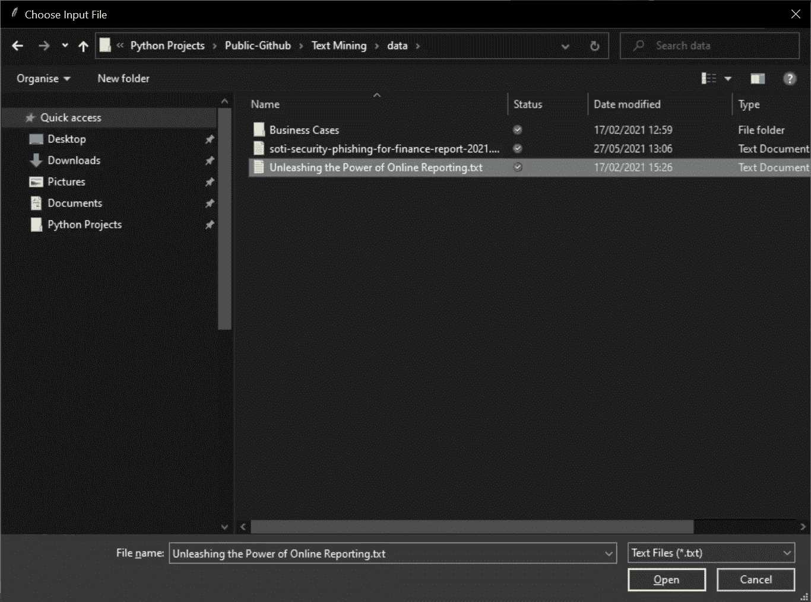

# Python 中的基本文本摘要

> 原文：<https://towardsdatascience.com/basic-text-summarization-in-python-d87df82497b3?source=collection_archive---------28----------------------->

## 如何使用文本摘要将复杂的书面报告转换为 300 字的压缩摘要


帕特里克·托马索在 [Unsplash](https://unsplash.com/s/photos/words?utm_source=unsplash&utm_medium=referral&utm_content=creditCopyText) 上的照片

# 背景

文本摘要是文本挖掘和自然语言处理的一个子集，旨在获取长的文本语料库，并将其转换为可以轻松快速阅读和理解而不会丢失原始文本含义的摘要。

特别是文本摘要“标记”单词(即将其转换为数据)，然后通过查看相对频率和其他因素来评估每个单词的重要性。然后可以将单词重要性分数聚合回句子的值，最重要的句子会出现在摘要的顶部。

如果你想更深入地探索这些原理，这篇文章是一个很好的起点——[https://towardsdatascience . com/a-机器学习中的文本摘要快速介绍-3d27ccf18a9f](/a-quick-introduction-to-text-summarization-in-machine-learning-3d27ccf18a9f)

# 目标

本文的目标是开发一个基本的交互式文本摘要实用程序来演示这些原理，并提供一种为复杂报告生成基本摘要的方法。

如果摘要传达了源报告的大部分意思，并且能够在很短的时间内被阅读和理解，那么摘要就是成功的。

# 准备

首先，我们需要导入将要使用的库…

# 文件操作

我们的文本摘要实用程序的构建块处理允许用户浏览本地文件系统来选择要摘要的文件的工作。

`openfile()`处理显示文件|打开对话框，选择文件，并返回所选文件的完整路径。

接下来`getText`获取路径，打开文件并将文件中包含的文本读入一个`str`。提供的代码可以从。txt 或者。docx 文件。

# 文本摘要

主要工作通过调用`gensim.summarization.summarize`函数在一行代码中完成。同样的效果可以通过使用`nltk`自然语言工具包来实现，但是它会更加复杂，并且需要更低级的工作。

`summarise`函数提供了实现，它遵循文本摘要中涉及的 3 个基本步骤-

1.  预处理和准备文本。
2.  执行文本摘要过程。
3.  后处理整理结果。

将会有许多严肃的、行业强度的文本处理引擎，它们涉及这 3 个步骤的复杂和全面的实现，但是这是一个很好的例子，它确实提供了我们将会看到的非常有用的摘要。

# 调用文本摘要

最后几个辅助函数是-

*   它格式化并打印包含标记的文本，给我们一个格式良好的标题。
*   `openLocalFileAndSummarize`它调用我们上面定义的函数来选择一个文件并汇总其内容。
*   `on_button_clicked`它处理按钮点击事件，为笔记本增加交互性，并允许选择几个文件并按顺序汇总。

# 测试总结

为了测试文本摘要，我从两个公共网站收集了文本，这两个网站发布了关于在线报告和营销主题的免费报告。

用于提供测试数据的两个网站是-

*   [https://www . sustain ability-reports . com/unleashing-the-power of-online-reporting/](https://www.sustainability-reports.com/unleashing-the-power-of-online-reporting/)
*   https://www . McKinsey . com/business-functions/marketing-and-sales/our-insights/was-all-markets-now

# 运行总结

最后，一行代码创建了一个按钮，可以重复单击该按钮从本地磁盘中选择一个. txt 或. docx 文件，然后该文件将被转换为 300 字的摘要，如下所示。


作者图片

单击该按钮时，会显示一个文件|打开对话框来选择文件-



作者图片

一旦文件被选中，`gensim.summarization.summarize`开始工作，输出被格式化为单元格输出-

**释放在线报告力量的执行摘要. txt**

```
Unleashing the Power of Online Reporting Source: Sustainable Brands, 15 February 2018 Confronted with an ever-growing demand for transparency and materiality, companies need to find an adequate format to publish both financial and pre-financial information to their stakeholders in an effective way.In the real world, they are confronted with a multitude of information sources different in name, type and content, like Annual Report, CSR Report, Financial Statement, Sustainability Report, Annual Review, Corporate Citizenship Report, or Integrated Report.Online integrated reporting to the rescue Research from Message Group among Europe’s 800 largest companies shows that between 2015 and 2017 the number of businesses publishing financial and extra-financial information in one single integrated report increased by 34 percent, while the number of companies publishing separate sustainability and annual reports decreased by 30 percent.Unlike stand-alone annual or sustainability reports, online integrated reporting formats put an organization’s financial performance, business strategy and governance into the social, environmental and economic context within which it operates.Instead of directing readers from a webpage to separate PDF reports and resources located in different online places, Core & More provides all the relevant information on a single multi-layered website.Moreover, it is flexible enough to integrate multiple reporting frameworks, accounting standards and concepts, such as the International Financial Reporting Standard (IFRS) in combination with GRI, <IR>, the TCFD recommendations, or the SDGs.
 On top of all this flexibility, a digital reporting format is highly interactive and customizable, allowing the reader to create charts or compile selected content into personal PDF or printed reports.Turning reporting into a powerful communications tool In view of growing demand for ESG disclosure, the related surge in sustainability reporting, and a complex reporting landscape companies are challenged to find a disclosure format for both financial and extra-financial information that has a measurable value for their key stakeholders.
```

# 结论

文本摘要可能是一个复杂且涉及预处理、摘要和后处理的过程，并且能够在不丢失原始文本含义的情况下对复杂报告进行摘要的真实世界应用将具有商业价值。

然而，在本文中，我们已经探索了基本概念，并快速构建了一个简单的文本摘要工具。txt 或者。docx 文件，然后根据评估最流行的句子将内容总结为 300 个单词。

对两个公开报告的测试证明了基本的文本摘要过程是有效的，并提供了一个摘要输出的例子。

完整的源代码可以在这里找到-

<https://github.com/grahamharrison68/Public-Github/blob/master/Text%20Mining/Text%20Summarization%20Article.ipynb>  

# 感谢您的阅读！

如果你喜欢读这篇文章，为什么不看看我在 https://grahamharrison-86487.medium.com/的其他文章呢？

此外，我很乐意听到您对这篇文章、我的任何其他文章或任何与数据科学和数据分析相关的内容的看法。

如果你想联系我讨论这些话题，请在 LinkedIn 上找我—【https://www.linkedin.com/in/grahamharrison1 或者发电子邮件到[ghar rison @ Lincoln college . AC . uk](mailto:GHarrison@lincolncollege.ac.uk)。