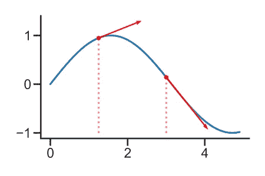
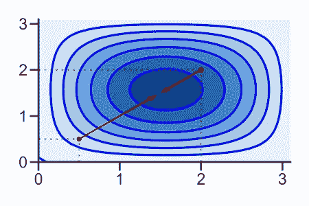
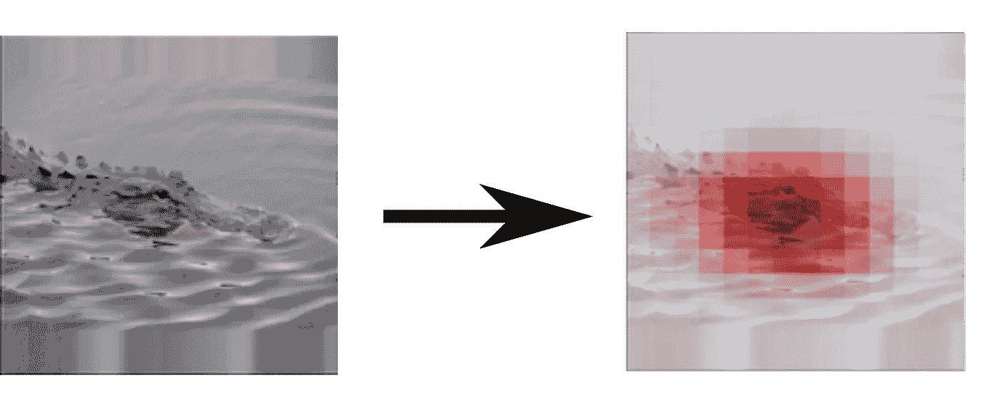
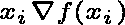

# 基础:渐变*输入作为解释

> 原文：<https://towardsdatascience.com/basics-gradient-input-as-explanation-bca79bb80de0?source=collection_archive---------14----------------------->

## [入门](https://towardsdatascience.com/tagged/getting-started)，[模型可解释性](https://towardsdatascience.com/tagged/model-interpretability)

## 简单函数的简单方法。

在这篇文章中，我想了解基于渐变的解释的基础，你如何使用它们，以及它们能做什么或不能做什么。

[Gradient*Input](https://jmlr.org/papers/volume11/baehrens10a/baehrens10a.pdf) 是解释可微分机器学习模型(如神经网络)的一种很好的方式，因为它在概念上很简单，易于实现。计算梯度也非常快，特别是如果你使用现代的 ML 库，像 [pytorch](https://pytorch.org/) 、 [TensorFlow](https://www.tensorflow.org/) 或 [JAX](https://github.com/google/jax) ，它们包括自动微分。

Gradient*Input 仅适用于解释相对简单的模型，但它是一个基本概念，对于理解许多其他更加健壮的[基于梯度的技术](/indepth-explaining-dnns-with-gradients-2bb148a30ba0)是必要的。

# 什么是渐变？

你可能在高中或大学课堂上遇到过梯度。这不会是一个严谨的介绍，而只是一个快速的提醒。

首先，我们需要记住什么是 [*衍生品*](https://tutorial.math.lamar.edu/classes/calcI/DefnOfDerivative.aspx) 。本质上，一个可微函数的导数 f(x): ℝ → ℝ，告诉我们对于任何输入 x，如果我们增加 x 一点，f(x)会改变多少。

蓝色:函数 f(x)。红色箭头:f(x)在两个不同 x 处的导数。导数本身(一个数字)只是箭头的倾斜度。图片作者。

这对于例如凸优化问题是有用的:为了找到最小值，我们只需从任意点开始，进入 f(x)减少最多的方向，重复计算梯度并采取步骤，直到我们到达最小值，即 [*梯度下降*](https://www.ibm.com/cloud/learn/gradient-descent) 。

可微函数 f(x): ℝ^d → ℝ的*梯度*只是 f(x) w.r.t .对 x 的每一个 d 维的[(偏)导数](https://tutorial.math.lamar.edu/Classes/CalcIII/PartialDerivsIntro.aspx)的向量

蓝色:函数 f(x1，x2)。红色箭头:f(x1，x2)在两个不同点的梯度。图片作者。

梯度告诉我们，对于任意点(x1，x2 ),当在 d 维输入空间的任意方向上迈出一小步时，f(x1，x2)将改变多少。因此，它也告诉我们 f(x1，x1)在哪个方向上增加最多。

形式上，我们把 f(x) w.r.t. x 的梯度写成∇f(x).

# 归因看起来像什么？

一大类旨在解释机器学习模型的解释方法被称为*归因方法*，产生的解释被称为*归因*。归属的目的是将特定产出的一部分责任归属于相应投入的每个方面。

例如，考虑一只被训练从图像中识别鳄鱼的 DNN。归因方法将为输入的每个像素分配一个分数，表明该像素对最终输出的贡献(鳄鱼或非鳄鱼)。如果我们把这些个人属性放回一个矩阵中，我们通常称之为*属性图。*我们可以将属性图可视化为图像，指示图像的哪些区域是重要的。

左图:来自 ImageNet2012 数据集的鳄鱼。右图:一张可能的属性图，覆盖在原始图像上。图片作者。

创建属性地图有不同的方法，一般来说，没有事实来告诉我们哪个像素对输出的贡献有多大。这就是为什么没有一种归属方法可以声称它是“正确的”。通常，它们都有不同的属性，可能在不同的应用场景中有用。

# 什么是渐变*输入？

渐变*输入是一种属性方法，也是最简单有意义的方法之一。这个想法是使用函数(例如我们的模型)的梯度信息，它告诉我们对于每个输入维度，如果我们在这个方向上迈出一小步，函数是否会增加。如果我们的函数输出是，比方说，图像包含鳄鱼的概率，那么梯度基本上告诉我们每个维度增加了多少模型对鳄鱼的预测。

现在，如果我们知道每个维度在这个方向上的一个步骤增加了多少输出，我们只需要将它与输入本身相乘就可以得到一个完整的属性。

这个想法是，梯度告诉我们一个维度的重要性，输入告诉我们这个维度在图像中的表达有多强烈。综上所述，只有在以下情况下，维度的属性才会很高:1)维度似乎对输出很重要；2)维度的值很高。

到目前为止，一切似乎都很合理。只有一个问题:如果我们只迈出一小步，梯度只能告诉我们尺寸*的重要性。这是非常局部的信息，当解释复杂的函数时，即使在输入空间中的几个微小的步骤之后，梯度也可以快速改变。这意味着，如果我们在梯度方向上迈出一步，函数可能会上升，但如果我们在*相同方向*上迈出一大步，函数也可能会下降——这实际上使梯度提供的解释无效。*

现在这听起来很令人失望，当然有数据集和模型，梯度*输入比其他输入做得更好。如果你试图解释一个浅薄的神经网络，还是值得一试。

这个问题也有解决的办法，它依赖于与梯度输入相同的原理，但是使它更加健壮。也许最简单的是[平滑梯度](https://arxiv.org/abs/1706.03825)和[综合梯度](http://proceedings.mlr.press/v70/sundararajan17a/sundararajan17a.pdf)，但还有无数其他方法更复杂，可能基于不同的原理。

# 结束语和替代词

梯度*输入的力量，它是如此简单和快速。它也是更复杂的解释方法的坚实的概念基础。

普通梯度作为一种解释方法的缺点是，它们只适合局部地解释一个函数。这意味着，您应该只使用它们来解释相当简单的函数，因为简单性意味着它们在全局和局部的行为是相似的。

在我之前的一篇[帖子](/indepth-explaining-dnns-with-gradients-2bb148a30ba0)中，我做了一个基于梯度的解释方法的对比。都是基于梯度*输入，并对其进行适配，使其更适合解释复杂函数。

当然，还有更多的解释方法。最流行的有[遮挡分析](/inshort-occlusion-analysis-for-explaining-dnns-d0ad3af9aeb6)、 [SmoothGrad](https://arxiv.org/abs/1706.03825) 、[综合渐变](http://proceedings.mlr.press/v70/sundararajan17a/sundararajan17a.pdf)、[期望渐变](https://arxiv.org/abs/1906.10670)、 [LRP](/indepth-layer-wise-relevance-propagation-340f95deb1ea) 、 [DeepLIFT](https://arxiv.org/abs/1704.02685) 、 [Shapley 值](https://arxiv.org/abs/1705.07874)。如果你想解释深层神经网络，我建议你转向他们。

希望你学到了有用的东西。