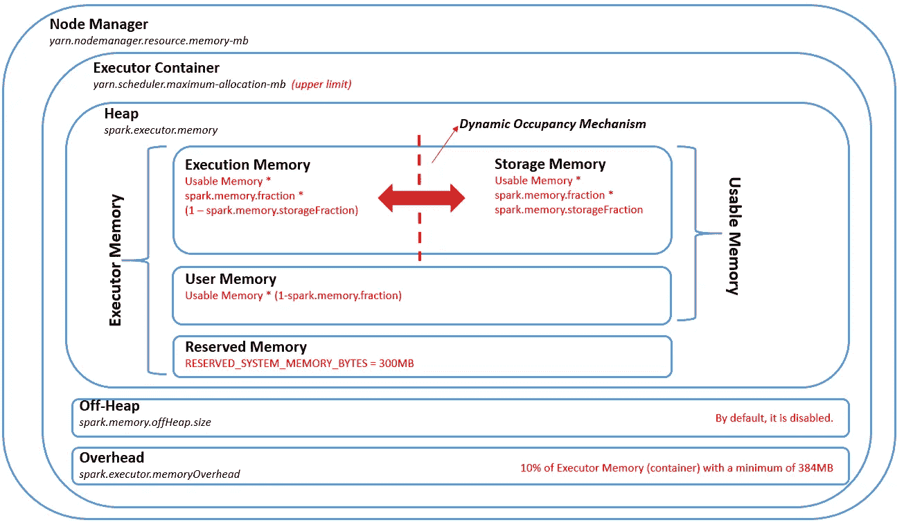
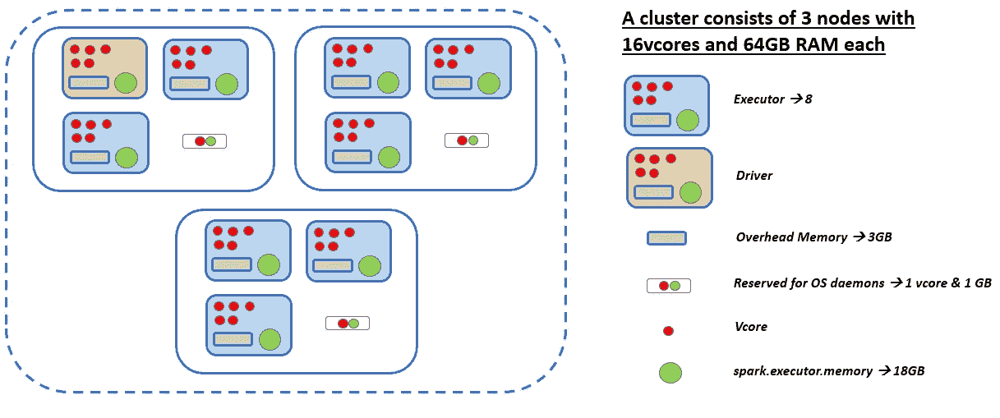

# Apache Spark 配置设置的基础

> 原文：<https://towardsdatascience.com/basics-of-apache-spark-configuration-settings-ca4faff40d45?source=collection_archive---------0----------------------->

## 使用 YARN 作为集群管理框架决定 Pyspark 配置参数

Apache Spark 是最流行的开源分布式计算平台之一，用于内存批处理和流处理。虽然它有望以常规方式快速处理数百万条记录，但如果最初配置不当，可能会导致无法接受的内存和 CPU 使用结果。Spark 应用程序的资源利用率非常重要，尤其是在 AWS 这样的云平台中。不必要的内存和 CPU 资源的使用以及长时间的工作过程可能会大大增加成本。

为了让 Spark 以高性能工作，出现了基于配置级和代码级的两个不同点。前者是在初始阶段正确配置 Spark，而后者是在考虑性能问题的情况下开发/审查代码。在这篇文章中，我的目标是深入了解配置设置。我还打算写另一篇关于编码最佳实践的文章。这篇文章主要是针对以集群模式运行纱线的 Pyspark 应用程序。


迭戈·根纳罗在 [Unsplash](https://unsplash.com?utm_source=medium&utm_medium=referral) 上的照片

# **火花建筑——以简单的方式**

在继续讨论之前，我将简要介绍一下 Spark 架构和术语。Spark 使用主/从架构，带有一个名为*驱动*的中央协调器和一组名为*执行器*的可执行工作流，它们位于集群中的各个节点。

*资源管理器*是集群中所有应用之间资源分配的决策单元，是*集群管理器*的一部分。*集群管理器*是在集群上以容器的形式控制、管理和保留计算资源的进程。Spark 应用程序有许多集群管理器选项，其中之一是 Hadoop YARN。

当一个 Spark 应用启动时，*资源管理器*启动*应用主机(AM)* 并为其分配一个容器。AM 协调其应用程序中所有任务的执行。AM 可以被认为是一个非执行容器，具有向纱线请求容器的特殊能力，占用自己的资源。

一旦 *AM* 启动，它向*资源管理器*请求容器和容器的资源请求。成功接收集装箱后， *AM* 将其投放。在容器内部，它通过*驱动*运行用户应用程序代码。应用完成后， *AM* 将资源释放回*资源管理器*。如果 *AM* 崩溃或变得不可用，*资源管理器*可以创建另一个容器，并在其上重启 *AM* 。

*驱动*以集群模式放置在 *AM* 内部，负责将用户应用转换成更小的执行单元，称为任务，然后调度它们在执行器上运行。这些任务在 worker 节点上执行，然后将结果返回给驱动程序。*驱动*也通知 *AM* 执行者对应用的需求。它运行在自己的 JVM 中。执行者是工作者节点上的进程(计算单元)，其工作是完成分配的任务。一个执行器容器就是一个 JVM。

Spark 上下文是 Spark 功能的主要入口。 *Spark Context* 还通过定期发送心跳消息来实时跟踪执行者。 *Spark 上下文*是由*驱动*为每个 Spark 应用程序创建的，当用户第一次提交时。它存在于 Spark 应用程序的整个生命周期中。*火花上下文*在火花应用完成后停止工作。

Spark 作业有两种不同的运行模式— *客户端模式*和*集群模式*。区别主要取决于*驱动*在哪里运行。当它在*客户端模式*的客户端进程中运行时，它在*集群模式*的 *AM* 中运行。在生产中，*集群模式*是有意义的，客户端可以在初始化应用程序后离开。

# 纱线相关参数

Spark 的领先集群管理框架之一是 YARN。在纱线术语中，执行器和 *AM* 在容器内运行。容器就是内存和 CPU 的简单分配。当 Spark 应用在*集群模式*下通过 YARN 提交时，资源将由*资源管理器*以容器的形式进行分配。

在 *yarn-site.xml* 文件中，如果 Spark 作为集群管理框架与 yarn 一起使用，调整以下参数是一个很好的起点。在同一集群中运行火花应用和非火花应用的情况下，首先正确设置这些纱线参数是非常重要的。在某种程度上，这些参数将定义集群中 Spark 应用程序的边界。以下是需要正确设置的基本纱线参数。

**yarn . node manager . resource . memory-MB**

**yarn . scheduler . max-allocation-MB**

**yarn . scheduler . minimum-allocation-MB**

**yarn . node manager . resource . CPU-v cores**

**yarn . scheduler . maximum-allocation-v cores**

**yarn . scheduler . minimum-allocation-v cores**

**yarn . node manager . resource . memory-MB**简单来说就是单个节点中可以分配给容器的物理内存量。考虑到操作系统守护进程和节点中其他正在运行的进程，它必须低于节点的总 RAM 值。**yarn . scheduler . minimum-allocation-MB**和**yarn . scheduler . maximum-allocation-MB**参数分别表示单个容器可以获得的最小和最大内存分配值。

类似的推理也适用于容器的 CPU 分配。**yarn . node manager . resource . CPU-vcores**确定为单个节点中的所有容器分配的总可用 v cores。并且每个容器在作为下限和上限**的**yarn . scheduler . minimum-allocation-vcores**和**yarn . scheduler . maximum-allocation-v cores**参数的值内获得 v cores。**

# Spark 中的内存管理

与 Spark 中的 CPU 利用率相比，内存利用率有点棘手。在深入研究配置调优之前，了解一下内存管理方面的情况会很有帮助。下图很好地总结了 Spark 中的内存管理。



火花记忆化合物

执行器容器(它是一个 JVM)分配一个由三部分组成的内存部分。它们分别是堆内存、堆外内存和开销内存。属性**spark . memory . off Heap . enabled .**默认禁用堆外内存。要使用堆外内存，可在启用后通过**spark . memory . off Heap . size**设置堆外内存的大小。关于 Spark 应用程序中堆外内存使用的详细解释，以及利弊可以在[这里](https://www.waitingforcode.com/apache-spark/apache-spark-off-heap-memory/read)找到。

内存开销可以用**spark . executor . memory overhead**属性设置，默认情况下是 10%的 executor 内存，最小 384MB。它基本上涵盖了费用，如虚拟机管理费用，实习字符串，其他本地管理费用等。

有趣的事情开始了。与堆外内存不同，堆内存中的所有对象都由垃圾收集器(GC)绑定。为了简单起见，可以认为它由 3 个不同的区域组成，保留内存、用户内存和包括执行和存储内存的统一区域。保留内存用于存储内部对象。它是硬编码的，等于 300MB。

用户内存是为用户数据结构、Spark 中的内部元数据保留的，并在记录稀少且异常大的情况下防止 OOM 错误。使用 **spark.memory.fraction** 属性通过下面的公式简单估算。它决定了有多少 JVM 堆空间用于 Spark 执行内存。建议将此属性的默认值设置为 0.6。因此，用户内存等于 JVM 执行器内存(堆内存)的 40%。

```
User Memory = (Heap Size-300MB)*(1-spark.memory.fraction)# where 300MB stands for reserved memory and spark.memory.fraction propery is 0.6 by default.
```

在 Spark 中，执行和存储共享一个统一的区域。当不使用执行内存时，存储可以获取所有可用内存，反之亦然。在必要的情况下，执行可能会驱逐存储器，直到由**spark . memory . storage fraction**属性设置的某个限制。超过这个限制，执行在任何情况下都不能驱逐存储。该属性的默认值为 0.5。这个调整过程被称为动态占用机制。这种统一的内存管理是 Spark 从 1.6 开始的默认行为。执行和存储内存的初始值通过以下公式计算。

```
Execution memory = Usable Memory * spark.memory.fraction*(1-spark.memory.storageFraction)Storage memory = Usable Memory * spark.memory.fraction*spark.memory.storageFraction
```

执行内存用于存储混洗、连接、聚合、排序等操作中的临时数据。注意，数据操作实际上是在这一部分中处理的。另一方面，存储内存用于存储缓存和广播数据。正如预期的那样，执行内存优先于存储内存。任务的执行比缓存的数据更重要。如果执行内存不足，整个作业可能会崩溃。此外，重要的是要记住，在调整动态占用机制的参数时，驱逐过程是有代价的。内存回收的成本取决于缓存数据的存储级别，如 MEMORY_ONLY 和 MEMORY_AND_DISK_SER。Spark 中内存管理的清晰解释可以在[这里](https://luminousmen.com/post/dive-into-spark-memory)找到。此外，您可以在这里找到另一个关于垃圾收集的内存管理视图[。](https://spark.apache.org/docs/2.2.0/tuning.html#garbage-collection-tuning)

# 主要配置设置

在设置相应的纱线参数并了解 Spark 中的内存管理后，我们进入下一部分——设置内部 Spark 参数。

正确设置下面列出的配置参数非常重要，它基本上决定了 Spark 的源消耗和性能。让我们来看看[他们](https://spark.apache.org/docs/latest/configuration.html#application-properties)。

**spark . executor . instances:**spark 应用程序的执行者数量。

**spark.executor.memory:** 运行任务的每个执行器使用的内存量。

**spark.executor.cores:** 一个执行器可以运行的并发任务的数量。

**spark.driver.memory:** 数量用于驱动的内存。

**spark.driver.cores:** 用于驱动程序进程的虚拟内核数量。

**spark . SQL . shuffle . partitions:**为连接或聚合而重排数据时使用的分区数量。

**spark . Default . parallelism:**由连接和聚合等转换返回的弹性分布式数据集(rdd)中的默认分区数。

通过一个例子来理解配置设置背后的推理更好。假设我们有一个由 3 个节点组成的群集，具有指定的容量值，如下图所示。



一个火花簇例子

第一步是设置 **spark.executor.cores** 即多半是一个简单明了的属性。将大量的 vcores 分配给每个执行器会导致执行器数量的减少，从而降低并行性。另一方面，将少量的 vcores 分配给每个执行器会导致大量的执行器，因此可能会增加应用程序中的 I/O 成本。在上述标准的照明中，作为经验法则，一般设置为 **5** 。

第二步是决定**spark . executor . instances**属性。为了计算这个属性，我们首先确定每个节点的执行器数量。每个节点可能会为 Hadoop 和 OS 守护程序保留一个 vcore。这不是一条经验法则，您可以向系统管理员寻求帮助来决定这些值。

```
executor_per_node = (vcore_per_node-1)/spark.executor.coresexecutor_per_node = (16–1)/5 = 3spark.executor.instances = (executor_per_node * number_of_nodes)-1 spark.executor.instances = (3*3)-1 = 8
```

第三步是决定 **spark.executor.memory** 属性。为此，首先计算总的可用执行器内存，然后考虑内存开销，并从总的可用内存中减去。类似地，每个节点可能会为 Hadoop 和 OS 守护程序保留 1 GB。请注意，运行内存过多的执行器通常会导致过多的垃圾收集延迟。

```
total_executor_memory =  (total_ram_per_node -1) / executor_per_nodetotal_executor_memory = (64–1)/3 = 21(rounded down)spark.executor.memory = total_executor_memory * 0.9spark.executor.memory = 21*0.9 = 18 (rounded down)memory_overhead = 21*0.1 = 3 (rounded up)
```

**spark.driver.memory** 可以设置成和 *spark.executor.memory* 一样，就像 **spark.driver.cores** 设置成和*spark . executor . cores*一样。

另一个突出的性质是**spark . default . parallelism**，可以借助下面的公式进行估算。建议集群中的每个 CPU 内核执行 2-3 个任务。Spark 在许多任务中重用一个 executor JVM，并有效地支持耗时约 200 毫秒的任务。因此，并行级别可以设置为大于集群中的内核数量。虽然公式的结果给出了一个线索，但鼓励考虑分区大小来调整并行度值。推荐的分区大小约为 128MB。通过使用*重新分区*和/或*合并*，可以在洗牌操作期间根据需要定义该属性。如果混洗操作中的数据量非常不同。在 Spark 执行的流程中，*Spark . default . parallelism*可能不会在会话级别设置

```
spark.default.parallelism = spark.executor.instances * spark.executor.cores * 2spark.default.parallelism = 8 * 5 * 2 = 80
```

对于数据帧，**spark . SQL . shuffle . partitions**可以和*spark . default . parallelism*属性一起设置。

请注意，所有配置设置方法都是基于最大化可用资源的利用率。然而，如果多个 Spark 应用程序运行在同一个集群上，并且共享一个公共资源池，那该怎么办呢？在那种情况下，利用**spark . dynamic allocation . enabled**属性可能是一种替代方法。与**spark . dynamic allocation . initial executors、spark . dynamic allocation . min executors、**和**spark . dynamic allocation . max executors 一起使用。**从属性名称可以理解，应用程序从初始的执行人编号开始，然后在执行需求高的情况下增加执行人编号，或者在执行人处于上下限内的空闲位置的情况下减少执行编号。

另一个观点可能是对运行多个 Spark 应用程序的环境应用实验方法。为了更好地阐明这一点，从验证工作持续时间等限制的配置开始。例如，计划的 Spark 应用程序每 10 分钟运行一次，预计不会持续超过 10 分钟。然后，只要不违反限制，逐步减少资源。

# 公平调度程序

如果您有一个运行大量 Spark 应用程序的环境，我也强烈建议您看看 YARN 中的 [*公平调度器*](https://hadoop.apache.org/docs/current/hadoop-yarn/hadoop-yarn-site/FairScheduler.html) 。它提供了一个更高的抽象来管理多个 Spark 应用程序的资源共享。目标是让所有应用程序在一段时间内获得或多或少相等的资源份额，而不是惩罚执行时间较短的应用程序。它的配置在两个文件中维护: *yarn-site.xml* 和 *fair-schedular.xml* 。

在*公平调度器*中，根据内存和 CPU 使用情况，通过利用队列来进行资源管理。这些队列之间公平地共享资源。队列的主要属性可以被计数为 *minResources* 、 *maxResources* 、 *weights* 和 *schedulingPolicy* 。为了更清楚起见，让我们假设您有相同的环境来开发新模型和在生产中运行调度应用程序，这是有原因的。可以为开发和生产应用程序定义单独的队列，类似地，可以为不同用户触发的应用程序定义不同的队列。此外，可以为不同的队列分配不同的权重，因此相应队列中的应用程序可以根据权重成比例地获得资源。对于同时使用 fair schedular 和 Spark 配置属性的问题，您可能会得到一个简单的答案。

# 有用的链接

[](https://medium.com/@ch.nabarun/apache-spark-optimization-techniques-54864d4fdc0c) [## Apache Spark 优化技术

### 在讨论各种优化技术之前，快速回顾一下 spark 是如何运行的

medium.com](https://medium.com/@ch.nabarun/apache-spark-optimization-techniques-54864d4fdc0c) [](https://blog.cloudera.com/how-to-tune-your-apache-spark-jobs-part-2/) [## How-to:调优 Apache Spark 作业(第 2 部分)

### 编者按，2021 年 1 月:这篇博文仅供历史参考。它涵盖了 Spark 1.3，该版本…

blog.cloudera.com](https://blog.cloudera.com/how-to-tune-your-apache-spark-jobs-part-2/) [](https://aws.amazon.com/tr/blogs/big-data/best-practices-for-successfully-managing-memory-for-apache-spark-applications-on-amazon-emr/) [## 在 Amazon EMR 上成功管理 Apache Spark 应用程序内存的最佳实践|…

### 在大数据领域，一个常见的使用情形是对海量数据执行提取、转换(ET)和数据分析…

aws.amazon.com](https://aws.amazon.com/tr/blogs/big-data/best-practices-for-successfully-managing-memory-for-apache-spark-applications-on-amazon-emr/) [](https://luminousmen.com/post/spark-anatomy-of-spark-application) [## 火花。Spark 应用剖析

### Apache Spark 被认为是对大数据原始技术 Hadoop 的有力补充。火花是一个更…

luminousmen.com](https://luminousmen.com/post/spark-anatomy-of-spark-application) [](https://spark.apache.org/docs/latest/tuning.html#memory-management-overview) [## 调谐火花

### 由于大多数 Spark 计算的内存性质，Spark 程序可能会被内存中的任何资源阻塞

spark.apache.org](https://spark.apache.org/docs/latest/tuning.html#memory-management-overview)