# 计数矢量器的基础

> 原文：<https://towardsdatascience.com/basics-of-countvectorizer-e26677900f9c?source=collection_archive---------1----------------------->

## 了解关于 CountVectorizer 的一切信息。


照片由[阿里·沙阿·拉哈尼](https://unsplash.com/@lakhani?utm_source=medium&utm_medium=referral)在 [Unsplash](https://unsplash.com?utm_source=medium&utm_medium=referral) 上拍摄

机器不能理解字符和单词。所以在处理文本数据时，我们需要用机器能够理解的数字来表示它。Countvectorizer 是一种将文本转换为数字数据的方法。为了向您展示它是如何工作的，让我们举一个例子:

```
text = [‘Hello my name is james, this is my python notebook’]
```

文本被转换成如下所示的稀疏矩阵。

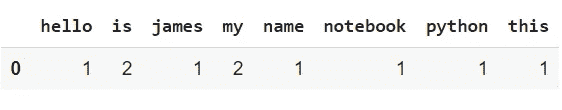

我们在文本中有 8 个唯一的单词，因此在矩阵中有 8 个不同的列，每个列代表一个唯一的单词。该行代表字数。因为单词“is”和“my”重复出现了两次，所以我们对这些特定单词的计数为 2，对其余单词的计数为 1。

Countvectorizer 使文本数据可以很容易地直接用于机器学习和深度学习模型，如文本分类。

让我们再举一个例子，但这一次有不止一个输入:

```
text = [‘Hello my name is james' , ’this is my python notebook’]
```

我有两个文本输入，所发生的是每个输入被预处理，标记化，并表示为一个稀疏矩阵。默认情况下，Countvectorizer 将文本转换为小写，并使用单词级标记化。

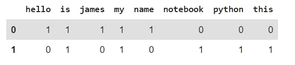

现在我们已经看了一些例子，让我们实际编码！

我们将首先从导入必要的库开始。我们将使用 pandas 库来可视化矩阵，并使用 sk learn . feature _ extraction . text 库来执行矢量化。

```
import pandas as pdfrom sklearn.feature_extraction.text import CountVectorizer text = [‘Hello my name is james’,‘james this is my python notebook’,‘james trying to create a big dataset’,‘james of words to try differnt’,‘features of count vectorizer’] coun_vect = CountVectorizer()count_matrix = coun_vect.fit_transform(text) count_array = count_matrix.toarray() df = pd.DataFrame(data=count_array,columns = coun_vect.get_feature_names())print(df)
```

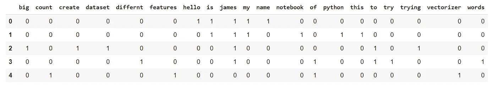

# **参数**

*   **小写**

在标记前将所有字符转换成小写。默认值设置为 true，并采用布尔值。

```
text = [‘hello my name is james’,‘Hello my name is James’] coun_vect = CountVectorizer(**lowercase=False**)count_matrix = coun_vect.fit_transform(text) count_array = count_matrix.toarray() df = pd.DataFrame(data=count_array,columns = coun_vect.get_feature_names())print(df)
```

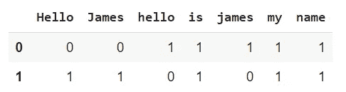

现在让我们尝试不使用“小写=假”

```
text = [‘hello my name is james’,‘Hello my name is James’] coun_vect = CountVectorizer()count_matrix = coun_vect.fit_transform(text) count_array = count_matrix.toarray() df = pd.DataFrame(data=count_array,columns = coun_vect.get_feature_names())print(df)
```

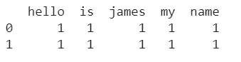

*   **停 _ 字**

停用词是任何语言中对句子没有多大意义的词。它们可以被安全地忽略，而不会牺牲句子的意义。有三种处理停用词的方法:

1.  自定义停用字词列表

```
text = [‘Hello my name is james’,‘james this is my python notebook’,‘james trying to create a big dataset’,‘james of words to try differnt’,‘features of count vectorizer’] coun_vect = CountVectorizer(**stop_words= [‘is’,’to’,’my’]**)count_matrix = coun_vect.fit_transform(text) count_array = count_matrix.toarray() df = pd.DataFrame(data=count_array,columns = coun_vect.get_feature_names())print(df)
```

稀疏矩阵去掉这几个字后是，到和我的:

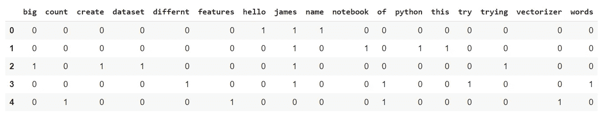

2.sklearn 内置停用词表

```
text = [‘Hello my name is james’,‘james this is my python notebook’,‘james trying to create a big dataset’,‘james of words to try differnt’,‘features of count vectorizer’] coun_vect = CountVectorizer(**stop_words=’english’**)count_matrix = coun_vect.fit_transform(text) count_array = count_matrix.toarray() df = pd.DataFrame(data=count_array,columns = coun_vect.get_feature_names())print(df)
```

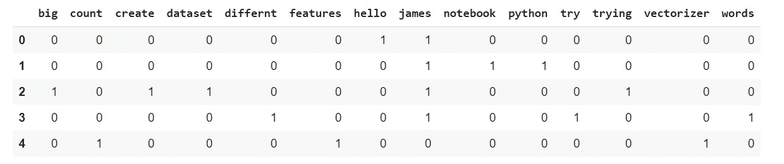

3.使用 max_df 和 min_df(稍后介绍)

*Max_df:*

Max_df 代表最大文档频率。类似于 min_df，我们可以忽略频繁出现的单词。这些单词可能就像在每个文档中出现的单词“the ”,不会为我们的文本分类或任何其他机器学习模型提供有价值的信息，因此可以安全地忽略。Max_df 查看有多少文档包含该单词，如果它超过 max_df 阈值，则从稀疏矩阵中消除它。这个参数又可以是 2 种类型的值，百分比和绝对值。

使用绝对值:

```
text = [‘Hello my name is james’,‘james this is my python notebook’,‘james trying to create a big dataset’,‘james of words to try differnt’,‘features of count vectorizer’] coun_vect = CountVectorizer(**max_df=1**)count_matrix = coun_vect.fit_transform(text) count_array = count_matrix.toarray() df = pd.DataFrame(data=count_array,columns = coun_vect.get_feature_names())print(df)
```

单词“is”、“to”、“james”、“my”和“of”已从稀疏矩阵中删除，因为它们出现在多个文档中。

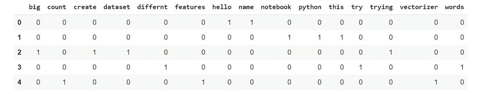

使用百分比:

```
text = [‘Hello my name is james’,‘james this is my python notebook’,‘james trying to create a big dataset’,‘james of words to try differnt’,‘features of count vectorizer’] coun_vect = CountVectorizer(**max_df=0.75**)count_matrix = coun_vect.fit_transform(text) count_array = count_matrix.toarray() df = pd.DataFrame(data=count_array,columns = coun_vect.get_feature_names())print(df)
```

如您所见，单词“james”在 5 个文档中出现了 4 个(85%)，因此越过了 75%的阈值并从稀疏矩阵中移除

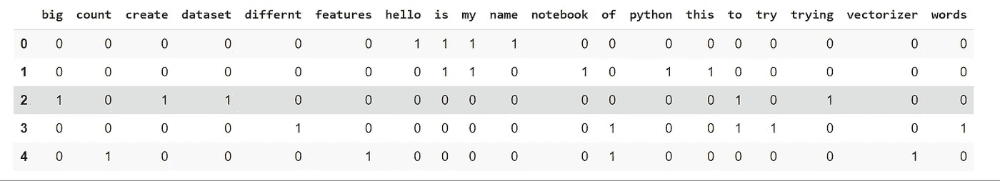

*Min_df:*

Min_df 代表最小文档频率，与计算单词在整个数据集中出现的次数的术语频率相反，文档频率计算数据集中(也称为行或条目)具有特定单词的文档的数量。当构建词汇表时，Min_df 忽略文档频率严格低于给定阈值的术语。例如，在您的数据集中，您可能有只出现在 1 或 2 个文档中的名称，现在这些名称可以被忽略，因为它们不能提供整个数据集的足够信息，而只能提供几个特定文档的信息。min_df 可以取绝对值(1，2，3..)或表示文档百分比的值(0.50，忽略出现在 50%文档中的单词)

使用绝对值:

```
text = [‘Hello my name is james’,‘james this is my python notebook’,‘james trying to create a big dataset’,‘james of words to try differnt’,‘features of count vectorizer’] coun_vect = CountVectorizer(**min_df=2**)count_matrix = coun_vect.fit_transform(text) count_array = count_matrix.toarray() df = pd.DataFrame(data=count_array,columns = coun_vect.get_feature_names())print(df)
```

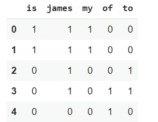

*   **max_features**

计数矢量器将选择出现频率最高的单词/特征/术语。它采用绝对值，因此如果您设置“max_features = 3”，它将选择数据中最常见的 3 个单词。

```
text = [‘This is the first document.’,’This document is the second document.’,’And this is the third one.’, ‘Is this the first document?’,]coun_vect = CountVectorizer(max_features=3)count_matrix = coun_vect.fit_transform(text)count_array = count_matrix.toarray()df = pd.DataFrame(data=count_array,columns = coun_vect.get_feature_names())print(df)df
```

*   **双星**

通过设置“binary = True”，CountVectorizer 不再考虑术语/单词的频率。如果发生，则设置为 1，否则为 0。默认情况下，binary 设置为 False。这通常在术语/单词的计数不能为机器学习模型提供有用信息时使用。

```
text = [‘This is the first document. Is this the first document?’ ]coun_vect = CountVectorizer(binary=True)count_matrix = coun_vect.fit_transform(text)count_array = count_matrix.toarray()df = pd.DataFrame(data=count_array,columns = coun_vect.get_feature_names())print(df)
```

尽管所有的单词在上面的输入中出现了两次，我们的稀疏矩阵只是用 1 来表示它

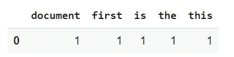

现在让我们看看我们是否使用了默认值:

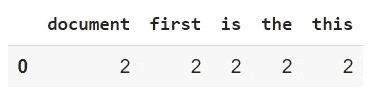

*   **词汇**

它们是稀疏矩阵中单词的集合。

```
text = [‘hello my name is james’,‘Hello my name is James’]coun_vect = CountVectorizer()count_matrix = coun_vect.fit_transform(text)print(coun_vect.vocabulary_)
```

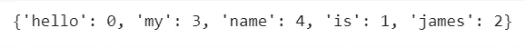

这些数字不代表单词的数量，而是代表单词在矩阵中的位置

如果你只是想要没有单词在稀疏矩阵中的位置的词汇表，你可以使用' get_feature_names()'方法。如果您注意到这是我们在创建数据库和设置列时使用的相同方法。

```
text = [‘Hello my name is james’,‘james this is my python notebook’,‘james trying to create a big dataset’] coun_vect = CountVectorizer()count_matrix = coun_vect.fit_transform(text) print( coun_vect.get_feature_names())
```

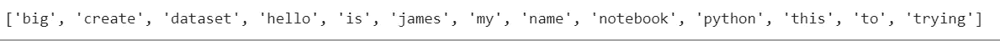

CountVectorizer 只是处理文本数据的方法之一。Td-idf 是一种更好的数据矢量化方法。我建议你查看一下 sklearn 的官方文档以了解更多信息。

希望这有所帮助:)