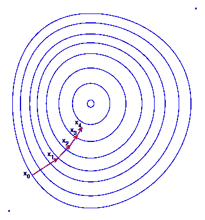

# 深度学习的基础:反向传播

> 原文：<https://towardsdatascience.com/basics-of-deep-learning-backpropagation-e2aeb435727?source=collection_archive---------26----------------------->

## 从头开始反向传播的分步实践教程

劳伦·里奇蒙的照片

我现在已经研究深度学习有一段时间了，我成为了 PyTorch 或 TensorFlow 等当前深度学习框架的超级粉丝。然而，随着我越来越习惯这样简单但强大的工具，深度学习中核心概念的基础，如反向传播，开始淡出。我相信回到基础总是好的，我想做一个详细的实践教程来理清事情。

<https://colab.research.google.com/drive/10sYc0tB2dw_jsw9D61SwliN1nqugyjP1?usp=sharing>  

# 介绍

深度学习的基本过程是使用学习到的权重执行网络定义的操作。比如著名的卷积神经网络(CNN)就是乘法、加法等。像素强度值具有由网络设计的这种规则。然后，如果我们想要分类图片是狗还是猫，我们应该以某种方式得到操作后的二进制结果，以告诉 1 是狗，0 是猫。

当我们训练网络时，我们只是简单地更新权重，以便输出结果变得更接近答案。换句话说，有了一个训练有素的网络，我们可以正确地将图像分类到它真正属于的类别。这就是反向传播的用武之地。我们计算梯度并逐步更新权重以满足目标。目标函数(又名损失函数)是我们如何量化答案和预测之间的差异。通过一个简单且可微的目标函数，我们可以很容易地找到全局最小值。然而，在大多数情况下，这并不是一个微不足道的过程。

图片来源[维基百科](https://en.wikipedia.org/wiki/Gradient_descent)

# 链式法则

没有链式法则，你就无法谈论反向传播。链规则使您能够以简单的方式计算局部梯度。

局部梯度的计算(费，2017)

反向传播的例子(费，2017)

这是一个简单的反向传播的例子。正如我们之前讨论的，输入数据是上面的 *x* 、 *y* 和 *z* 。圆形节点是操作，它们构成了功能 *f* 。由于我们需要知道每个输入变量对输出结果的影响，给定 *x* 、 *y* 或 *z* 的 *f* 的偏导数就是我们想要得到的梯度。然后，通过链规则，我们可以反向传播梯度，并获得每个局部梯度，如上图所示。

矢量化反向传播示例(费-李非，2017 年)

由于我们将在实际实现中进行更多的矢量化计算，这里有一个例子，函数 *f* 是 L2 范数。L2 范数的梯度正好是输入值的两倍，即上面的 *2q* 。那么，给定 *W* 的 *q* 的偏导数将是 *2q* 和 *x* 转置的内积。还有，同样给定的 *x* 会是 *W* 转置和 *2q* 的内积，而为什么 *W* 转置是因为 *xᵢ* 的每个偏导数都给定了 *W* 的列向量。

# 激活功能

在深度学习中，如果没有激活函数，层之间的一组线性操作终究只是一个大的线性函数。非线性激活函数进一步增加了模型的复杂性。我将介绍一个基本的激活函数及其导数，来计算我们反向传播的梯度。

## 乙状结肠的

## 双曲正切

## 整流线性单位

# 目标函数

在训练神经网络时，量化预测与答案的接近程度的有效方法是非常重要的。为了执行反向传播和更新影响输出预测的所有相关权重，需要可微分的目标函数(又名损失函数)。我将介绍两个目标函数，称为均方误差(MSE)和交叉熵损失函数。

## 均方误差

MSE 是当今最通用的损失项，常用于预测数值。它计算了预测和事实之间的平均平方距离。最终激活层通常遵循线性或 ReLU。

## 交叉熵

交叉熵通常用于从多个类别中预测单个标签。对于最终激活函数，它通常遵循 softmax，使得输出概率之和为 1，并且它提供了对损失项的非常简单的推导，如下所示。

# 反向传播

作者图片

对于如上所述的全连接网络，在反向传播中只需要考虑三件事。来自右侧的通过梯度，从激活函数的导数计算的局部梯度，以及关于权重和左侧输入的通过梯度。

第一个梯度来自损失项，通过如上所述的这些项的推导，我们可以开始从右向左传递梯度。从每一层，我们首先计算关于激活层的梯度。然后，该梯度与输入值(*z’*)的内积将是相对于我们的权重的梯度。此外，权重梯度的内积( *w* )将是下一个向左通过的梯度。

重复这个简单的过程是我们成功反向传播所需要的！

# 参考

[1]费-李非， [CS231n:用于视觉识别的卷积神经网络](http://cs231n.stanford.edu/2017/index.html)，2017
[2] Stacey Ronaghan，[深度学习:我应该使用哪些损失和激活函数？](/deep-learning-which-loss-and-activation-functions-should-i-use-ac02f1c56aa8)，2018