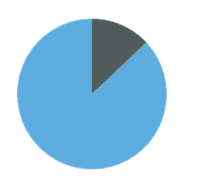
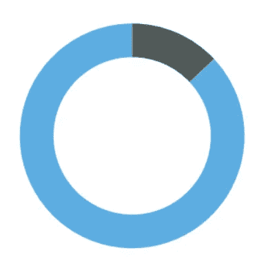
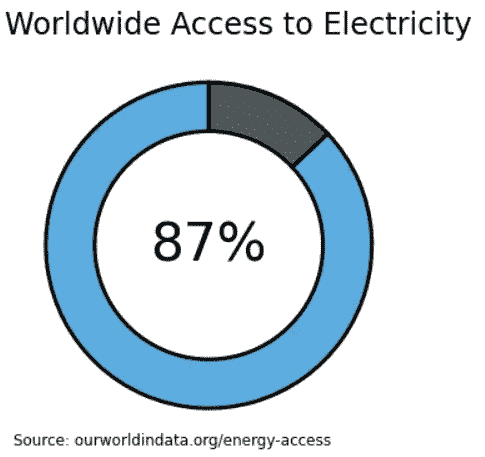
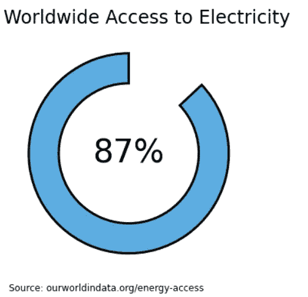
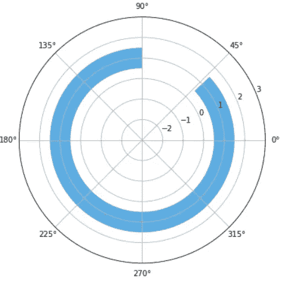
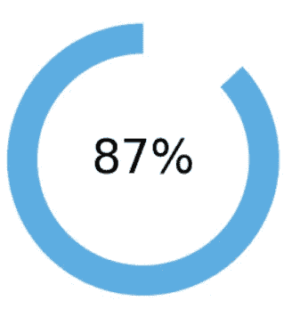
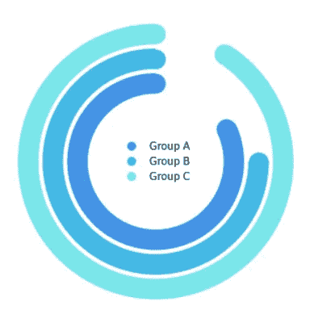

# 使用 Python 的 Matplotlib 的圆环图基础

> 原文：<https://towardsdatascience.com/basics-of-donut-charts-with-pythons-matplotlib-100cf71b259d?source=collection_archive---------14----------------------->

## 使用 Matplotlib 绘制甜甜圈的不同方法快速指南

与饼状图有许多相似之处，这种创造性的可视化使其区别于其声名狼藉的表亲。开放的中心使切片看起来像条形，并将比较的焦点从面积和角度改变为长度。


甜甜圈和圆形进度条——作者图片

在本文中，我们将检查用 Matplolib 绘制环形图的两种方法。一种简单的方法是使用饼图和参数楔形图，另一种更复杂的方法是使用极轴和水平条形图。

## 图片兴趣探测调查

在 Matplotlib 中没有绘制环形图的方法，但是我们可以使用 wedgeprops 快速转换饼图。

让我们从一个简单的馅饼开始。

```
import matplotlib.pyplot as pltplt.pie([87,13], startangle=90, colors=['#5DADE2', '#515A5A'])plt.show()
```



饼图—作者图片

现在我们可以添加参数 wedgeprops 并定义边缘的宽度，其中一个意味着边界将一直延伸到中心。

```
fig, ax = plt.subplots(figsize=(6, 6))

ax.pie([87,13], 
       wedgeprops={'width':0.3}, 
       startangle=90, 
       colors=['#5DADE2', '#515A5A'])plt.show()
```



甜甜圈——作者图片

这很简单。现在我们可以利用中心的空间让我们的数据更加明显。

```
fig, ax = plt.subplots(figsize=(6, 6))wedgeprops = {'width':0.3, 'edgecolor':'black', 'linewidth':3}ax.pie([87,13], wedgeprops=wedgeprops, startangle=90, colors=['#5DADE2', '#515A5A'])plt.title('Worldwide Access to Electricity', fontsize=24, loc='left')plt.text(0, 0, "87%", ha='center', va='center', fontsize=42)
plt.text(-1.2, -1.2, "Source: ourworldindata.org/energy-access", ha='left', va='center', fontsize=12)plt.show()
```



带细节的圆环图—图片由作者提供

当我们要显示简单的比较或比例时，圆环图特别有用。在我看来，使用它们的最佳方式就像一个圆形进度条，比如我们突出显示单一比例的例子。

在这些情况下，我们可以进一步简化图表。

```
fig, ax = plt.subplots(figsize=(6, 6))data = [87, 13]
wedgeprops = {'width':0.3, 'edgecolor':'black', 'lw':3}
patches, _ = ax.pie(data, wedgeprops=wedgeprops, startangle=90, colors=['#5DADE2', 'white'])patches[1].set_zorder(0)
patches[1].set_edgecolor('white')plt.title('Worldwide Access to Electricity', fontsize=24, loc='left')
plt.text(0, 0, f"{data[0]}%", ha='center', va='center', fontsize=42)
plt.text(-1.2, -1.3, "Source: ourworldindata.org/energy-access", ha='left', va='top', fontsize=12)plt.show()
```



圆形进度条—作者图片

## 酒吧

尽管这个解决方案比前一个更复杂，但它提供了一些令人兴奋的定制选项。

先说简单的。

```
from math import pifig, ax = plt.subplots(figsize=(6, 6), subplot_kw={'projection':'polar'})data = 87 
startangle = 90x = (data * pi *2)/ 100 # convert x data from percentage
left = (startangle * pi *2)/ 360 # convert start from angleax.barh(1, x, left=left, height=1, color='#5DADE2')
plt.ylim(-3, 3)plt.show()
```



极轴中的水平条-作者图片

你大概能明白为什么这更复杂了。

现在我们从角度出发。因此，我们必须在将每个元素添加到轴之前转换其 x 位置。

```
from math import pifig, ax = plt.subplots(figsize=(6, 6), subplot_kw={'projection':'polar'})data = 87
startangle = 90x = (data * pi *2)/ 100
left = (startangle * pi *2)/ 360 #this is to control where the bar startsplt.xticks([])
plt.yticks([])
ax.spines.clear()ax.barh(1, x, left=left, height=1, color='#5DADE2') 
plt.ylim(-3, 3)plt.text(0, -3, "87%", ha='center', va='center', fontsize=42)plt.show()
```



圆形进度条—作者图片

使用这种方法时，您有更多的选择；更容易添加多个进度条，定义它们之间的距离，并向可视化添加细节。

另一方面，文本的定位会变得很棘手。

```
from math import pi
import numpy as np
from matplotlib.patches import Patch
from matplotlib.lines import Line2Dfig, ax = plt.subplots(figsize=(6, 6))ax = plt.subplot(projection='polar')data = [82, 75, 91]
startangle = 90
colors = ['#4393E5', '#43BAE5', '#7AE6EA']xs = [(i * pi *2)/ 100 for i in data]
ys = [-0.2, 1, 2.2]
left = (startangle * pi *2)/ 360 #this is to control where the bar starts# plot bars and points at the end to make them round
for i, x in enumerate(xs):
    ax.barh(ys[i], x, left=left, height=1, color=colors[i])
    ax.scatter(x+left, ys[i], s=350, color=colors[i], zorder=2)
    ax.scatter(left, ys[i], s=350, color=colors[i], zorder=2)

plt.ylim(-4, 4)# legend
legend_elements = [Line2D([0], [0], marker='o', color='w', label='Group A', markerfacecolor='#4393E5', markersize=10),
                  Line2D([0], [0], marker='o', color='w', label='Group B', markerfacecolor='#43BAE5', markersize=10),
                  Line2D([0], [0], marker='o', color='w', label='Group C', markerfacecolor='#7AE6EA', markersize=10)]
ax.legend(handles=legend_elements, loc='center', frameon=False)# clear ticks, grids, spines
plt.xticks([])
plt.yticks([])
ax.spines.clear()plt.show()
```



多个进度条—作者图片

楔形区的 width 属性是一个简单的参数，它可以使任何饼图更加激动人心，可读性更好。

有其他选项来绘制这种可视化效果也很棒。我看过另一个教程，他们展示了如何在饼图的中心画一个白色的圆圈，将它变成一个甜甜圈，这表明了如何通过数据可视化来获得创意。

感谢阅读我的文章！— [更多 Python DataViz 教程](https://linktr.ee/admin/settings#Settings--SocialLinks)。

**资源:**
MPL 派；
[MPL 楔形](https://matplotlib.org/stable/api/_as_gen/matplotlib.patches.Wedge.html)；
[MPL 极坐标散点示例](https://matplotlib.org/stable/gallery/pie_and_polar_charts/polar_demo.html)；
[MPL Barh](https://matplotlib.org/stable/api/_as_gen/matplotlib.pyplot.barh.html)；