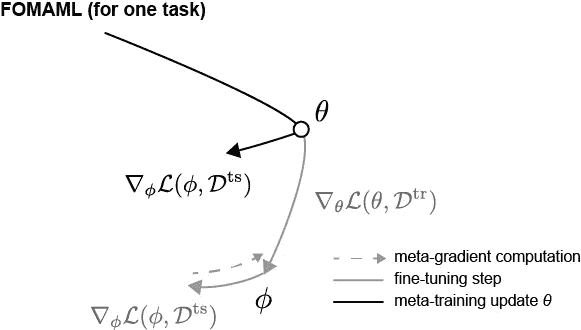

# 基于优化的元学习的少量学习基础

> 原文：<https://towardsdatascience.com/basics-of-few-shot-learning-with-optimization-based-meta-learning-e6e9ffd4775a?source=collection_archive---------16----------------------->

## 基于优化的元学习中 MAML、FOMAML 和爬虫方法背后的机制概述

凯利·西克玛在 [Unsplash](https://unsplash.com?utm_source=medium&utm_medium=referral) 上的照片

元学习方法可以大致分为基于度量、基于优化和基于模型的方法。在这篇文章中，我们将主要关注基于优化的元学习方法背后的数学。

*术语。*元学习模型用元训练数据集(用一组任务 *τ* = { *τ* ₁、 *τ* ₂、 *τ* ₃、…})训练，用元测试数据集(任务 *τₜₛ* )测试。每个任务 *τᵢ* 由任务训练集(即支持集)*dᵢ*ᵗʳ*t21】和任务测试集(即查询集) *Dᵢ* ᵗˢ.组成元学习问题的一种类型是*N*-way*k*-shot learning，其中我们在 *N* 个类之间进行选择，并利用每个类的 *k* 个示例进行学习。*

双向单次示例的元训练、元测试、支持和查询数据集的图示。图片作者。

# 迁移学习(微调)

在继续讨论元学习之前，我们将简要提及另一种常用的方法——通过微调转移学习，以*将知识*从基础模型(例如，通过识别许多不同的对象构建)转移到新任务(例如，专门识别狗)。这里的想法是建立在一般任务上预先训练的模型，并在新的特定任务上微调该模型(通过仅更新神经网络中有限的层集合和/或以较慢的学习速率)。我们将在这一节复习数学术语，这样我们就可以与后面要讨论的元学习进行比较和对比。

在微调设置中，我们将首先导出在 *D* ᵖʳᵉ-ᵗʳ上预训练的一组优化的参数 *θ* ᵖʳᵉ-ᵗʳ，

在微调过程中，我们将调整使训练集 *D* ᵗʳ损失最小的参数，

该等式示出了一个梯度步骤，但是实际上这是通过多个梯度步骤来优化的。作为示例，下面显示了参数空间中从预训练参数值 *θ* ᵖʳᵉ-ᵗʳ到微调参数值 *θ* 的路径。

微调。图片作者。

在通过微调的迁移学习中，希望基础模型已经学习了基本模式(如形状、对比度、图像中的物体)，微调可以更快更容易地适应新的任务。然而，这种方法并不是专门围绕着*学习*而设计的。新任务可能不会与基本任务重叠，从而导致知识的*转移*性能不佳。另一方面，元学习是明确围绕构建任务和算法进行设计的，以便进行一般化的学习。

# MAML

模型不可知元学习(MAML)是由 Finn 等人在 2017 年提出的。这是一种基于优化的元学习方法。其思想是，我们不是寻找对给定的训练数据集或经过微调的训练集有用的参数，而是寻找经过微调后可推广到其他测试集的最佳参数。

**为了一个任务。**对于给定的任务，我们将首先在微调步骤中使用支持训练数据集 *D* ᵗʳ。 *D* ᵗʳ的最佳参数 *ϕ* 为，

不同于微调(我们将在此停止)，我们想要计算这个最优参数 *ϕ* 在查询测试数据集 *D* ᵗˢ上的表现，损失函数为 *L* ( *ϕ* ， *D* ᵗˢ).目标是优化初始参数 *θ* ,使其在给定微调的情况下在查询测试集上表现良好。换句话说，我们在元训练步骤中更新 *θ* ,

这里我们需要计算∇_θ *L* ( *ϕ* ， *D* ᵗˢ)，它是损失函数关于 *θ* 的导数。

我们可以如下说明参数空间中的路径，

MAML 负责一项任务。图片作者。

请注意，我们不是在微调步骤直接更新 *θ* ，而是根据支持训练和测试数据集(灰色路径)判断最佳参数的方向，并在元训练步骤中更新 *θ* 。

**用于任务集。不仅仅是一个任务，为了对各种任务进行归纳，我们可以通过对一组任务进行平均来执行每一步的元学习 *τ* = { *τ* ₁， *τ* ₂， *τ* ₃，…}。因此支撑组任务 *τᵢ* 的最佳参数 *ϕᵢ* 为:**

元训练步骤是，

术语∇_*θ*l(*ϕ*ᵢ， *Dᵢ* ᵗˢ)$可以进一步展开。下面我们将省略下标 *i* ，但是这种讨论适用于每个任务。对于链式法则，该术语可以表示为:

我们可以扩展早期的路径视觉效果，以包含多项任务，

多重任务的 MAML。图片作者。

在这里，我们对每个任务的最佳参数的方向性有所了解(用不同的颜色)，并根据任务的平均值更新 *θ* (黑色路径)。

# 一阶 MAML

在 MAML 元学习步骤中，我们需要计算海森矩阵。作为替代，在一阶 MAML (FOMAML)中，可以通过将∇_*θ*l(*θ*， *D* ᵗʳ)视为常数并因此忽略二阶导数项来使用一阶近似。这意味着我们将项∇_ *θ ϕ* 视为单位矩阵 *I* ，从而得到:

这可以直观地说明如下，

一级 MAML。图片作者。

注意，我们不是通过在计算图中一路展开来执行元梯度计算，而是使用一阶近似∇_*ϕ*t16】l(*ϕ*， *D* ᵗˢ)作为更新 *θ* 的梯度。

# 爬行动物

爬行动物(OpenAI)是一种替代方法，其性能与 MAML 相当，但在计算和存储方面比 MAML 更有效，因为没有二阶导数的显式计算。

首先，我们将引入一个更新函数 *Uᵏ* ，它只是 MAML 中微调步骤的一个重新表述(和推广),

其中 *k* 是 *ϕ* 更新的次数。

对于爬虫，在每次迭代中，1)任务 *τᵢ* 被采样，2)在 *k* 更新后，计算 *τᵢ* 的最优参数 *ϕᵢ* ，以及 3)模型参数 *θ* 被更新为:

不是每个迭代一个任务，而是可以评估多个任务，产生如下的批处理版本，

在哪里

参数路径可以被示意性地可视化为，

爬行动物。图片作者。

将爬行动物与不同任务间平均的规则随机梯度下降区分开来的关键区别是对 *ϕᵢ* 在*k*t60】1 步上的估计，并使用*ϕᵢ*θ作为更新 *θ* 的梯度。在标准随机梯度下降中，在每个梯度步骤之后更新参数( *U* ，其中 *k* =1)。作者 Nichol 等人已经表明，当 *k* > 1 时，这允许算法拾取高阶导数，并且随之而来的行为类似于 MAML，并且与 *k* =1 时明显不同。

# 资源

*   [芬恩(2020) CS330 讲座](https://cs330.stanford.edu/#topics)
*   [快速前进研究(2020)元学习](https://meta-learning.fastforwardlabs.com/)
*   [Ecoffet (2018)博客文章](/paper-repro-deep-metalearning-using-maml-and-reptile-fd1df1cc81b0)
*   【翁(2018)博文
*   [尼科尔&舒尔曼(2018) OpenAI 博客文章](https://openai.com/blog/reptile/)

# 参考

1.  模型不可知的元学习，用于深度网络的快速适应。 *ICML* 2017。 [arXiv](https://arxiv.org/abs/1703.03400)
2.  一阶元学习算法。 *arXiv* 2018。 [arXiv](https://arxiv.org/abs/1803.02999)

*原载于 2021 年 8 月 7 日*[*https://boyangzhao . github . io*](https://boyangzhao.github.io/posts/few_shot_learning)*。*