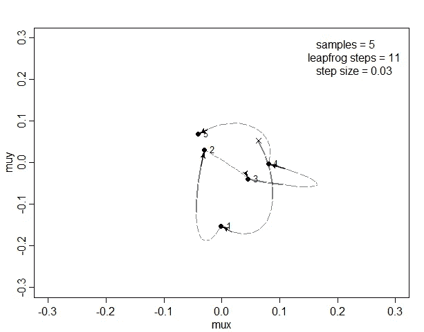

# 马尔可夫链蒙特卡罗算法基础

> 原文：<https://towardsdatascience.com/basics-of-markov-chain-monte-carlo-algorithms-a53a6b3a763d?source=collection_archive---------19----------------------->

## 这篇文章的目的是给马尔可夫链蒙特卡罗算法一个概念性的理解，以及我们为什么使用它们。

## 介绍

马尔可夫链蒙特卡罗是一组算法，用于通过从后验分布中取样来绘制后验分布。我们使用这种方法而不是二次近似方法的原因是，当我们遇到具有多个峰值的分布时，该算法可能会收敛到局部最大值，而不会给出后验分布的真实近似。然而，蒙特卡罗算法使用随机性和混沌理论的原理来解决问题，否则这些问题很难(如果不是不可能的话)通过分析来解决。

## 马尔科夫国王的类比

让我们用一个类比来开始这个讨论，我们可以在遍历不同类型的算法时更新这个类比。假设有 10 个岛屿以环形方式放置，并且有一个国王监管这些岛屿。马尔柯夫国王的受托人建议他，为了避免人民的反叛，他必须定期访问每个岛屿。条件是每个岛屿必须按人口比例参观。

岛的人口分布使得岛 10 的人口是岛 1 的 10 倍，岛 5 的人口是岛 1 的 5 倍，等等；因此，马尔科夫国王将停留在 10 号岛，比他停留在 1 号岛多 10 倍。Markov 国王的一位统计学家解释了一种方法，他可以用这种方法来计划他对这些岛屿的访问，并让他的人民高兴。方法是:
第一步:每周，Markov 王在移动到下一个岛或留在当前岛之间做出决定。
第二步:他抛硬币。如果硬币正面朝上，马尔科夫国王考虑以顺时针方向移动到下一个岛。如果硬币落在一个反面，国王马尔可夫考虑以逆时针方向移动到下一个岛。让我们把这个岛叫做*求婚岛*。
第三步:如果求婚岛的人口比当前岛的人口多，马尔科夫国王总是接受求婚，并移动到求婚岛。如果提议岛屿的人口少于当前岛屿的人口，那么他以`population_proposal/population_current`的概率接受提议。因为这是一个概率，这也可能导致国王马尔科夫根本不动，拒绝建议。

下面给出了模拟这种情况的代码。随着周数的增加，你肯定会发现在岛上度过的周数与岛上的相对人口数成正比。

```
num_weeks <- 1e4
positions <- rep(0,num_weeks)
current<-10
for(i in 1:num_weeks){
  ##record current position
  positions[i] <- current

  ##flip coin to generate a proposal
  proposal <- current + sample(c(-1,1), size = 1)

  ##This is just to make sure that proposal remains between 1 and 10
  if(proposal < 1) proposal <- 10
  if(proposal >10) proposal <- 1

  #move?
  prob_move <- proposal/current
  current <- ifelse(runif(1)<prob_move, proposal, current)
}
barplot(prop.table(table(positions)), ylim = c(0,0.2))
```


在上面给出的代码块中，随着周数的增加，条形图给出了一个稳定增加的分布，说明了每个岛屿的访问量与其人口规模成比例—(图片由作者提供)

## 大都会算法

这种算法被称为 Metropolis 算法。这是最简单的算法，属于马尔可夫链蒙特卡罗算法类。此外还有 Metropolis-Hastings 算法。
这两种算法的唯一不同之处在于，Metropolis 算法只是随机遍历负对数后验分布，而 Metropolis-Hastings 算法则提出了一个更加合理的建议。这可以参考它的数学[这里](https://www.statisticshowto.com/metropolis-hastings-algorithm/)更详细地理解。
让我们试着把这里的点点滴滴联系起来；你在后验分布上选择一个估计的起点。这是国王旅行开始时所在的岛屿。您生成一个随机数，建议点应该移动的方向。计算建议点和当前点的密度。如果建议点具有比当前更高的后验密度，则移动到建议点。如果它的密度较低，你以`density_proposal/density_current`的概率移动到提议点。
所以一旦你一遍又一遍地这样做，你最终总会走向后防线的顶峰。沿途采集的样本有助于估计后验分布的形状。

我们使用这种算法的原因是，从后验样本中提取样本来告知我们后验的可能形状，因为如果我们试图找到后验的方程，然后试图优化它，我们将不得不求解一个非常复杂的积分。有时，这些积分甚至是不可解的，这就是为什么*从最高密度区域采样*给了我们一个更快更精确的关于后验形状的估计。

## 蒙特国王的类比

让我们假设 Markov 国王有一个叫 King Monte 的兄弟，他监管着边缘陡峭而中间平坦的山谷。为了方便起见，我们假设山谷的形状像一个碗，山谷中的人口分布与地形的陡度成反比。简单来说，在山谷陡峭的边缘周围，人口较低，在山谷平坦的中心周围，人口较高。蒙特国王被告知，就像马尔柯夫国王一样，为了避免他的人民叛变，他必须按照人口密度的比例访问山谷。这个问题比上一个问题稍微复杂一点。与金·马尔科夫的问题不同，我们在这里面对的是一大片连续的待开发土地。国王蒙特坐进他的车，在某个随机的方向上给了他的车一些随机的冲力。当汽车开始上坡时，它的动能开始转化为势能，直到汽车停下来掉头，并向中心移动。在一些预定的时间间隔，国王蒙特停下他的车，会见他所在地区的人；这个过程一遍又一遍地重复。从长远来看，国王蒙特将总是更多地访问人口较高的地区，因为重力将总是迫使他向中心而不是边缘。
让我们试着分析这是如何适用于确定后的形状。到目前为止，我们已经理解，计算后验概率的精确解在计算上过于昂贵；然而，我们能够计算任何单点的概率密度。我们还可以计算任意给定点的后验斜率。这其中的数学可以在[这里](https://colindcarroll.com/2019/04/11/hamiltonian-monte-carlo-from-scratch/)找到。因此，该算法基本上运行一个动态模拟，接近准确的国王蒙特的汽车如何表现。唯一的区别是，我们的观点是在一个无摩擦的平原上前进。在开始模拟之前，我们还必须定义两件事情。一个是点在停止前应该走的步数，我们称之为*跳步、*，第二个是*步长*。这个点以随机的动量被弹向随机的方向。评估下一步的梯度和密度，并考虑能量因素。在我们完成所有的蛙跳步骤后，该点停止并采样其在后部的当前位置。代码可以在[这里](https://github.com/sheharyarakhtar/MediumArticles)找到。下图显示了 5 个样本点的路径。



该图显示了马尔可夫链在 HMC 算法中的轨迹。每个点的方向和动量都是随机的。一旦我们增加样本的数量，链将总是从更接近(0，0)的区域中采样更多的样本

## 哈密顿蒙特卡罗

汉密尔顿并没有创造这个算法，虽然他确实对现代动力学贡献很大。由于 HMC 使用了动力学和能量守恒的原理，毫不夸张地说，达到了后验的顶峰，这种算法就以他的名字命名了。HMC 如此受欢迎的原因是因为与 Metropolis 或 Metropolis-Hastings 算法不同，该提议被拒绝的几率非常低。其原因是，下一个采样点是由一长串事件决定的，这些事件几乎总是导致下一个样本具有比当前样本更大的后验密度。唯一一次提案被拒绝是当系统的能量不守恒时，这通常发生在我们对提案密度的数值近似不好的时候。

然而，使用 HMC 的最大原因不是这个。由于参数数量较少，大都市和 HMC 的工作方式非常相似。HMC 总是更有效率，但结果是一样的。随着你向更高维度移动，后验模式离大多数概率质量存在的地方越来越远。很难想象超过 3 个维度，所以这样想。当参数的数量相对较少时，比如 3，后验模型会给出一个很好的近似值，来表示大部分概率质量的位置。当你有 1000 个参数时，分布的形状变得越来越像一个甜甜圈，大部分的概率质量离模式越远。

这导致 Metropolis 算法比 HMC 算法更频繁地拒绝提案，因此需要更多的时间来收敛。下面显示的图表对此给出了更多的含义。


每个密度上面的数字是维度的数量。随着参数数量的增加，模式离我们想要采样的值越来越远—(图片由作者提供)

## 摘要

在本文中，我们通过两个流行的 MCMC 方法来从概念上理解它们。在以后的文章中，我将介绍它们在 R 和 Stan 中的实现。本文中用于生成图表和模拟数据的所有代码都可以在[这里](https://github.com/sheharyarakhtar/MediumArticles)找到。


照片由[丹尼尔·利维斯·佩鲁西](https://unsplash.com/@yogidan2012?utm_source=medium&utm_medium=referral)在 [Unsplash](https://unsplash.com?utm_source=medium&utm_medium=referral) 上拍摄

## 参考

[1] Richard McElreath，R 和 Stan(2020)【T0【2】[**斯蒂芬妮·格伦**](https://www.statisticshowto.com/contact/) 用实例进行统计再思考。[**StatisticsHowTo.com**](https://www.statisticshowto.com/)中的“Metropolis-Hastings 算法/ Metropolis 算法”:对于我们其他人来说是基本的统计数据！[https://www . statistics show to . com/metropolis-Hastings-algorithm/](https://www.statisticshowto.com/metropolis-hastings-algorithm/)
【3】科林·卡罗尔，[https://colind Carroll . com/2019/04/11/哈密顿-蒙特卡罗-从头开始/](https://colindcarroll.com/2019/04/11/hamiltonian-monte-carlo-from-scratch/)