# 基于 Python 的 Matplotlib 的 OHLC 海图基础

> 原文：<https://towardsdatascience.com/basics-of-ohlc-charts-with-pythons-matplotlib-56d0e745a5be?source=collection_archive---------10----------------------->

## 如何绘制股票分析的基本图表的快速指南

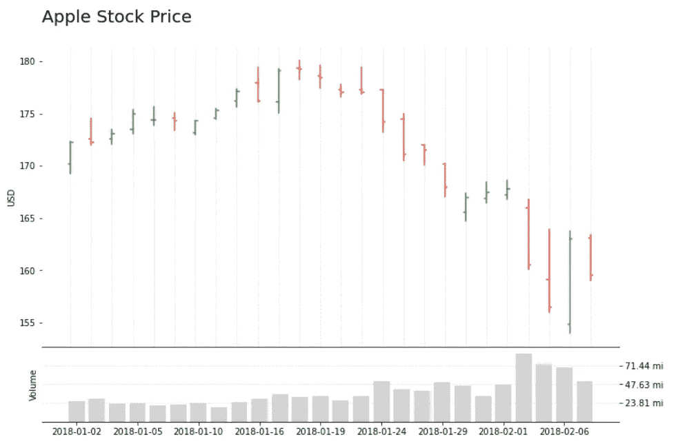

OHLC 图表与卷-图片由作者

历史可以追溯到 18 世纪，开盘-盘高-盘低-收盘(OHLC)图是最受欢迎的金融分析工具之一，通常用于说明股票价格随时间的变化。

在本文中，我们将了解如何使用 Matplotlib 从头开始构建 OHLC 图表，探索这种可视化的优势和局限性，并了解使用 mplfinance 的更直接的方法。

## OHLC 图表是如何工作的？

图表由一系列垂直线组成，这些垂直线包含了价格的四个关键变量；一段时间内的最小值、最大值、初始值和结束值，通常以小时、天或周为单位。


OHLC——作者的形象

## 和蜡烛图有什么区别？

OHLC 与[蜡烛图](https://en.wikipedia.org/wiki/Candlestick_chart)非常相似，因为它们都显示相同的信息，并用于说明一段时间内的价格。通常指股票、货币、债券、商品等。

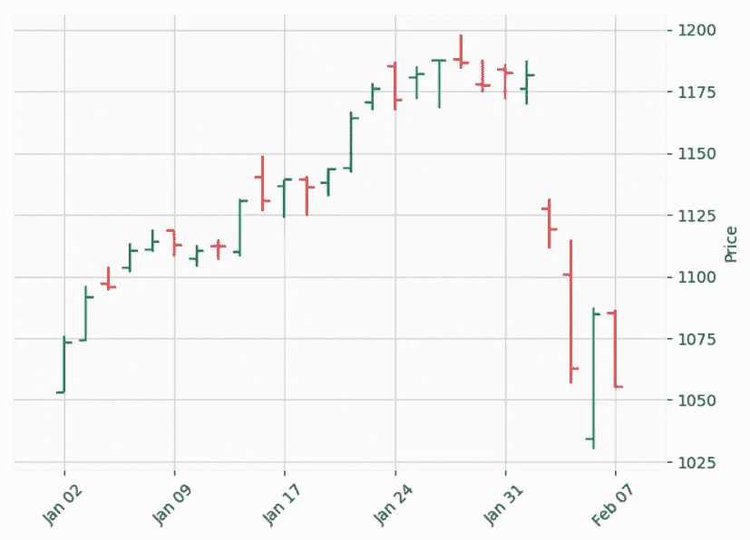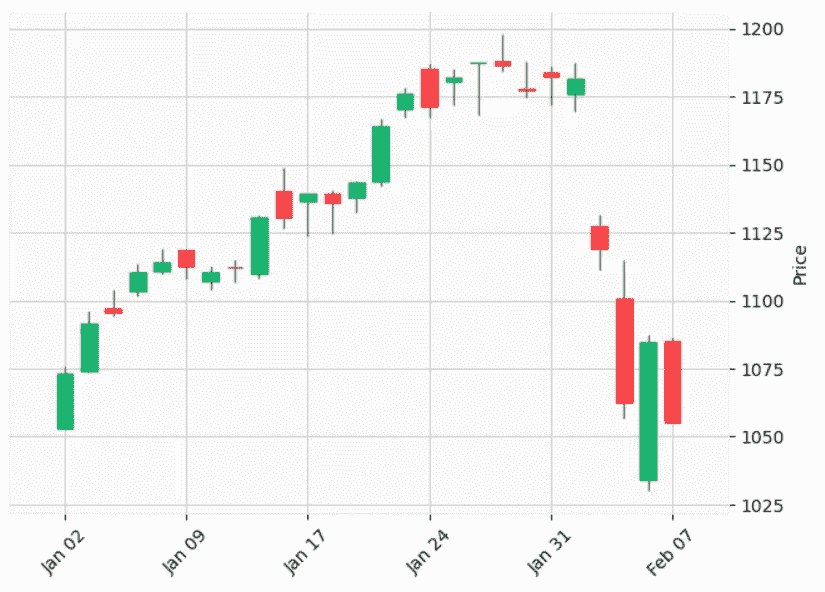

OHLC 和烛台图表——作者图片

它们在显示数据的方式上略有不同；OHLC 开盘价总是在棍子的左边，收盘价在右边。

烛台的左右两边都没有标记。他们有一个盒子。

盒子的填充代表价格的方向。通常，实心或红色方框意味着价格下跌(熊市)，因此开盘价是矩形的顶部。

空的或绿色的方框表示相反的情况(牛市)，方框的顶部是收盘价。

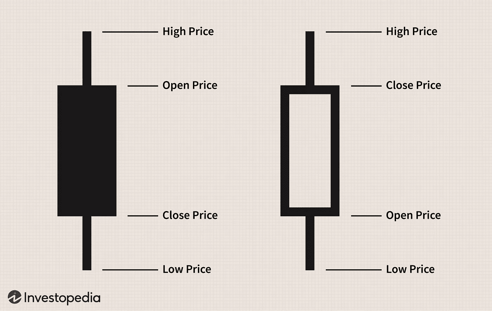

烛台——来自 [Investopedia](https://www.investopedia.com/trading/candlestick-charting-what-is-it/)

## Matplotlib

让我们开始构建我们的 OHLC 图表。首先，我们将导入所需的库。

```
import pandas as pd
import matplotlib.pyplot as plt
import numpy as np
import math
```

本例中的数据来自名为 [S & P 500 股票数据](https://www.kaggle.com/camnugent/sandp500)的 Kaggle 数据集。

```
df = pd.read_csv('../data/all_stocks_5yr.csv')
df.head()
```

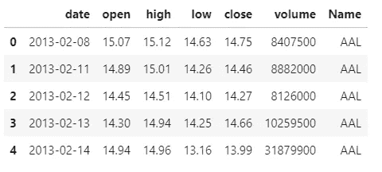

数据框的前五行-作者提供的图片

这是一个庞大的数据集，我们不会一次绘制所有这些数据，所以在开始之前，让我们选择一个较小的子集。

```
# filter Apple stocks
df_apple = df[df['Name'] == 'AAPL'].copy()# convert date column from string to date
df_apple['date'] = pd.to_datetime(df_apple['date']) # filter records after 2017
df_apple = df_apple[df_apple['date'].dt.year > 2017] df_apple.reset_index(inplace=True)
```

现在让我们画出树枝。它们应该从最低价格延伸到最高价格。

我们将为它创建一个 NumPy 数组，而不是使用日期作为 x。该数组的长度将从 0 变为数据帧的长度。操纵数字序列更容易，这将有助于定位棒和开盘价/收盘价的标记。

为了画线，我们将遍历数据框，为每条数据记录绘制一条线。

```
x = np.arange(0,len(df_apple))
fig, ax = plt.subplots(1, figsize=(12,6))for idx, val in df_apple.iterrows():
    plt.plot([x[idx], x[idx]], [val['low'], val['high']])plt.show()
```

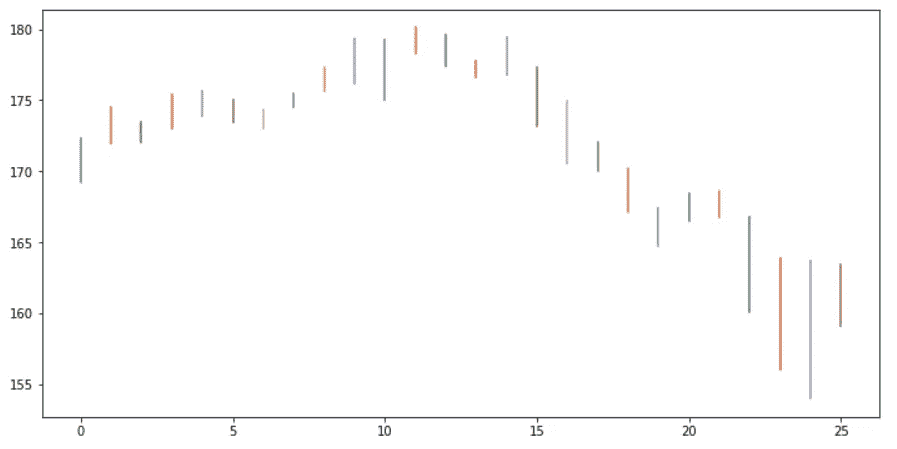

矩形中的彩虹线——作者图片

太棒了，现在我们可以添加标记了。

```
x = np.arange(0,len(df_apple))
fig, ax = plt.subplots(1, figsize=(12,6))for idx, val in df_apple.iterrows():
    # high/low lines
    plt.plot([x[idx], x[idx]], 
             [val['low'], val['high']], 
             color='black')
 **# open marker
    plt.plot([x[idx], x[idx]-0.1], 
             [val['open'], val['open']], 
             color='black')
    # close marker
    plt.plot([x[idx], x[idx]+0.1], 
             [val['close'], val['close']], 
             color='black')**plt.show()
```

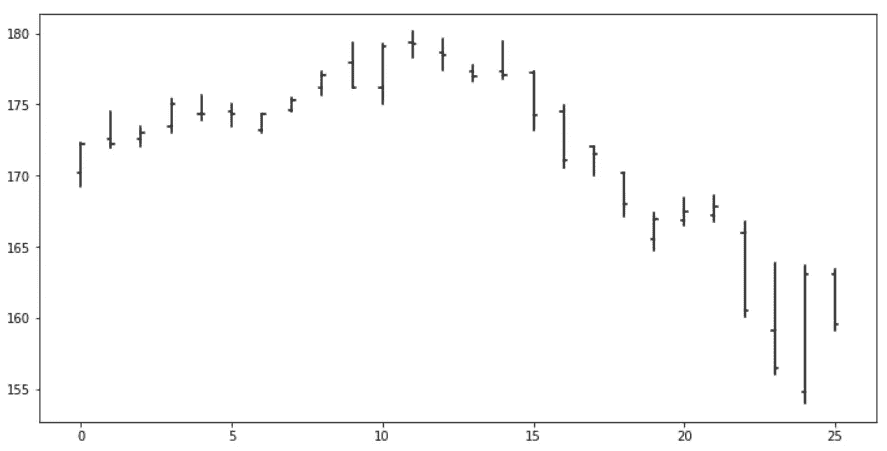

OHLC 海图—图片由作者提供

在那里！用 Matplotlib 绘制 OHLC 图表非常容易。与烛台不同，你不需要颜色或符号中的不同填充物来理解可视化。

最简单的形式，这个图表是可读的和相对简单的。

## 颜色；色彩；色调

它们不是必须的，但是可以把我们的视觉带到另一个层次。

我们将在循环的开始添加一个绿色的变量；然后我们将添加一个条件来检查开盘价是否高于收盘价；为真时，我们将颜色改为红色。

```
x = np.arange(0,len(df_apple))
fig, ax = plt.subplots(1, figsize=(12,6))for idx, val in df_apple.iterrows():
    **color = '#2CA453'
    if val['open'] > val['close']: color= '#F04730'**
    plt.plot([x[idx], x[idx]], 
             [val['low'], val['high']], 
             **color=color**)
    plt.plot([x[idx], x[idx]-0.1], 
             [val['open'], val['open']], 
             **color=color**)
    plt.plot([x[idx], x[idx]+0.1], 
             [val['close'], val['close']], 
             **color=color**)plt.show()
```

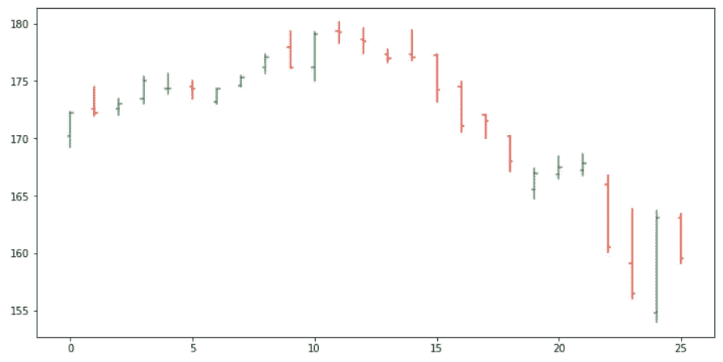

彩色编码的 OHLC 海图——图片由作者提供

给我们的 OHLC 图表添加颜色使得过去的趋势更加明显，我们的可视化更加有洞察力。

## 一会儿

我们的可视化看起来已经很棒了，但是 x 轴已经没用了。

使用一个数字序列作为我们的 x 有助于画线和标记，但我们不能像这样告诉日期。

我们将使用 x 来定位我们的记号，并将日期作为标签。我们还需要考虑，如果我们打印每个日期，我们的 x 轴将是不可读的，所以我们将在绘图时跳过一些值。

```
x = np.arange(0,len(df_apple))
fig, ax = plt.subplots(1, figsize=(12,6))for idx, val in df_apple.iterrows():
    color = '#2CA453'
    if val['open'] > val['close']: color= '#F04730'
    plt.plot([x[idx], x[idx]], 
             [val['low'], val['high']], 
             color=color)
    plt.plot([x[idx], x[idx]-0.1], 
             [val['open'], val['open']], 
             color=color)
    plt.plot([x[idx], x[idx]+0.1], 
             [val['close'], val['close']], 
             color=color)

# ticks
plt.xticks(x[::3], df_apple.date.dt.date[::3])plt.show()
```

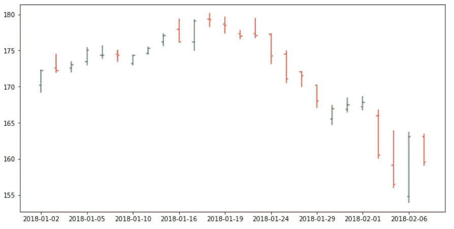

带有正确 x 轴的 OHLC 图表—作者图片

太好了！现在我们可以给我们的可视化添加一些样式，使它更有吸引力。

```
x = np.arange(0,len(df_apple))
fig, ax = plt.subplots(1, figsize=(12,6))for idx, val in df_apple.iterrows():
    color = '#2CA453'
    if val['open'] > val['close']: color= '#F04730'
    plt.plot([x[idx], x[idx]], [val['low'], val['high']], color=color)
    plt.plot([x[idx], x[idx]-0.1], [val['open'], val['open']], color=color)
    plt.plot([x[idx], x[idx]+0.1], [val['close'], val['close']], color=color)

# ticks
plt.xticks(x[::3], df_apple.date.dt.date[::3])
ax.set_xticks(x, minor=True)# labels
plt.ylabel('USD')# grid
ax.xaxis.grid(color='black', linestyle='dashed', which='both', alpha=0.1)# remove spines
ax.spines['right'].set_visible(False)
ax.spines['top'].set_visible(False)# title
plt.title('Apple Stock Price', loc='left', fontsize=20)
plt.show()
```

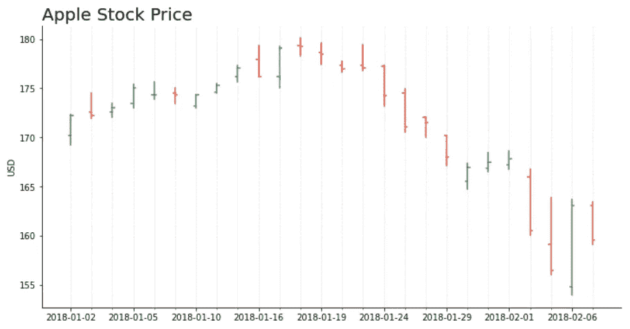

带细节的 OHLC 图表—图片由作者提供

OHLC 图表是一个很好的分析起点，因为它给了我们一个很好的概述，我们可以在此基础上进行分析。

## 改进和定制

您可以绘制一些预测价格、置信区间、移动平均线、交易量和更多的变量和统计数据来补充您的可视化。

用 Matplotlib 从头开始构建我们的可视化给了我们很多自由。

```
x = np.arange(0,len(df_apple))
fig, (ax, ax2) = plt.subplots(2, figsize=(12,8), gridspec_kw={'height_ratios': [4, 1]})for idx, val in df_apple.iterrows():
    color = '#2CA453'
    if val['open'] > val['close']: color= '#F04730'
    ax.plot([x[idx], x[idx]], [val['low'], val['high']], color=color)
    ax.plot([x[idx], x[idx]-0.1], [val['open'], val['open']], color=color)
    ax.plot([x[idx], x[idx]+0.1], [val['close'], val['close']], color=color)

# ticks top plot
ax2.set_xticks(x[::3])
ax2.set_xticklabels(df_apple.date.dt.date[::3])
ax.set_xticks(x, minor=True)# labels
ax.set_ylabel('USD')
ax2.set_ylabel('Volume')# grid
ax.xaxis.grid(color='black', linestyle='dashed', which='both', alpha=0.1)
ax2.set_axisbelow(True)
ax2.yaxis.grid(color='black', linestyle='dashed', which='both', alpha=0.1)# remove spines
ax.spines['right'].set_visible(False)
ax.spines['left'].set_visible(False)
ax.spines['top'].set_visible(False)
ax2.spines['right'].set_visible(False)
ax2.spines['left'].set_visible(False)# plot volume
ax2.bar(x, df_apple['volume'], color='lightgrey')
# get max volume + 10%
mx = df_apple['volume'].max()*1.1
# define tick locations - 0 to max in 4 steps
yticks_ax2 = np.arange(0, mx+1, mx/4)
# create labels for ticks. Replace 1.000.000 by 'mi'
yticks_labels_ax2 = ['{:.2f} mi'.format(i/1000000) for i in yticks_ax2]
ax2.yaxis.tick_right() # Move ticks to the left side
# plot y ticks / skip first and last values (0 and max)
plt.yticks(yticks_ax2[1:-1], yticks_labels_ax2[1:-1])
plt.ylim(0,mx)

# title
ax.set_title('Apple Stock Price\n', loc='left', fontsize=20)
# no spacing between the subplots
plt.subplots_adjust(wspace=0, hspace=0)
plt.show()
```


OHLC 图表与卷-图片由作者

## Matplotlib 金融

在文章的开头，我提到了一种绘制 OHLC 图表的更简单的方法。mplfinance 是一个优秀的财务可视化工具包。

```
pip install --upgrade mplfinance
```

让我们来看看它有多容易使用。

数据框应包含以下字段:开盘、收盘、盘高、盘低和成交量。它还应该有一个日期时间索引。

我们的数据有适当的字段，所以我们只需要改变索引。

```
import mplfinance as mpfdf_google = df[df['Name'] == 'GOOGL'].copy()
df_google['date'] = pd.to_datetime(df_google['date'])
df_google = df_google[df_google['date'] > pd.to_datetime('2017-12-31')]
df_google = df_google.set_index('date')mpf.plot(df_google)
```

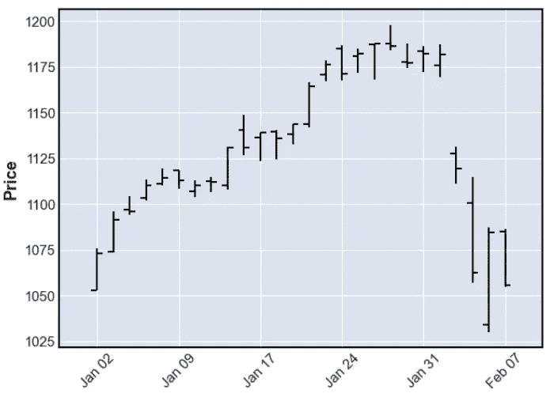

OHLC 海图—图片由作者提供

就这样，我们有了 OHLC 图表！

我们还可以添加移动平均线，并用一行代码可视化体积。

```
mpf.plot(df_google,type='candle',mav=(3, 5),volume=True, title='Google')
```

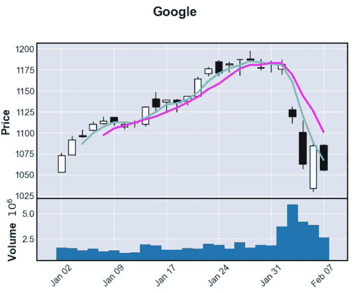

带移动平均线和成交量的 OHLC 图表——图片由作者提供

Matplotlib 财务实用程序比从头开始绘制图表更容易使用，但它们不容易定制。

对于大多数快速分析，您需要一个功能性和可读性强的图表，而 mplfinance 就足够了。

对于其他更具体的约束，当您需要向可视化中添加特定的组件或者定制样式以遵循一些设计标准时，mplfinance 可能会有所欠缺。

在这些情况下，使用 Matplotlib 从头开始绘制图表是值得的。我们可以很容易地添加、修改或删除可视化的任何部分，使它成为一个很好的工具。

感谢阅读我的文章。我希望你喜欢它！

查看更多 Python DataViz 教程。

**推荐人:**
[mpl finance](https://github.com/matplotlib/mpl-finance)；
[mplfinance —样式和定制](https://github.com/matplotlib/mplfinance/blob/master/examples/styles.ipynb)；

[Matplotlib —子情节 grid spec](https://matplotlib.org/3.1.0/tutorials/intermediate/gridspec.html)；
[Matplotlib —x 坐标](https://matplotlib.org/stable/api/_as_gen/matplotlib.pyplot.xticks.html)， [y 坐标](https://matplotlib.org/stable/api/_as_gen/matplotlib.pyplot.yticks.html)；
[Matplotlib —右勾](https://matplotlib.org/3.3.4/api/_as_gen/matplotlib.axis.YAxis.tick_right.html)；
[Matplotlib —棘](https://matplotlib.org/stable/api/spines_api.html)；
[Matplotlib —网格线](https://matplotlib.org/stable/api/_as_gen/matplotlib.pyplot.grid.html)、[W3](https://www.w3schools.com/python/matplotlib_grid.asp)；
[Matplotlib—Lines](https://matplotlib.org/stable/api/_as_gen/matplotlib.pyplot.plot.html)；
[Matplotlib—Bars](https://matplotlib.org/stable/api/_as_gen/matplotlib.pyplot.bar.html)；