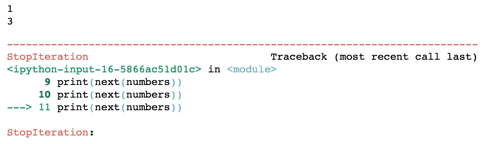

# Python 生成器的基础

> 原文：<https://towardsdatascience.com/basics-of-python-generators-a47b3cab1a23?source=collection_archive---------7----------------------->

## *了解生成器的基础知识并在 Python 中实现它们*


[博伊图梅洛·菲特拉](https://unsplash.com/@writecodenow?utm_source=unsplash&utm_medium=referral&utm_content=creditCopyText)在 [Unsplash](https://unsplash.com/?utm_source=unsplash&utm_medium=referral&utm_content=creditCopyText) 上的照片

## 什么是 Python 生成器？

Python 生成器函数允许您声明一个行为类似迭代器的函数，允许程序员以一种快速、简单和干净的方式创建迭代器。迭代器是一个可以被迭代或循环的对象。它用于抽象数据容器，使其行为像一个可迭代的对象。更常用的可迭代对象的例子包括列表、字典和字符串。

在本文中，我们将借助一些例子学习在 Python 中创建和使用生成器。

## 用 Python 实现的简单类迭代器

让我们首先看一个简单的基于类的迭代器来产生奇数:

```
class get_odds:
    def __init__(self, max):
        self.n=3
        self.max=max
    def __iter__(self):
        return self
    def __next__(self):
        if self.n <= self.max:
            result = self.n
            self.n += 2
            return result
        else:
            raise StopIterationnumbers = get_odds(10)
print(next(numbers))
print(next(numbers))
print(next(numbers))# Output
3
5
7
```

如你所见，生成了一系列奇数。为了生成这个结果，我们在 get_odds 类中创建了一个自定义迭代器。对于要成为迭代器的对象，它应该实现将返回迭代器对象的 **__iter__** 方法，然后 **__next__** 方法将返回序列中的下一个值，并可能在没有值要返回时引发 StopIteration 异常。如你所见，创建迭代器的过程是漫长的，这就是我们求助于生成器的原因。同样，python 生成器是实现迭代器的一种简单方式。

## 生成器函数和常规函数的区别

常规函数和生成器函数之间的主要区别在于，生成器函数的状态是通过使用关键字 yield 来维护的，其工作方式非常类似于使用 return，但它有一些重要的区别。区别在于 yield 保存了函数的状态。下一次调用该函数时，将从停止的地方继续执行，使用让步前的变量值，而 return 语句将完全终止该函数。另一个区别是生成器函数甚至不运行函数，它只创建并返回一个生成器对象。最后，只有在生成器对象上调用 **next()** 时，生成器函数中的代码才会执行。

## Python 中的生成器实现

让我们使用前面的代码实现相同的迭代器，只是使用了 python 生成器。

```
def get_odds_generator():
    n=1

    n+=2
    yield n

    n+=2
    yield n 

    n+=2
    yield n

numbers=get_odds_generator()
print(next(numbers))
print(next(numbers))
print(next(numbers))# Output
3
5
7
```

上面我首先创建了一个生成器函数，它有三个 yield 语句，当我们调用这个函数时，它返回一个迭代器对象的生成器。然后我们调用 **next()** 方法从这个对象中检索元素。第一个 print 语句给出了第一个 yield 语句的值 3，第二个 print 语句给出了第二个 yield 语句的值 5，最后一个 print 语句给出了第三个 yield 语句的值 7。如您所见，与我们基于类的迭代器相比，生成器函数要简单得多。

现在让我们尝试实现一个循环，让这个 python 生成器返回奇数，直到某个最大数。

```
def get_odds_generator(max):
    n=1

    while n<=max:
        yield n
        n+=2

numbers=get_odds_generator(3)
print(next(numbers))
print(next(numbers))
print(next(numbers))
```



作者图片

从输出中可以看到，生成了 1 和 3，之后引发了 StopIteration 异常。循环条件(n <=max) is False since max is 3 and n is 5, therefore the StopIteration exception was raised.

When comparing this code with our get_odds class, you can see that in our generator we never explicitly defined the __iter__ method, the __next__ method, or raised a StopIteration exception — these are handled implicitly by generators, making programming much easier and simpler to understand!

Iterators and generators are typically used to handle a large stream of data theoretically even an infinite stream of data. These large streams of data cannot be stored in memory at once, to handle this we can use generators to handle only one item at a time. Next, we will build a generator to produce an infinite stream of Fibonacci numbers. Fibonacci numbers are a series of numbers where the next element is the sum of the previous two elements.

```
def fibonacci_generator():
    n1=0
    n2=1
    while True:
        yield n1
        n1, n2 = n2, n1 + n2sequence= fibonacci_generator()
print(next(sequence))
print(next(sequence))
print(next(sequence))
print(next(sequence))
print(next(sequence))# Output
0
1
1
2
3
```

As you can see from the code above, in defining the fibonacci_generator function, I first created the first two elements of the fibonacci series, then used an infinite while loop and inside it yield the value of n1 and then update the values so that the next term will be the sum of the previous two terms with the line n1,n2=n2,n1+n2\. Our print statements gives us the sequence of numbers in the fibonacci sequence. If we had used a for loop and a list to store this infinite series, we would have run out of memory, however with generators we can keep accessing these terms for as long as we want since we are dealing with one item at a time.

## Summary

From this article, we have covered the basics of python generators. By the way, we can also create generators on the fly using generator expressions, which you can read more about in this article by Richmond Alake. Thank you for reading and all code is available on my [Github](https://github.com/mkosaka1/Python_Basics/blob/master/2)%20Generators.ipynb) :)

</understanding-generator-expressions-in-python-fe0c4534619> 