# 线性回归的批、小批和随机梯度下降

> 原文：<https://towardsdatascience.com/batch-mini-batch-and-stochastic-gradient-descent-for-linear-regression-9fe4eefa637c?source=collection_archive---------10----------------------->

## 三种基本梯度下降变体的实现和比较

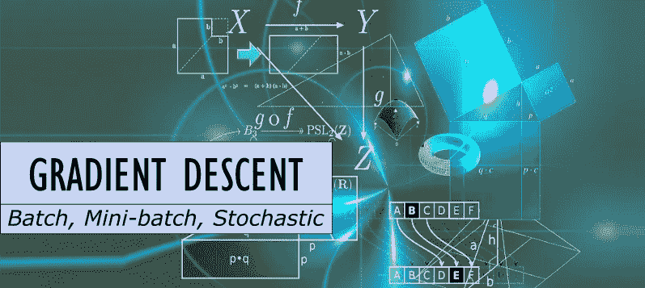

图片由来自 Pixabay 的 [geralt 提供，由作者修改](https://pixabay.com/illustrations/banner-header-mathematics-formula-982162/)

## 1.介绍

梯度下降算法是一种迭代一阶优化方法，用于找到函数的局部最小值(理想情况下是全局最小值)。它的基本实现和行为我已经在我的另一篇文章中描述过了。这一个集中在算法用来计算梯度和制作步骤的数据量的三个主要变量上。

这三种变体是:

*   批量梯度下降(BGD)
*   随机梯度下降
*   小批量梯度下降(mBGD)

在本文中，我们将在一个简单的线性回归任务中看到它们的性能。

简单回顾一下——一元线性函数定义为:

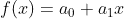

它由两个系数参数化:

*   *a0* -偏差
*   *a1* -函数的斜率。

出于演示目的，我们定义以下线性函数:

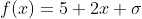

其中 **σ** 是白(高斯)噪声。下面的代码为我们将要使用的数据集生成了 100 个点。

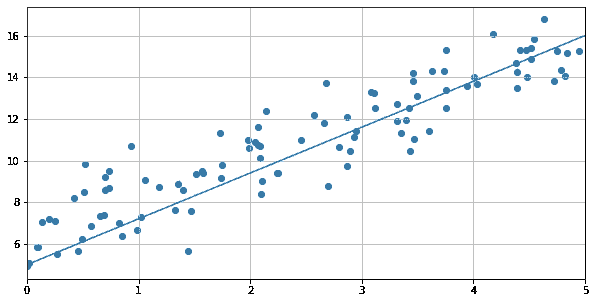

我们希望最小化的成本函数(指标)是**均方误差**，定义为:

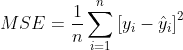

在一元函数的情况下，它可以明确地写成:

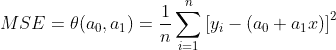

下面的代码计算给定的一组两个参数的 MSE 成本。

注意，对于我们的原始系数，由于随机误差(白噪声),最小成本函数不为 0(它将在每次运行时变化),此时等于:

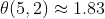

下图显示了最佳点附近的这个函数。我们可以看到它有一个细长的碗的形状。

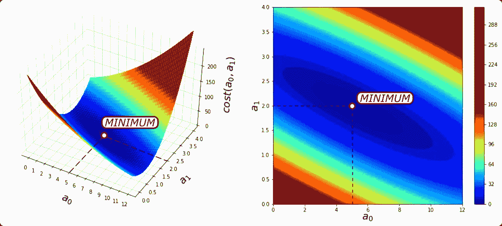

围绕全局最小值的成本函数；作者图片

要使用任何梯度下降算法，我们必须计算这个函数的梯度。因为对于一元线性回归，我们的算法最小化 2 个系数，我们必须分别计算它们的导数。让我们注意到:

现在，使用[链规则](https://en.wikipedia.org/wiki/Chain_rule)我们获得以下结果:

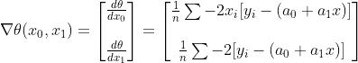

下一节将关注算法本身。使用的代码可以在[我的 GitHub 库](https://github.com/RobKwiatkowski/Gradient_Descent_Visualisations)上找到。

## 2.批量梯度下降

在批处理 GD 中，在每一步都使用整个数据集来计算梯度(记住:我们不计算成本函数本身)。下图显示了它在优化过程中的表现。它需要 86 次迭代来找到全局最优值(在给定的容差内)。

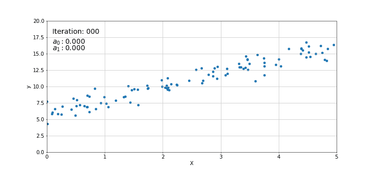

批量梯度下降过程的动画；作者图片

批量梯度下降的轨迹；作者图片

批量梯度下降的轨迹看起来很好——每一步都越来越接近最优，横向振荡随着时间的推移越来越小。这是它具有良好收敛速度的原因。

为了准确地找到它的收敛速度，我们必须做一些数学。为了不过分复杂，让我们假设我们的成本函数是强凸的(两次可微的)并且具有[一个 Lipschitz 连续](https://en.wikipedia.org/wiki/Lipschitz_continuity)梯度，其中 L > 0 定义为:

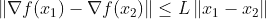

第二个假设限制了渐变的速度。

如果您可以计算 L，那么您可以导出所谓的**“保证进度的界限”**，它是保证收敛的步长(学习速率):

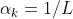

然而，你不应该在实践中使用这个值，因为它真的很小而且收敛很慢。找到最佳学习率是一个巨大的话题，适合单独写一篇文章——只需检查一些东西，例如“[回溯线搜索](https://en.wikipedia.org/wiki/Backtracking_line_search)”，“阿米霍条件”或“[沃尔夫条件](https://en.wikipedia.org/wiki/Wolfe_conditions)”。

**假设固定步长**收敛速度取决于函数的凸性。

对于简单(弱)**凸**函数，收敛速度为[1]:

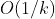

其中 k 是迭代次数。该速率称为“亚线性收敛”，对于给定的容差ε，需要以下迭代次数才能收敛[1]:

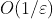

对于**强凸**函数，比率为[1]:

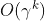

其中 0

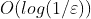

Pros and Cons of Batch Gradient Descent:

**优点:**

*   一个简单的算法，只需要计算一个梯度
*   在训练期间可以使用固定的学习速率，并且可以预期 BGD 收敛
*   如果损失函数是凸的，非常快地收敛到全局最小值(对于非凸函数，非常快地收敛到局部最小值)

缺点:

*   即使使用矢量化实现，当数据集很大时(大数据的情况)，速度也可能很慢
*   不是所有的问题都是凸的，所以梯度下降算法不是通用的

典型使用案例:

*   适合计算机内存的小型数据库
*   凸成本函数的问题(如 OLS，逻辑回归等。)

## 3.随机梯度下降

随机梯度下降的思想不是使用整个数据集来计算梯度，而是仅使用单个样本。目标是加快这一进程。就选择样本而言，有两条主要规则:

*   随机规则—随机选择的样本(可能重复)
*   循环规则—每个样本一次(无重复或重复次数最少)

随机规则更常见。

*   下图显示了 SGD 如何收敛到最终解(示例性运行)。红点表示为给定步长计算选择的样本。

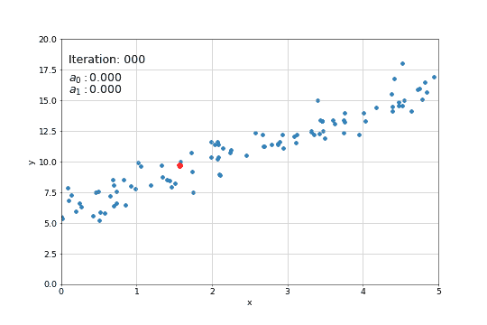

SGS 收敛过程的动画；作者图片

由于其随机性，每次运行需要不同数量的步骤来达到全局最小值。在相同起点(0，0)和相同学习率(0.05)下运行 100 次所需的迭代直方图下方。

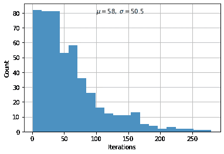

收敛所需的迭代次数；作者图片

与批处理 GD 相反，它不会直接收敛到解，因为它每次迭代只使用 1 个样本，这意味着步骤非常嘈杂。但是，它的效率要高得多，CPU/GPU 负载更少。这种影响对于小型数据库(像这样)几乎看不到，但在处理大数据时会对性能产生巨大影响。

下图显示了上例中 SGD 步骤的轨迹。

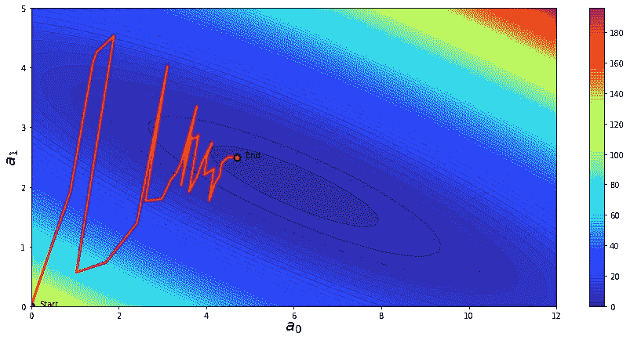

随机梯度下降的轨迹；作者图片

固定步长随机梯度下降的收敛速度[1]:

这意味着 SGD 不像批量梯度下降那样具有线性收敛速度——仅仅意味着它需要更多的迭代(但不一定需要计算时间)。

随机梯度下降的利与弊:

**优点:**

*   对于大型数据集，比批量 GD 收敛更快(时间更少)
*   可以逃离局部极小值

**缺点:**

*   步骤更嘈杂— SGD 可能需要更多迭代才能收敛到限制值
*   它可以在全局最优值附近“跳跃”——它可能需要比批量 GD 更大的容差

典型使用案例:

*   是用于训练人工神经网络的更高级随机算法的基础

## 4.小批量梯度下降

小批量梯度下降是一种在纯 SGD 和批量梯度下降之间找到良好平衡的方法。想法是使用一个观察子集来更新梯度。每个尺寸所用的点数称为批量，一个批量的每次迭代称为一个时期。下面的动画显示了每个步骤中使用的点的收敛过程(批量大小为 10)。

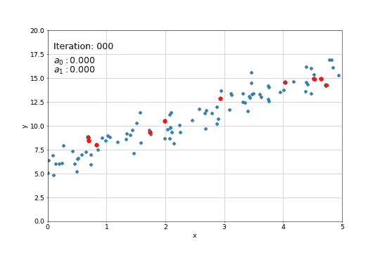

小批量梯度下降的收敛过程:作者图片

轨迹仍然是嘈杂的，但更稳定地走向最小值。

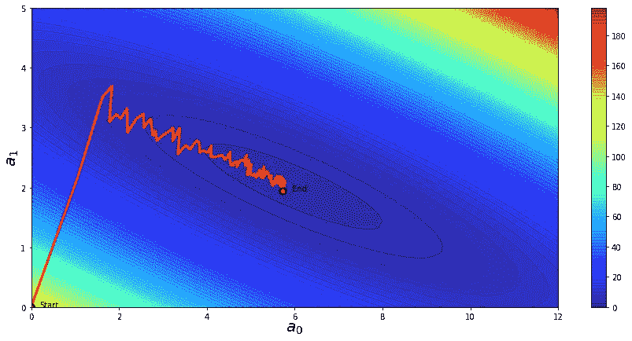

小批量梯度下降的轨迹；作者图片

该算法的收敛比介于 BGD 和 mBGD 之间，为[1]:

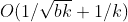

其中 b 是批量大小。

小批量梯度下降的利与弊:

**优点:**

*   BGD 和新加坡元之间在效率方面的良好平衡
*   很容易放入计算机内存
*   可以避开局部最小值

**缺点:**

*   它仍然可以在全局最优值附近“反弹”——它可能需要比批量 GD 更大的容差，但小于 SGD
*   另一个需要优化的超参数—批量

典型使用案例:

*   这是深度神经网络训练中非常常见的算法

# **5。总结**

我们经历了梯度下降算法的 3 个基本变体。在当代的 ML 中，使用了更先进和更有效的版本，但是仍然使用这里描述的基本思想。进一步的修改包括自适应学习率、各种动量(如内斯特罗夫)、平均等。

一些非常流行的实现有:

*   [亚当](https://keras.io/api/optimizers/adam/)
*   [RMSprop](https://keras.io/api/optimizers/rmsprop/)
*   阿达格拉德[。](https://keras.io/api/optimizers/adagrad/)

有一个正在进行的研究工作，以进一步改善他们的非凸函数(深度神经网络)，其中包括各种想法，每个过程的数据。

如果你想了解更多关于本文主题的细节，我强烈建议你查阅这些阅读材料:

1.  [加州大学伯克利分校 Ryan Tibshirani 的随机梯度下降](http://www.stat.cmu.edu/~ryantibs/convexopt/lectures/stochastic-gd.pdf)
2.  [加州大学伯克利分校 Ryan Tibshirani 的凸优化](https://www.stat.cmu.edu/~ryantibs/convexopt-F18/scribes/Lecture_24.pdf)
3.  [用不一致随机梯度下降加速深度神经网络训练](https://www.sciencedirect.com/science/article/abs/pii/S0893608017301399)
4.  [深度神经网络训练中随机梯度下降的不收敛性](https://www.sciencedirect.com/science/article/pii/S0885064X20300844)
5.  [带洗牌的分布式随机梯度下降的收敛性分析](https://www.sciencedirect.com/science/article/abs/pii/S0925231219300578)