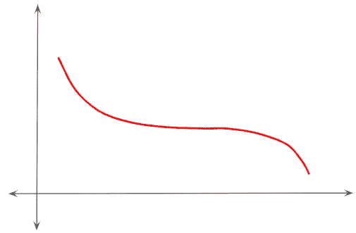
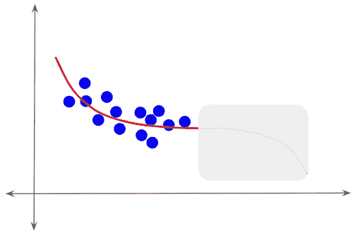
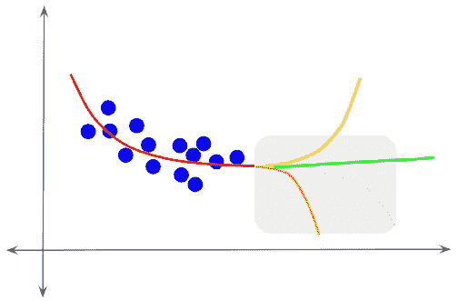
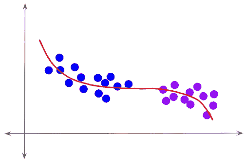
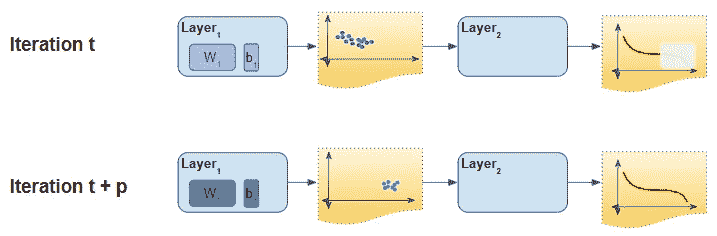
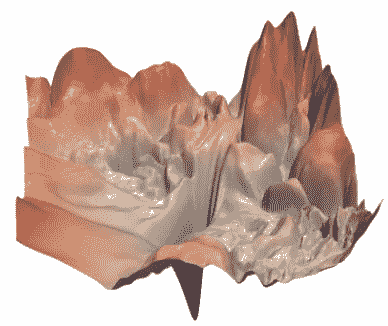
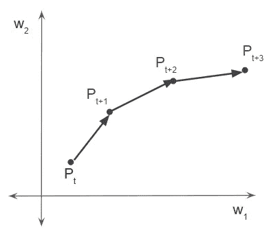
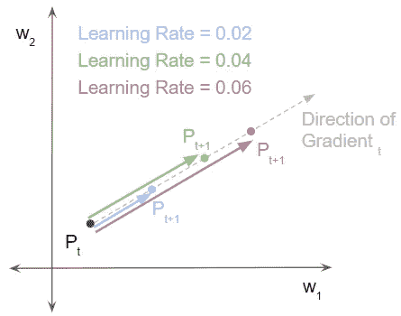
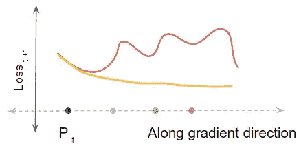
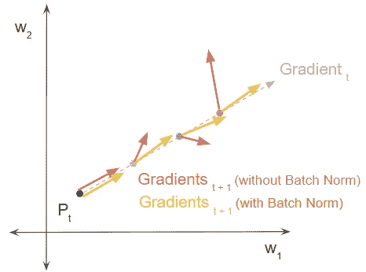

# 直观地解释了批量定额——它为什么有效？

> 原文：<https://towardsdatascience.com/batch-norm-explained-visually-why-does-it-work-90b98bcc58a0?source=collection_archive---------11----------------------->

## 实践教程，直观的深度学习系列

## 一个温和的指南的原因，批量规范层的成功，使训练收敛更快，在平原英语

由 [Unsplash](https://unsplash.com?utm_source=medium&utm_medium=referral) 上的[absolute vision](https://unsplash.com/@freegraphictoday?utm_source=medium&utm_medium=referral)拍摄

批量范数层经常用于深度学习模型中，与卷积或线性层相关联。许多最先进的计算机视觉架构，如 Inception 和 Resnet，都依赖于它来创建可以更快训练的更深层次的网络。

在本文中，我们将探讨*为什么*批处理规范有效，以及为什么在训练模型时它需要较少的训练时期。

你可能也喜欢阅读我的另一篇关于 Batch Norm 的文章，这篇文章用简单的语言解释了什么是 Batch Norm，并一步一步地介绍了它是如何在幕后运作的。

 [## Batch Norm 直观地解释了它是如何工作的，以及为什么神经网络需要它

### 一个非常重要的深度学习层的温和指南，用简单的英语

towardsdatascience.com](/batch-norm-explained-visually-how-it-works-and-why-neural-networks-need-it-b18919692739) 

如果你对一般的神经网络架构感兴趣，我有一些你可能会喜欢的文章。

1.  [优化器算法](/neural-network-optimizers-made-simple-core-algorithms-and-why-they-are-needed-7fd072cd2788) *(梯度下降优化器使用的基本技术，如 SGD、Momentum、RMSProp、Adam 等)*
2.  [图像字幕架构](/image-captions-with-deep-learning-state-of-the-art-architectures-3290573712db) *(具有图像特征编码器、序列解码器和注意力的多模态 CNN 和 RNN 架构)*

# 批量定额为什么管用？

毫无疑问，Batch Norm 工作得非常好，并为深度学习架构设计和培训提供了大量可测量的好处。然而，奇怪的是，究竟是什么赋予了它如此神奇的力量，目前还没有一个普遍认同的答案。

诚然，已经提出了许多理论。但是多年来，关于这些理论中哪一个是正确的一直存在争议。

最初的发明者对为什么批处理规范有效的第一个解释是基于一种叫做内部协变量转移的东西。后来在麻省理工学院研究人员的另一篇[论文](https://arxiv.org/pdf/1805.11604.pdf)中，该理论被驳斥，并基于损耗和梯度曲线的平滑提出了另一种观点。这是两个最著名的假设，所以让我们在下面回顾一下。

# 理论 1——内部协变量转移

如果你和我一样，我相信你会觉得这个术语很吓人！😄用简单的语言来说，这是什么意思？

假设我们要训练一个模型，模型需要学习的理想目标输出函数(虽然我们事先不知道)如下。

*目标函数(图片由作者提供)*

不知何故，假设我们输入到模型中的训练数据值只覆盖了输出值范围的一部分。因此，该模型只能学习目标函数的子集。

*训练数据分布(图片由作者提供)*

该模型不知道目标曲线的其余部分。什么都有可能。

*目标曲线的其余部分(图片由作者提供)*

假设我们现在向模型提供一些不同的测试数据，如下所示。这与模型最初训练时使用的数据有着非常不同的分布。该模型无法对这些新数据的预测进行归纳。

例如，如果我们用客机的图片训练一个图像分类模型，然后用军用飞机的图片测试它，这种情况就会发生。

*测试数据有不同的分布(图片由作者提供)*

这就是协变量转移的问题——尽管新数据仍然符合相同的目标函数，但模型输入的数据分布与之前训练的数据分布非常不同。

为了让模型知道如何适应这些新数据，它必须重新学习一些目标输出函数。这会减慢训练过程。如果我们从一开始就为模型提供了覆盖所有值的代表性分布，它就能够更快地了解目标输出。

既然我们了解了什么是“协变量转移”，那么让我们看看它是如何影响网络训练的。

在训练过程中，网络的每一层都学习一个输出函数来适应它的输入。假设在一次迭代中，层“k”接收来自前一层的小批量激活。然后，它通过基于该输入更新其权重来调整其输出激活。

然而，在每次迭代中，前一层‘k-1’也在做同样的事情。它调整其输出激活，有效地改变其分布。

*协变量移位如何影响训练(图片由作者提供)*

这也是层“k”的输入。换句话说，该层接收的输入数据的分布与以前不同。它现在被迫学习适应这种新的输入。正如我们所看到的，每一层最终都试图从不断变化的输入中学习，因此需要更长的时间来收敛并减缓训练。

因此，提出的假设是批处理范数有助于稳定这些从一次迭代到下一次迭代的移位分布，从而加快训练。

# 理论 2 —损耗和梯度平滑

麻省理工学院的论文发表的结果挑战了解决协变量移位是 Batch Norm 性能的原因的说法，并提出了不同的解释。

在典型的神经网络中,“损失景观”不是平滑的凸面。它非常颠簸，有陡峭的悬崖和平坦的表面。这给梯度下降带来了挑战——因为它可能会在它认为有希望遵循的方向上突然遇到障碍。为了弥补这一点，学习率保持在较低水平，这样我们在任何方向都只能迈出小步。

*一个神经网络损失景观* [*(来源*](https://arxiv.org/pdf/1712.09913.pdf) *，经郝莉许可)*

如果你想了解更多这方面的内容，请参阅我的关于神经网络优化器的[文章](/neural-network-optimizers-made-simple-core-algorithms-and-why-they-are-needed-7fd072cd2788)，这篇文章更详细地解释了这一点，以及不同的优化器算法是如何发展来应对这些挑战的。

本文提出批处理范数的作用是通过改变网络权值的分布来平滑损失景观。这意味着梯度下降可以自信地朝着一个方向迈出一步，因为它知道在这个过程中不会发现突然的中断。因此，它可以通过使用更大的学习速率来迈出更大的步伐。

为了研究这一理论，本文进行了一项实验，以分析一个模型在训练过程中的损失景观。我们将尝试用一个简单的例子来形象化这一点。

假设我们有一个简单的网络，有两个权重参数(w1 和 w2)。这些权重的值可以显示在 2D 表面上，每个权重有一个轴。权重值的每个组合对应于这个 2D 平面上的一个点。

随着训练过程中重量的变化，我们移动到这个表面上的另一个点。因此，可以在训练迭代中绘制权重的轨迹。

请注意，下图仅显示了每个点的重量值。为了形象化这种损失，想象一个 3D 表面，第三个轴代表从页面出来的损失。如果我们对所有不同重量组合的损失进行测量和绘图，损失曲线的形状称为损失图。

*(图片作者)*

实验的目标是通过测量如果我们继续向同一方向移动，在不同点的损失和梯度看起来像什么，来检查损失情况。他们在有和没有批量标准的情况下进行测量，看看批量标准有什么影响。

假设在训练期间的某次迭代‘t’时，它在点 P(t)。它评估 Pt 处的损耗和梯度。然后，从该点开始，以一定的学习速率向前迈出一步，到达下一个点 P(t+1)。然后它倒回 P(t ),并以更高的学习速率重复该步骤。

换句话说，它通过沿着梯度方向采取三种不同大小的步骤(蓝色、绿色和粉色箭头)，使用三种不同的学习速率，尝试了三种不同的替代方案。这给我们带来了 P(t+1)的三个不同的下一点。然后，在每一个 P(t+1)点，它测量新的损失和梯度。

在此之后，对同一网络重复所有三个步骤，但包括批量标准。

*(图片作者)*

现在，我们可以绘制出 P(t+1)点(蓝色、绿色和粉色)在单个方向上的损耗。起伏的红色曲线表示没有批次标准的损失，平滑下降的黄色曲线表示有批次标准的损失。

*批量亏损平稳下降(图片由作者提供)*

类似地，我们可以画出这些点上梯度的大小和方向。红色箭头显示梯度在大小和方向上剧烈波动，没有批次标准。黄色箭头显示梯度的大小和方向保持稳定，具有批次标准。

*批量规范的渐变更平滑(图片由作者提供)*

这个实验告诉我们，批量范数显著地平滑了损失情况。这对我们的训练有什么帮助？

理想的情况是，在下一个点 P(t+1)，梯度也位于相同的方向。这意味着我们可以继续朝着同一个方向前进。这样可以让训练顺利进行，快速找到最小值。

另一方面，如果 P(t+1)处的最佳梯度方向将我们带向不同的方向，我们将会徒劳地沿着之字形路线前进。这将需要更多的训练迭代来收敛。

虽然这篇论文的发现到目前为止还没有受到质疑，但不清楚它们是否已经被完全接受为结束这场辩论的决定性证据。

不管哪个理论是正确的，我们可以肯定的是批处理规范提供了几个优点。

# 批量定额的优点

Batch Norm 提供的巨大好处是让模型更快收敛，加快训练速度。这使得训练对如何初始化权重和超参数的精确调整不太敏感。

批量定额让你使用更高的学习率。如果没有批处理规范，学习率必须保持较小，以防止大的异常梯度影响梯度下降。批处理规范有助于减少这些异常值的影响。

批次范数还降低了梯度对初始权重值的依赖性。由于权重是随机初始化的，因此在训练的早期阶段，异常权重值会扭曲梯度。因此，网络收敛需要更长的时间。批处理规范有助于抑制这些异常值的影响。

# 批量定额什么时候不适用？

批量定额不适用于较小的批量。这导致每个小批量的平均值和方差中有太多的噪声。

批量定额不适用于循环网络。每个时间步长之后的激活具有不同的分布，使得对其应用批量定额不切实际。

# 结论

即使我们不确定正确的解释，探索这些不同的理论也是令人着迷的，因为它让我们对神经网络的内部工作有了一些了解。

无论如何，批处理规范是我们在设计架构时绝对应该考虑的一层。

最后，如果你喜欢这篇文章，你可能也会喜欢我关于变形金刚、音频深度学习和地理定位机器学习的其他系列。

 [## 直观解释的变压器(第 1 部分):功能概述

### NLP 变形金刚的简明指南，以及为什么它们比 rnn 更好，用简单的英语。注意力如何帮助…

towardsdatascience.com](/transformers-explained-visually-part-1-overview-of-functionality-95a6dd460452)  [## 音频深度学习变得简单(第一部分):最新技术

### 颠覆性深度学习音频应用和架构世界的温和指南。以及为什么我们都需要…

towardsdatascience.com](/audio-deep-learning-made-simple-part-1-state-of-the-art-techniques-da1d3dff2504)  [## 利用地理位置数据进行机器学习:基本技术

### 简明的地理空间数据特征工程和可视化指南

towardsdatascience.com](/leveraging-geolocation-data-for-machine-learning-essential-techniques-192ce3a969bc) 

让我们继续学习吧！